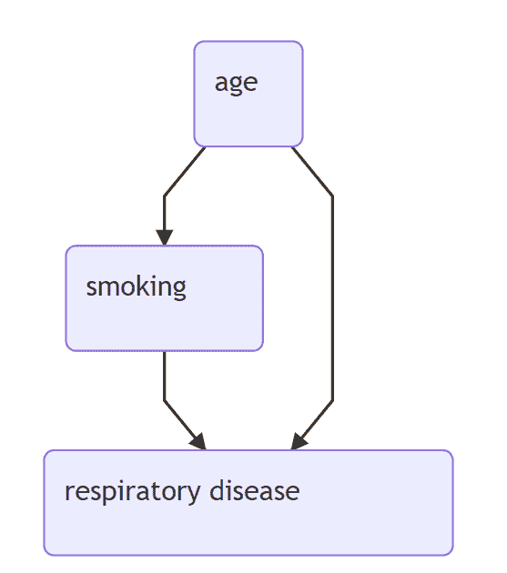
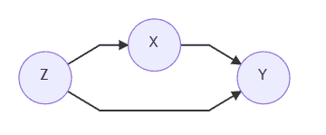
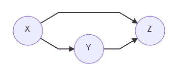

# 混杂变得简单

> 原文：<https://towardsdatascience.com/confounders-made-simple-19131ff63ed1?source=collection_archive---------13----------------------->

摘要:在一项观察性研究中，并不是所有的治疗和结果变量的协变量都应该被调整。默认情况下，人们应该怀疑那些盲目调整许多混杂因素而没有从因果关系上证明其选择的研究。

**免责声明:**我的因果推理知识有限，我可能会说一些非常错误的话。如果你发现错误，请在推特上联系我 [@jsevillamol](https://twitter.com/Jsevillamol) ！

# 混杂因素的问题

假设你想确定治疗对结果的因果影响。当务之急是确定它们之间是否存在统计相关性。

虽然仍然具有挑战性，但我们有很好的统计工具来确定复杂变量集之间的统计关联网络。

然而，**相关性不是因果关系** —相关性可能是由**混杂因素**引起的，是治疗和结果的因果前因。

例如，治疗可能是吸烟，结果可能是呼吸系统疾病，一个似是而非的混杂因素是年龄；年纪大的人吸烟更频繁，也更容易患呼吸道疾病。

我们可以用因果图来说明这种情况:

A causal diagram for a smoking study

我们说从治疗到结果有一个畅通的后门路径通过年龄，即吸烟<= age =>呼吸道疾病。

理想情况下，我们希望进行一项随机对照试验(RCT ),随机分配治疗方案，这样我们就可以转移后门。

A randomized controlled trial (RCT) of a smoking study

但这并不总是可能的；例如，治疗可能是不道德的，或者我们可能想从历史数据中得出结论。在那些情况下我们应该做什么？

# 如何不对混杂因素进行调整

阻止混杂因素的虚假影响的另一种方法是**通过例如**分层**来调整**。在吸烟的例子中，我们可以将数据分为年轻人和老年人，研究每一组中吸烟和疾病之间的相关性，然后报告加权相关性，作为因果效应的估计。

如果我们确信协变量确实是一个混杂变量，或者是治疗和结果的因果祖先，这将很好地工作——因为在每个研究组中，混杂变量是固定的，它不再能够对治疗和结果产生虚假的影响，我们将能够对治疗的真正因果影响做出断言。

因此，每当研究人员发现一个与治疗和结果都相关的变量时，他们往往会对其进行调整。

但这并不是三个变量之间唯一可能的因果关系！

## 治疗 X、结果 Y 和协变量 Z 之间可能的因果关系

**Confounder**

**Mediator**

**Collider**

协变量**可能会调节**治疗和结果之间的相互作用。即 X = > Z，Z = > Y。

例如，我们可以研究转基因作物对消费者健康的影响，我们发现转基因作物不太可能被病原体感染。在这种情况下，病原体的存在将成为转基因生物和消费者健康之间的媒介。

请注意，介质不一定是解释这种效应的唯一机制——转基因生物也可能改变作物的饮食结构，而与它对病原体的影响无关。

在这种情况下，对协变量 Z 进行调整将减少治疗 X 对结果 Y 的明显影响，我们的报告将具有误导性(除非我们特别试图单独测量非协变量介导的治疗效果部分)。

第三种可能性是协变量是治疗和结果的 T2 对撞机。也就是说，X 和 Y 都导致 z。例如，我们可以让人工智能研究人员和国际象棋爱好者都喜欢阅读自动化国际象棋比赛的发展。

调整对撞机将会增加治疗效果在结果中的表观强度。

在前面的例子中，如果我们调查阅读了自动下棋文章的人，我们可能会发现象棋爱好者不太可能是人工智能研究人员，反之亦然——但这并不奇怪，因为我们从我们的调查人口统计中过滤掉了既不是人工智能研究人员也不是象棋爱好者的人。

所以要小心调整调解器和碰撞器！

现在，我们如何区分协变量是混杂变量的情况和协变量是中介变量或碰撞变量的情况？

简而言之:我们不能，至少不能仅从观察数据来看。我们需要依赖于潜在因果关系的领域特定知识。

当涉及多个协变量时，情况会变得更加复杂。我们需要绘制出所有协变量、治疗和结果之间的整个因果图，并在科学基础上证明我们的因果图。

然后，我们可以使用 do-calculus 的规则和原则，如[后门标准](http://bayes.cs.ucla.edu/BOOK-2K/ch3-3.pdf)，找到一组要调整的协变量，以阻止治疗和结果之间的虚假相关性，这样我们就可以估计真正的因果关系。

总的来说，我预计一项研究调整的变量越多，它们就越有可能通过对撞机引入虚假的相关性或阻断中介路径。

# 自由度的问题

我们应该怀疑以无原则的方式调整许多变量的研究的另一个强有力的原因是如何进行研究的自由度的增加。

如果你用 1000 种不同的方法来衡量两个变量之间的关系，并选择一个相关性最大的，你很可能高估了治疗的有效性。

拥有一个更大的协变量集可以让你对任何子集进行调整。例如，如果你有 10 个协变量，你可以调整 2^10 ≈ 1000 个可能的子集。

不一定是单个研究小组系统地尝试所有可能的调整子集并挑选最佳子集(尽管值得注意的是，一些统计方法正在做一些非常类似的事情——例如变量选择的逐步或最佳子集方法)。可能是不同的研究人员正在尝试不同的子集，而结合他们结果的机制是有偏见的。

例如，100 个研究小组可能会尝试 100 个不同的子集。他们中的 95 个正确地识别出没有影响，但是由于发表偏倚，他们没有广泛地公布他们的结果，而错误地识别出有强烈影响的 5 个组是唯一一个被发表的，造成了一种印象，即所有进行的研究都发现了强烈的影响，而实际上没有。

总的来说，**当你不预先承诺在研究中遵循一种原则性的调整方法时，你更有可能在结果中引入偏差**。

# 提醒一句:你仍然需要良好的控制

在这篇文章中，我们将重点放在选择太多不合适的控件的问题上，因为我看到更多的人缺乏这种直觉，即使是那些了解应用统计学的人也是如此。

然而，请注意，你可能会犯相反的错误——你可能无法调整相关的混淆因素——并最终得出结论[巧克力消费导致诺贝尔奖](http://www.biostat.jhsph.edu/courses/bio621/misc/Chocolate%20consumption%20cognitive%20function%20and%20nobel%20laurates%20(NEJM).pdf)。

尤其是对复杂现象的观察，只对一些事情进行调整实际上保证了你忽略了你应该调整的事情——你可能会高估或低估效果。

一个相关的挑战出现在“残留混杂”的标题下。即使你确定了一个混杂因素并对其进行了调整，它仍然会影响到与你测量它的准确程度相称的结果——自然，我们测量的大多数东西都是不准确的或通过代理来测量的。

所以用一句话概括:**如果你想从观察数据中推断因果关系，控制混杂因素是关键**。

# 那么我们该怎么办呢？

作为一个试金石，**更值得怀疑的是那些对变量进行调整而没有根据因果关系证明其调整选择的观察性研究**。

然而，一些研究没有做必要的工作来证明他们选择的混杂因素，这使得我们在从他们的工作中提取可靠的数据时处于一个更糟糕的位置。在这种情况下，我们能做些什么？

首先，我们可以单独检查每一个选择的混杂因素，并思考它们与治疗和结果的因果关系。

例如，假设我们正在审查一项关于核不扩散条约(X)对核武器投资水平(Y)的影响的研究，我们想知道它们是否应该根据 GDP (Z)进行调整。

嗯，有可能 GDP 较高的国家也更有影响力，并使条约对他们有利，所以 Z => X。而 GDP 较高的国家可以在核武器上投资更多，所以 Z => Y。在这种情况下，GDP 将是一个混杂因素，我们应该为此进行调整。

但我们可以讲一个同样令人信服的故事，认为签署该条约的国家可能会被视为更加合作，并获得更好的贸易协议，所以 X => Z。而在核武器上投资更多的国家具有更好的安全性，因此它们吸引更多的投资者，所以 Y => Z。根据这种解释，GDP 是一个对撞机，我们不应该为此进行调整。

或者我们可以结合前面的两个场景来论证 X=>Z 和 Z=>Y，所以 GDP 将是一个碰撞体，我们也不应该对它进行调整。

在没有令人信服的理由来拒绝替代解释的情况下，我们不应该根据 GDP 进行调整。

然而，想象一下，这项研究正在根据其他核协议的参与情况进行调整。认为加入其他条约导致加入《不扩散条约》似乎有些牵强；这两者似乎都是由该国签署核条约的普遍倾向更直接导致的。

在这种情况下,“对条约的偏好”是《不扩散核武器条约》对核投资影响的混淆因素，但我们无法直接观察到它。然而，我们可以通过后门标准调整“其他核条约”来阻止其虚假影响。

如果这项研究对 GPD 和参与其他核条约进行调整，会发生什么？

默认情况下，我们应该怀疑他们的结论的因果有效性。

我们可以利用这一信息做出一些预测(例如，我们可以利用上述研究的结果来猜测一个无论如何都要签署条约的国家是否会减少对核武库的投资)，但我们不能提出处理建议(例如，我们不能断言游说一个国家行为者接受《不扩散条约》是让他们减少核武库的有效方式)。

如果我们想挽救他们的结果，我们可以试着建立一个相关变量的因果图，并考虑他们选择的混杂因素是否满足相关标准。

如果他们选择的调整变量没有正确地阻止虚假效应或通过碰撞器引入新的效应，并且我们可以访问这些数据，我们可能想尝试用更好的调整变量重新运行这项研究。

但是当然，我们仍然可以确定作者没有包括在数据集中的关键混杂因素。在这种情况下，我建议关注约翰·图基的话:

*“一些数据和对答案的渴望并不能确保从给定的数据中提取出合理的答案。”*

# 结论

在这篇文章中，我们解释了协变量和治疗结果对之间的三种因果关系:混杂因素、中介因素和碰撞因素。我们已经看到，为了推断因果效应，我们应该调整混杂因素，而不是中介因素或碰撞因素。

我们认为，一项观察性研究调整的变量越多，它们就越有可能犯因果错误，或者额外的自由度和发表偏倚夸大了报道的效果。

我们也提醒读者不要犯相反的错误——以有原则的方式调整混杂因素对于将观察数据转化为因果信息至关重要。

作为从以前的研究中提取数据的一种方式，我们建议根据因果标准严格检查他们对调整协变量的选择。如果他们对不需要的变量进行了调整，我们建议在数据可用的情况下重新进行分析，而如果数据中缺少关键混杂因素，我们应该接受有时我们没有足够的信息来正确回答我们关心的问题。

我要感谢 Luisa Rodriguez 给了我思考混杂因素的借口，感谢 Gregory Lewis 阅读了早期的草稿并指出错误。通过我直接从格雷戈里的评论中剽窃的文章的一些巧妙的引用；所有的错误都是我的错。

关于因果推理的进一步阅读，我推荐朱迪亚·珀尔的《为什么 和 [*一本* *关于好与坏控制的速成教程*](http://causality.cs.ucla.edu/blog/index.php/2019/08/14/a-crash-course-in-good-and-bad-control/) ，以及格温的《为什么关联通常≠因果关系 》。

*本文由牛津大学* *人类未来研究所* [*暑期研究员杰米·塞维利亚撰写。在 twitter 上找我*](https://www.fhi.ox.ac.uk/)[*@ jsevillamol*](https://twitter.com/Jsevillamol)。