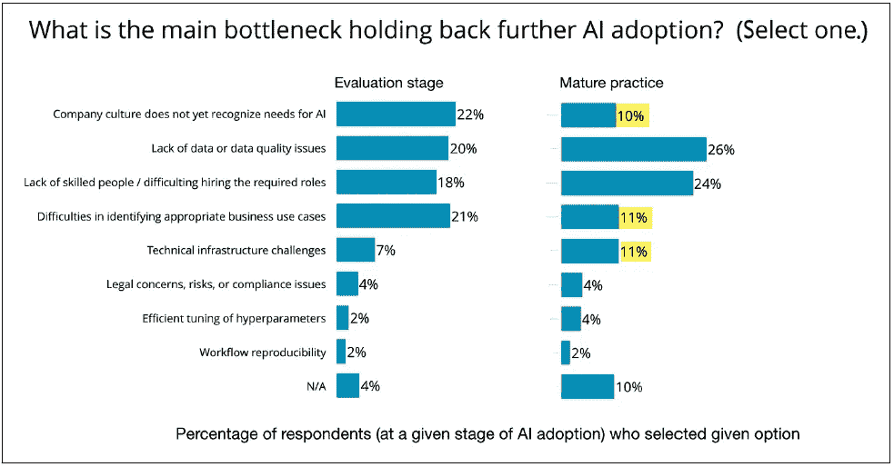

# 直面深度学习系统:有多少事情已经改变，有多少我们不知道

> 原文：<https://towardsdatascience.com/confronting-deep-learning-systems-how-much-things-have-changed-f067738b728f?source=collection_archive---------21----------------------->

Photo by Magne Træland on Unsplash

随着公司在业务中采用人工智能，他们正在大规模地面对深度学习系统的技术。这就像进入一个巨大的黑暗洞穴——惊奇和兴奋，伴随着恐惧，你不知道你将进入什么！

# 在 IT 方面几乎一无所知

我向一位同事推荐了帕科·内森的[博客，该博客总结了最近的地层调查。这位同事是商业智能和数据仓库领域备受尊敬的专家。](https://blog.dominodatalab.com/themes-and-conferences-per-pacoid-episode-7/)

他的反应是，“ ***有多少事情已经改变，有多少我们不知道！***
……指 IT 专业人士对抗新兴的深度学习系统。

用我的话来说，IT 专业人士对建立在现有基础设施上的人工智能系统的含义一无所知。此外，在企业集团之间出现了严重的文化脱节，这些集团必须为组织及其利益相关者合作，以实现人工智能系统的价值。

虽然这是一个令人不安的评论，但听到这个反应，我还是松了一口气。我花了去年的时间试图说服其他 BI/DW 同事，让他们认识到等待企业 IT 的未决问题。通常的反应是干瞪眼…好像他们怀疑我的理智！

> 术语:使用人工神经网络(ANN)的深度学习(DL)是机器学习(ML)的一个子集。这篇文章强调了企业系统中**传统机器学习**(无 ANN)与**深度学习**(使用 ANN)之间的差异。

那么，有什么好大惊小怪的呢？

*TL；在你有地图之前，不要进入(人工智能系统的)洞穴！*

# Pacoid 再次出击！

Paco Nathan(或 twitter 上的 Pacoid)自我描述为“邪恶的疯狂科学家”和“球员/教练”。我的经验严重倾向于后者。在 AI/ML/DS 社区中，他是一个杰出的人物，他与外界联系紧密，才华横溢，善于表达，富有人情味。

内森与本·洛里卡合作，本·洛里卡是奥莱利媒体公司的首席数据科学家，也是地层数据会议和 T21 人工智能会议的项目总监。他们调查了这些社区的态度和行动，这些社区是早期采用者——跨越(或努力跨越)鸿沟，在他们的组织内拥抱人工智能系统。

因此，大惊小怪的是关注这些早期采用者告诉我们的关于当前人工智能系统的信息，无论它们是成功的、失败的、灾难性的、道德上有害的、政治上幼稚的，还是介于两者之间的一切。

该调查基于 2018 年 11 月中旬的 1300 份答复，具有良好的全球企业代表性。因此，应该认真对待这一信息。这里是如何做到这一点…

首先，我推荐阅读 [Pacoid 的博客](https://blog.dominodatalab.com/themes-and-conferences-per-pacoid-episode-7/)。[1]其次，浏览与 Lorica 合著的这三份报告中的调查详情:

*   [*机器学习状态*](https://www.oreilly.com/data/free/state-of-machine-learning-adoption-in-the-enterprise.csp)(2018 年 8 月)[2]
*   *(2019 年 1 月)[3]*
*   **(2019 年 2 月)【4】—尤其是这个**
*   **此外，在[5]和[6]中引用的早期报告**

**如果你正在你的组织内拥抱(或计划拥抱)人工智能系统，你会发现几个发人深省的观察。…洞穴地图的碎片。**

**以下是我的几点看法。请在下面的评论中分享你的观察。**

# **外卖:深度学习有牵引力**

**与我交谈过的许多 IT 专业人士认为，神经网络令人兴奋，但传统的机器学习对于未来许多年的商业应用来说绰绰有余。**

**然而，这些调查表明，深度学习技术在企业系统中具有相当大的吸引力。它不再仅仅是研究人员的宠儿；这项技术正在投入使用！**

**调查数据显示，超过一半的人正在使用深度学习(55%)，以及强化学习(22%)和迁移学习(16%)，如图所示。**

****

**Figure 1–15\. AI technologies used, from AI Adoption survey [4]**

**另一方面……人们也想知道受访者在检查时在想象什么:主动学习、知识图表、计划和推理。这里需要面对面的面试！**

**正如所料，超过一半(53%)的人使用神经网络进行图像处理。然而，令人惊讶的是，更多的人将神经网络用于结构化数据(86%)和文本(69%)，如下所示。**

****

**Figure 1–21\. Data types, limited to deep learning respondents, from AI Adoption survey [4]**

**当被问及使用的人工智能工具时，令人惊讶的是，大量工具主要涉及神经网络，如 TensorFlow (55%)、Keras (34%)和 PyTorch (29%)。这明显多于传统机器学习的工具，如 scikit-Learn。**

****

**Figure 1–29\. AI tools used, in [4]**

**最后，人工智能采用报告[4]中的后续数字表明，深度学习的采用在各个行业都很普遍，并在人工智能成熟实践的公司中加速。**

# **外卖:跟上人工智能成熟的人——不**

**it 专业人士经典的“等到别人想通了”策略对一些公司来说可能是一场灾难。这种策略忽略了新兴人工智能系统正在推动的基本范式的快速转变。这种转变需要缓慢的文化变革，以使技术变革得以成功实施。让我们详细研究一下这个问题。**

**洛里卡和内森经常区分人工智能采用的三个成熟阶段:*尚未成熟的* (19%)，*正在评估的* (54%)，以及*正在生产的*或人工智能成熟的(27%)。[4]这一区别用于理解报告中的几个因素。**

****

**Figure 1–2\. Stage of maturity for AI adoption, in [4]**

**虽然这些类别是模糊的，但请观察这些关键方面。人工智能成熟的(生产中的)公司正在不断地做所有这三个类别。人工智能成熟的公司可能*还没有*特定的人工智能方法(如强化学习)，但他们已经指派一些专家每周**监测关于该方法的新兴研究。人工智能成熟的公司可能正在评估许多原型，但他们不断在他们的生产模型中使用它们进行挑战者-冠军竞赛。这是各个层面的持续创新，因此…****

**一个关键的见解是，人工智能成熟的组织正在迅速扩大与尚未成熟和正在评估的组织的差距，使其难以赶上，如下所示。请注意，瓶颈(黄色突出显示)——文化没有认识到需求，用例没有确定——对于人工智能成熟的公司来说变得不那么重要。相比之下，缺乏高质量的数据和缺乏熟练的人员对人工智能成熟的公司来说更为显著。**

****

**Figure 1–9\. Challenges, by stage of maturity, in [4]**

**人工智能成熟公司的人工智能技术更倾向于深度学习(以黄色突出显示)，这需要更大的投资，如下所示。**

****

**Figure 1–17\. AI technologies, by stage of maturity, in [4]**

**差距扩大的原因是人工智能采用的障碍主要是文化上的，而不是技术上的。在这种情况下，没有针对啤酒的跳跃式银子弹，至少在地平线上没有！**

# **外卖:人工智能学习的动物园**

**在过去的一年里，深度学习的一个有趣的方面是深度学习的途径、方法、视角和实践的不断扩大。每周在 [arXiv](https://arxiv.org/) 、 [PapersWithCode](https://paperswithcode.com/) 、 [DataElixir](https://dataelixir.com/newsletters/) 或[two minutes papers](https://www.patreon.com/TwoMinutePapers)上，我经常反应真的！…还是很神奇！**

**在调查中，你会看到这个动物园的新术语，如迁移学习、强化学习、生成对抗学习等等。这个*动物园*的一部分是一个叫做**元学习**的类别，它表示一个算法正在学习它如何学习以及如何改进它的学习。这就像一个人类导师的角色，引导和激励学生学得更多更好。**

**参考上面图 1–17 中人工智能技术的成熟阶段。请注意，与评估阶段的公司相比，实践成熟的公司使用迁移学习的次数是前者的 3 倍。洛里卡和内森发表评论…**

> **迁移学习提供了一个有趣的细微差别，因为它在生产中的使用往往需要更有经验的从业者。我们
> 看到成熟的实践利用迁移学习的速度是评估阶段公司的近三倍。迁移学习的应用是有价值的，尽管这些价值对于门外汉来说可能不那么明显。[4]**

**在公司研究更高水平的人工智能成熟度之前，他们不知道自己不知道什么，并且能够获得价值。**

**在其他地方，洛里卡和内森谈到了强化学习…**

> **已经使用强化学习的受访者正在开始
> 在我们 2017 年列出的
> 强化学习的一些应用领域建立人工智能系统:客户服务；
> 运营、设施和车队管理；金融；和营销，
> 广告，和公关。[4]**

**最后，无监督的深度学习是一个热门的研究领域，有自动编码器，高维嵌入空间等等。许多与机器学习的明显区别正在变得模糊，例如训练/测试数据集的意义。因此，吸收这又一个范式转变将是具有挑战性的！**

# **外卖:优化业务指标—是**

**成功的人工智能系统的文化变革不可或缺的是正确识别深度学习的业务用例的技能，由针对特定业务目标的指标塑造。这项技能需要重新思考基本范式、丰富的想象力和良好的商业头脑。所有职能部门(数据科学家、数据工程、开发运维专家、业务线经理等)都缺乏这种技能。)是关键的拦路虎。**

**在下图中，最大的技能缺口(57%)是对“ML 建模师和数据科学家”的明显需求。然而，几乎有一半(47%)表明了对能够“理解和维护一组业务用例”的人的需求。**

****

**Figure 1–10\. Skills gap, in [4]**

**内森特别指出…**

> **“人工智能的产品管理”缺乏经过验证的方法，这种专业知识需要时间在组织层面上培养。[1]**

# **要点:不仅仅是业务指标**

**一个令人耳目一新的方面是对不仅仅与业务相关的指标的强调。每个组织都存在于大社会中，它必须为大社会做出贡献，而不仅仅是索取。因此，调查受访者对“透明度、可解释性、公平性、偏见、道德、隐私、安全性、可靠性和合规性”重要性的认识令人惊讶。**

**下图列出了调查中的问题，按人工智能采用成熟度分类。**

****

**Figure 1–28\. Risks checked, by stage of maturity, in [4]**

**请注意，随着公司在人工智能采用方面的成熟，他们对这些问题的关注也在增加。我发现数据科学专业人士中越来越多的共识是，这些问题是他们公司的真正风险，并将决定应用人工智能技术的长期成功。要使这成为现实，还有艰巨的技术工作要做。把它想象成给你正在制造的核弹安装安全装置。这迫使你进入正确的心态！**

# **外卖:另一件事**

**在 Pacoid 博客的结尾，有一段是以“另一件事”开始的，好像 Nathan 停顿了一下，思考了一下，并分享了最后的深切关注…**

> **我一直听到的一个观点是，数据科学家和工程师之间有一种隐现的脱节。相反，迫在眉睫的脱节**是 ML 的工程部署和业务用例的“最后一英里”之间的差距，你需要熬夜担心**。火花，卡夫卡，张量流，雪花等。，不会在那里救你。AutoML 不会在那里救你。这就是模型一旦暴露给实时客户数据就会退化的地方，这需要大量的[统计专业知识](https://www.oreilly.com/library/view/strata-data-conference/9781492025856/video322935.html)来回答甚至一个简单的“为什么？”利益相关者的问题。这是一个大的攻击面暴露于针对输入数据的[安全利用](https://twitter.com/kennyco26/status/1100128527947612161)的点——具有目前几乎不可想象的后果。这就是复杂的道德和合规问题产生的地方，这些问题会导致愤怒的监管者前来敲门。那些是商业问题。当最终业务问题会给你的组织带来最大的痛苦时，停止膨胀数据工程团队作为灵丹妙药。我们在企业中采用人工智能的时间还不够长，关于这些问题的案例研究还不足以成为标准的 HBS 讲座，但它们将会成为。很快。[1]**

**这一段真的击中了我的要害！我可以清楚地想象一家大公司热情地推出一个创新的人工智能系统来解决一个重大的商业问题，结果却撞毁了上述段落中的现实。**

# **思考新范式和新价值观**

**理解上述要点的一个有用方法是认识到**我们都**需要以不同的方式思考过去几十年来推动企业系统技术进步的基本范式和价值观。这可不容易！因为…**

**这是一种思考**信息**以及如何有效利用信息来改进业务流程的新方式。仅仅为管理者提供见解已经不够了，这威胁到了当今大多数商业智能基础设施。见解不能在委员会会议上被搁置，而必须立即转化为指导当今商业交易的指南。**

**这是对软件的一种新的思考方式，今天的软件本质上是天才计算机程序员的艺术作品……就像博物馆里描绘静态逻辑清晰片段的油画。世界不是一成不变的。静态逻辑的每一部分从投入生产的那一天起就过时了，需要不断地修改和修补以跟踪不断变化的世界。如今的软件无法追踪世界每小时的变化。**

**这是对**学习**的一种新的思考方式，如今这种学习仅限于组织信息生态系统的数据集成，正如数据仓库+数据湖架构所反映的那样。这种范式必须转变为管理模型，将这些数据归纳为一个持续的学习过程。软件必须通过不断进化这些模型中的逻辑来跟踪世界的每一个曲折。所以，你上周安装的人工智能系统这周的行为有了很大的不同。你能做到吗？**

**这是一种思考**人类智能**及其在管理组织中的作用的新方式。人们越来越容易认为，用人工智能取代人类智能更具成本效益，因此这自然会导致工作岗位的减少。一个人应该接受这个结果，并发现一个新的职业。越来越难认为用人工智能(例如，人在回路中)增强人类智能具有独特的好处，应该被设计到人工智能系统中。这似乎是一个越来越困难的任务，对组织没有明显的好处。那么，这是未来社会人类智慧的最终结果吗？**

**不幸的是，许多组织将永远无法转变他们的文化，从而失去他们的竞争优势——作为一个企业的目的——并遭受挥之不去的死亡。**

**这不是必然的！作为 IT 专业人员，我们生活在一个有趣的时代。咳咳！随着人工智能技术的爆炸式增长，我们有令人兴奋的有利机会以现在难以想象的方式在全球范围内改变商业。希望是，作为一个社会，我们这样做是为了造福所有人。然而，不幸的现实是…如果我们懒惰或以自我为中心，甚至是恶意的，那些同样的机会是可以被误用的。**

# **BizSmartAnalytics 插件**

**我愿意与关心上述问题的其他人合作。首先，在下面的评论中分享你的想法。第二，分享你对 BizSmartAnalytics.com[所列相关文章的反馈。第三，支持 Patreon 在](https://BizSmartAnalytics.com)[https://www.patreon.com/BizSmartAnalytics](https://www.patreon.com/BizSmartAnalytics)指导与人工智能系统相关的 IT 专业人员同行小组。**

> ****帽子尖**给《T2》**数据灵丹妙药** 的编辑 Lon Riesberg——这是我推荐的。每周，我都会找到至少一两个关于这个爆炸式增长的数据科学领域的优秀资源。这是我发现 Pacoid 博客的地方。在[https://DataElixir.com](https://dataelixir.com/)/免费订阅。**

## **参考**

**[1]内森，帕科。*每个 Pacoid 的主题和会议，第 7 集*。数据科学博客，多米诺数据实验室。2019 年 3 月 3 日。
[https://blog . dominodatalab . com/themes-and-conferences-per-pacoid-episode-7/](https://blog.dominodatalab.com/themes-and-conferences-per-pacoid-episode-7/)**

**[2]洛里卡&内森。*企业采用机器学习的状况。*2018 年 8 月。
[https://www . oreilly . com/data/free/state-of-machine-learning-adoption-in-the-enterprise . CSP](https://www.oreilly.com/data/free/state-of-machine-learning-adoption-in-the-enterprise.csp)(需要免费注册，不含广告拦截)**

**[3]洛里卡&内森。*不断发展的数据基础设施:高级分析和人工智能的工具和最佳实践。*2019 年 1 月。
[https://www . oreilly . com/data/free/evolving-data-infra structure . CSP](https://www.oreilly.com/data/free/evolving-data-infrastructure.csp)(需要免费注册不含广告拦截)**

**[4]洛里卡&内森。人工智能在企业中的采用:企业如何在实践中规划和优先考虑人工智能项目。2019 年 2 月。
[https://www . oreilly . com/data/free/ai-adoption-in-the-enterprise . CSP](https://www.oreilly.com/data/free/ai-adoption-in-the-enterprise.csp)(需要免费注册，不含广告拦截)**

**[5]洛里卡。人工智能技能发展的三个有希望的领域。2018 年 8 月。
[https://www . oreilly . com/ideas/3-有前途的人工智能技能发展领域](https://www.oreilly.com/ideas/3-promising-areas-for-ai-skills-development)**

**[6]洛里卡和洛基德斯。*公司如何通过深度学习将人工智能投入工作*。2018 年 4 月。
[https://www . oreilly . com/data/free/how-companies-is-put-to-work-through-deep-learning . CSP](https://www.oreilly.com/data/free/how-companies-are-putting-aI-to-work-through-deep-learning.csp?utm_medium=content+synd&utm_source=oreilly.com&utm_campaign=awareness&utm_content=3+promising+areas+for+ai+skills+development+body+text+cta)**