# 混淆矩阵和类别统计

> 原文：<https://towardsdatascience.com/confusion-matrix-and-class-statistics-68b79f4f510b?source=collection_archive---------4----------------------->

*合著:* [*马瑞特*](https://www.linkedin.com/in/maarit-widmann-02641a170/)

通过这篇文章，我将回归经典。这里解释了混淆矩阵和一些与它相关的准确性措施。

— — — — — — —

分类模型将数据分配给两个或多个类别。有时，检测一个或另一个类同样重要，并且不需要额外的成本。例如，我们可能希望平等地区分白葡萄酒和红葡萄酒。在其他时候，检测一个类别的成员比检测另一个类别的成员更重要:只要发现所有犯罪的航班乘客，对无威胁的航班乘客进行额外的调查是可以容忍的。

当您量化分类模型的性能时，类别分布也很重要。例如，在疾病检测中，与健康人群相比，疾病携带者的数量可能很少。

评估任何性质的分类模型的第一步是检查它的混淆矩阵。事实上，许多模型统计和准确性度量都是建立在这个混乱矩阵之上的。

# 电子邮件分类:垃圾邮件与有用邮件

让我们以电子邮件分类问题为例。目标是将收到的电子邮件分为两类:垃圾邮件和有用的(“正常”)电子邮件。为此，我们使用由 [UCI 机器学习库](https://archive.ics.uci.edu/ml/index.php)提供的 [Spambase 数据集](https://archive.ics.uci.edu/ml/datasets/spambase)。该数据集包含 4601 封电子邮件，通过 57 个特征进行描述，如文本长度和特定单词的存在，如“购买”、“订阅”和“赢得”。“垃圾邮件”列为电子邮件提供了两种可能的标签:“垃圾邮件”和“正常”。

图 1 显示了一个工作流，它涵盖了构建分类模型的步骤:读取和预处理数据，划分为训练集和测试集，训练模型，根据模型进行预测，以及评估预测结果。

下面显示的工作流可从 KNIME Hub 页面[下载，也可从示例服务器下载，下载位置为:04 _ Analytics/10 _ Scoring/01 _ Evaluating _ Classification _ Model _ Performance。](https://hub.knime.com/knime/workflows/Examples/04_Analytics/10_Scoring/01_Evaluating_Classification_Model_Performance*wWrebA_HNv4hHDDG)

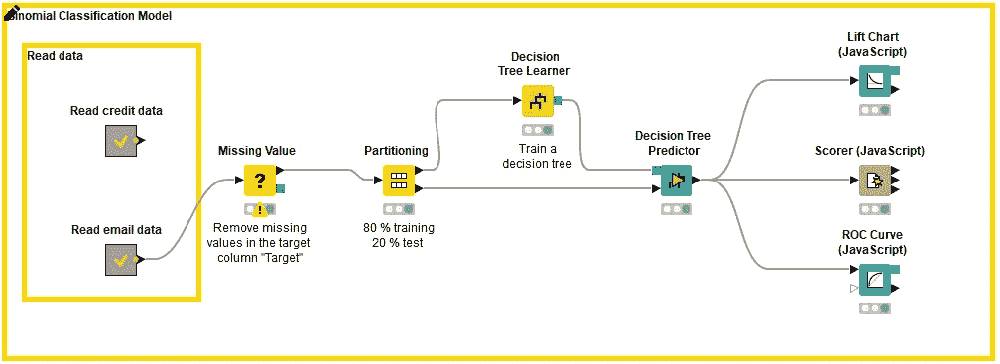

*Fig. 1: Workflow building, applying and evaluating a supervised classification model: data reading and preprocessing, partitioning, model training, prediction, and model evaluation. This workflow predicts whether emails are “spam” or “normal”.*

构建分类模型的最后一步是模型评分，它基于测试集中实际的和预测的目标列值的比较。模型的整个评分过程由一个匹配计数组成:有多少数据行被模型正确分类，有多少数据行被模型错误分类。混淆矩阵中总结了这些计数。

在电子邮件分类示例中，我们需要回答几个不同的问题:

*   有多少实际的垃圾邮件被预测为垃圾邮件？
*   正常的有多少？
*   一些正常的电子邮件被预测为垃圾邮件吗？
*   有多少正常邮件被正确预测？

这些数字显示在混淆矩阵中。并且在混淆矩阵的顶部计算类别统计。混淆矩阵和类统计显示在 Scorer (JavaScript)节点的交互视图中，如图 2 所示。

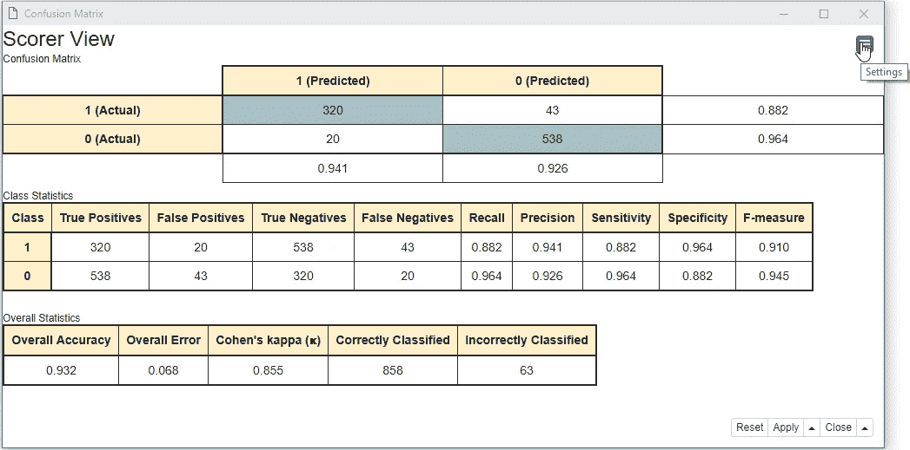

*Fig. 2: Confusion matrix and class statistics in the interactive view of the Scorer (JavaScript) node.*

# 混淆矩阵

现在让我们看看这些数字在混乱矩阵中是什么。

最初引入混淆矩阵是为了评估二项式分类的结果。因此，首先要做的是将两个类中的一个作为感兴趣的类，即**正类**。在目标列中，我们需要(任意)选择一个值作为正类。另一个值则自动被视为负类。这个赋值是任意的，只要记住一些类统计会根据所选的正类显示不同的值。这里我们选择垃圾邮件作为正面类，正常邮件作为负面类。

图 3 中的混淆矩阵报告了:

*   属于肯定类别(垃圾邮件)并被正确分类的数据行(电子邮件)。这些被称为**真阳性(TP)。**真阳性的数量放在混淆矩阵的左上角单元格中。
*   数据行(电子邮件)属于肯定类(垃圾邮件)，但被错误地归类为否定类(正常电子邮件)。这些被称为**假阴性(FN)** 。假阴性的数量放在混淆矩阵的右上角单元中。
*   属于负面类别(正常)且被错误分类为正面类别(垃圾邮件)的数据行(电子邮件)。这些被称为**假阳性(FP)** 。假阳性的数量被放在混淆矩阵的左下角。

属于负类(正常)并被正确分类的数据行(电子邮件)。这些被称为**真否定(TN)** 。真阴性的数量放在混淆矩阵的右下角。

因此，正确的预测是在灰色背景的对角线上；不正确的预测在红色背景的对角线上:

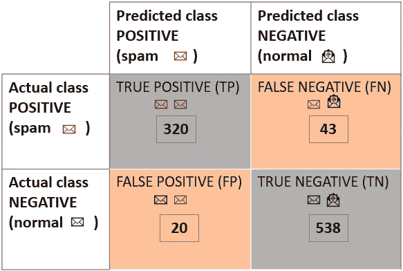

Fig. 3: A confusion matrix showing actual and predicted positive and negative classes in the test set.

# 等级统计的度量

现在，使用混淆矩阵中的四个计数，我们可以计算一些类统计度量来量化模型性能。

类统计，顾名思义，分别总结了正类和负类的模型性能。这就是为什么它的值和解释随着正类的不同定义而变化，以及为什么它经常用两个度量来表示的原因。

# 敏感性和特异性

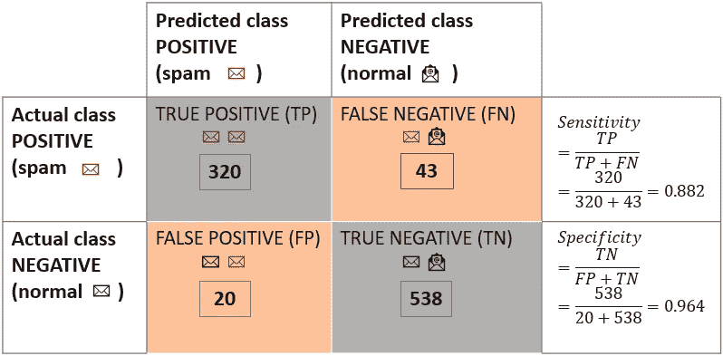

Fig. 4: Sensitivity and specificity values and their formulas, which are based on the values in the confusion matrix, for a classification model predicting emails as “spam” or “normal”

**敏感度**衡量模型检测阳性类别中事件的难易程度。因此，假设垃圾邮件是肯定的类别，敏感度量化了有多少实际的垃圾邮件被正确预测为垃圾邮件。

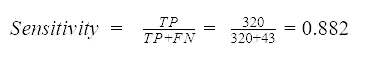

我们将真阳性的数量除以数据集中所有阳性事件的数量:正确预测的阳性类事件(TP)和错误预测的阳性类事件(FN)。该示例中的模型达到灵敏度值 0.882。这意味着数据集中约 88 %的垃圾邮件被正确预测为垃圾邮件。

**特异性**测量分配给阳性类别的精确程度，在这种情况下，是分配给电子邮件的垃圾邮件标签。

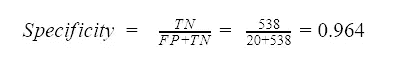

我们将真阴性的数量除以数据集中所有阴性事件的数量:预测错误的阴性类事件(FP)和预测正确的阴性类事件(TN)。该模型达到 0.964 的特异性值，因此不到 4 %的所有正常电子邮件被错误地预测为垃圾邮件。

# 召回率、精确度和 F 值

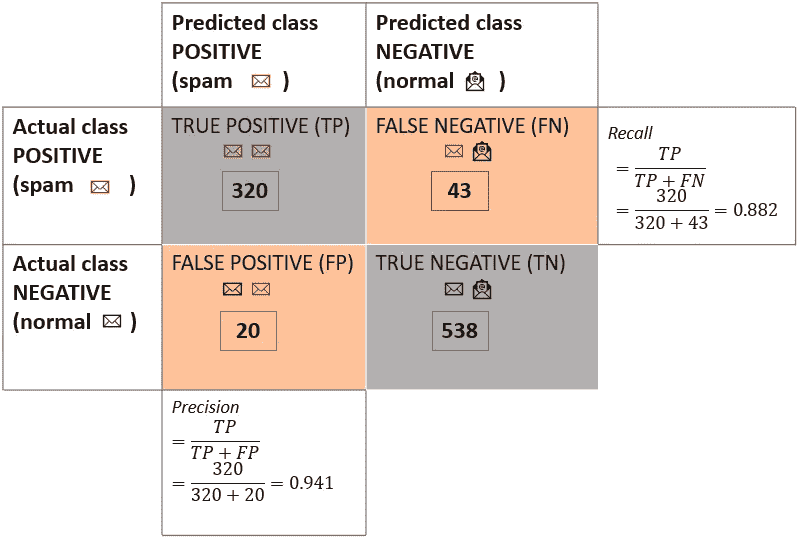

Fig. 5: Recall and precision values and their formulas, which are based on the values shown in the confusion matrix, for a classification model predicting emails as “spam” or “normal”

与敏感度类似，**回忆**衡量模型在探测积极事件方面的表现。因此，回忆的公式和敏感度的公式是一样的。

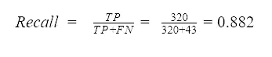

**Precision** 衡量模型在将正面事件分配给正面类方面的表现。也就是垃圾邮件预测的准确程度。

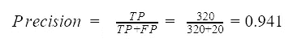

我们将真阳性的数量除以分配给阳性类别的所有事件的数量，即真阳性和假阳性的总和。该模型的精度值为 0.941。因此，几乎 95 %被预测为垃圾邮件的电子邮件实际上是垃圾邮件。

召回率和精确度通常成对报告，因为这些指标从两个角度报告模型的相关性，也称为通过召回率测量的[类型 I 错误](https://en.wikipedia.org/wiki/Type_I_and_type_II_errors#Type_I_error)和通过精确度测量的[类型 II 错误](https://en.wikipedia.org/wiki/Type_I_and_type_II_errors#Type_II_error)。

召回和精确通常是相关的:如果我们使用更严格的垃圾邮件过滤器，我们将减少收件箱中危险邮件的数量，但增加事后必须从垃圾邮件箱文件夹中收集的正常邮件的数量。相反，即不太严格的垃圾邮件过滤器，将迫使我们对收件箱进行第二次手动过滤，一些垃圾邮件偶尔会进入收件箱。

或者，可以通过将召回率和精确度结合起来的方法来报告召回率和精确度。一个例子叫做 **F-measure** ，它是召回率和精确度的调和平均值:

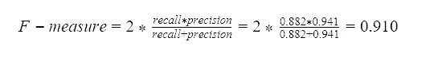

# 多元分类模型

在多项式分类模型的情况下，目标列有三个或更多的值。例如，电子邮件可以被标记为“垃圾邮件”、“广告”和“正常邮件”。

类似于二项式分类模型，目标类值被分配给正类和负类。在这里，我们将垃圾邮件定义为正面类别，将普通邮件和广告邮件定义为负面类别。现在，混淆矩阵如图 6 所示。

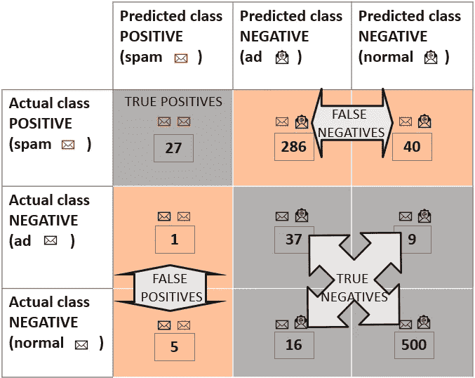

Fig. 6: Confusion matrix showing the distribution of predictions to true positives, false negatives, false positives, and true negatives for a classification model predicting emails into three classes “spam”, “ad”, and “normal”

为了计算类别统计数据，我们必须使用多元混淆矩阵中的值重新定义真阳性、假阴性、假阳性和真阴性:

*   由阳性类别的行和列标识的单元包含**真阳性**，即实际和预测的类别是垃圾邮件
*   由肯定类别的行和否定类别的列标识的单元包含**假否定**，其中实际类别是垃圾邮件，而预测类别是正常或广告
*   由否定类别的行和肯定类别的列标识的单元格包含**误报**，其中实际类别是正常或 ad，而预测类别是垃圾邮件
*   阳性类别的行和列之外的单元格包含**真阴性**，其中实际类别为 ad 或正常，预测类别为 ad 或正常。否定类别中的不正确预测仍然被认为是真正的否定

现在，这四个统计数据可用于使用上一节中介绍的公式计算类统计数据。

# 摘要

在本文中，我们已经为模型性能评估中使用的度量奠定了基础:混淆矩阵。

事实上，混淆矩阵显示了分类模型的性能:有多少正面和负面事件被正确或错误地预测。这些计数是计算更一般的类统计度量的基础。在这里，我们报告了最常用的指标:灵敏度和特异性、召回率和精确度以及 F 值。

混淆矩阵和类统计量已被定义为二项式分类问题。然而，我们已经展示了它们如何能够被容易地扩展以解决多项式分类问题。

— — -

正如最初发表在 [KNIME 博客](https://www.knime.com/blog/from-modeling-to-scoring-confusion-matrix-and-class-statistics)