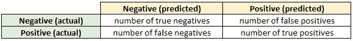
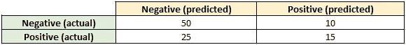
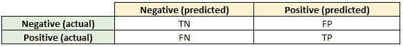
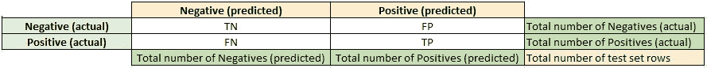
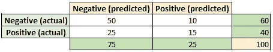

# 困惑矩阵——它是什么？

> 原文：<https://towardsdatascience.com/confusion-matrix-what-is-it-e859e1bbecdc?source=collection_archive---------7----------------------->

Source: [Unsplash](https://unsplash.com/photos/Zq6HerrBPEs)

## [机器学习](https://towardsai.net/p/category/machine-learning)

## 计算评估二元分类所需的矩阵

你手头有一个二进制分类问题。让我们将目标变量中的两个类分别表示为“负”和“正”。您已经有了用于开发分类器的数据集，执行了探索性数据分析、特征工程，并得出了应该训练什么模型的结论。您已经将数据分为定型集和测试集，并使用定型集来定型您的模型。然后，将测试数据中的每个实例提供给训练好的模型，并获得两个类中的一个作为相应的输出。

现在，你如何知道你的模型是否表现良好？并非所有被模型分类为“负”的测试集行将实际上是“负”的。同样适用于‘积极’。换句话说，你如何评价自己？这就是混淆矩阵发挥作用的地方。

混淆矩阵是具有以下结构的 2x2 矩阵:

元素*真阴性的数量*是被模型分类为‘阴性’但实际上是‘阴性’的行数。

元素*假阴性的数量*是被模型分类为‘阳性’但实际上是‘阴性’的行数。

同样的道理，我们可以理解*真阳性数和* *假阳性数*是什么意思*。*

列标签**阴性(预测)**表示第一列包含预测的“阴性”数&列标签**阳性(预测)**表示第二列包含预测的“阳性”数。同样，行标签**负数(实际)** & **正数(实际)**表示这两行包含实际“负数”和“正数”的数字。

让我们看一个例子。假设测试集包含 100 行，其中 75 行为“负”，其余为“正”。假设经过训练的模型正确地将 50%的实际“负面”和 15%的实际“正面”分类。这意味着它错误地将 25 个实际“负面”和 10 个实际“正面”分类。这意味着，

*真正否定的数量= 50*

*假阴性的数量= 25*

*真阳性的数量= 15*

*误报数量= 10*

因此，本例中的混淆矩阵如下所示:

为了表示简单，让我们将*个真阴性*表示为**TN** ，*个假阴性*表示为 **FN** ，*个真阳性*表示为 **TP，**和*个假阳性*表示为 **FP** 。因此，混淆矩阵的简化表示为:

不难理解，*真阴性数* (TN)和*假阴性数* (FN)之和等于*总数* *模型预测的*阴性数，即 FN +TN =预测阴性总数。

类似地，*真阴性数* (TN)和*假阳性数* (FP)之和等于*真阴性总数，*即 TN + FP =真阴性总数。

根据同样的推理，我们理解，

FP + TP =预测阳性总数

FN + TP =实际阳性总数。

当然，*预测阴性总数* +预测阳性总数*=*测试集行数**

*类似地，*实际阴性总数+实际阳性总数=测试集行数。**

*将此信息添加到混淆矩阵中:*

**

*将这些附加信息添加到前面讨论的例子中的混淆矩阵中:*

**

*让我们看看如何使用 scikit-learn 的*度量*模块在 Python 中计算混淆矩阵。让我们在测试集中取 10 行，并将“负”和“正”分别表示为 0 和 1。在下面的 Python 代码中，我们从*度量*模块中导入了*混淆 _ 矩阵*函数。然后将实际的和预测的类作为输入给*混淆矩阵*函数，我们得到矩阵作为输出。*

*检查代码中的*实际*和*预测*列表，*

**真底片数* (TN) = 1*

**真阳性的数量* (TP) = 4*

**假阴性数量* (FN) = 2*

**误报数量* (FP) *=* 3*

**实际底片总数* (TN + FP) *=* 4*

**实际阳性总数* (TP + FN) *=* 6*

**预测否定总数* (TN + FN) *=* 3*

**预测阳性总数* (TP + FP) = 7*

*在上面的代码中打印混淆矩阵会得到以下输出:*

*[[1 3]
[2 4]]*

*程序给出了正确的混淆矩阵。*

*在我以后的文章中，我将解释如何使用混淆矩阵来评估二元分类器的性能。*

*现在结束！*

*延伸阅读:*

*neptune.ai 的以下帖子详细解释了可以使用混淆矩阵计算的 24 个性能指标，以评估二进制分类:*

* [## 二元分类的 24 个评估指标(以及何时使用)- neptune.ai

### 分类度量让您可以评估机器学习模型的性能，但它们有这么多，每个…

海王星. ai](https://neptune.ai/blog/evaluation-metrics-binary-classification) 

## 参考资料:

 [## Skymind

### 关于混淆矩阵的文章— skymind.ai](https://skymind.ai/wiki/accuracy-precision-recall-f1)  [## 机器学习中的混淆矩阵

### 在机器学习领域，特别是统计分类问题，混淆矩阵，也…

www.geeksforgeeks.org](https://www.geeksforgeeks.org/confusion-matrix-machine-learning/)*