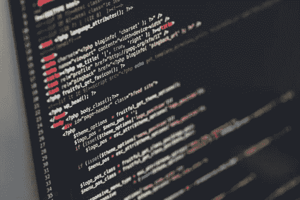

# 不偏不倚不一定公平

> 原文：<https://towardsdatascience.com/confusion-over-bias-7fa46200bd08?source=collection_archive---------30----------------------->

## 关于“偏见”在数据科学中的真正含义，有太多的困惑

最近有很多关于人工智能和机器学习中的伦理和偏见的伟大文章，但每篇文章都让我想起近年来我与分析师和数据科学家就“偏见”进行的经常是艰难的对话和培训，以及围绕模型或机器生成的结果中可能存在或不存在的各种不同类型的偏见的困惑。这些对话很少触及任何伦理困境，而是关注准确性和可能导致扭曲结果(偏向特定结果)的因素。尽管一个精确的(无偏的)算法被提供了歪斜的(有偏的)数据，歪斜的(有偏的)结果仍可能发生。如果结果本身是有偏差的，但不是以不公平的方式偏袒一个群体，那么根据许多定义，它是“无偏见的”…令人困惑。是啊…

***机器不能偏！***

在过去的一年里，我与一位非常自信的高级数据架构师进行了一次比较痛苦的对话，内容是关于团队产生的算法偏差。这并不是一种造成道德困境的“偏见”,而是一种针对特定客户的偏见，仅仅因为我们从中提取的数据样本超出了这部分客户。不可能！他不以为然地摇着手指，好像我不再值得在他的智力优势面前出现。对他来说，我提出一个数学公式会激发情感并对刻板印象起作用的想法是荒谬的，也是我无知的表现。对我来说，我们雇佣了一个不理解样本偏差概念的高级数据架构师的想法是一个深不可测的组织失败，需要解决。数据科学开发团队中还有其他人不理解样本偏差吗？我就不吊你胃口了——痛苦的回答是肯定的。事实上，在我们将我们认为理所当然的统计基础知识添加到“数据科学家”、“数据分析师”和“数据架构师”的筛选标准中后，它大大减少了我们的候选人。我震惊地发现，即使是许多受过高级机器学习方法培训的数据科学家，也很少或根本不了解如何确定数据样本中的偏斜或偏差。

***即使大数据也有大偏差***

如果你碰巧是脸书、亚马逊或谷歌，你拥有每个人所有时间做的所有事情的数据——那么你正在研究所谓的“人口”。对我们其他人来说——你正在研究一个样本。这可能是一个巨大的 Pb 大小的样本，但它仍然是一个样本。在营销分析中，大多数零售商对忠诚客户的丰富数据有很好的洞察力，几乎与在线客户的丰富数据一样，也许是店内客户的良好数据。在你的客户交易的已知范围内，会有需要调整的偏差。一家拥有 90%交易量的公司要做的工作要少得多，但如果你只跟踪忠诚客户，这些客户和非忠诚客户的行为会有很大的不同。因此，如果不了解数据不对称会导致何种偏见，你就无法对你的客户做出全面的了解。当你更进一步，试着推断你现有客户的特征和行为以获得新客户时，理解你的客户与一般人群以及你的潜在目标有多大的不同是非常重要的。

***机器不会制造不公平，但会延续已经存在的不公平* *模式***

**好算法&坏数据** —数据中的偏差意味着数据中存在偏差，这可能会给出不正确的结果。它比损坏的数据更棘手，因为从各方面来看，它都处于良好的状态，所以它通过了所有的质量检查，但它来自一个过度/不足代表某些人群或行为的来源。对于许多 ML/AI 部署来说，这种错误已经是一个普遍而持久的问题。由于公司面临来自董事会和投资者的压力，要求它们在产品中添加任何类似人工智能的东西，它们竞相将算法放在未经验证的数据集上推向市场。基于深度学习算法的扭曲数据是黑盒的完美配方，黑盒会吐出看似合理但无法完全检查的答案，直到出现可怕和明显的错误。令人不安？应该是这样的，但在某种程度上，这更多的是关于疏忽的实践，而不是通过正确数据工作的算法、良好的算法但产生不公平的结果所产生的道德困境。

好的数据，好的算法，坏的结果——机器输入完美的数据，创造出不带感情色彩的数学结果，无论你如何解读它们。人类观察结果并解读意图——但这与意图无关，这只是数学。当结果不公平时，问题就出现了，事实是，因为这个世界并不像今天这样公平，不受约束的算法将加剧这种差距。事实:有一些产品，低收入社区的人会比富裕社区的人支付更多。这不是观点，也不是数据偏差或糟糕算法的结果——这是我知道的事实，因为多年来强大而彻底的定量分析。基于这种认识，在一个公正的、正确运行的机器算法独立于人类干预来设定价格的世界里，穷人和少数民族将为基本商品支付更多的费用。这不能通过从算法中删除收入、种族和其他属性来解决——事实上，添加这些东西是唯一可以帮助阻止算法产生任何有社会良知的人都会认为不公平的结果的东西。即使在缺乏社会良知的情况下，抵制或对歧视行为采取法律行动的威胁也足以让大多数公司尽一切可能避免不公平的结果，这种不公平的结果不是来自数据或算法的错误，而是来自我们的社会结构和人类表现出的有时令人惊讶的行为，这些行为被机器发现了。

*PS。当然，我很容易指责人们不理解认知偏差和统计偏差之间的区别，或者不了解英语中使用偏差的各种方式。对任何有兴趣的人来说，这里有一些链接。*

[关于统计偏差](https://data36.com/statistical-bias-types-explained/On)

[认知偏差](https://humanhow.com/en/list-of-cognitive-biases-with-examples/)

[无意识偏见与大脑](https://www.psychologytoday.com/us/blog/the-media-psychology-effect/201604/mris-reveal-unconscious-bias-in-the-brain)