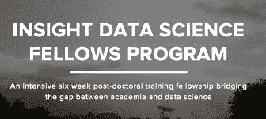

# 国会关门了，所以她成了网飞的一名数据科学家

> 原文：<https://towardsdatascience.com/congress-shut-down-so-she-became-a-data-scientist-at-netflix-927de653fe31?source=collection_archive---------25----------------------->

## 了解 Becky Tucker 如何克服学术生涯中的挫折，她在网飞大学做什么，以及用同理心倾听的重要性

网飞彻底改变了我们观看的方式，并将基于订阅的流媒体内容变成了常态。凭借超过 1 . 39 亿的全球用户和美国 51%的市场份额，网飞是这个领域的主导者。

贝基·塔克已经和网飞在一起快五年了。她目前是 Studio 科学和分析团队的高级数据科学家。在本文中，我们将讨论她从物理学到数据科学的转变，她在网飞大学的工作，以及带着同理心和谦逊倾听的重要性。

**转向数据科学** 在从事数据科学之前，Becky 对物理和更广阔的宇宙非常着迷。她在佐治亚理工大学攻读物理学，重点是天文学。受教学和学习乐趣的激励，她在加州理工学院观测宇宙学小组攻读物理学博士学位。

她以实验专家的身份加入了这个小组，用 Matlab 和 Python 做实验工作和数据分析。然而，到了第四年，她开始对自己在学术界的工作前景感到失望。她感兴趣的工作类型意味着一年只会有两到三个终身教职的学术职位，而且通常竞争非常激烈。

更糟糕的是，在她研究生院的最后一年，政府关门导致极地项目办公室取消了整整一季的仪器发射，这导致她的实验推迟了两年。因此，她可以再呆两年，直到完成她的项目，或者将她的职业生涯转向新的领域。

由于她整个实验室的设备都滞留在新西兰，要过几个月才能全部取回，她有很多空闲时间。这一空白让她重新审视了自己对学术界的疑虑，因此她开始探索一些物理学博士的典型替代职业，包括量化金融、航空航天、国防、科学咨询和相对较新的数据科学领域。通过阅读和与该领域个人的讨论，她意识到数据科学非常适合她。

虽然她有一些编程经验，并在几次实习中使用过神经网络，但这个领域对她来说非常陌生。幸运的是，她遇到了 [Insight 数据科学项目](https://www.insightdatascience.com/)，这是一个面向 STEM 领域的博士、希望过渡到数据科学的项目。鉴于她日程表上的空缺，她能够得到导师的同意参加。

作为一名物理学家，她有很好的 Python 技能，但作为一名程序员，她的技能很差。她对数据库或 SQL 一无所知，对机器学习和成为一名有效的数据科学家所需的许多其他概念的了解也很有限。

然而，由于她在物理方面的训练，她不那么害怕困难的问题，并且已经培养了自学困难概念的技能。这种心态在德语短语“ *Sitzfleisch* 中被她捕捉到了，大致翻译过来就是坐在椅子上足够长时间来解决难题的能力。

在项目接近尾声时，全班有机会进行路演，在两分钟的演示时间内展示他们在不同公司的个人项目。Becky 的项目是在 LocationMap 上，这是一个使用 Python 和 MySQL 识别和绘制电影拍摄地点的网络应用程序。她已经是一个巨大的电影迷，因此，该项目是一个她真正感兴趣的生活。在她对电影的个人兴趣和初露头角的数据科学技能之间，在网飞的一个角色看起来像是梦寐以求的角色。

在他们的办公室推销了她的项目后，她获得了一次面试机会，并得到了三个月后开始工作的机会。这给了她足够的时间回到研究生院并完成论文(使用校准和测试数据，而不是飞行数据)，使她能够获得博士学位并开始她的新角色。

回想她在 Insight 的时光，Becky 很感激它给她提供的经历。她从中获得的最有价值的东西是了解她不知道的事情。具体来说，行业是什么样子，人们如何看待业务指标，以及在数据科学角色中取得成功所需的术语和技能。这也肯定了她投身科技行业，离开学术界的决定。

## **网飞数据科学**

刚刚从研究生院毕业，Becky 就加入了网飞位于洛杉矶办公室的数据科学和工程团队。当时公司的大部分人员都在洛杉矶工作，所以洛杉矶办事处很小。她的团队由 12 人组成，洛杉矶办公室总共大约有 250 人。

她发现这种转变很容易，这在一定程度上要归功于团队中那些了不起的、支持她的人，他们帮助她成长起来。她从来没有因为不知道某件事而感到难过，在最初的几个月里，团队积极地帮助她寻找项目。

在早期，她的大量工作围绕着对网飞原创电视连续剧的分析，该电视剧当时由三个节目组成。这些项目的工作与她在学术界的工作形成了鲜明的对比，在学术界很难看到她的工作的直接影响。

她很快发现自己担任了一个高级职位，目前她在分析和预测建模之间分配时间。她所做的工作类型经常变化，在任何给定的时间，她可能从事三个中型和一个小型项目。在这些项目中，50%可能会在本季度内获得回报，而另一半可能会有超出本季度的可交付成果。虽然她所做的工作类型通常是与共享代码库协作，但她的大多数项目都是独立的。

她最喜欢网飞文化的一个方面是关注环境，而不是控制。虽然她的经理和利益相关者可以向她介绍公司的情况，以及他们认为什么可能是重要的，但由她来决定最重要的事情是什么。这通常意味着优先考虑有可能产生最大商业影响的项目。

## **给别人的建议**

当被问及五年前她会给自己什么建议时，她给出了以下建议:

1.  不要忽视软件工程在数据科学中的重要性。如果你认为你正在生成的代码可以存活几个季度，那就投资构建健壮的代码。这意味着添加注释，使代码可读，便于将来维护。
2.  虽然机器学习可能是她工作的一个重要方面，但她作为数据科学家的角色既是技术角色，也是商业角色。因此，能够以同情和谦逊的态度倾听利益相关者的意见，对你的成功至关重要。一个重要的重构是，你的工作应该是帮助那些已经是专家的人更好地完成他们的工作，而不是告诉他们如何做他们的工作。
3.  继续学习！每个人都是不同的，但她发现最好的学习方法之一是买课本，每天早上花 45 分钟来复习。能够浏览教科书的基本原理并将其应用到工作中是巩固概念的一个很好的方法。(她推荐[统计学习的要素](https://www.amazon.com/Elements-Statistical-Learning-Prediction-Statistics-ebook/dp/B00475AS2E)和[做贝叶斯数据分析](https://www.amazon.com/Doing-Bayesian-Data-Analysis-Tutorial/dp/0123814855))
4.  当与利益相关者交流时，要学会如何使用隐喻和类比来使你的观点易于理解。当试图向非技术利益相关者解释为什么某些东西可能或可能不工作时，这种策略得到了巨大的回报。

## 《数据思维》是一个系列，介绍处理数据的专业人士。在这个系列中，你将了解他们的日常故事，以及给别人的建议。

## 之前的采访包括来自[红牛](/data-minds-jai-bansal-data-scientist-at-red-bull-afdb141a0e26)、[开门](/data-minds-emily-fay-data-scientist-at-opendoor-50be07f5d7ca)和 [Snapchat](/data-minds-evan-chow-data-scientist-at-snapchat-1bad17861ff8) 的数据科学家。