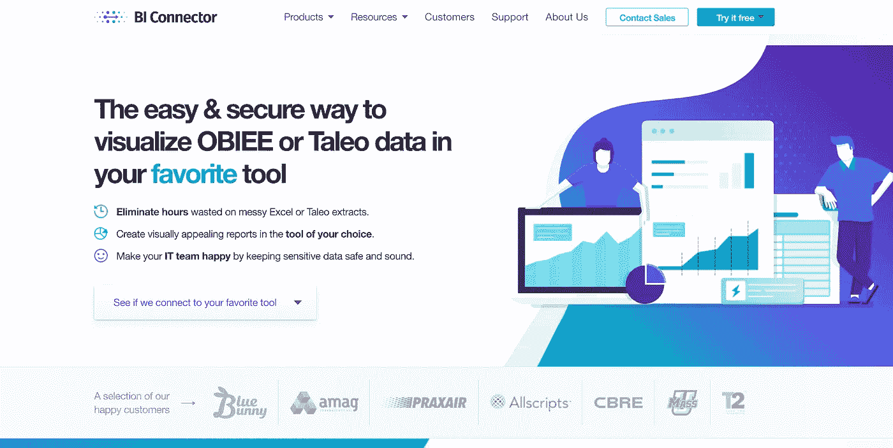

# 有一个难以置信的简单方法可以让你的 OBIEE 数据变得漂亮

> 原文：<https://towardsdatascience.com/connect-obiee-and-tableau-with-biconnector-f9d9949e1670?source=collection_archive---------9----------------------->

## BI 连接器的绝对初学者指南:如何毫不费力地将 OBIEE 连接到 Tableau 2019.2

Image by [Evren Ozdemir](https://pixabay.com/users/lextotan-7839095/?utm_source=link-attribution&utm_medium=referral&utm_campaign=image&utm_content=3135551) from [Pixabay](https://pixabay.com/?utm_source=link-attribution&utm_medium=referral&utm_campaign=image&utm_content=3135551)

您是否对以您想要的方式可视化 OBIEE 数据有多难感到沮丧？你希望你可以轻松(安全)地连接到 Tableau 吗？

你可以！

[BI 连接器](https://www.biconnector.com/)允许您在 Tableau、PowerBI 和 Qlik 中安全地访问和使用您的 OBIEE 和 Taleo 数据。

> (完全公开:我最近一直在用 BI Connector 做一些工作，肯定已经从他们那里得到了报酬，并且已经获得了他们所提供的东西。也就是说，我现在知道那边有几个人，我可以担保他们是一个多么棒的团队！)

## 将数据可视化！

如果您想要使用可视化来交流分析的结果，您可能想要使用 Tableau 这样的现代且易于使用的工具。但是没有简单的方法来处理你的 OBIEE 数据！

虽然 OBIEE 在数据和业务分析方面令人惊叹，但在简单直观的可视化方面，它不如 Tableau 有趣。

只是玩起来没那么爽！(尤其是如果你不是 OBIEE 专家的话……)

> 你不会相信有多少公司在出口、进口、SQL 暂存区等方面浪费了数万美元的时间和精力，因为他们不知道有一种工具可以让他们只需点击几下鼠标，就可以安全地将 OBIEE 数据直接连接到 Tableau。

手动将 OBIEE 数据连接到 Tableau 通常意味着浪费大量时间来创建、导出 OBIEE 数据，以及将 OBIEE 数据导入 Tableau 之类的东西。有了 BI 连接器，就简单了。它几乎不需要任何时间！您使用 OBIEE 凭证登录，这意味着您可以使用现有的业务逻辑。**你不需要对 OBIEE** 做任何改动。

你节省了时间和金钱。

GIF via [GIPHY](https://media.giphy.com/media/zIG2npQKq6PBe/giphy.gif)

BI Connector 非常适合从事机器学习、数据分析、数据可视化、商业分析、数据科学和预测分析的任何人。它使初学者的生活变得容易，并给高级用户一些他们可以从中获得乐趣的东西。

它简单、安全、高效。安装时间不到五分钟！

您可以对主题区域和报告运行直接的基于查询的实时连接，并立即使用您的结果来创建华丽、响应迅速和直观的可视化效果。您将避免常见错误，同时做出更快的决策。它为你节省了大量的时间和精力！

Photo by nickgesell via [Pixabay](http://Pixabay.com)

## [奥比耶](http://www.oracle.com/us/solutions/business-analytics/business-intelligence/enterprise-edition/overview/index.html)

Image labeled for reuse via [Wikimedia Commons](https://commons.wikimedia.org/wiki/File:Logo_oracle.jpg)

如果你对数据很认真，很有可能你已经在使用 [OBIEE](http://www.oracle.com/us/solutions/business-analytics/business-intelligence/enterprise-edition/overview/index.html) 。对于数据报告和智能来说是很神奇的。它可以容纳大量的数据。它还能非常好地处理复杂的模式。此外，Oracle 还开发了 OBIEE 中可用的预定义 BI 解决方案。它提供交互式仪表盘和报告、可操作的情报、主动检测和警报、Microsoft Office 集成等等。

也就是说，OBIEE 中的可视化选项没有 Tableau 中的多。现有的那些肯定不是用户友好的。OBIEE 使用其他工具的能力也有限，如果您想使用它们，通常需要购买额外的许可证。如果你想正确使用 OBIEE，你需要接受一些严肃的教育。

将 OBIEE 数据连接到 Tableau 也不容易。您可以导出数据并将其导入 Tableau，这将导致重复的数据、重复的逻辑和潜在的不一致的结果。您可以创建和维护一个 SQL 数据库暂存环境。但是这需要时间、金钱和资源。

> **同样值得注意的是，这两种选择都将你的数据置于未经授权访问和其他安全问题的风险之中。**

## [画面](https://www.tableau.com)

Image labeled for reuse via [Wikipedia](https://en.wikipedia.org/wiki/File:Tableau_Logo.png)

另一方面，Tableau 提供了华丽的、易于创建的可视化效果。它直观且用户友好，具有简单的拖放式响应图表和仪表盘、一键式公式、过滤器等等。(2019.2 还有一些好玩的新功能，包括矢量地图！[你可以在这里查看新功能](https://www.tableau.com/products/new-features)。)但是，虽然 Tableau 可以处理大量数据，但它无法管理 OBIEE 可以轻松处理的巨大数据量。当您有超过 25 个表或超过 16 个 get 列时，就很难使用了。

而 Tableau 里的一切都需要从头开发。

这两种工具不能互相替代。他们真的一起做了惊人的工作！但是让他们一起工作很有挑战性。

这就是 BI 连接器的用武之地！

## [双连接器](https://www.biconnector.com/)

BI 连接器是连接 OBIEE 和 Tableau 的简单而安全的方式。通过 BI Connector，您可以使用 OBIEE 数据在 Tableau 中立即创建可视化效果。BI Connector 使用 OBIEE 安全模型，因此您的数据受到保护。

它自动将你的 OBIEE 数据移入 Tableau，并保证你的数据安全。

Image by [analogicus](https://pixabay.com/users/analogicus-8164369/?utm_source=link-attribution&utm_medium=referral&utm_campaign=image&utm_content=3297650) from [Pixabay](https://pixabay.com/?utm_source=link-attribution&utm_medium=referral&utm_campaign=image&utm_content=3297650)

BI Connector 位于 OBIEE 层之上，让您可以毫不费力地集成您最喜欢的数据可视化工具，无论是 Tableau、Qlik 还是 Power BI。它简单、直观，并且弥合了技术之间的差距。这为您节省了大量的时间和金钱！

BI Connector 让您可以即插即用地访问已经在 OBIEE 中构建的内容。您可以直接从数据仓库中运行您的结果。另外，它既有趣又安全！您将构建 Tableau 可视化，同时使用 OBIEE 安全性保护您的数据。

## 如何使用 BI 连接器连接 OBIEE 和 Tableau

BI 连接器非常容易安装。它需要不到五分钟。你可以在这里找到有用的[分步指南](https://support.biconnector.com/support/solutions/articles/8000032391-connect-tableau-desktop-to-obiee-bi-connector-desktop-edition-step-by-step-installation-guide)和[真正有用的视频](https://www.biconnector.com/getting-started-with-bi-connector-for-tableau/)，如果你遇到任何问题，它们将带你完成整个过程。

## 第一步:下载

首先，你需要去 [BI 连接器网站](https://www.biconnector.com)下载 BI 连接器。你可以点击“免费试用”按钮，下拉菜单“可视化 OBIEE 数据”并点击“Tableau”

输入你的信息，点击按钮“试用 BI Connector for Tableau ”,你的下载就开始了。不需要信用卡或承诺。你有 30 天的时间来尝试，没有任何风险。

双击“bi connector-Desktop-Edition-x64-tableau . exe”文件将其解压缩。指定位置，然后开始安装。你可以点击“安装”按钮，然后按照提示进行操作。

在安装过程结束时，您会看到一个弹出窗口，让您知道您的安装已经完成。确保选中“启动 ODBC 管理器”旁边的框，然后单击“完成”

## 步骤 2: ODBC 管理员和许可证激活

接下来，您需要创建一个新的数据源。转到 ODBC 数据库管理器并单击“添加”将弹出一个对话框，您可以在其中激活 30 天的试用许可证。输入您的个人信息，然后保留试用许可证号码(它会自动显示)或将其更改为您购买的许可证的密钥，然后单击“激活”这将使您返回到现在可以创建新数据源的窗口。

点击“添加”按钮

输入数据源名称(OBIEE Connect here)和您的服务器名称、端口、用户 ID 和密码。**这是您用于 Oracle BI 服务器的信息。**

> 如果你使用类似“http://obieefunstuff . websitename . com:9704/analytics”的内容登录 OBIEE，那么你的服务器名称将是“http://obieefunstuff . websitename . com”，你的端口将是 9704。您的用户 ID 和密码就是您的 OBIEE 用户 ID 和密码。最好看一下[官方分步指南](https://support.biconnector.com/support/solutions/articles/8000032391-connect-tableau-desktop-to-obiee-bi-connector-desktop-edition-step-by-step-installation-guide)了解更多信息。它将带您了解一些常见的场景，包括如果在 URL 中看不到您的端口号该怎么办。

现在点击“测试连接”以确保一切正常。

## 步骤 3:配置主题区域或报告的访问权限

在下一个窗口中，您将看到两个小单选按钮，允许您选择“主题区域”或“报告”如果您想要连接到您在 OBIEE 目录中预先构建的分析，选择“**报告**如果你有兴趣从你的主题领域建立一个新的分析，选择“**主题领域**

做出选择后，点击“保存”如果您想更改或更新您的信息，您可以随时再次进入此屏幕。

## 步骤 4:配置 Tableau

现在是时候去 Tableau 了！启动 Tableau，然后单击“更多服务器”，然后转到“其他数据库(ODBC)”。现在，您可以选择您创建的数据源，并单击“连接”确保您的服务器名称、端口和用户 ID 与您之前使用的完全相同，并在这里输入相同的密码。测试您的连接并点击“确定”您将在“其他数据库(ODBC)”屏幕上再次单击“确定”。

你已经准备好了！开始可视化您的数据！

继续从下拉菜单中选择您的数据库，然后单击“OK”

## 完成的

就是这样！你都准备好了！

你可以像平常一样拖放你的信息！创建过滤器，添加颜色，标签，工具提示，和其他一切你通常用 Tableau 做的事情。你的 OBIEE 数据唾手可得，你可以完全按照你想要的方式使用它。

您甚至可以将 OIBEE 数据与 Tableau 中的其他数据文件混合在一起，就像您通常所做的那样。从同样的过程开始，然后点击左上角的“添加”或者下拉你的数据菜单到“新数据源”例如，如果您有 CSV 文件中的数据，请选择“文本文件”。这将打开一个窗口，您可以在其中选择您的文件。

现在，您可以开始处理您的附加数据了！

真的就那么简单。你只需几分钟就能把 OBIEE 的力量与 Tableau 的轻松和吸引力结合起来。

你还在等什么？今天就试试 [BI 连接器](https://www.biconnector.com/)！

感谢阅读！和往常一样，如果你用这些信息做了什么很酷的事情，请在下面的评论中让每个人都知道，或者随时在 LinkedIn [@annebonnerdata](https://www.linkedin.com/in/annebonnerdata/) 上联系。

当然了，

