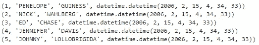

# 将 Python 连接到 Oracle、SQL Server、MySQL 和 PostgreSQL

> 原文：<https://towardsdatascience.com/connecting-python-to-oracle-sql-server-mysql-and-postgresql-ea1e4523b1e9?source=collection_archive---------4----------------------->

## 数据库。在一定程度上经常被数据科学家忽略，至少被新的数据科学家忽略。我明白了，你有你的波士顿住房数据集存储在 CSV 文件中，为什么还要麻烦数据库呢？


Photo by [panumas nikhomkhai](https://www.pexels.com/@cookiecutter?utm_content=attributionCopyText&utm_medium=referral&utm_source=pexels) from [Pexels](https://www.pexels.com/photo/bandwidth-close-up-computer-connection-1148820/?utm_content=attributionCopyText&utm_medium=referral&utm_source=pexels)

在我职业生涯的大部分时间里，我也忽略了它们，但后来我需要为我的日常工作学习 SQL 和 PL/SQL。这是一项很好的技能——甚至可以说是你简历中的必备技能——但是客户想要用 PL/SQL 交付数据科学项目是完全的白痴行为。

但是 SQL 不等于数据库。我喜欢数据库的数据存储能力，主要是因为数据比 CSV 更安全——没有人可以双击并打开/更改 Excel 中的表格。

出于这个原因，我决定写这篇文章，因为出于某种原因，在网上找到 2010 年后发布的关于这个主题的东西并不像你想象的那样简单(从那以后发生了很多变化)。

# Oracle 连接

为了连接到 Oracle 数据库,您当然需要在您的机器上安装该数据库。我的机器有 **12c** 版本，所以不能保证所有东西都能在旧版本或新版本上运行。为了测试一切，我解锁了著名的 **HR** 模式，并将密码设置为 *hr* 。

一旦你也这样做了，点击*连接*将显示你需要连接 Python 到你的 Oracle 数据库实例的每个细节:


在跳转到代码之前，你需要通过 *pip* 安装**CX _ Oracle库，就像这样:**

```
pip install cx_oracle
```

连接过程是我今天要讨论的四个过程中最长的，但是如果你逐行阅读的话，它真的很简单。我选择从著名的**雇员**表中获取前 10 行(注意 Oracle 如何使用 ***ROWNUM*** ，而不是 ***TOP*** ，或 ***LIMIT*** ):

```
import cx_Oracledsn = cx_Oracle.makedsn(
    'localhost', 
    '1521', 
    service_name='orcl'
)
conn = cx_Oracle.connect(
    user='hr', 
    password='hr', 
    dsn=dsn
)c = conn.cursor()
c.execute('SELECT * FROM employees WHERE ROWNUM <= 10')for row in c: print(row)
conn.close()
```

执行此代码块将向您的笔记本输出以下内容:


这并不难，是吗？下面的会更容易，或者至少写的更短，我保证！

# SQL Server

除了 Oracle 数据库之外，微软的 SQL Server 也是典型工作环境中常见的数据库系统。要连接到它，您首先需要获取**服务器名称**(所选字符串):


然后，当您连接到数据库引擎时，您将需要找到数据库名称和表名称，这样您就知道应该在连接字符串中放入什么:


哦，差点忘了。还需要通过 *pip* 安装***py odbc*库:**

```
pip install pyodbc
```

正如所承诺的，这段代码比连接到 Oracle 的代码要短一些:

```
import pyodbcconn = pyodbc.connect(
    'Driver={SQL Server};'
    'Server=DESKTOP-TLF7IMQ\SQLEXPRESS;'
    'Database=retail;'
    'Trusted_Connection=yes;'
)cursor = conn.cursor()
cursor.execute('SELECT TOP 5 * FROM dbo.table_transactions')for row in cursor: print(row)
conn.close()
```

执行此代码单元将输出以下内容:


接下来，MySQL。

# 关系型数据库

虽然在工作环境中可能不像前两个那么常用， [MySQL](https://dev.mysql.com/downloads/) 仍然非常受欢迎，如果你以前学过 web 开发，你可能会用到它。

默认情况下，MySQL 实例附带了这个 ***sakila*** 数据库，它看起来对 [dvdrental](http://www.postgresqltutorial.com/postgresql-sample-database/) 数据库非常熟悉。我要建立的连接是到 ***sakila*** 数据库，以及 ***演员*** 表。


我通过 [Anaconda](https://www.anaconda.com/) 安装的 Python 已经内置了必要的库，所以不需要额外安装。要从 Python 连接，我将使用 ***mysql*** 库:

```
import mysql.connectorconn = mysql.connector.connect(
    host='localhost',
    user='root',
    passwd='1234'
)cursor = conn.cursor()
cursor.execute('SELECT * FROM sakila.actor LIMIT 5')for row in cursor: print(row)
conn.close()
```

一旦执行了这段代码，您将得到如下输出:



搞定三个，还剩一个！

# 一种数据库系统

最后但同样重要的是 Postgres 数据库。要连接到它，您需要安装 ***psycopg2*** 库:

```
pip install psycopg2
```

奇怪的名字，我知道。很容易在导入时出现打印错误。

然而，连接过程相当简单。我的数据库实例包含前面提到的 ***dvdrental*** 数据库，所以我将连接到它，再一次连接到 actor 表:

```
import psycopg2conn = psycopg2.connect(
    user='postgres',
    password='1234',
    host='127.0.0.1',
    port='5432',
    database='dvdrental'
)cursor = conn.cursor()
cursor.execute('SELECT * FROM actor LIMIT 10')for row in cursor: print(row)
conn.close()
```

执行该代码块将输出以下内容:


# 结论

这篇文章差不多到此结束。我看过 15 分钟以上的文章，只连接到一个数据库，涵盖了所有的基本细节。就我个人而言，我不认为这有什么意义，因为拜托，这只是一个数据库连接！有很多更重要的事情需要关注。

如果你是一名数据科学家，你将主要使用数据库来获取数据，所以这篇文章对你来说已经足够了。如果需要更高级的东西，去问你最好的朋友，谷歌。

感谢阅读…

*喜欢这篇文章吗？成为* [*中等会员*](https://medium.com/@radecicdario/membership) *继续无限制的学习。如果你使用下面的链接，我会收到你的一部分会员费，不需要你额外付费。*

[](https://medium.com/@radecicdario/membership) [## 通过我的推荐链接加入 Medium-Dario rade ci

### 作为一个媒体会员，你的会员费的一部分会给你阅读的作家，你可以完全接触到每一个故事…

medium.com](https://medium.com/@radecicdario/membership)