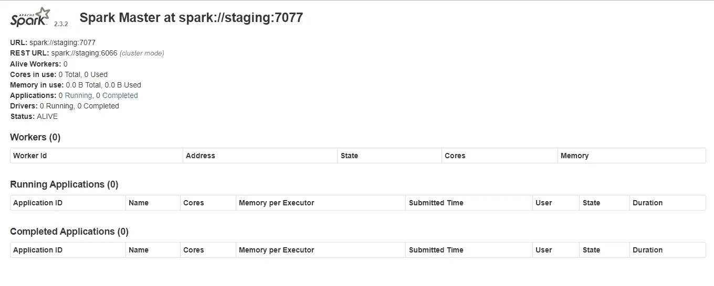
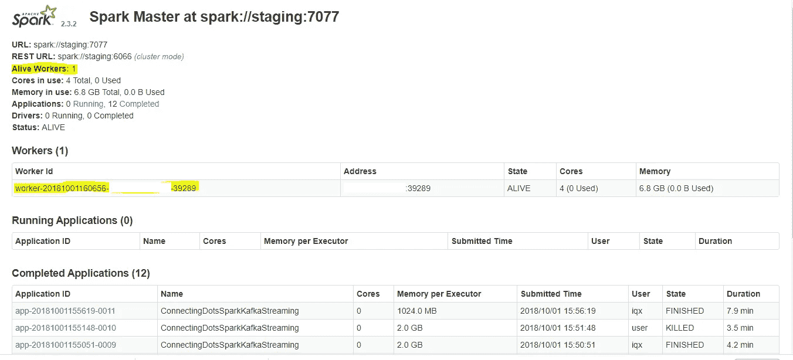

# 将点连接起来(Python、Spark 和 Kafka)

> 原文：<https://towardsdatascience.com/connecting-the-dots-python-spark-and-kafka-19e6beba6404?source=collection_archive---------7----------------------->

## Python、Spark 和 Kafka 是数据科学家日常活动中的重要框架。让他们能够整合这些框架是至关重要的。


Photo By [César Gaviria](https://www.pexels.com/@cesar-gaviria-232160) from [Pexels](https://www.pexels.com/@cesar-gaviria-232160)

## 介绍

通常，数据科学家更喜欢使用 Python(在某些情况下是 R)来开发机器学习模型。在这里，他们有一个有效的理由，因为数据驱动的解决方案伴随着许多实验而来。进行实验需要与我们用来开发模型的语言进行大量的交互，python 中可用于开发机器学习模型的库和平台非常多。这是一个有效的论点；然而，当这些模型应用于生产时，我们会遇到问题。

我们仍然有 Python 微服务库如 Flask 来部署机器学习模型并将其作为 API 发布。然而，问题是，“这能满足实时分析的需要吗？在实时分析中，你需要在一毫秒的时间内处理数百万个事件？”答案是否定的。这种情况是我写这篇文章的动机。

为了克服上述所有问题，我已经确定了一组可以适当连接的点。在本文中，我试图将这些点联系起来，它们是 Python、Apache Spark 和 Apache Kafka。

这篇文章是按以下顺序组织的:

*   讨论在 Linux 环境中设置 Apache Spark 的步骤。
*   开始卡夫卡(更多详情请参考这篇[文章](https://www.linkedin.com/pulse/quickstart-apache-kafka-kafka-python-kiruparan-balachandran/))。
*   创建一个 PySpark 应用程序，用于消费和处理事件并写回 Kafka。
*   使用 Kafka-Python 生成和消费事件的步骤。

# 安装 Spark

最新版本的 Apache Spark 可以在 http://spark.apache.org/downloads.html 的[买到](http://spark.apache.org/downloads.html)

在我撰写本文时，Spark-2.3.2 是最新版本。

**步骤 1** :使用以下命令将 spark-2.3.2 下载到本地机器

```
wget http://www-us.apache.org/dist/spark/spark-2.3.2/spark-2.3.2-bin-hadoop2.7.tgz
```

**第二步**:拆包。

```
tar -xvf spark-2.1.1-bin-hadoop2.7.tgz
```

**第三步**:创建软链接(可选)。

这一步是可选的，但却是优选的；方便以后升级 spark 版本。

```
ln -s /home/xxx/spark-2.3.2-bin-hadoop2.7/ /home/xxx/spark
```

**步骤 4** :向 bashrc 添加 SPARK_HOME 条目

```
*#set spark related environment varibales*
SPARK_HOME="/home/xxx/spark"
export PATH=$SPARK_HOME/bin:$PATH
export PATH=$SPARK_HOME/sbin:$PATH
```

**步骤 5** :验证安装

```
pyspark
```

如果一切都准确无误，控制台上会显示以下输出:

**步骤 6** :启动本机主机

```
start-master.sh
```

Spark Master Web GUI(流动屏幕)可从以下网址访问:[http://abc.def.com:8080/](http://iqx.iqmedialabs.com:8080/)



Spark Master Web GUI — Image by Author

**第七步**:启动工人

```
start-slave.sh spark:*//abc.def.ghi.jkl:7077*
```

如果一切都准确，工人的条目将出现在同一个屏幕上。



Spark Master Web GUI with workers — Image by Author

# 开始卡夫卡

在这里，Kafka 是一个流媒体平台，有助于生产和消费 spark 平台的事件。

更详细的说明请参考我已经写过的关于[卡夫卡](https://medium.com/@kiruparan/quickstart-apache-kafka-kafka-python-e8356bec94)的文章。

**第一步**:转到卡夫卡根文件夹

```
cd /home/xxx/IQ_STREAM_PROCESSOR/kafka_2.12-2.0.0/
```

**第二步**:启动卡夫卡动物园管理员

```
bin/zookeeper-server-start.sh config/zookeeper.properties
```

**第三步**:启动卡夫卡经纪人

```
bin/kafka-server-start.sh config/server.properties
```

**第四步**:创建两个 Kafka 主题( *input_event 和* output_event)

# Apache Spark (PySpark)上的事件处理

## 设置火花

**第一步**

首先在集群的每个节点中设置 python 包，并指定每个 worker 节点的路径。这里最好安装 Anaconda，它包含了大部分必要的 python 包。

在 *spark-env.sh* 中添加以下条目，以指定每个工作节点的路径。

```
export PYSPARK_PYTHON='/home/xxx/anaconda3/bin/python'
```

**第二步**

需要安装 spark 应用程序中使用的其他 python 依赖项。比如我们用 Kafka-python 把处理过的事件写回 Kafka。

这是安装 Kafka python 的过程:

在控制台中，转到 anaconda bin 目录

```
cd /home/xxx/anaconda3/bin/
```

执行以下命令

```
pip install kafka-python
```

**第三步**

从以下网址下载 Spark Streaming 的 Kafka 库:[https://mvnrepository . com/artifact/org . Apache . Spark/Spark-Streaming-Kafka-0-8-assembly](https://mvnrepository.com/artifact/org.apache.spark/spark-streaming-kafka-0-8-assembly)【稍后提交 Spark 作业需要用到这个】。

现在我们已经安排好了运行 Spark 应用程序所需的整个氛围。

## 创建并提交公园申请

**创建 SparkContext**

spark 上下文是访问 Spark 功能的入口点，并提供到 Spark 集群的连接。要创建 SparkContext，首先，我们应该创建 SparkConf，它包含传递给 SparkContext 所需的参数。下面的代码片段展示了如何创建 SparkContext。

这里，仅安排了主 URL 和应用程序名称，但不限于此。SparkConf 允许你控制更多的参数。例如，您可以指定驱动程序进程使用的内核数量、每个执行器进程使用的内存量等。

**创建【流上下文 Kafka 经纪人输入流】**

流上下文是访问 spark 流功能的入口点。流式上下文的关键功能是从不同的流式源创建离散流。以下代码片段显示了如何创建 StreamingContext。

```
*#batch duration, here i process for each second*
ssc = StreamingContext(sc,1)
```

接下来，我们为来自 Kafka 代理的 pulls 消息创建输入流。应该指定创建输入流的以下参数:

*   从该流连接的 Zookeeper 的主机名和端口。
*   此消费者的组 id。
*   “每个主题要使用的 Kafka 分区数”:指定该流并行读取的分区数。

下面的代码片段表达了如何为 Kafka 代理创建输入流。

**处理事件并写回卡夫卡**

在为 Kafka Brokers 创建流之后，我们从流中提取每个事件并处理这些事件。在这里，我演示了一个在大多数 spark 教程中引用的典型示例(字数统计),并进行了一些小的修改，以在整个处理期间保持键值并写回 Kafka。

以下代码片段描述了接收入站流并使用已处理的事件创建另一个流:

现在，剩下的就是给卡夫卡回信了。我们获取处理后的流，并通过对 stream 应用输出操作(这里我们使用 foreachRDD)写回外部系统。这将每个 RDD 中的数据推送到外部系统(在我们的用例中，推送到 Kafka)。下面的代码 snipe 解释了如何将每个 RDD 中的数据写回卡夫卡:

**启动星火应用**

脚本 spark-submit 用于启动 spark 应用程序。在启动应用程序期间，应指定以下参数:

*   master:连接 master 的 URL 在我们的例子中，它是 spark://abc.def.ghi.jkl:7077
*   deploy-mode:部署驱动程序的选项(在 worker 节点或本地作为外部客户机)
*   jars:回忆一下我们关于 Spark Streaming 的卡夫卡图书馆的讨论；这里我们需要提交这个 jar 来提供 Kafka 依赖项。

最后，我们必须提交我们在本节中编写的 PySpark 脚本，即 spark_processor.py

启动所有命令后，我们的 spark 应用程序将如下所示:

如果一切正常，控制台中将出现以下输出:

现在我们有了必要的设置，是时候进行测试了。在这里，我使用 Kafka-python 来创建事件，并使用在我以前的[文章](https://www.linkedin.com/pulse/quickstart-apache-kafka-kafka-python-kiruparan-balachandran/)中已经讨论过的事件

以下是代码片段供您参考:

*产生事件的代码*

*消费事件的代码*

如果一切都准确无误，流程事件将按如下方式消耗并显示在控制台中:

## 最后的想法

本文的要点是，
1) Python、Spark 和 Kafka 是数据科学家日常活动中的重要框架。
2)本文帮助数据科学家用 Python 进行实验，同时在可扩展的生产环境中部署最终模型。

感谢您阅读本文。希望你们也能把这些点联系起来！