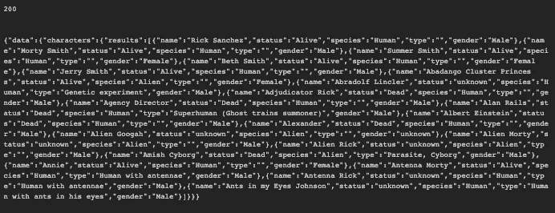
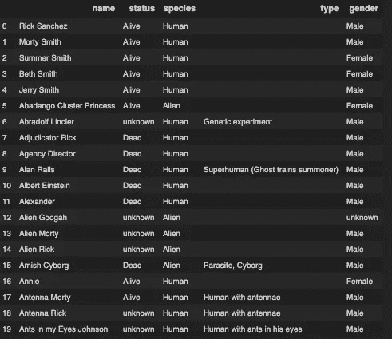

# 使用 Python 连接到 GraphQL API

> 原文：<https://towardsdatascience.com/connecting-to-a-graphql-api-using-python-246dda927840?source=collection_archive---------2----------------------->


Photo by [Perry Grone](https://unsplash.com/@perrygrone?utm_source=medium&utm_medium=referral) on [Unsplash](https://unsplash.com?utm_source=medium&utm_medium=referral)

让我们自动化并消除误差，尝试一步一步地消除前端。

***graph QL 到底是什么？*** [GraphQL](https://graphql.org/) 用最简单的话来说就是一种 ***查询语言*** 用于前端。我们发送一个请求并取回某些数据。GraphQL 也足够先进，可以对称为突变的数据进行更改。但这需要一篇全新的文章来解释。

所以我想直接连接到 GraphQL 的主要原因是因为我们有一个 web 应用程序，我们必须手动一个接一个地填写字段。如果我们知道这是重复的，那就不是最有效地利用我的时间。

我使用的老方法是通过 [Selenium](https://www.seleniumhq.org/) ，每当前端工程师做出一些改变时，这也会导致错误。所以我做了一些研究，决定为什么不直接通过 GraphQL 发送数据。我仍然从 SalesForce 获取数据，我有一篇文章向您展示如何做到这一点[这里](/using-python-to-get-salesforce-data-97bb5a7ef2cf)。然后我会处理所有的数据并发送给 GraphQL 端点。

但是我有点跑题了，让我们用 Python 连接到 GraphQL 并取回一些数据吧！

***入门***
假设你已经安装了 Python 你需要的主要模块有:
1 .`requests` (用于连接 GraphQL)
2。`json`(用于解析 GraphQL 数据)
3 .`pandas`(用于我们数据的可见性)

让我们将这些模块导入到新的 Python 脚本中。

```
import requests
import json
import pandas as pd
```

出于教程的目的，我们将连接到一个不需要认证的 GraphQL 端点。我们将连接到一个 [Rick 和 Morty GraphQL API](https://rickandmortyapi.com/about) ！

让我们从一些简单的东西开始，一个[角色数据集](https://rickandmortyapi.com/documentation/#character)就可以了。我想从他们每个人那里得到的信息是名字，地位，物种，类型和性别。我们可以将这个 GraphQL 查询设置为字符串，并将其设置为变量，如下所示:

```
query = """query {
    characters {
    results {
      name
      status
      species
      type
      gender
    }
  }
}"""
```

做这个的人让我们很容易联系到一起。我们每天最多收到 10000 个请求，所以请谨慎使用。接下来的几行代码我们设置 URL，向他们发送请求，也就是查询。如果成功，我们应该得到一个字符串格式的`200`和`text`的`status_code`。

```
url = '[https://rickandmortyapi.com/graphql/'](https://rickandmortyapi.com/graphql/')
r = requests.post(url, json={'query': query})
print(r.status_code)
print(r.text)
```



`r.text`是一个字符串的格式。这就是模块`json`出现的地方。让我们将这个字符串转换成 JSON 格式，这样我们就可以将它移动到 DataFrame 中。

```
json_data = json.loads(r.text)
```

我们只想要名字，地位，物种，类型和性别。因此，在我们将它推入数据帧之前，因为它是一个嵌套的 JSON，所以我们想进一步进入嵌套。现在我们可以把它发送出去翻译成数据帧。我们可以用下面的代码做到这一点:

```
df_data = json_data[‘data’][‘characters’][‘results’]
df = pd.DataFrame(df_data)
```

我们的数据帧现在应该是这样的。



现在，它已经被转移到一个熊猫数据框架的可能性是无限的！

访问我的代码[这里](https://www.patreon.com/melvfnz)！

我这里还有家教和职业指导！

如果你们有任何问题、评论或顾虑，请不要忘记通过 LinkedIn 与我联系！