# 利用廉价的 GPU 计算:使用 windows 连接到 Vast.ai

> 原文：<https://towardsdatascience.com/connecting-to-vast-ai-using-windows-f087664d82d0?source=collection_archive---------7----------------------->

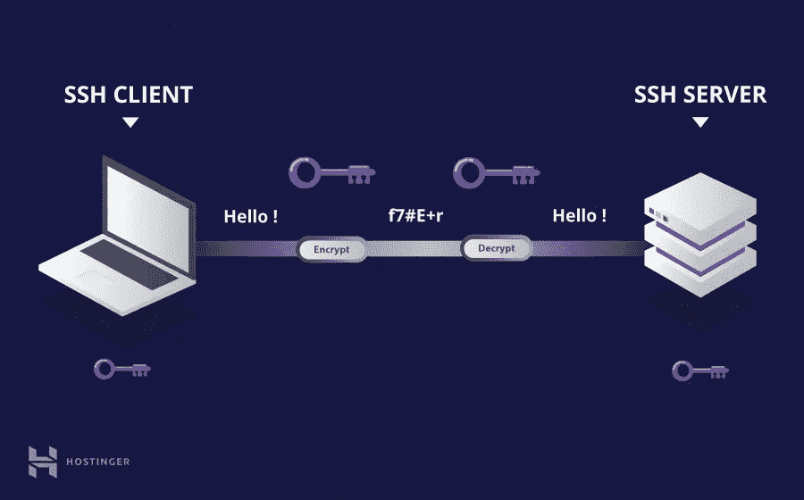

Image courtesy: [https://www.hostinger.com/tutorials/ssh-tutorial-how-does-ssh-work](https://www.hostinger.com/tutorials/ssh-tutorial-how-does-ssh-work)

冒险进入加密货币和数据科学的世界，我会建造自己的超级计算机绝非偶然。最酷的是，任何人都可以获得廉价的 GPU 计算，比 AWS 实例便宜 3 -10 倍。所有这一切都是由于 [Vast.ai](https://vast.ai/console/create/) 平台使点对点共享 GPU 计算能力成为可能。

在接下来的系列文章中，我将展示如何在 Vast.ai 平台上开始一些不同的任务:

*   **使用 windows 连接到 Vast.ai:选择并 ssh 到你选择的装备**
*   启动 Jupyter 笔记本
*   运行基准
*   [入门:折叠@Home](https://medium.com/@pricett/folding-home-on-vast-ai-rent-compute-power-to-support-disease-research-99f710fe976d?sk=1d4b3eee2408700d73f855fb42400022)
*   入门:使用 hashcat
*   入门:使用 fast.ai

# 选择并 ssh 到您选择的装备中

## 选择并导航到实例

1.  在你的浏览器中，在[https://vast.ai/console/create/](https://vast.ai/console/create/)选择你的图像和装备

首先，选择您的 docker 图像，如下所示。有几个选项可供选择，但是对于本教程，我从 docker hub 中选择了 [fastai 映像，并选择了 **Run interactive shell server，SSH**](https://hub.docker.com/r/vastai/fastai-v3/tags)

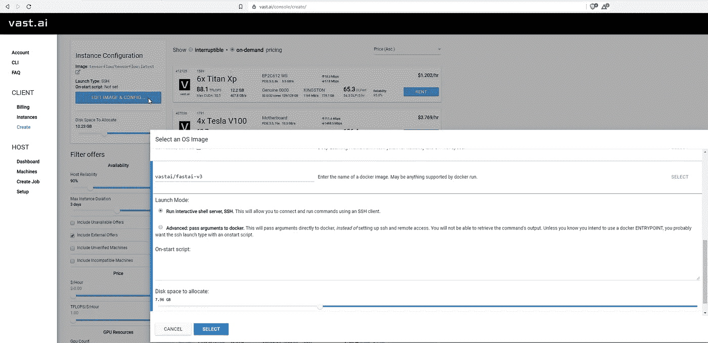

Selecting fastai docker image

然后，我们选择钻机的选择(116)，并点击租赁，如下所示。

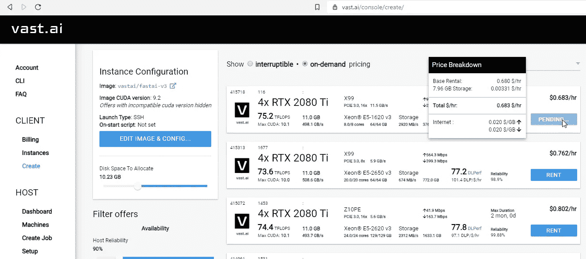

Select rig/instance of choice

2.导航到您刚刚创建的实例[https://vast.ai/console/instances/](https://vast.ai/console/instances/)。请注意，如果映像已经在主机装备上，根据主机连接速度和映像的大小，您的实例可能需要 30 秒到 15 分钟的加载时间。专业提示:让主持人为你预装图像，这样你每次不到一分钟就能开始。

3.转到实例并单击**连接**，这将显示 ip 地址和端口(它也显示在实例的顶部)。

```
ssh -p **515836**  [**root@ssh5.vast.ai**](mailto:root@ssh5.vast.ai) -L 8080:localhost:8080
```

稍后您将需要端口 **515836** 和 ip 地址[**root @ ssh 5 . vast . ai**](mailto:root@ssh5.vast.ai)(注意端口和 ip 地址可能不同)。

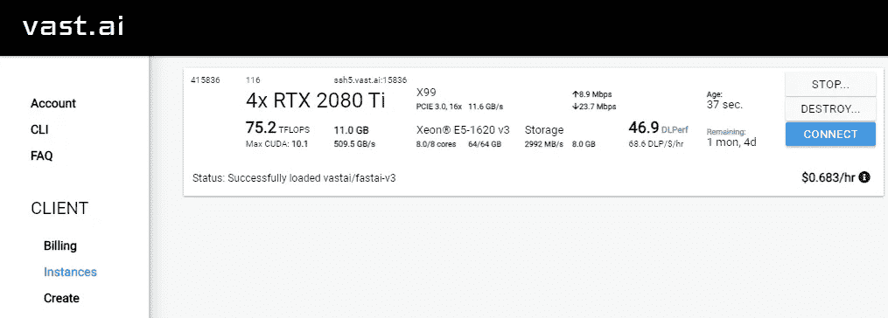

Instances page where you can connect to your instance

## 安装 PuTTY 并生成 ssh 密钥

4.为 windows 下载并安装 [PuTTYgen](https://www.puttygen.com/download-putty#PuTTY_for_windows)

5.使用 PuTTYgen 选择 RSA，然后按 generate 按钮生成公钥和私钥。

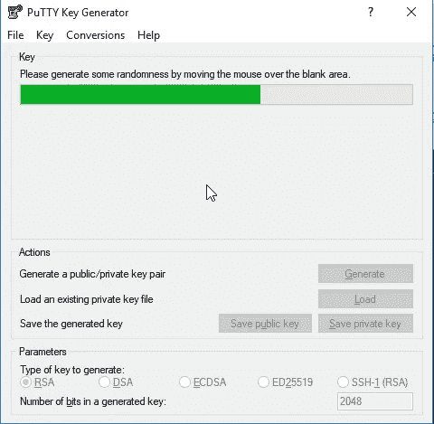

6.添加一个额外的安全密码，保存公钥和私钥，并将公钥复制到您的剪贴板。

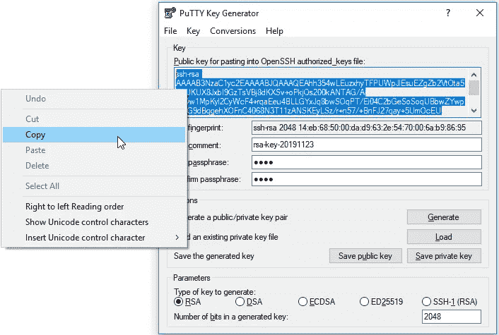

7.前往 https://vast.ai/console/account/[的](https://vast.ai/console/account/)，输入第六步生成的**公钥**。

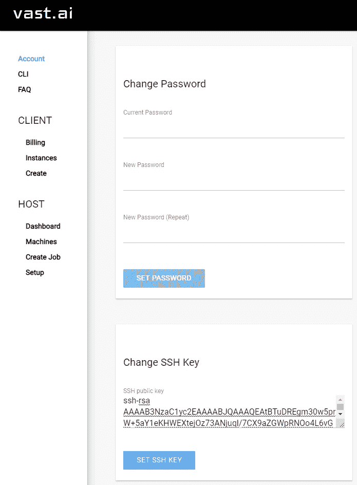

8.打开 PuTTY，输入步骤 3 中的 IP 地址和端口号。

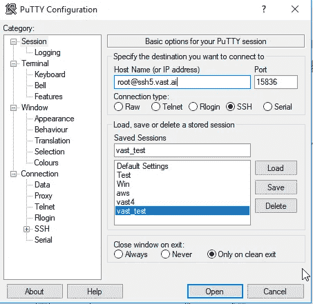

9.转到**连接→SSH →认证**并选择您的私钥

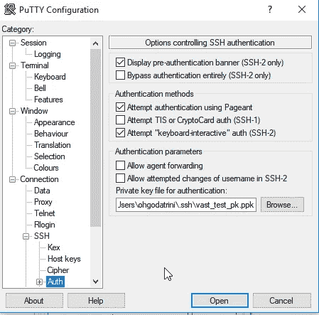

10.导航回**会话**并保存您的配置，以便您稍后可以轻松加载。

## 连接到您的实例

11.单击打开，接受任何弹出窗口，并使用生成公钥时使用的密码登录。

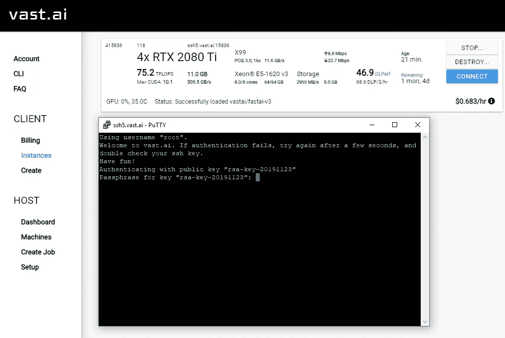

12.**撒野！！！！！！！！**

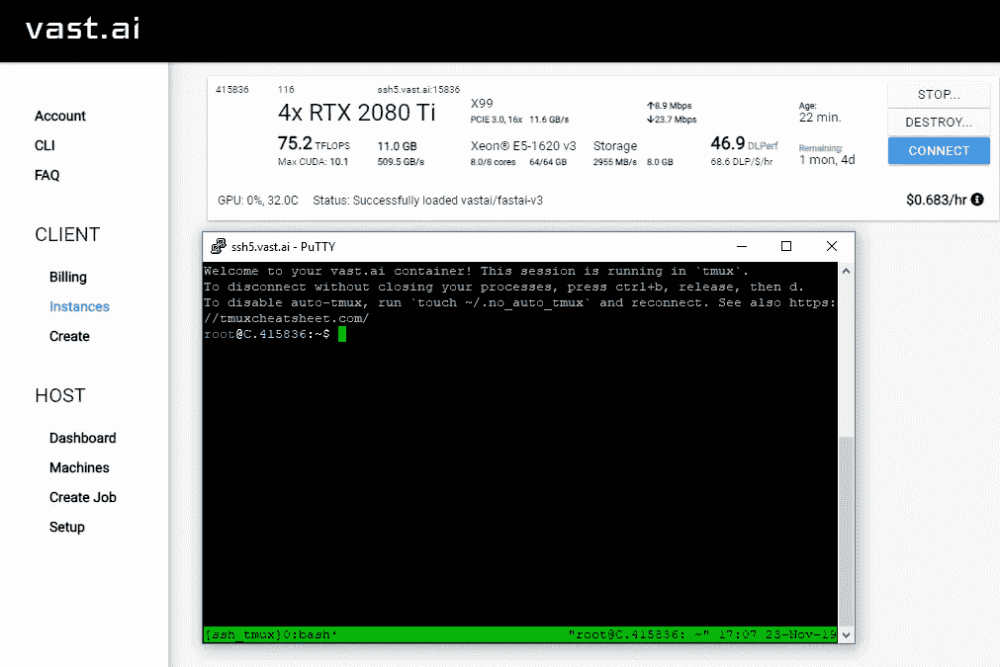

如果你仍然有问题，请在下面的评论中联系我们，或者加入 Vast.ai [Discord](https://discordapp.com/invite/UmPbgMB) 社区。更多关于 Vastai 点对点系统的信息可以在[常见问题](https://vast.ai/faq/)中找到。

注意我不是 Vast.ai 的开发者，但是我有 rig (116 ),它是托管在这个平台上的，所以你可以随意表达你的爱😺。