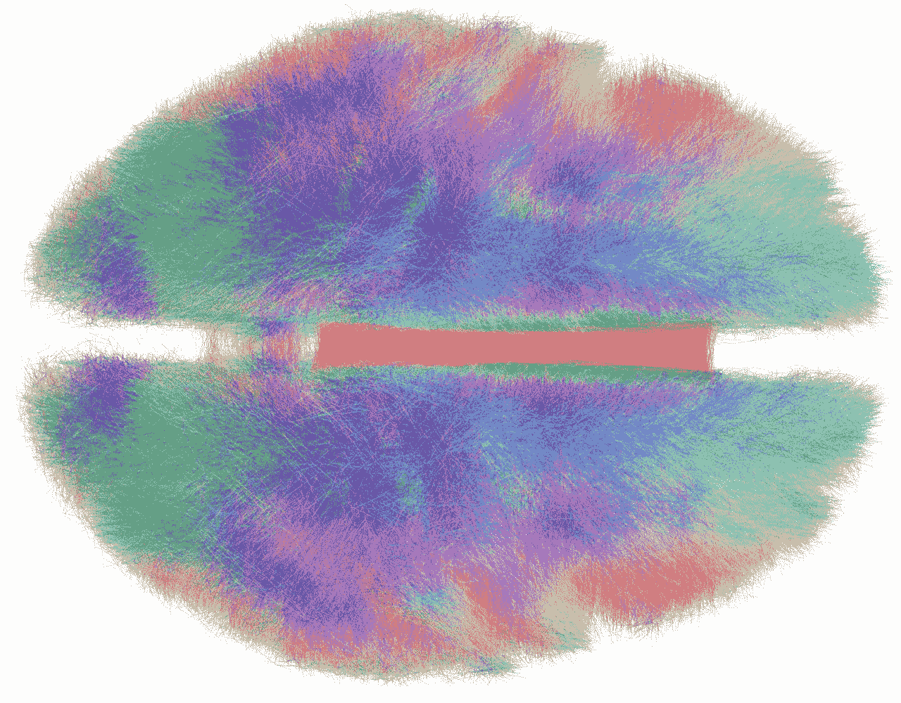
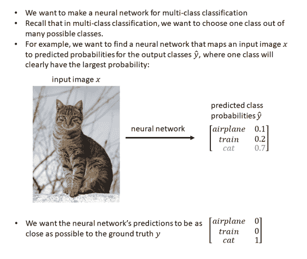
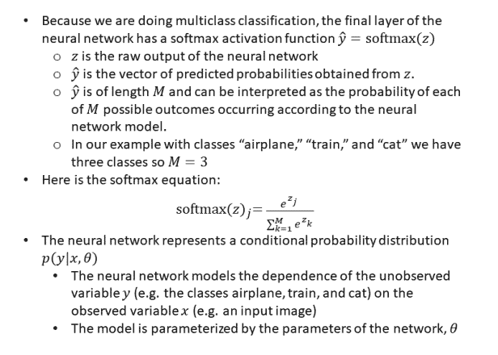
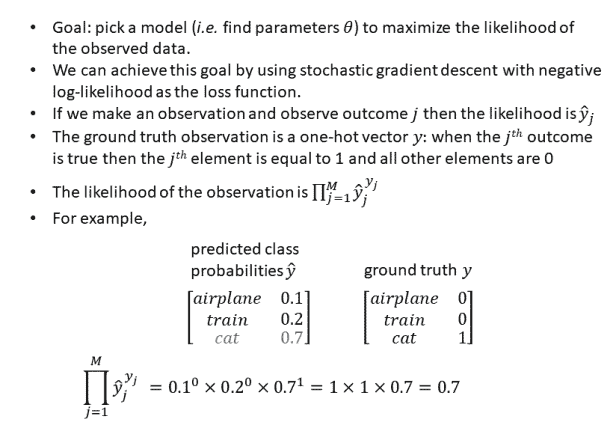
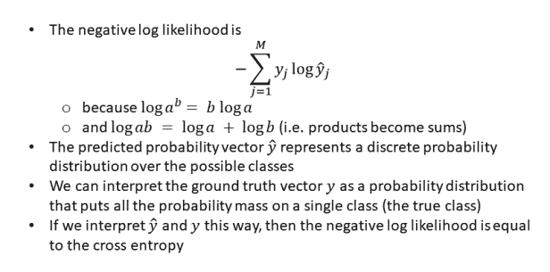
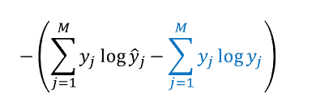
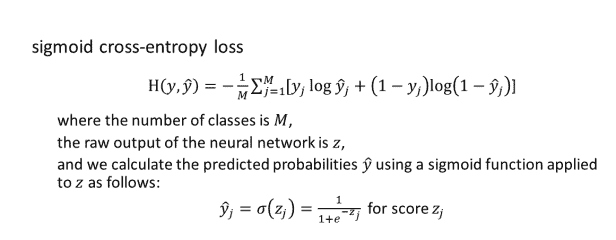

# 联系:对数似然、交叉熵、KL 散度、逻辑回归和神经网络

> 原文：<https://towardsdatascience.com/connections-log-likelihood-cross-entropy-kl-divergence-logistic-regression-and-neural-networks-40043dfb6200?source=collection_archive---------13----------------------->

本文将涵盖负对数似然、熵、softmax 与 sigmoid 交叉熵损失、最大似然估计、Kullback-Leibler (KL)散度、逻辑回归和神经网络之间的关系。如果您不熟悉这些主题之间的联系，那么这篇文章就是为您准备的！

## **推荐背景**

*   对神经网络的基本理解。如果你想了解更多这方面的背景知识，请阅读[神经网络简介](https://glassboxmedicine.com/2019/01/17/introduction-to-neural-networks/)。
*   透彻理解多类和多标签分类之间的区别。如果你不熟悉这个话题，请阅读文章[多标签 vs .多类分类:Sigmoid vs. Softmax](https://glassboxmedicine.com/2019/05/26/classification-sigmoid-vs-softmax/) 。简短回顾如下:在多类分类中，我们希望将单个类分配给一个输入，因此我们将 softmax 函数应用于神经网络的原始输出。在多标签分类中，我们希望将多个类别分配给一个输入，因此我们对神经网络的原始输出应用元素式 sigmoid 函数。

# **问题设置:用神经网络进行多类分类**

首先，我们将使用一个多类分类问题来理解对数似然和交叉熵之间的关系。这是我们的问题设置:

猫咪图片来源:[维基百科](https://en.wikipedia.org/wiki/File:Cat_November_2010-1a.jpg)。

# **可能性**

假设我们已经选择了一个特定的神经网络架构来解决这个多类分类问题——例如， [VGG](https://neurohive.io/en/popular-networks/vgg16/) ，[雷斯网](https://arxiv.org/abs/1512.03385)，[谷歌网](https://arxiv.org/abs/1409.4842)等。我们选择的架构代表了一系列可能的模型，其中该系列的每个成员具有不同的权重(不同的参数)，因此代表了输入图像 *x* 和一些输出类预测 *y* 之间的不同关系。我们希望选择具有一组好的参数的家庭成员来解决我们的特定问题[image]->[飞机、火车或猫]。

选择好的参数来解决我们的任务的一种方法是选择最大化观察数据可能性的参数:

# **负对数可能性**

负对数似然性实际上是似然性对数的负值:

参考设置、似然性和负对数似然性:[“交叉熵和对数似然性”，作者安德鲁·韦伯](http://www.awebb.info/blog/cross_entropy)

# **关于最大似然估计的旁注**

为什么我们“最小化负对数似然性”而不是“最大化似然性”，当它们在数学上是相同的？这是因为我们通常最小化损失函数，所以我们谈论“负对数可能性”，因为我们可以最小化它。(来源:[交叉验证](https://stats.stackexchange.com/questions/141087/why-do-we-minimize-the-negative-likelihood-if-it-is-equivalent-to-maximization-o)。)

因此，当您最小化负对数似然时，您正在执行最大似然估计。根据维基百科上关于 MLE 的文章，

> *最大似然估计(MLE)是一种通过最大化似然函数来估计概率分布参数的方法，使得在假设的统计模型下，观察到的数据是最有可能的。参数空间中使似然函数最大的点称为最大似然估计。[……]从贝叶斯推理的角度来看，最大似然估计是最大后验估计(MAP)的一种特殊情况，它假设参数的先验分布是均匀的。*

这是乔纳森·戈登在 Quora 上的另一个总结:

> *最大化(对数)似然相当于最小化二元交叉熵。这两个目标函数之间实际上没有区别，因此得到的模型或其特征之间也不会有区别。*
> 
> *当然，使用 softmax 交叉熵和所谓的多核似然性，这可以非常简单地扩展到多类情况，因此当对多类情况这样做时没有区别，例如在神经网络中。*
> 
> *MLE 和交叉熵的区别在于，MLE 代表了一种结构化和原则性的建模和训练方法，而 binary/softmax 交叉熵只是代表了应用于人们通常关心的问题的特例。*

# **熵**

之后，撇开最大似然估计，让我们更深入地研究负对数似然和交叉熵之间的关系。首先，我们将定义熵:

# **交叉熵**

章节参考:[维基百科交叉熵](https://en.wikipedia.org/wiki/Cross_entropy)，[安德鲁·韦伯的《交叉熵和对数似然性》](http://www.awebb.info/blog/cross_entropy)

# **库尔巴克-莱布勒(KL)发散**

Kullback-Leibler (KL)散度通常被概念化为一个概率分布如何不同于第二个概率分布的度量，*即*作为两个概率分布之间的距离的度量。从技术上讲，KL 散度不是一个真正的度量，因为它不符合三角形不等式，并且 *D_KL(g||f)* 不等于 *D_KL(f||g)* —但直觉上，这似乎是一种更自然的表示损失的方式，因为我们希望我们的模型学习的分布与真实分布非常相似(*，即*我们希望 KL 散度很小，我们希望最小化 KL 散度。)

这里是 KL 散度的等式，如果我们使用对 *f(x)* 的最优编码而不是对*g(X)*的最优编码，KL 散度可以被解释为传达随机变量 *X* (分布为 *g(x)* 的值所需的额外比特的预期数量

KL 发散的其他思考方式 *D_KL (g||f):*

*   这是 g 相对于 f 的相对熵
*   它是当一个人将自己的信念从先验概率分布 *f* 修正为后验概率分布 *g* 时所获得的信息的度量
*   用 *f* 近似 *g* 时丢失的信息量

在机器学习中， *g* 通常代表数据的真实分布，而 *f* 代表模型对分布的近似。因此，对于我们的神经网络，我们可以将 KL 散度写成这样:

请注意，第二项(蓝色)仅取决于固定的数据。因为第二项不依赖于可能性 y-hat(预测的概率)，所以它也不依赖于模型的参数。因此，最小化 KL 散度的参数与最小化交叉熵和负对数似然的参数是相同的！这意味着我们可以最小化交叉熵损失函数，得到和最小化 KL 散度相同的参数。

章节参考:[维基百科 Kullback-Leibler divergence，](https://en.wikipedia.org/wiki/Kullback%E2%80%93Leibler_divergence)T2【交叉熵与对数似然】安德鲁·韦伯

# **那“乙状结肠交叉熵损失”呢？**

到目前为止，我们已经关注了多*类*分类问题环境中的“softmax 交叉熵损失”。然而，当训练多*标签*分类模型时，其中多个输出类是可能的，则使用“sigmoid 交叉熵损失”而不是“softmax 交叉熵损失”请参见[这篇文章](https://glassboxmedicine.com/2019/05/26/classification-sigmoid-vs-softmax/)了解更多关于多标签与多类分类的背景。

正如我们刚刚看到的，交叉熵定义在两个概率分布 *f(x)* 和 *g(x)之间。*但这在应用于输出层的 sigmoid 的上下文中没有意义，因为输出小数的总和不会是 1，因此我们实际上没有输出“分布”

根据迈克尔·尼尔森的书，第三章方程 63 ，一种有效的思考 sigmoid 交叉熵损失的方式是“每个神经元交叉熵的总和，每个神经元的激活被解释为二元概率分布的一部分。”

因此，对于 sigmoid 交叉熵的情况，我们将考虑一组概率分布，其中每个神经元在概念上代表两元素概率分布的一部分，而不是考虑所有输出神经元的概率分布(这在 softmax 交叉熵的情况下完全没问题)。

例如，假设我们将下面的图片输入到用 sigmoid 交叉熵损失训练的多标记图像分类神经网络:

Image Source: [Wikipedia](https://commons.wikimedia.org/wiki/File:Cat_and_dog.JPG).

我们的网络具有对应于类别猫、狗、沙发、飞机、火车和汽车的输出神经元。

在将 sigmoid 函数应用于猫神经元的原始值之后，我们得到 0.8 作为我们的值。我们可以认为这个 0.8 是“猫”类的概率，我们可以想象一个隐含的概率值 1–0.8 = 0.2 是“没有猫”类的概率。这个隐含的概率值并不对应于网络中的实际神经元。这只是想象/假设。

类似地，在对狗神经元的原始值应用 sigmoid 函数之后，我们得到 0.9 作为我们的值。我们可以认为这个 0.9 是“狗”类的概率，我们可以想象 1–0.9 = 0.1 的隐含概率值是“没有狗”类的概率。

对于飞机神经元，我们得到的概率是 0.01。这意味着对于所有的输出神经元，我们有 1–0.01 = 0.99 的概率“没有飞机”——以此类推。因此，每个神经元都有自己的“交叉熵损失”,我们只需将每个神经元的交叉熵相加，就可以得到总的 sigmoid 交叉熵损失。

我们可以写出该网络的 sigmoid 交叉熵损失如下:

" Sigmoid 交叉熵有时被称为“二元交叉熵”. "[本文](https://peltarion.com/knowledge-center/documentation/modeling-view/build-an-ai-model/loss-functions/binary-crossentropy)讨论了多标签分类问题的“二元交叉熵”,并包括了等式。

# **逻辑回归、神经网络、交叉熵和负对数似然之间的联系**

*   如果神经网络没有隐藏层，并且原始输出向量应用了 softmax，则这相当于多项式逻辑回归
*   如果神经网络没有隐藏层，并且原始输出是应用了 sigmoid(逻辑函数)的单个值，那么这就是逻辑回归
*   因此，逻辑回归只是神经网络的一个特例！( [refA](https://www.quora.com/Is-a-single-layer-feed-forward-neural-network-equivalent-to-a-logistic-regression-algorithm) ， [refB](https://www.datasciencecentral.com/profiles/blogs/logistic-regression-as-a-neural-network) )
*   如果神经网络确实具有隐藏层，并且原始输出向量应用了 softmax，并且使用交叉熵损失对其进行训练，则这是“softmax 交叉熵损失”，它可以被解释为负对数似然，因为 softmax 创建了概率分布。
*   如果神经网络确实具有隐藏层，并且原始输出向量应用了元素式 sigmoids，并且使用交叉熵损失对其进行训练，则这是“sigmoid 交叉熵损失”,其不能被解释为负对数似然，因为在所有示例中不存在概率分布。输出的总和不等于 1。这里，我们需要使用上一节提供的解释，其中我们将损失概念化为一组累加在一起的每个神经元的交叉熵。

章节参考:[统计堆栈交换](https://stats.stackexchange.com/questions/297749/how-meaningful-is-the-connection-between-mle-and-cross-entropy-in-deep-learning)

要了解更多信息，你可以看看维基百科上关于交叉熵的文章，特别是最后一部分，标题是“交叉熵损失函数和逻辑回归”本节描述了如何将逻辑回归中使用的典型损失函数计算为样本中所有交叉熵的平均值(“sigmoid 交叉熵损失”)。)交叉熵损失有时被称为“逻辑损失”或“对数损失”，sigmoid 函数也被称为“逻辑函数”

# **交叉熵实现**

在 Pytorch 中，[交叉熵有几种实现方式](https://github.com/rasbt/stat479-deep-learning-ss19/blob/master/other/pytorch-lossfunc-cheatsheet.md):

*实现 A:* `torch.nn.functional.binary_cross_entropy`(参见`[torch.nn.BCELoss](https://pytorch.org/docs/stable/nn.html#torch.nn.BCELoss))`:该函数的输入值已经应用了一个 sigmoid，例如

*实现 B:* `torch.nn.functional.binary_cross_entropy_with_logits`(参见`[torch.nn.BCEWithLogitsLoss](https://pytorch.org/docs/stable/nn.html#torch.nn.BCELoss))`:“该损失将一个 s 形层和 B 形层结合在一个单独的类中。这个版本在数值上比使用简单的 Sigmoid 后跟 BCELoss 更稳定，因为通过将运算合并到一个层中，我们利用了 log-sum-exp 技巧来实现数值稳定性。”

*实现 C:* `torch.nn.functional.nll_loss`(见`[torch.nn.NLLLoss](https://pytorch.org/docs/stable/nn.html#torch.nn.NLLLoss)`):“负对数似然损失。用 C 类训练一个分类问题很有用。[...]通过转发调用给出的输入应该包含每一类的对数概率。

*实现 D:* `torch.nn.functional.cross_entropy`(见`[torch.nn.CrossEntropyLoss](https://pytorch.org/docs/stable/nn.html#torch.nn.CrossEntropyLoss)`):“这个判据结合了 nn。LogSoftmax()和 nn。NLLLoss()在一个单独的类中。这在用 C 类训练分类问题时很有用。[...]输入应该包含每个类的原始的、未标准化的分数。

# **结论**

正如我们在这里讨论的，负对数似然、交叉熵、KL 散度、神经网络和逻辑回归之间存在基本关系。我希望你喜欢学习这些不同的模型和损失之间的联系！

# **关于特色图片**

因为这篇文章的主题是连接，所以特色图片是一个“连接体”连接体是“大脑中神经连接的综合图，可以被认为是它的‘线路图’。”“参考:[维基百科](https://en.wikipedia.org/wiki/Connectome)。精选图片来源:[人类连接体](https://en.wikipedia.org/wiki/Connectome#/media/File:The_Human_Connectome.png)。

*原载于 2019 年 12 月 7 日*[*http://glassboxmedicine.com*](https://glassboxmedicine.com/2019/12/07/connections-log-likelihood-cross-entropy-kl-divergence-logistic-regression-and-neural-networks/)*。*