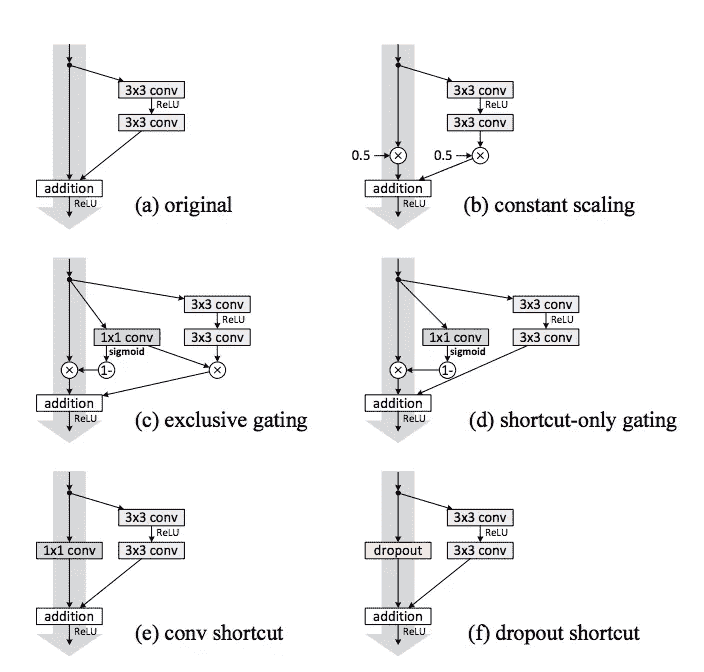
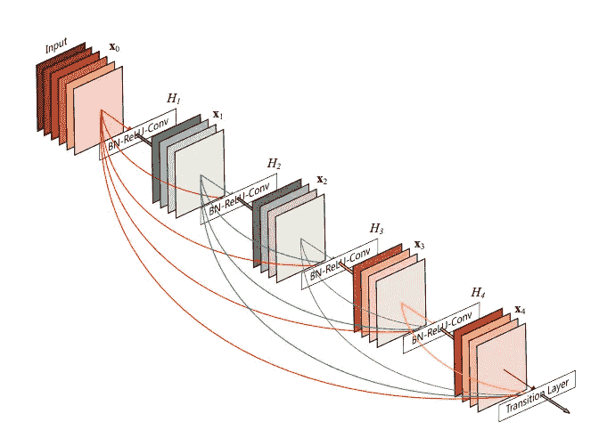
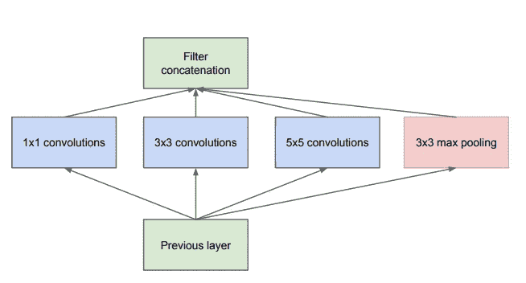

# 深层神经网络中的连接模式

> 原文：<https://towardsdatascience.com/connectivity-patterns-in-deep-neural-networks-787c90316a6d?source=collection_archive---------21----------------------->

本文将讨论一个推动神经网络设计进步的核心组件，即用于计算机视觉任务的卷积网络。LeNet-5、AlexNet 和 VGG 等经典 CNN 都有一种连接模式，即前一层的输出作为下一层的输入。这种顺序处理模式很容易理解，也是开始学习神经网络的好方法。

随后出现了 ResNet、Inception 和 DenseNet 等架构，它们极大地改变了这种连接模式。在所有这些网络中，计算仍然遵循顺序模式，其中一层在正向传递中仅计算一次输出，然而，该层的输出与经典模型的连接不同。

ResNet 提供了跳过连接，这是对 CNN 连接最直观的改变。这种跳过连接也称为身份映射，它从上一层获取输入，并将其向前传播一层。例如，以层 l1、l2 和 l3 为例。传统上，l1 输出只能从 l1 到 l2，但是通过跳过连接，l1 输出被克隆到 l3 的输入。

ResNet 的作者在他们的论文“深度剩余网络中的身份映射”中继续剖析他们的跳过连接，并测试向身份映射添加额外复杂性的影响，该论文通常被称为 ResNet-v2:

Empirical evaluations of different possible constructions of the ResNet identity mapping / skip-connection

在 ResNet 之后， [DenseNet](https://www.henryailabs.com/2-25-19.html) 呈现出非常相似的连接模式。在 DenseNet 中，不是让跳过连接向前传播一层，而是将所有先前的层向前跳过，作为未来层的输入。例如，层 l4 的输入是原始输入 l0+L1、l2 和 l3 的输出。先前的特征地图都被连接起来作为后面图层的输入。

Illustration of the DenseNet connectivity pattern

ResNet 和 DenseNet 都直观地提供了功能冗余的解决方案。在神经网络中必须通过顺序处理来保持状态的结果。不必学习保存信息的参数，而是将这些信息显式地复制到更高级的表示中。

顺便说一下，Inception 模型与 ResNet 和 DenseNet 有着根本不同的连接模型。先启块将相同的输入输入到多个层中，并组合这些输出，而不是将早期层的输出推到后面的层中。直观地说，这样做是为了试图保留视觉信息中一些自然明显的稀疏性。

Illustration of an Inception block

Inception 块也不一定与 ResNet 或 DenseNet 分离。初始块被封装在这种结构中，因此可以忽略内部的复杂性，并且它可以被视为具有输入和输出的标准层。该输出可以以类似于任何其他神经网络层的方式向前跳过。

关于什么将导致神经网络设计的突破，有许多思路，例如标准化、多任务学习和数据扩充。连通性模式很有趣，因为它们很好地适应了 AlexNet 等原始 CNN 中明显的模块化框架，此外还解决了消失梯度和特征冗余等问题。

思考连接模式如何适应元学习神经网络架构的框架是很有趣的。用包含在每层中的所有各种各样的超参数，例如滤波器尺寸和特征图的数量，来设计标准神经网络层的离散搜索空间是足够困难的。为初始模块和非固定跳过连接增加灵活性可以为元学习模型带来指数级的大搜索空间。

感谢阅读这篇文章！以下是讨论论文、ResNet、DenseNet 和 Inception network (GoogLeNet)的链接:

 [## 用于图像识别的深度残差学习

### 更深层次的神经网络更难训练。我们提出了一个剩余学习框架，以减轻训练…

arxiv.org](https://arxiv.org/abs/1512.03385)  [## 密集连接的卷积网络

### 最近的工作表明，卷积网络可以更深入，更准确，更有效地训练，如果…

arxiv.org](https://arxiv.org/abs/1608.06993)