# 使用 GANs 解决类不平衡数据集问题

> 原文：<https://towardsdatascience.com/conquer-class-imbalanced-dataset-issues-using-gans-2482b52593aa?source=collection_archive---------14----------------------->

## DC-甘生成图像的某些类类型，以改善图像分类

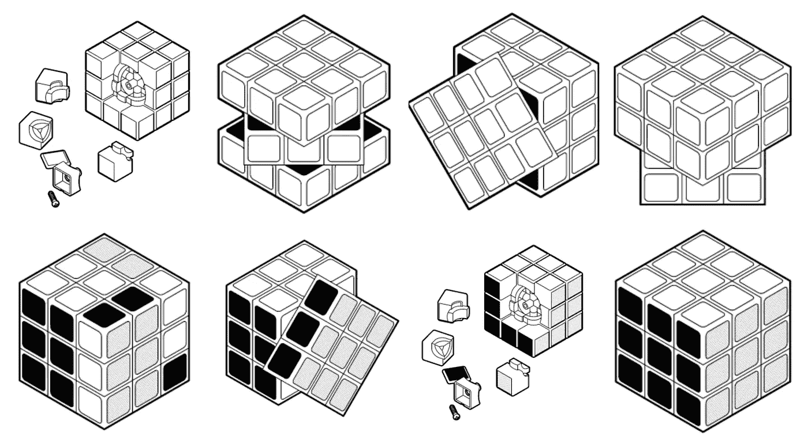

Created by Lluisa lborra from Noun Project

现实生活中深度学习应用的一个常见问题是，一些类在训练集中的样本数量明显高于其他类。让我们考虑一个制造商正在构建一个视觉检测系统来检测受损产品。没有哪个厂商会有好的产品形象那么多损坏的产品形象。这种差异被称为阶级不平衡。类别不平衡数据集在不同领域都很常见，如卫生、银行、安全和其他领域。对于这样的数据集，学习算法通常偏向于多数类，因此对于少数类实例有更高的误分类率。

有不同的策略来解决这个问题，例如过采样、欠采样、两阶段训练和成本敏感学习。与算法改进相比，为少数类生成人工数据的方法构成了更通用的方法。本文旨在利用深度卷积生成对抗网络(DC-GAN)来改善分类性能，从而缩小数据集中的这一差距。

甘斯就像魔方。一旦你知道解决立方体的诀窍，有多种方法可以得到完美的立方体。它可以快至 3.47 秒(3×3 魔方的当前世界纪录)，如果你搞砸了，很容易发现。但是，如果你不知道解决立方体的诀窍，它可能要花很长时间。GAN 的失败时间和成本相当高(考虑到培训时间和资源的美元价值)，尤其是当您的资源有限，并且您可能仍然不知道哪里出了问题时。一旦你知道了 GAN 的依赖性，就相对容易得到一个完美的解决方案。

**在本文中，我们将探讨以下主题-**

1.  使 GANs 工作/稳定的提示和技巧。
2.  如何定义甘？如何为 Kaggle 比赛的真实世界数据集塑造 GAN？
3.  令人兴奋的 GANs 用例。

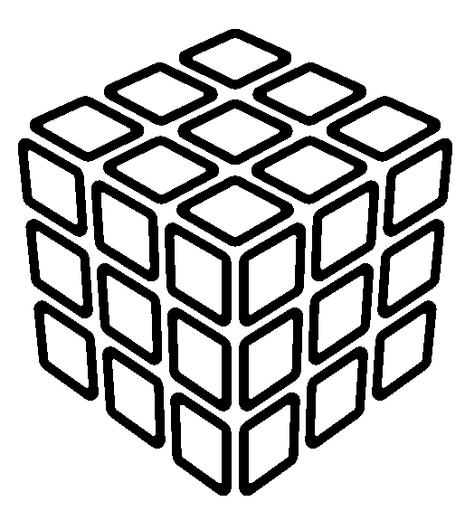

Created by Tresnatiq from Noun Project

**使 GANs 工作/稳定的技巧和诀窍-**

开发用于生成图像的 GAN 需要用于对给定图像是真实的还是生成的进行分类的鉴别器卷积神经网络模型，以及使用逆卷积层将输入转换为像素值的完整二维图像的生成器模型。

这些生成器和鉴别器模型在零和游戏中竞争。这意味着对一个模型的改进是以降低另一个模型的性能为代价的。结果是一个非常不稳定的训练过程，经常会导致失败。

虽然 GANs 的研究继续提高这些模型的基本稳定性，但有许多技巧可以训练它们并使它们稳定。

1.  使用步长卷积>>不要使用最大池层数，而是使用卷积层中的步长在鉴别器模型中执行下采样。使用 Conv2DTranspose 和 stride 进行上采样。
2.  移除全连接层>>鉴别器中不使用全连接层，而是将卷积层展平并直接传递到输出层。
3.  使用批处理规范化>>在鉴别器和生成器模型中都建议使用批处理规范图层，但生成器的输出和鉴别器的输入除外。
4.  建议仅在发生器中使用 ReLU、Leaky ReLU 和 Tanh >> ReLU，但对于允许小于零的值的 ReLU 鉴别器变化，建议使用 Leaky ReLU。此外，生成器使用双曲正切函数，鉴别器在输出层使用 Sigmoid 激活函数。
5.  归一化输入>>归一化-1 到 1 之间的输入图像。为真实和虚假构建不同的小批量，即每个小批量只需要包含所有真实图像或所有生成的图像。
6.  学习率>>对鉴别器(1e-3)和发生器(1e-4)使用不同的学习率。对两者都使用 Adam optimizer。
7.  Performance hack > >训练鉴别器两次，生成器一次。在发电机中使用 50%的压差。
8.  早期跟踪故障>>鉴别器中损失 0.0 是故障模式。如果发生器的损耗稳步下降，很可能用垃圾图像愚弄鉴别器。当训练顺利进行时，鉴别器损耗具有低方差并随时间下降。

所有这些技巧，我们需要放在一起，以创造一个完美的甘。

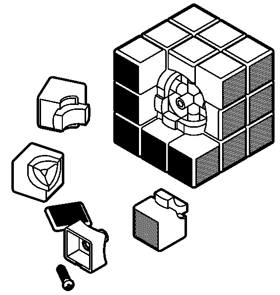

Created by Lluisa Iborra from Noun Project

**如何定义甘？如何为 Kaggle 比赛的真实世界数据集塑造 GAN？-**

研究人员开发了多种口味的 gan，网上也有多种解决方案来解决类别不平衡问题，但所有这些主要是在玩具数据集上，如 MNIST，CIFAR-10 和 ImageNet。我一直在研究来自 Kaggle 竞赛的医学图像分类([糖尿病视网膜病变检测](https://www.kaggle.com/c/diabetic-retinopathy-detection/overview))数据集。该数据集有 4 个类，其中类 1 有 13k 个样本，而类 4 只有 600 个样本。Kaggle 竞赛获胜者最近使用的解决阶级不平衡问题的方法之一就是使用 DC-甘。我们将使用 DC-甘为 4 类糖尿病视网膜病变检测数据库创建人工样本。

让我们开始编码练习，并实现这些技巧来生成新的图像。所有的实验都是在 NVIDIA Quadro M400 GPU 上完成的。这款 GPU 有 8 GB 内存。GPU 在 Ubuntu 16.04 实例上为 GPU 1.8.0 配置了 CUDA 9.0、cuDNN 7.4、TF。

导入所有必要的环境。这段代码期望所有的包都预先安装好。

我已经从 Kaggle 下载了[数据库](https://www.kaggle.com/c/diabetic-retinopathy-detection/overview)。该数据库中的图像很难用肉眼区分，因此该数据集与所有玩具数据集非常不同。数据库有几个 zip 文件，我们需要将它们解压缩到包含各自图像的 train/test 文件夹中。列车图像的所有标签都在单独的 csv 文件中提供。

在下面的代码中，我们将读取一个包含图像标签和名称的 csv 文件。我们需要做一些健全的检查(添加。jpeg 扩展，删除所有大小为 0 KB 的图像，从数据帧中移除已删除图像的条目)。

在该数据集中，类别 3 和 4 是少数类别，因为它们在整个数据集中的代表性非常低。我们将训练 GAN 为第 4 课生成图像。

以下部分定义了鉴别器和生成器。鉴别器使用 2 x 2 步长的卷积层对输入图像进行下采样(技巧#1 和 2)。输出层使用 Sigmoid 激活函数来预测输入样本是真是假。该模型被训练为使用 Adam 优化器(技巧#4)来最小化二元交叉熵损失函数。

发生器由 Conv2DTranspose 定义，步长为 2 x 2，可将图像上采样至最高 128 像素。输出层使用双曲正切激活函数来确保输出值在[-1，1]的期望范围内(技巧#4)。我们有意对鉴别器和生成器使用不同的学习速率(技巧 6)。

*define_gan()* 函数使用已经定义的生成器和鉴别器模型，并创建一个新的逻辑模型。

下面的函数 *load_real_samples()* 将从数据集中读取实际数据并归一化图像(技巧#5)，然后在调用 *train()时将它们馈送到 *generate_real_samples()* 。*

*generate _ fake _ samples()*函数生成带有随机像素值和假标签 0 的图像。

没有评估 GAN 性能的指标，生成的图像必须由操作员进行质量评估。这使得很难决定在哪里停止训练。

由于敌对的性质，发电机的属性在每个纪元后都在变化。一旦生成了可接受质量的图像，生成器可能不会提高性能，在许多情况下甚至会随着后续时期而降低性能。

使用 3 个选项来处理这个问题

1.  定期评估鉴别器对真假图像的分类精度。
2.  定期生成图像并保存，供操作员查看。
3.  定期保存生成器模型以备后用。

所有这些操作将由*summary _ performance()*函数执行，以评估鉴别器模型。多个历元的训练 GAN 将同时每 10 个历元生成模型的快照 *save_plat()* 将继续保存图像。这将有助于回溯 GAN 图像生成的进程。

*train()* 函数定义如下，每个时期内的批次数量由批次大小分成训练数据集的次数来定义。

训练鉴别器模型被更新两次(每次用假的和真的样本),并且对于每批迭代生成器被更新一次(技巧#7)。

训练 GAN 时观察损耗至关重要，鉴频器损耗的突然下降表明发生器模型已经开始产生鉴频器可以轻易辨别的坏样本(技巧 8)。

为了可视化模型，我们可以使用 *plot_model()* 函数绘制它们。

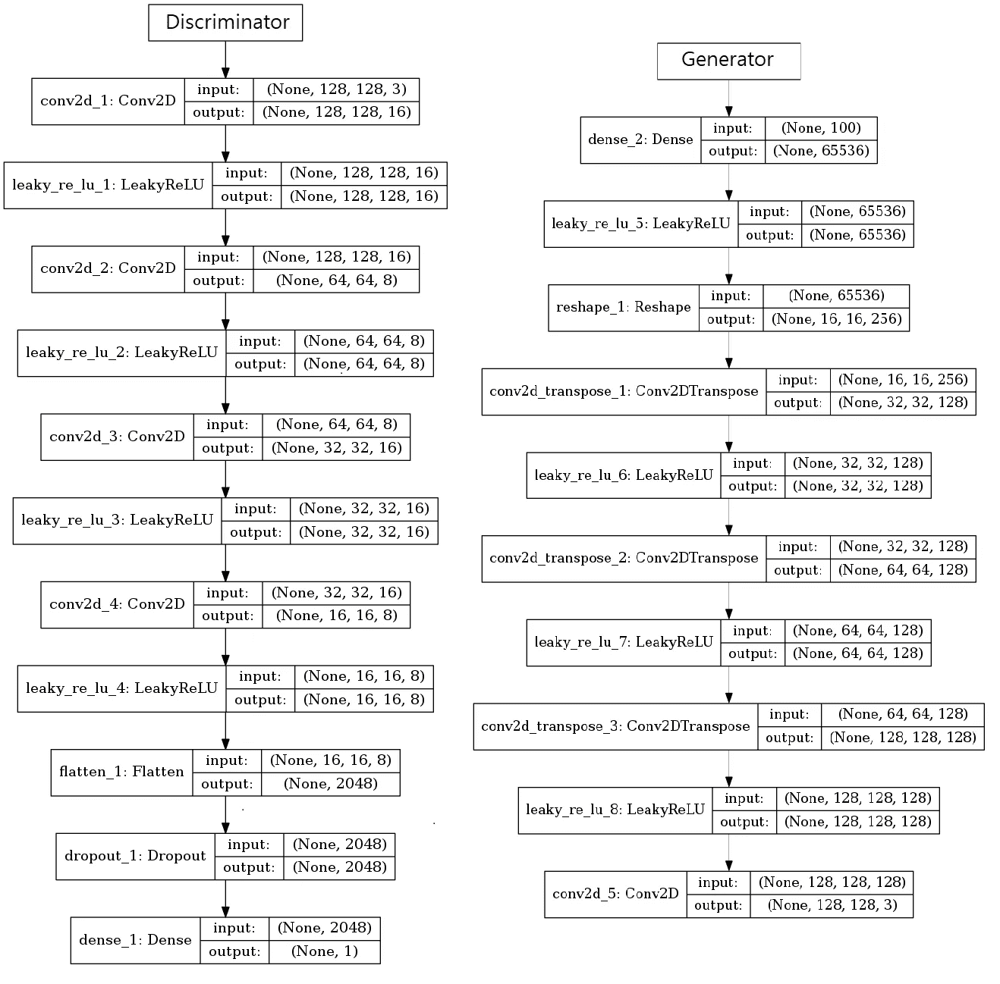

*summary()* 功能也可用于查看模型布局和可训练参数的数量。调用 *train()* 函数开始鉴别器和发电机训练。

鉴别器模型

```
_________________________________________________________________
Layer (type)                 Output Shape              Param #   
=================================================================
conv2d_1 (Conv2D)            (None, 128, 128, 16)      448       
_________________________________________________________________
leaky_re_lu_1 (LeakyReLU)    (None, 128, 128, 16)      0         
_________________________________________________________________
conv2d_2 (Conv2D)            (None, 64, 64, 8)         1160      
_________________________________________________________________
leaky_re_lu_2 (LeakyReLU)    (None, 64, 64, 8)         0         
_________________________________________________________________
conv2d_3 (Conv2D)            (None, 32, 32, 16)        1168      
_________________________________________________________________
leaky_re_lu_3 (LeakyReLU)    (None, 32, 32, 16)        0         
_________________________________________________________________
conv2d_4 (Conv2D)            (None, 16, 16, 8)         1160      
_________________________________________________________________
leaky_re_lu_4 (LeakyReLU)    (None, 16, 16, 8)         0         
_________________________________________________________________
flatten_1 (Flatten)          (None, 2048)              0         
_________________________________________________________________
dropout_1 (Dropout)          (None, 2048)              0         
_________________________________________________________________
dense_1 (Dense)              (None, 1)                 2049      
=================================================================
Total params: 11,970
Trainable params: 5,985
Non-trainable params: 5,985
_________________________________________________________________
```

发电机模型

```
_________________________________________________________________
Layer (type)                 Output Shape              Param #   
=================================================================
dense_2 (Dense)              (None, 65536)             6619136   
_________________________________________________________________
leaky_re_lu_5 (LeakyReLU)    (None, 65536)             0         
_________________________________________________________________
reshape_1 (Reshape)          (None, 16, 16, 256)       0         
_________________________________________________________________
conv2d_transpose_1 (Conv2DTr (None, 32, 32, 128)       524416    
_________________________________________________________________
leaky_re_lu_6 (LeakyReLU)    (None, 32, 32, 128)       0         
_________________________________________________________________
conv2d_transpose_2 (Conv2DTr (None, 64, 64, 128)       262272    
_________________________________________________________________
leaky_re_lu_7 (LeakyReLU)    (None, 64, 64, 128)       0         
_________________________________________________________________
conv2d_transpose_3 (Conv2DTr (None, 128, 128, 128)     262272    
_________________________________________________________________
leaky_re_lu_8 (LeakyReLU)    (None, 128, 128, 128)     0         
_________________________________________________________________
conv2d_5 (Conv2D)            (None, 128, 128, 3)       3459      
=================================================================
Total params: 7,671,555
Trainable params: 7,671,555
Non-trainable params: 0
_________________________________________________________________
```

培训流程将如下所示

```
.....
>319, 5/10, d1=0.692, d2=0.761 g=0.709
>319, 6/10, d1=0.822, d2=0.759 g=0.690
>319, 7/10, d1=0.733, d2=0.764 g=0.723
>319, 8/10, d1=0.662, d2=0.740 g=0.743
>319, 9/10, d1=0.701, d2=0.683 g=0.758
>319, 10/10, d1=0.830, d2=0.744 g=0.728
>320, 1/10, d1=0.749, d2=0.717 g=0.731
>320, 2/10, d1=0.677, d2=0.796 g=0.722
>320, 3/10, d1=0.766, d2=0.700 g=0.717
>320, 4/10, d1=0.676, d2=0.736 g=0.765
>320, 5/10, d1=0.792, d2=0.762 g=0.730
>320, 6/10, d1=0.690, d2=0.710 g=0.719
>320, 7/10, d1=0.807, d2=0.759 g=0.708
>320, 8/10, d1=0.715, d2=0.747 g=0.711
>320, 9/10, d1=0.719, d2=0.720 g=0.731
>320, 10/10, d1=0.695, d2=0.717 g=0.694
################# Summarize ###################
>Accuracy real: 35%, fake: 57%
```

经过 320 个时代，下面是我能够产生的图像质量。这个 GAN 的训练花了大约 30 分钟。更复杂的发生器和鉴别器模型可以产生更好质量的图像。

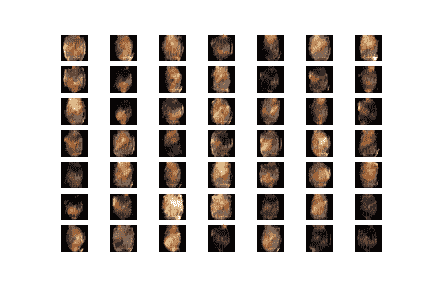

save_plot() will generate a 7 by 7 matrix of images

GAN 向完美立方体的进展

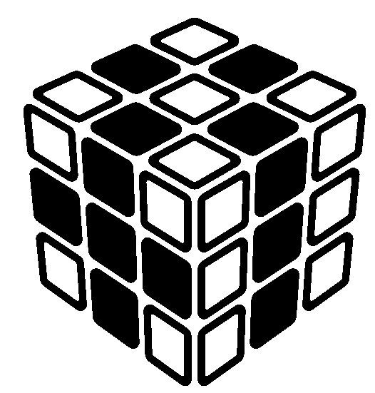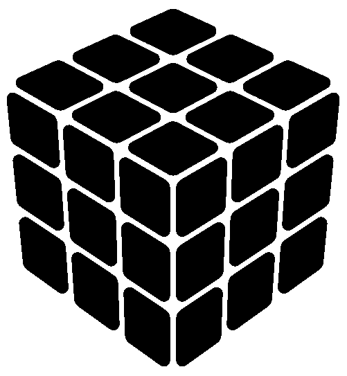

Created by Tresnatiq from Noun Project

现在，这些新生成的少数民族类图像可以添加到原始不平衡数据集中。这将有助于将不平衡的多类数据转换成平衡的数据集。这将提高模型的分类性能。

可以在这里找到针对这种不平衡数据集的图像分类算法

[](/the-quest-of-higher-accuracy-for-cnn-models-42df5d731faf) [## 对 CNN 模型更高精度的探索

### 在本帖中，我们将学习使用数据重新设计、超参数调整和模型改进准确性的技术…

towardsdatascience.com](/the-quest-of-higher-accuracy-for-cnn-models-42df5d731faf) 

所有的 iPython 笔记本都可以在[https://github.com/swanandM/DC-GAN-RetinopathyImages](https://github.com/swanandM/DC-GAN-RetinopathyImages)买到

图像分类笔记本[https://github . com/swanandM/Diabetic-Retinopathy-Detection-with-TF](https://github.com/swanandM/Diabetic-Retinopathy-Detection-with-TF)

**GANs 的精彩用例**

GAN 在最初几年取得了令人印象深刻的进步。2017 年，甘能够创作出 1024 x 1024 大小的图像，几乎可以骗过所有人。尽管这种技术会产生严重的社会信任问题，但考虑到这些天发布的假新闻的数量。工程师在开发任何会引起社会动荡的应用程序之前必须小心谨慎。

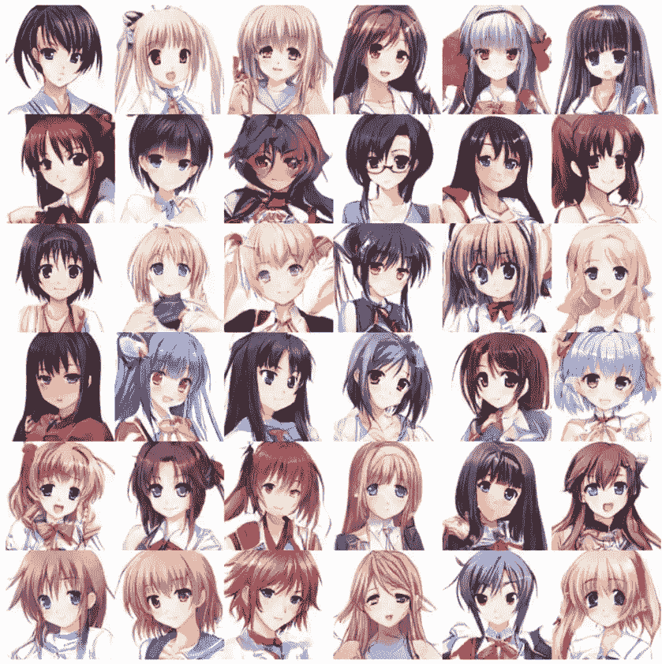

[Towards the automatic Anime characters creation with Generative Adversarial Networks](https://arxiv.org/pdf/1708.05509.pdf)

为游戏和电影创作动画需要付出巨大的努力。甘可以在没有任何专业技能的情况下自动生成这些动画角色。除此之外，一个专业的动画创作者可以从这些设计中获得灵感。

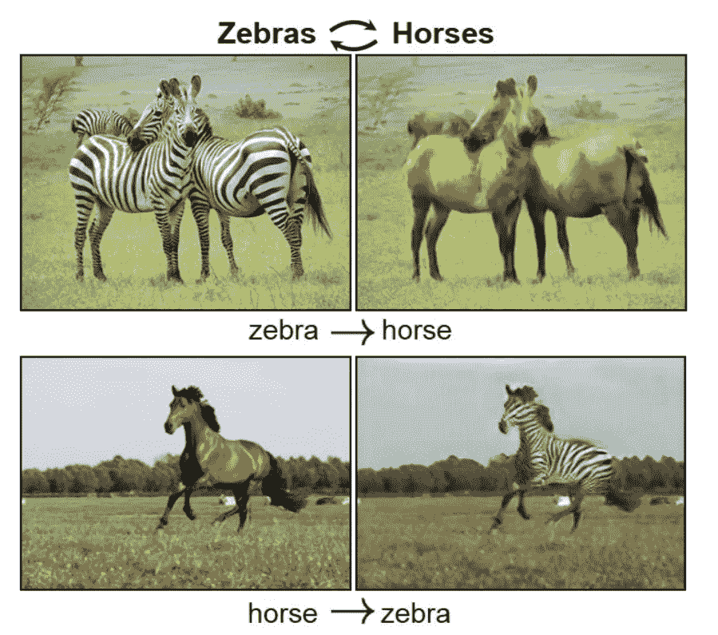

[CycleGAN](https://github.com/junyanz/CycleGAN)

CycleGAN 可以将图像从一个域转换到另一个域。

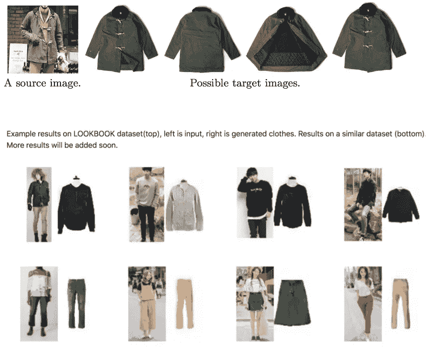

[PixelDTGAN](https://github.com/fxia22/PixelDTGAN)

PixelDTGAN 用于根据名人照片生成营销图像。这也用作基于图像的建议工具。

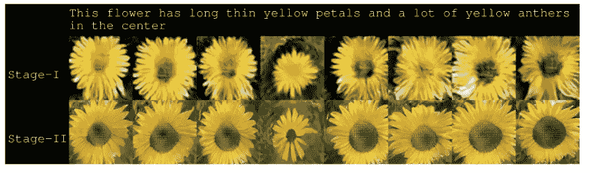

[StackGAN](https://github.com/hanzhanggit/StackGAN)

[文字转图像](https://arxiv.org/pdf/1612.03242v1.pdf)是域转移 GAN 的应用之一。这有巨大的应用，包括照片编辑和计算机辅助设计。

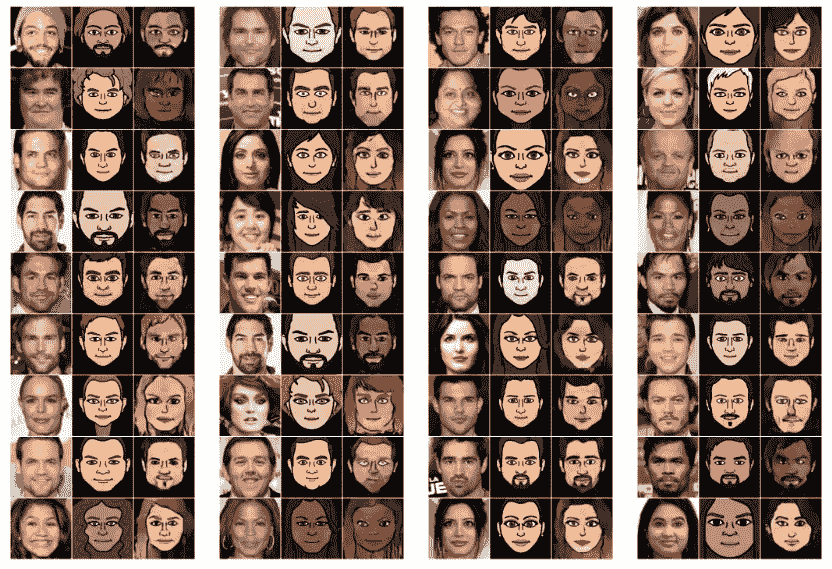

[DTN](https://arxiv.org/pdf/1611.02200.pdf)

根据图片创建表情符号是 Snap chat 和 Instagram 等平台已经使用的知名应用之一。

**参考文献**

1.  [使用条件生成对抗网络进行不平衡学习的有效数据生成](https://www.sciencedirect.com/science/article/pii/S0957417417306346)
2.  [如何开发 GAN 以生成 CIFAR10 小型彩色照片](https://machinelearningmastery.com/how-to-develop-a-generative-adversarial-network-for-a-cifar-10-small-object-photographs-from-scratch/)
3.  [甘的一些炫酷应用](https://medium.com/@jonathan_hui/gan-some-cool-applications-of-gans-4c9ecca35900)
4.  [如何训练一个甘？](https://github.com/soumith/ganhacks#authors)