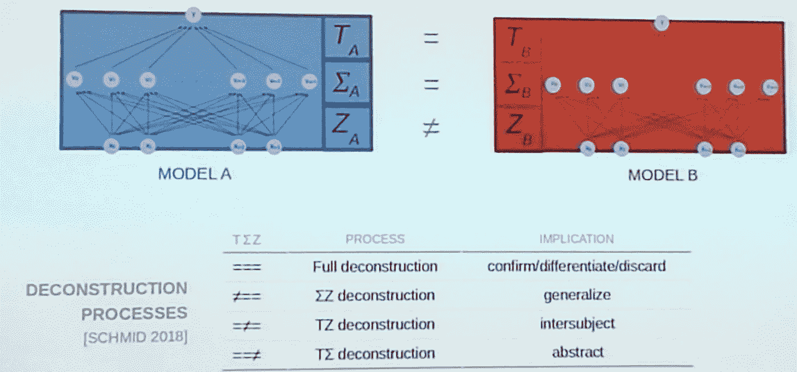

# 建构主义机器学习

> 原文：<https://towardsdatascience.com/constructivist-machine-learning-7c2192883c2d?source=collection_archive---------38----------------------->

## 让机器学习更接近人类的愿景

Photo by [The Roaming Platypus](https://unsplash.com/@the_roaming_platypus?utm_source=medium&utm_medium=referral) on [Unsplash](https://unsplash.com?utm_source=medium&utm_medium=referral)

有没有办法用建构主义的方式重新解读机器学习？更重要的是，我们为什么要这么做？

这两个问题的答案都很简单。是的，我们可以做到，这样做的动机可能会解决现代机器学习的一个关键缺陷，即，让它更接近人类对现实的解释。

认知功能的关键部分是模型。

人类能够建立非常复杂的模型，这要归功于我们大脑的工作方式。[功能主义心理学](https://www.britannica.com/science/functionalism-psychology)已经表明，心理模型能够不断构建假设的结构来预测环境，并不断修改它们。

我们可以依靠 Stachoviak (1973)的[一般模型理论来尝试理解什么是现实和认知。](https://modelpractice.wordpress.com/2012/07/04/model-stachowiak/)

学习由构建、解构和重构模型构成。建构主义理论认为不存在独立于人类的现实，知识是个人获得的。如果你从这个角度思考机器学习，它基本上不属于任何以人为本的现实解释。

但是，您可以映射:

*   **构造**(创建，想象)为无监督学习
*   **重建**(复制、模仿)为监督学习
*   **解构**(反映、怀疑)反而没有清晰地映射出来。它部分映射到在线学习，但不是全部。这也是因为您需要研究模型、抽象、比较、区分它们，并选择/丢弃无效的模型。

实际上，在机器学习算法中实现一些建构主义方法是可能的。例如，这里有一个简单的方案，您可以查看两个分类模型。我们查看模型的时间(T)、主题(适马)和目的(Z)。两个模型下面的表格显示了不同的情况(当三个方面中的一个不同时)以及它在建构主义过程方面意味着什么。

这个故事源自 Thomas Schmid(莱比锡大学)在斯坦福大学举行的关于 KB & AI 2019 的 [AAAI 人工智能春季研讨会上基于](https://www.aaai-make.info/program)[他的论文](https://proceedings.aaai-make.info/short1.pdf)所做的演讲。