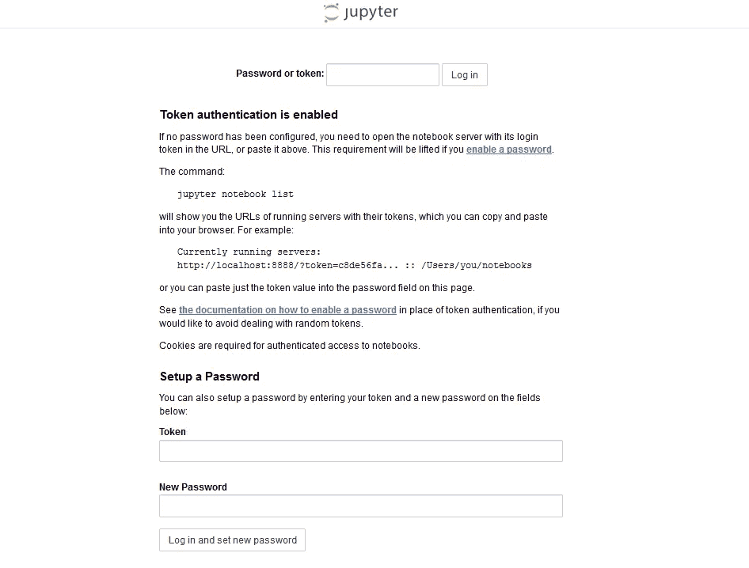
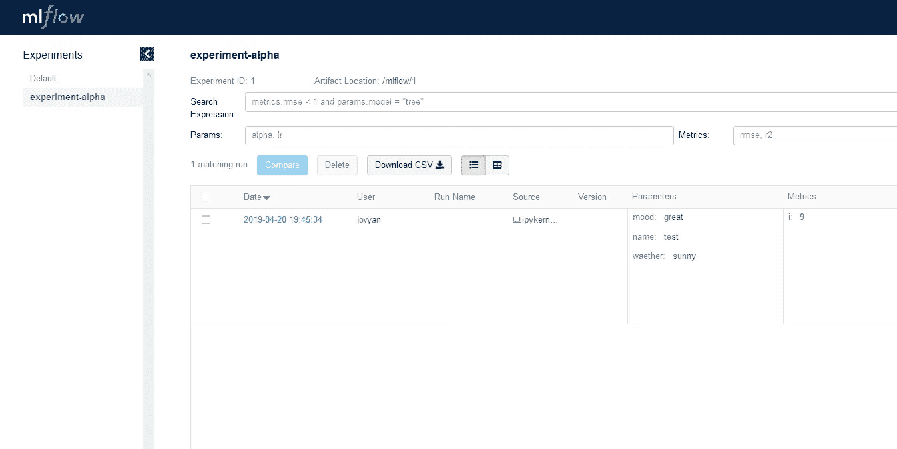

# 使用 Docker-Compose 将您的整个数据科学环境(或任何您想要的东西)容器化

> 原文：<https://towardsdatascience.com/containerize-your-whole-data-science-environment-or-anything-you-want-with-docker-compose-e962b8ce8ce5?source=collection_archive---------7----------------------->

## 用一个简单的文件和几个命令行从多个交互的容器构建应用程序的入门指南。


[Source: Pixabay](https://pixabay.com/photos/containers-storage-rusted-rusty-1209079/)

在本文中，我想与您一起探索如何创建一个容器化的数据科学环境或您可能想要的任何其他系统，您可以快速部署到任何运行 Docker 的机器上，可能是您的笔记本电脑或云计算机。为此，我想向您演示的工具是 Docker-Compose *、*，它是 Docker *、*的补充，用于构建和运行由多个容器*、*构成的应用程序。本文中我想与您一起构建的示例系统将由三个组件组成:一个用于进行实验的 *Jupyter Notebook* 服务器，一个用于记录和组织实验参数和指标的 *MLflow 跟踪服务器*，以及一个作为后端的 *Postgres* 数据库我的主要目的是给你一个 Docker-Compose 的概念和如何使用它，并假设你至少对 Docker 有一个基本的了解，或者可能是对它的用途和工作原理有一个初步的了解。如果没有，让我们快速了解一下为什么您应该为另一项技术而烦恼。

# 为什么要用 Docker 和 Compose 呢？

当你已经安装好了所有的东西并且设置得很好的时候，你可能会问自己为什么要使用 Docker。简而言之，没有太多的流行词——宾果:对我来说，真正开始尝试了解 Docker 和 Compose 的动机是建立一个与本文中我将向您展示的环境类似的环境，托管在服务器上的某个地方，以便我可以从任何地方访问它。因为我在配置和设置方面没有天赋，所以我想在我的笔记本电脑和 Docker 容器中舒适地尝试一下，在那里我不会破坏任何东西，然后在我准备好的时候把它放到云中。我也仍然不确定云提供商，所以我真的很喜欢这个想法，能够快速拿起我的设置并移动到其他地方。
当我告诉一位同事这个小项目时，他也很感兴趣，因为他认为在为学生举办研讨会或举办研讨会时，当您可能需要让您的设置突然在许多计算机上运行时，或者您可能只是想让它在按需部署时，这是一个很好的东西。

我还发现让我的生活变得容易得多的另一件事是，你可以多么可靠地用容器再现结果。如果你从事软件工作，当遇到任何设置问题时，你很可能迟早会遇到这句名言“它在我的机器上工作”。容器使这成为过去，因为它们的行为是非常可预测的，无论你在哪里部署和运行它们，你都会得到相同的结果，当它“在我的机器上工作”时，它也很可能在你的机器上工作。

对我来说，将 Compose 添加到工具箱的动机是，一旦您想要将多个容器连接在一起以便彼此交互，事情就变得不那么琐碎了。Docker-Compose 是一个简单的工具，它允许你描述多个容器的集合，这些容器可以通过它们自己的网络以一种非常直接的方式进行交互，这正是我所需要的。你可以在一个小小的 *YAML* 格式的文件中指定一切，将容器定义为*服务*，定义*卷*来存储数据，设置端口转发，这比只使用 Docker 还要简单*。*即使你只使用一个容器，我也发现它非常方便，我现在几乎只使用它。Docker 的所有桌面发行版中都包含了 Compose，所以如果你有一个正在运行的版本，你可以马上试用。

# 简单的 Jupyter 服务

作为起点，我们将创建一个由单个容器组成的简单系统。让我们从 Jupyter 笔记本开始，定义一个 docker 文件，其中包含笔记本服务器和一个 *docker-compose.yml* 文件，该文件描述了如何构建和运行 Docker 映像并将笔记本服务器端口暴露给主机，以便我们可以连接到它。Jupyter 很容易上手，因为它背后的团队已经提供了很好的图像，只需添加您可能需要的工具，就可以开始了。使用 Docker-Compose，您可以使用 Docker HUB 等存储库中的现成映像，或者从 Docker 文件构建本地映像。

让我们从项目结构开始，我们有一个 *docker-compose.yml* 文件，我们将在其中指定我们的系统，我们还有一个 docker 文件，目前只用于我们的笔记本，在我们希望构建和运行的单独文件夹中。

```
data-toolbox
|- jupyter-notebook-docker
|    |- Dockerfile
|- docker-compose.yml
```

笔记本 Dockerfile 是 Jupyter 团队在 [Docker HUB](https://hub.docker.com/r/jupyter/scipy-notebook/) 上发布的 *scipy* 图片的简单扩展。 *scipy-notebook* 镜像已经包含了许多有用的库，比如 *numpy* 、 *pandas* 、 *matloblib* 、 *seaborn* 、 *dask* 等等，并且还启用了 *Jupyter Lab* 。我们将向映像中添加两个库， *mlflow* ，因为我们想要客户端——库的一部分，我们将使用它来连接到 mlflow 跟踪服务器(我们将在下一步设置),以及 *psycopg2，*库，它将允许我们轻松地连接到我们将在最后设置的 Postgres 数据库。为此，我们只需添加一个 *RUN* 命令，让 *conda* 包管理器将 *mlflow* 和 *psycopg2* 添加到环境中。
例如，如果您有兴趣使用 *Spark* 构建一个设置(您甚至可以在使用 *Docker Swarm* 或 *Kubernetes* 的集群设置中完全容器化该设置)，Jupyter 团队也可以使用 Spark 笔记本映像进行扩展。

A simple Dockerfile, extending from the scipy-notebook and adding some libraries

最后但同样重要的是 *docker-compose.yml* 文件，还不是很令人兴奋。部分*服务*描述了我们系统的 Docker 映像，现在我们刚刚添加了一个条目，我们称之为*笔记本*，在其中我们指定将使用哪个 Docker 文件。在这种情况下，指令说:“在 jupyter-notebook-docker 文件夹中构建 docker 文件，并使用结果图像”。我们还指定我们希望笔记本服务器端口 8888 转发到主机上的同一个端口，以便我们可以连接到我们的笔记本。端口规范的顺序是主机:容器。如果您不想添加任何库，而只想使用预先制作的映像，您可以使用 *image* 命令，而不是 *build* ，并指定一个像 *jupyter/scipy-notebook* 这样的映像。我建议看一下 [docker-compose 文件参考](https://docs.docker.com/compose/compose-file/)，以便更好地理解哪些命令是可用的。

The docker-compose.yml describing a “notebook” service made from a local Docker image

现在，剩下要做的就是构建和运行项目。为了让 Docker-Compose 构建您的本地映像，当您与您的 *docker-compose.yml* 文件位于同一个文件夹中时，您只需在命令行中键入以下内容。

```
docker-compose build
```

如果一切正常，构建成功，你就可以用 compose 命令*启动你的系统了。*

```
docker-compose up
```

如果这也行得通，你现在应该可以通过在浏览器中访问 *localhost:8888* 来连接到你的新 Jupyter 笔记本了。在 Jupyter images 中，默认情况下启用身份验证，因此确保在启动容器时从日志中复制令牌。



Connecting to localhost:8888 reveals Jupyter running in the container

正如你所看到的,*组合*可以使运行一个容器变得更容易，因为你可以指定端口转发等。只需用更短的命令运行它，而不需要编写脚本文件。

# 添加 MLFlow 跟踪服务器

现在变得更有趣了，我们将 MLflow 跟踪服务器添加到组合中，以便我们可以记录实验运行、参数和指标，并组织我们的模型工件。为此，Jupyter 笔记本服务器需要能够与运行在不同容器中的 MLfLow 服务器通信。首先，让我们为新的 docker 文件添加另一个文件夹，这样您的项目结构看起来如下所示。

```
data-toolbox
|- jupyter-notebook-docker
|    |- Dockerfile
|- ml-flow-docker
|    |- Dockerfile
|- docker-compose.yml
```

首先，我们再次创建一个简单的 docker 映像，这次运行 MLflow 跟踪服务器。为此，我们扩展了预装 python 3.7 的 *python:3.7.0* Docker 映像，它是创建任何类似于此的 Python 相关映像的良好起点。我们所要做的就是通过 *pip* 安装 MLflow，为它创建一个目录来写入所有数据，然后用命令 *mlflow server* 启动服务器。基本就是这样。您可以看到 backend-store-uri 选项，它用于告诉 MLflow 在哪里存储数据，这里我们使用一个文件夹，但该选项也接受数据库 URIs 和其他内容，我们将在后面使用。查看[跟踪服务器文档](https://mlflow.org/docs/latest/tracking.html#mlflow-tracking-servers)以找到关于配置的更多细节。

The Dockerfile for a simple MLflow tracking server

现在来看一个稍微有趣一点的 docker-compose 文件。我们添加了第二个服务，我们称之为 *mlflow* ，并让它指向 ml-flow-docker 文件夹中的 docker 文件，我们*在“系统内部网络”中暴露*容器的端口 5000，并再次将其转发到主机的同一个端口，以便我们可以检查我们的实验运行，并查看我们的指标的酷图等等*。*命令 *expose* 只将 Compose 创建的系统内部网络中的端口公开为*端口*，我们知道将端口转发给主机。

因为我们还在运行笔记本服务器的容器中安装了 MLflow，所以我们可以设置一个环境变量，告诉 MLflow 客户端默认跟踪实验的位置。当我们正确设置这个变量时，我们不必在每次想要使用跟踪时通过 python API 在笔记本中设置它。Compose 允许您从合成文件中设置这些变量。这里，我们将环境变量 *MLFLOW_TRACKING_URI* 设置为 MLFLOW 跟踪服务器的地址。由于 *Compose* 自动为我们的*服务*创建一个带有*域名*的网络，我们可以简单地将跟踪 URI 称为服务名，相关端口——ml flow:5000——因为我们为跟踪服务器 *mlflow* 命名了服务。

The docker-compose.yml file now with an MLflow tracking server which is reachable from the Jupyter notebook

如果我们现在再次在命令行中输入可信的 docker-compose 命令 *build* 和*，我们将能够连接到 localhost:8888 并连接到我们的 Jupyter 笔记本，用 mlflow 创建一个新的实验并记录一些东西。我们还应该能够连接到 localhost:5000，并查看我们的 MLflow UI 和我们刚刚创建的实验。*

Creating a new experiment in MLflow and logging some stuff from a Jupyter Notebook.



We can see our logged experiment data in the MLflow UI running in the other container.

# 连接数据库

现在到了最棘手的部分，我们将为跟踪服务器添加一个数据库后端，因为对数据库日志的支持是在 0.9.1 中添加的，并承诺在跟踪和查询速度方面比文件存储高得多。数据库也很酷，有一个这样的数据库可以有效地存储和查询表格数据集。将跟踪数据存储在数据库中也有好处，我们可以直接从中查询和分析实验指标，如果您想做 MLflow UI 没有提供的任何事情，这可能是必要的，目前仍然很多。

添加数据库映像本身并不难，Postgres alpine 映像就是您真正需要的，一个运行 PostgresDB 的非常精简的映像。尽管如此，我们仍将从 Postgres 映像扩展并创建我们自己的 docker 文件，主要是因为我们希望将一个初始化脚本复制到映像中的一个文件夹中，以便 Postgres 在启动时初始化 mlflow 数据库。在 compose 文件中，我们像往常一样再次添加一个新服务，并将其命名为 *postgres，*我们还为 postgres 指定了环境变量，以便在启动时创建一个具有给定名称和密码的超级用户，当我们将数据库 URI 添加到跟踪服务器时，我们将需要它。由于 Postgres 映像已经默认公开了数据库端口，所以我们不需要向合成文件添加一个 *expose* 命令，但是我们可以再次将端口转发给主机来检查数据库。项目结构、docker 文件和合成文件现在如下所示。

```
data-toolbox
|- jupyter-notebook-docker
|    |- Dockerfile
|- ml-flow-docker
|    |- Dockerfile
|- postgres-docker
|    |- Dockerfile
|    |- init.sql
|- docker-compose.yml
```

Dockerfile for the PostgresDB, copying the init.sql into the init folder

The init.sql file, initializing the database for MLflow

The docker-compose file, now with the Postgres database added

为了使用 Postgres 数据库作为 MLflow 的后端，我们需要在启动 MLflow 服务器时将数据库 URI 配置为*后端存储 uri* 。此外，由于*后端存储 uri* 现在指向一个数据库，MLflow 将抱怨它不能在那里存储工件，所以您还需要提供一个*默认工件根*来指定工件存储的位置。请记住，如果您提供一个文件路径，而不是一个 NFS 或云存储解决方案(如 AWS S3)的地址，工件将存储在客户端，所以在运行笔记本的容器中，在我们这里指定的文件夹下，因为它基本上只是告诉客户端在哪里存储工件。跟踪服务器文档概述了目前工件存储的可能性。

The Dockerfile for the MLflow Server, now with a Postgres database backend configured

尽管您可以用 *depends* 命令告诉 Docker-Compose 以何种顺序启动服务，但这并不总是足够的。Compose 将看到一个容器启动，但不会等待它准备就绪，因为这对每个容器来说意味着其他事情，对于数据库来说，一旦 PostgresDB 接受连接，我们就认为容器准备就绪。不幸的是，数据库需要一段时间启动，MLflow 服务器立即检查数据库连接，发现没有开放的端口接受指定 URI 下的连接，然后关闭。太好了，现在怎么办？

感谢比我聪明得多的人，例如，你可以得到一个非常方便的 shell 脚本[*wait-for-it . sh*](https://github.com/vishnubob/wait-for-it)它允许你等待任何服务接受 TCP 连接，然后执行任何其他命令。显然，这只是实现这一点的一种方式，请随意留下你在评论中找到的其他方法，因为我很好奇其他人是如何解决这个问题的。

要合并脚本，我们只需下载它，将其放入包含跟踪服务器 Dockerfile 的文件夹中，并稍微更改 Dockerfile 以将脚本复制到映像中，设置*执行标志*以便它具有运行权限，然后我们使用脚本启动 MLflow 服务器，假设 Postgres 接受连接。默认情况下，脚本会在 15 秒内每秒尝试连接一次，这已经足够了。提示:我花了一段时间才弄明白，当你在 Windows 上把文件复制到镜像中时，确保它有 LF 作为行尾，而不是 CRLF，这会导致 bash 在容器中“找不到文件”。

The final Dockerfile for the MLFlow Tracking Server, waiting for the database to be up

# 让您的数据持久化

关于 Docker 容器的有趣的事情是，如果你关闭它们，你的数据、你的 Jupyter 笔记本、你在 MLFlow 中的指标以及数据库中的所有东西都不见了。每次启动编写环境时，您都可以从头开始。这很好，但并不总是你想要的，通常情况下，人们似乎不喜欢每次打开电脑就从头开始工作。这就是为什么我们必须让 Docker 容器将它们的数据写入一个持久存储，通常是主机磁盘。然后，当您再次启动容器时，您的数据仍将在那里。

有两种通用的方法可以实现这一点，一种是直接将主机的文件路径绑定到容器中的文件路径，另一种也是推荐的，也是稍微简单一点的方法，就是使用 Docker *volumes。*卷是由 Docker 管理的主机文件系统上的空间，与绑定文件路径相比有一些优势，例如，它们独立于主机文件结构，这意味着当移动到新机器时，您不需要更改任何内容，并且使用不同的卷*驱动程序*您还可以写入远程存储位置，而不是主机。我发现的另一个伟大的事情是，它们也可以在 Windows 主机上无缝地工作，否则当你试图简单地与 Docker 共享对本地文件夹的访问时，你会经常遇到问题。

无论您选择哪个选项，您唯一需要弄清楚的是容器将数据写入哪个目录，然后在那个位置挂载一个卷。例如，对于笔记本服务器，笔记本启动并将其数据写入文件夹 */home/jovyan* 。如果我们在该点装载一个卷，数据将被写入容器外的卷中，并保持持久。为了让 Docker Compose 创建卷，我们只需添加一个名为 *volumes* 的部分，然后指定卷应该具有的一些名称，然后将它们绑定到文件中相应服务部分下的容器中的正确路径。最后，包含容器的卷挂载的最终合成文件如下所示。

The final docker-compose.yml for our environment

如果您想知道当您让 docker 管理卷时，您的数据最终在哪里，您可以使用下面的 Docker 命令检查它们。请注意，您创建的卷的名称不会与您在合成文件中指定的名称完全相同。相反，当 Compose 创建卷时，它会在前面加上项目的名称，默认情况下是包含合成文件的目录的名称。在我们的例子中，项目目录被称为 *data-toolbox* ，因此为了检查文件存储卷，例如，我们将使用下面的命令。

```
docker volume inspect data-toolbox_file-store
```

您将得到类似如下的结果，在*挂载点*下，您可以看到该卷的数据将存放在主机上的什么位置。

```
[
    {
        "CreatedAt": "2019-06-17T18:51:53Z",
        "Driver": "local",
        "Labels": {
            "com.docker.compose.project": "data-toolbox",
            "com.docker.compose.version": "1.23.2",
            "com.docker.compose.volume": "file-store"
        },
        "Mountpoint": "/var/lib/docker/volumes/data-toolbox_file-store/_data",
        "Name": "data-toolbox_file-store",
        "Options": null,
        "Scope": "local"
    }
]
```

# 结论

我希望我能够用这个小例子来演示如何轻松地创建一个由多个容器组成的系统，该系统可以通过网络进行交互，并且可以大量共享数据。如果你已经跟随了，你现在应该有一个小型的容器化环境，你可以在你的笔记本电脑上玩，或者甚至可以放在一个服务器上，如果你愿意的话，可以认真地工作。您还应该能够扩展它，以添加您的环境中可能需要的更多东西，如不同的数据库、仪表板、消息队列和流服务器、Spark、构建工具或谁知道什么，您的想象力是有限的，我鼓励您尝试一下。使用 Docker 容器的好处是，你不能破坏任何东西。您可能会在某个时候耗尽磁盘空间，因为图像和容器会变得很大，如果您不运行一些命令来清理它们并不时地关闭它们，它们就会堆积起来。

一旦你熟悉了它，我发现让它快速运行起来变得很有趣。我不再在我的笔记本电脑上安装本地数据库进行开发，我提取一个 Docker 映像并运行它，如果我想保留数据，我会添加一个卷，如果不想，我就不这样做。如果你想更深入地了解这个问题，Docker 容器可以使很多事情变得更容易和更快，从构建管道到分布式系统和软件测试，等等。像*微服务架构*这样的东西只有在使用容器的情况下才真正可行。它可能会让你的生活变得更轻松，或者提高你的工作效率。

*非常感谢您的阅读。*