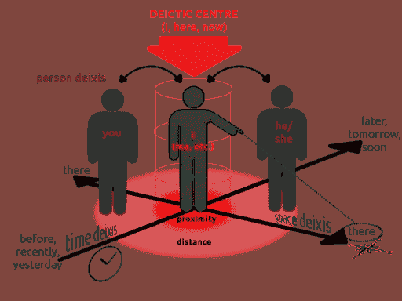

# 语境理论 I:会话结构

> 原文：<https://towardsdatascience.com/context-theory-i-conversation-structure-98713ad42175?source=collection_archive---------19----------------------->

```
"Must a name mean something?" Alice asked doubtfully. 
"Of course it must,"  Humpty Dumpty said with a short laugh; "my name means the shape I am -  and a good handsome shape it is, too. With a name like yours, you might  be any shape, almost."
                          Through the Looking Glass, Lewis Carroll
```

在上一篇文章中，我们发现了与语境理论相关的基本语言学概念。在这篇文章中，我们将关注对话结构，为什么一些话语可以跟随一些话语而不尴尬，修补是如何组织的…什么使对话有意义。

一次对话绝对不仅仅是分享话语；根据马丁·布伯，“对话是两个或两个以上实体之间的相互交谈……它是持续交流的有效手段，而不是有目的地试图得出某种结论或表达某种观点。”

在探索个别话语的意义之前，让我们从整体上来看对话的意义。记住，我告诉过你*上下文大于其组成部分的总和*(尽管我们还不确定那些组成部分到底是什么)*。*

当然，对话的意义取决于

*   参与者是谁
*   他们在哪里
*   他们为什么在那里
*   语言使用的语境。

那么语言的选择就不是任意的，而是由语境因素系统地驱动的。著名语言学家海姆斯在他的**说话**模型中对这个问题做了如下更好的解释:

场景是指对话发生的物理和心理环境，在大学大楼，在奶奶家或在医院；在一个有趣的，严肃的，专业的或浪漫的情绪，也许在某种意义上的文化氛围。

参与者是关于参与者的信息，他们的文化和社会背景。显然，老师对学生说话的方式不同于克拉拉阿姨对她的孙子乔说话的方式。

对话的目的和结果。哈利想在同事莎莉的生日聚会上向她表白，然而在赠送礼物时，他没有说“我爱你莎莉”，而是只能说“很高兴见到你”，然后她尴尬的沉默了。不幸的是，最初的目标和结果大相径庭。

**CT 序列是话语的序列。**

ey 指的是演讲的精神，即快乐、悲伤或热情。

工具是交流的渠道——书写、说话、发信号，有时是凝视，有时是 WhatsApp 信息或短信。线上的方式比较新，但是很常见的渠道。

orms 是一种社会规范。例如，法语、土耳其语、德语和许多其他语言都有一个表示尊敬的第二人称复数形式: *vous* 、 *siz* 、 *Sie* 。

enre 是一种家庭间的对话、闲聊、调情或趣闻。就像音乐一样，演讲也有几种类型。与音乐不同，有些语音类型很难定义。

我告诉过你，语言可能没有那么自成一体，肯定有环境效应。此外，我们的大脑认为世界的*中心*是他/她自己。当我们谈论相对时间或地理位置时，参考点总是现在的*和这里的*。这些是日常用语中的常用短语:**

```
*My home                   Tomorrow             Me
My office                 Last week            Your boyfriend
Here                      After my birthday    My mom
Over there                Recently
Opposite to the street    Soon*
```

**这些短语到底指的是哪里、什么时候和谁？更好的情况是，想象一下在一个瓶子里发现一条信息，上面写着，“我的食物用完了，很可能我会在两天内死去。请救救我，我在旧灯塔附近的一个岛上。没有任何日期和地图。你会去找消息的主人吗？没有参考点你怎么知道他是不是已经死了？**

*本文中最以自我为中心的术语是**指示语**。如果一个词的语义是固定的，但其指称意义根据时间和/或地点、参考时间/点而变化，那么这个词就是指示词。*

**

*Center of our semantic worlds: Ourselves, image source:Wikipedia*

```
*I         this      today
you       that      tomorrow
we        here      now
          there
personal  spatial   temporal*
```

*是典型的指示词，注意代词的存在。代词通常在 NLU 任务中被低估，要么在停用词过滤模块中完全消亡，要么没有引起太多关注。的确，一般来说，它们携带的信息不多，但在短文中，它们可以很大程度上改变意思。*

*地图应用程序、导航设备、像 [**我们的 Chris**](https://chris.com) 这样的驾驶助手、打车应用程序和拼车应用程序应该可以解决几乎所有查询中的**空间指示**。考虑以下对话片段:*

```
*Customer: I ordered a taxi 5 mins ago, where is it now?
Bot: It's on the way, arrives in 4 mins.
Customer: Can he come opposite side of the park?*
```

*这里，很明显“公园的对面”是靠近客户位置的公园(在我的例子中是蒂尔加滕😁).我们的 Chris 每天都面临这样的问题，并成功地解决了它们:*

```
*Hey Chris, navigate home
Navigiere ins Büro
Navigate to work
Navigate to my place*
```

*时间指示语在顾客抱怨中更常见(昨天、5 天前、明天、1 周前)，空间指示语在帮助顾客认路时更常见。空间指示要困难得多，时间指示的确[可以被 CFG](https://duygua.github.io/blog/2018/03/28/chatbot-nlu-series-datetimeparser/) s 解析；而空间指示语包括地理语义。(我们不告诉任何人我们是如何为克里斯做到的，这是纯粹的黑魔法😉).*

*正如人们所看到的，作为一种言语行为的对话有许多成分，但我们为什么要聚在一起说话呢？为了进行有意义的对话，参与者应该在同一个**场地**见面。首先，双方应该愿意交换一些信息，并在一些共同的基础上会面；应该有一些相互的认识和相互的假设。此外，在对话过程中，他们应该向其他参与者示意他们听到了什么以及他们听到了什么；听者必须为说话者的话语建立基础。**误解修复**是这一过程的一部分，同时也是对话管理中的一项巨大任务。考虑下面的对话部分，为更像人类的对话体验而添加到设计中的基础模式:*

```
*Customer: I want to buy a ticket for tomorrow.
Bot: So *you fly tomorrow*, where are you going?  (confirm what the bot heard)
Customer: To Munich.
Bot: *OK, great*. What time exactly? (confirm that the bot heard the previous utterance)*
```

*人类通过阅读句法、韵律、语调、停顿、手势、一些话语标记以及可能的凝视信号来“知道”谁应该在对话中发言、何时发言以及发言多长时间，**话轮转换**发生。请注意，有些信号是关于“成为人类”的，人类不仅可以通过文字或口语来阅读他人。一个轻微的停顿或者一个眼神就足以明白对方完了。几千年以来，人类就有阅读他人的能力，由于进化过程，这些基因正在消失。你的聊天机器人设计怎么样？在与客户通电话时，他能知道轮到自己说话吗？(感谢谷歌 Duplex 在这里，谁肯定知道在哪里加入对话。)*

*本文的最后，也可能是最重要的概念是**顺序组织**。当我们想给一个话语赋予意义时，这个话语在互动中的位置和它的话语一样重要。一个句子的意思当然会有所不同*

```
*is this utterance opening a dialog?
is it response to some prior utterance?
is it repair of some prior utterance?
or is it opening a new context?*
```

*，不信你亲眼看看:*

```
*Customer: *Hello*!                       (greeting)
Bot:      Hello, how can I help you?Bot: Would you like to order a taxi now?
Customer: *Helllooooo*, I already ordered a taxi 5 mins ago! (ah no)Bot: Would you like to place an order right now?
Customer: *Yes*, please.
Bot: OK, then I'm reserving your seat for Atlanta 9:00AM flight tomorrow.
Customer: *Yes*, but I'm not going to Atlanta, I go to Athens.*
```

*不同种类的**邻接对**衍生出不同的含义。在第二个例子中，问答邻接对的字面意思是*是，*，而第二个邻接对是一个错误恢复对，在这个上下文中*是*实际上不携带太多信息，而是用作上下文延续符。*

*另一个概念与上下文恢复有关，**修复组织**的确是对话式人工智能中的一个至关重要的话题。我们都有对自己的设计“抱歉，我没明白”的时候(意外时有发生😶)，问题是一个人能否从困境中恢复过来，尽快回到之前的语境？当出现问题时，要么是用户发起纠正，要么是聊天机器人想要澄清情况。请看以下对话片段:*

```
*Customer: Please play Crazy from Britney.
Bot:      I'll put on Seal right away.
Customer: No, Britney Spears.
Bot:      Alright, You Drive Me Crazy from Britney comes.Customer: Put on some good vibes, please.
Bot:      Sorry I didn't quite get that, can you maybe rephrase your sentence?
Customer: Play some music please.
Bot:      Sure, what would you like to listen?*
```

*一个典型的修复轨迹由以下动作序列组成:故障、修正启动和修正。最重要的是不要因为迷失在修复轨迹中而丢失先前的上下文:*

```
*- I want to order 2 cheeseburgers please.
- Ketchup or mayo?
- One with ketchup, other with mayo please.
- Sorry I didn't quite get that.            (here the order is not comprehended)
- Which part you didn't understand?
- Sorry I didn't quite understand, can you maybe rephrase? 
(this is the point of losing it, bot forgets about the order and focuses on recovering the very last utterance)*
```

*亲爱的读者，我们已经完成了语言学和结构基础；然而我们渴望更多。在本系列接下来的几集里，我们会发现语义框架、上下文的“类型”、如何参与以及具体参与什么……更多的计算问题。在一天结束的时候，我们都喜欢 PyTorch 代码，对吗😉*

*更多信息，请加入我们在[https://chris.com](https://chris.com/)的精彩克里斯工程活动。我们为对话式人工智能带来了一场革命，并创造了一种独特的产品。你也可以随时登陆 [https://duygua.github.io](https://duygua.github.io) 来看我。同时保持快乐和和谐！*

## *参考*

*   *布伯，马丁。1958.*我与你*。纽约:斯克里布纳。*
*   *海姆斯博士，1974 年。社会语言学基础:人种学方法。费城:宾夕法尼亚大学出版社。*