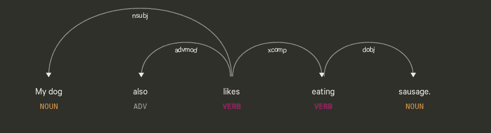
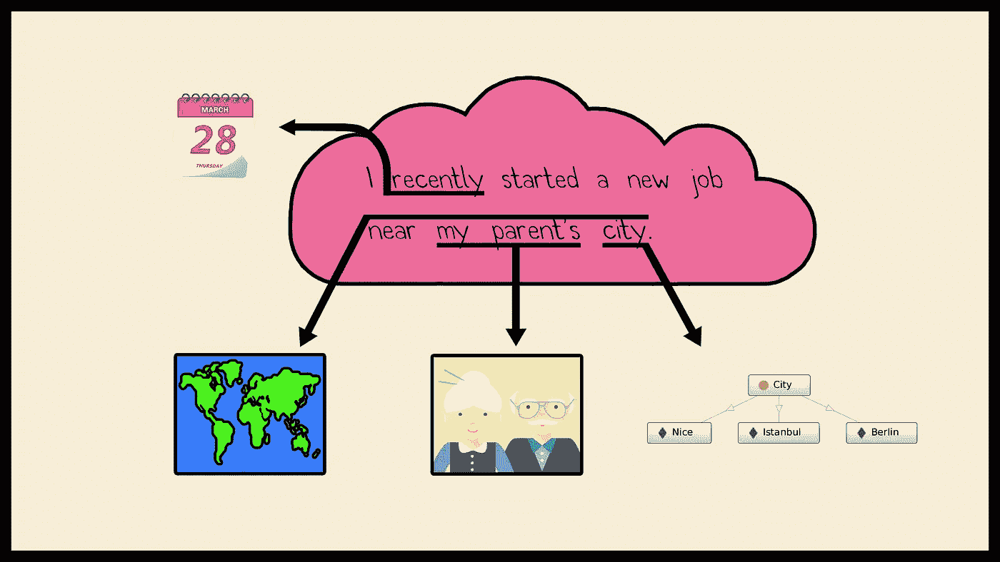
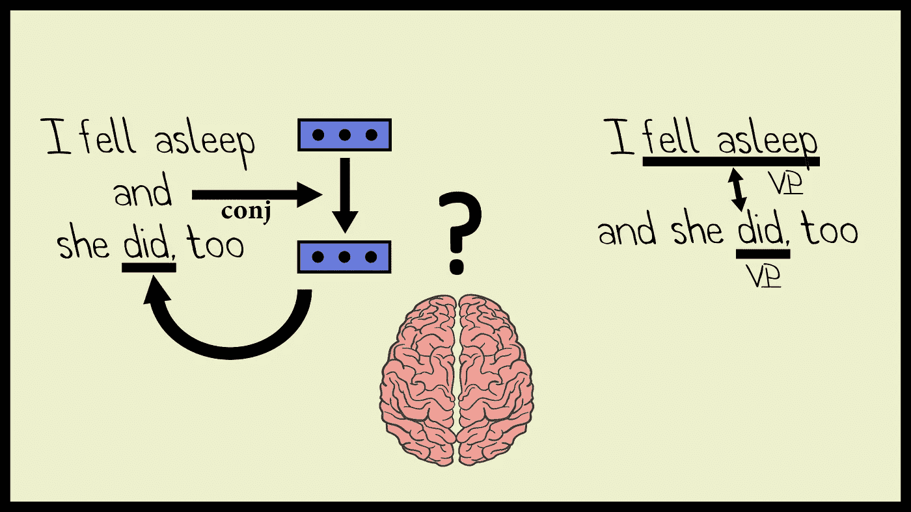

# 语境理论 I:导论

> 原文：<https://towardsdatascience.com/context-theory-i-introduction-9d121194bd48?source=collection_archive---------17----------------------->

## 计算语用学的语言学基础导论

```
"That's a great deal to make one word mean", Alice said in a thoughtful tone.
"When I make a word do a lot of work like that", said Humpty Dumpty, "I always pay it extra".
                          Through the Looking Glass, Lewis Carroll
```

自早期的状态机和意图分类组合以来，onversational AI 已经走过了漫长的道路。端到端的培训策略和强化学习研究加速取代了不可扩展的预定义意图和硬编码状态。然而，对于聊天机器人的最终用户来说，事情远非完美无缺。在这方面，对话管理组件显示出很大的改进潜力，像真正的人一样进行对话的关键在于跟上对话。

几乎每个人都可以对一些预定义的意图进行分类。更大的问题是:你能对上下文相关的意图进行分类吗？例如，当许多简短的回答存在于几乎所有的口语中，携带的信息不多，其含义通常严重依赖于上下文，但仍然可以极大地改变对话的方式，并对整个上下文做出巨大贡献时，你该怎么办？

当产生一个答案时，人们也许可以抓住语法衔接和词汇衔接…但是语法和词汇选择是使文章连贯的唯一因素吗？

在这一系列的文章中，我将解释语境理论和计算语用学的基础，主要是为了实用的目的；用于聊天机器人和其他形式的智能助手的对话管理组件。这样，我们可以更好地进行 NLU，更好地模拟对话状态，并生成连贯的答案……从而几乎模仿人类。

开玩笑的。

亲爱的读者们，计算语境理论这种东西并不存在，我也怀疑它是否会存在。与语言学中被充分研究的部分，如句法理论相反，语境缺乏一个定义明确的*单位*。句法理论享有*成分*等单位。因此，语法标记、依存语法和短语结构语法吸引了大量的研究。总体结果令人满意，在流行的 NLP 库中有几个基于统计和规则的解析器实现，包括[斯坦福 NLP](http://nlp.stanford.edu:8080/parser/) 和 [SpaCy](https://explosion.ai/demos/displacy) 。让我们看一个由 SpaCy 解析器生成的依赖关系的例子:



A typical dependency parse

正如人们所看到的:

*   语法标签定义明确
*   依赖关系是明确定义的

如果我们想对*上下文*做同样的事情呢？

如果一个人有足够的 GPU 能力和一个统计框架，以统计的方式建模依赖关系一点也不困难(好吧，这也不是小事)。然而，如果您想要对上下文建模，您将建模什么呢？到目前为止，构成对话上下文的组件是什么？实体、关系、共同参照、对话记忆、社会规范、对话背景、对话地点和时间、参与者的精神状态和情绪——我们如何对它们建模？

也许我们可以为对话历史建立一个记忆单元——但是参与者的记忆呢？可能参与者 I 前一天晚上睡得不好，感觉很累，当天根本不想交谈，因此只给出简短的回答。也许参与者 II 最近被女朋友甩了，他根本不想谈论女人。你是如何塑造别人的人生经历和心态的？

文化规范或日常生活的一般事实呢？时间和空间依赖？显然，对话发生在工作场所还是咖啡馆很重要。同样的，我想你不会像对你妈妈那样对你的老板说话。

只有一个连续稠密表示还是几个向量？仿真陈述的图形嵌入？

不同的语言学家试图定义什么是语境，以发展他们自己的理论。例如，威多森将语境定义为:

"实际语言使用环境中被认为与意义相关的那些方面"。

G.尤尔给出了一个相当无风险的定义:

在他的指称研究中，“语境是使用一个词的物理环境”。

目的不同，研究重点不同，但有一个非常重要的方面是共同的:环境。人们不能把所说的话与说这话的环境分开。谁要是宣称“语言是一个自成体系的系统”，未必真的正确。语言包括语言学、文化、时间、空间、环境和常识。这就是我们在这个系列中要彻底探索的。



Language not being a self-contained system

在考虑了所有这些计算和语言问题之后，只剩下一个问题:我们到底想把什么建模成上下文？

> 所谓的“语境”到底是什么？

为了给语境概念找到一个合理的“单位”，我们先来过一遍一些基本概念:

**连贯性**是你想要寻找的术语，如果你想知道是什么让一篇文章在语义上有意义的话。连贯包括句法特征、常识、常识和逻辑联系。参见示例:

```
S1: Last week I visited the Sandro shop in KaDeWe. I was not able to fit into any of the dresses.
S2: Oh yes, that's how French sizing is.
```

在这里，显然第二个说话者知道世界上的常识，桑德罗巴黎是一家法国服装零售商。然后他能够依次对这个问题发表评论。

这个例子怎么样:

```
S1: Have you met Mike's wife? She's gorgeous.
S2: I didn't know that he's married. He is not wearing a wedding ring.
```

这段对话看起来非常简单和普通，尽管它包含了一个重要的陷阱。在第二行中，第二个说话者得出了逻辑结论

```
has-a(Mike, wife) => married(Mike)
```

通过他们的常识。第二个结论是基于一个文化参照，即已婚者戴结婚戒指。尽管看起来微不足道，但考虑到普通人每天都会得出许多逻辑结论，我们如何表达常识在计算上并不那么简单。我们将在本系列的后面讨论这个问题。

连贯是一个大操场，是逻辑、知识表示、语法、语义的结合；结合大脑的不同部分，尽管被列在语言学之下。然而**衔接**实际上是一个纯粹的语言学概念。衔接是语法和词汇上的联系，在语义上把语篇粘合在一起。衔接拥有定义明确的工具，在本文中我将讨论指称和省略。

什么是引用？我们可以粗略地说，它是一个指针，在当前的话语语境中，在两个参与者的世界中，一个说话者抓住某个东西。不要扬起你的眉毛，我们仍然在发现“世界”是什么😊。更专业地说，指称表达是说话者用来指称某事物的语言表达。所指的东西叫做所指物。

指称可以是前指或后指。回指指的是在上下文中向后指的行为，而下指的字面意思是向下，来自καταφορά(“向下运动”)。比较示例:

```
Yesterday I saw *Jim* at the supermarket. **He** was with his lovely dog.
In **his** last years, *Picasso* created many paintings.
```

这里所指的术语是代词**何**，是先行词*吉姆*的回指。由于我们对会话界面的语境理论感兴趣，我们更多地看到了回指类型。在第二句中，代词 **his** 是一个后移代词 *Picasso* 。也许古希腊人的灵感来自对话的“上语境”和“下语境”——谁知道呢？😉

另一个源自希腊语的术语**省略号**(字面省略)在口语中大量出现:当一个短语从上下文来看“显而易见”时，我们就简单地省略它。

```
Should I call you tomorrow or ˢʰᵒᵘˡᵈ you ᶜᵃˡˡ me?Susanna is working full day on Mondays, ˢʰᵉ ᶦˢ ʷᵒʳᵏᶦⁿᵍ a half day on Fridays.- I'm writing a blog.
- For how long ʰᵃᵛᵉ ʸᵒᵘ ᵇᵉᵉⁿ ʷʳᶦᵗᶦⁿᵍ ᵃ ᵇˡᵒᵍ?
```

省略的一种常见且被广泛研究的形式是**动词短语省略、**或简称 VP-省略。在这种结构中，省略了一个非限定动词短语。参见示例:

```
I won't do it, but my colleague will ᵈᵒ ᶦᵗ.She can do it if she wants to ᵈᵒ ᶦᵗ.I fell asleep and she did, too.    'fell asleep' replaced by 'did'
```

我们如何给这类句子赋予意义？一种可能性是，我们的大脑进行了严格的语法替换，例如在第三句中，为了将含义添加到*做了*，我们寻找以前的 VP，发现*睡着了*。另一种可能性是，我们不是进行语法重建，而是检索当前的语义上下文。在第二种情况下，我们执行连续上下文向量的检索，而不是词性标注。虽然我们可以完全理解我们自己语言的语法，但我们可以使用一些检索任务，不是吗？😉最终，人脑可以用不同的方式处理语义。让我们希望我们能在整个系列中保持一致。



Brain, the most complicated semantic machine: syntactical parsing vs recent context retrieval

另一个话语概念，**确定性/不确定性**实际上是小学水平的语法信息——然而，就什么是**可推断的**信息，什么不是而言，它非常有用。我们都知道英语的定冠词(the)和不定冠词(a，an)。然后，定冠词和不定冠词被用于名词短语:女孩、苹果……当我们想在上下文中引入一个新的实体时，我们使用不定冠词。后来，如果我们想指这个实体，我们要么把它和定冠词一起用，要么用代词，要么用指示词。例如:

```
 Customer: I have bought 2 pairs of shoes, I want to return one
 Bot:      OK, please give me your tracking number
 Customer: 3EF1233AG
 Bot:      There is **a black Lanvin pair** and **a zebra Escada**. Which one would you like to give back?
 Customer: **The black pair**, please.
```

在这里，顾客的回答是完全连贯和可以理解的，因为一行前就已经介绍了这双黑色的鞋子。因此，在这一点上，客户和机器人都**熟悉**所谈论的对象。

事实上，相反的情况也适用:只有当所指实体的存在已经由当前上下文给出时，确定用法才有意义。你能想象这句话是怎么说的吗😊：

```
I saw **the movie** last week. **A movie** was not interesting at all.
```

我的母语是一种没有任何冠词的语言，既没有定，也没有不定。在英语翻译过程中，只有上下文告诉你在哪里插入文章。如果你想正确地说出上面的句子，你应该这样说:

```
Geçen hafta bir filme gittim. Hiç güzel değildi.
```

第二句话，虽然没有定冠词，但意思还是懂的。偶尔，我们在特定的情况下使用单回指:

```
Bot: Hangisini geri vermek istiyorsunuz?
Müşteri: Siyah olanı.   (the) black one
```

无论如何，熟悉程度不仅仅取决于冠词的用法，它还取决于整个上下文。就像土耳其语到英语的翻译一样，语境为确定性/不确定性提供线索。语境作为一个“整体”比其组成部分的总和更强大；如果某些成分缺失了，我们仍然可以从语篇语境中填补空缺。

亲爱的读者，我们已经到了文章的结尾，但我们仍然不太确定如何表示一个上下文对象，或者更确切地说，上下文对象到底是什么。我们将在本系列的下一篇文章中继续寻找更多的顺序性、更多的语义和更重要的语用学。也许汉姆蒂是对的，毕竟，我们必须付出额外的努力来解决做了很多工作的话，谁知道呢？

更多信息，请参加我们在[https://chris.com](https://chris.com/)举办的最佳克里斯工程活动。我们打造下一代驾驶员助手，为对话式人工智能带来一场革命。也可以上 [https://duygua.github.io](https://duygua.github.io) 来找我。在那之前保持快乐和和谐。

## 参考

*   马修和蒙塔尼，伊内斯。2017.spaCy 2:利用 Bloom 嵌入、卷积神经网络和增量解析的自然语言理解。 [https://spacy.io](https://spacy.io)
*   Manning、Christopher D .、Mihai Surdeanu、John Bauer、Jenny Finkel、Steven J. Bethard 和 David McClosky。2014.[斯坦福 CoreNLP 自然语言处理工具包](http://nlp.stanford.edu/pubs/StanfordCoreNlp2014.pdf)见*计算语言学协会第 52 届年会会议记录:系统演示*，第 55–60 页。
*   H.威多森。1996.语言学，牛津语言研究入门，ISSN 1754–7865
*   吉莉安·布朗，布朗·吉莉安，乔治·尤尔。1983.话语分析，*剑桥语言学教科书*