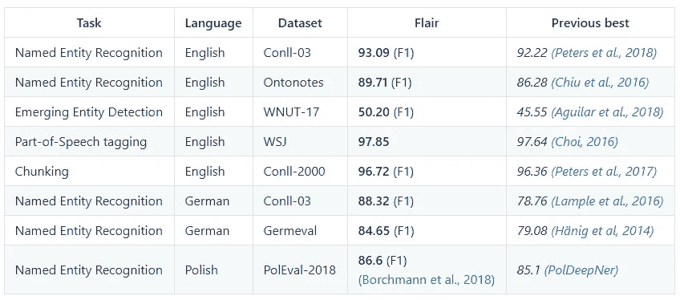

# 自然语言处理序列标注的上下文嵌入

> 原文：<https://towardsdatascience.com/contextual-embeddings-for-nlp-sequence-labeling-9a92ba5a6cf0?source=collection_archive---------12----------------------->

## 用于序列标记的上下文字符串嵌入


Photo by [Edward Ma](https://unsplash.com/@makcedward?utm_source=medium&utm_medium=referral) on [Unsplash](https://unsplash.com?utm_source=medium&utm_medium=referral)

文本表示(即文本嵌入)是解决自然语言处理任务的一个突破口。起初，单个单词向量代表一个单词，即使在上下文中携带不同的含义。例如，“华盛顿”可以是一个地点、名称或州。“华盛顿大学”

Zalando 发布了一个惊人的 NLP 库，flair，让我们的生活更轻松。它已经实现了他们上下文字符串嵌入算法和其他经典的和最新的文本表示算法。

在这个故事中，您将通过一些示例代码理解用于序列标记的上下文字符串嵌入的架构和设计。

# 建筑和设计

总体设计是将一个句子传递给**字符语言模型**来检索**上下文嵌入**，这样**序列标注模型**就可以对实体进行分类


Architecture and Design (Akbik et al., 2018)

## 语境嵌入

与经典的[单词嵌入](/3-silver-bullets-of-word-embedding-in-nlp-10fa8f50cc5a)不同，Akbik 等人将其称之为语境化的单词嵌入。换句话说，单词嵌入捕获了上下文中的单词语义，因此即使是同一个单词，在不同的上下文中也可以有不同的表示。你可以从语言模型(ELMo) 中找到[语境化的词向量(CoVe)](/replacing-your-word-embeddings-by-contextualized-word-vectors-9508877ad65d) 和[嵌入，以了解更多细节。Albik 等人将他们的嵌入命名为**上下文字符串嵌入**。](/how-bert-leverage-attention-mechanism-and-transformer-to-learn-word-contextual-relations-5bbee1b6dbdb)

## 字符语言模型

与其他模型不同，它基于字符级标记化，而不是单词级标记化。换句话说，它将把句子转换成字符序列，并通过语言模型来学习单词表示。


Contextual Embeddings of “Washington” (Akbik et al., 2018)

以“Washington”为例，双向 LSTM 模型允许“Washington”从前一个单词(即 George)和后一个单词(即 birth)中检索信息，从而可以计算句子上下文中的向量。

向量由前向神经网络和后向神经网络级联而成。对于前向神经网络，将提取单词中最后一个字符(即“n”)之后的隐藏状态。单词中第一个字符(即“W”)前的隐藏状态将从反向神经网络中提取。

## 堆叠嵌入

与其他研究一样，Akbik 等人利用堆叠嵌入获得了更好的结果。堆叠嵌入意味着组合多个嵌入来表示一个单词。

例如，Akbik 等人连接上下文嵌入和手套嵌入来表示用于序列标记的单词。

## 序列标签

来自字符语言模型的上下文嵌入和手套嵌入被传递到双向 LSTM-CRF 架构，以解决[命名实体识别(NER)](https://medium.com/@makcedward/named-entity-recognition-3fad3f53c91e) 问题。

# 实验



Experiment Result between previous best result (Akbik et al., 2018)

# 履行

## 命名实体识别(NER)

只需要执行以下命令来加载预先训练的 NER 标记。

```
from flair.data import Sentence
from flair.models import SequenceTaggertagger = SequenceTagger.load('ner')
```

之后，您可以简单地将句子传递给句子对象，然后执行预测。

```
sample_texts = [
    "I studied in University of Washington.",
]for text in sample_texts:
  print('-' * 50)
  print('Original Text')
  print(text)

  print('NER Result')
  sentence = Sentence(text)
  tagger.predict(sentence)
  for entity in sentence.get_spans('ner'):
    print(entity)
```

结果是

```
Original Text:
**I studied in University of Washington.**
NER Result:
**ORG-span [4,5,6]: "University of Washington."**
```

## 情感分类

它和 NER 一样容易。

```
from flair.data import Sentence
from flair.models import TextClassifierclassifier = TextClassifier.load('en-sentiment')
```

将句子传递给预先训练的分类器

```
sample_texts = [
    "Medium is a good platform for sharing idea",
]for text in sample_texts:
  print('-' * 50)
  print('Original Text')
  print(text)

  print('Classification Result')
  sentence = Sentence(text)
  classifier.predict(sentence)
  print(sentence.labels)
```

结果是

```
Original Text:
Medium is a good platform for sharing idea 
Classification Result:
 [POSITIVE (0.7012046575546265)]
```

# 拿走

要访问所有代码，你可以访问这个 [CoLab 笔记本](https://colab.research.google.com/drive/1H6F5ZCO728_CT37_EEfAFhfbDrEF7nQc)。

*   除了预训练的 flair 上下文嵌入，我们不仅可以应用经典的嵌入方法，如 GloVe、word2vec，还可以应用最新的嵌入方法，如 ELMo 和 BERT。你可以去看看这个[指南](https://github.com/zalandoresearch/flair/blob/master/resources/docs/TUTORIAL_4_ELMO_BERT_FLAIR_EMBEDDING.md)做参考。
*   我们还可以非常容易地实现堆叠嵌入。只需要很少的代码。可以访问这个[指南](https://github.com/zalandoresearch/flair/blob/master/resources/docs/TUTORIAL_3_WORD_EMBEDDING.md)进行参考。
*   如果你想在你的数据上训练定制模型，这个[指南](https://github.com/zalandoresearch/flair/blob/master/resources/docs/TUTORIAL_9_TRAINING_LM_EMBEDDINGS.md)会对你有用。

# 参考

Akbik A .，Blythe D. Vollgraf R. 2018。[用于序列标记的上下文字符串嵌入](http://alanakbik.github.io/papers/coling2018.pdf)。

[py torch 的天赋](https://github.com/zalandoresearch/flair)