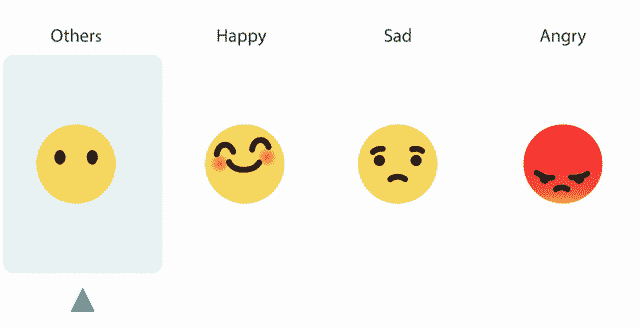
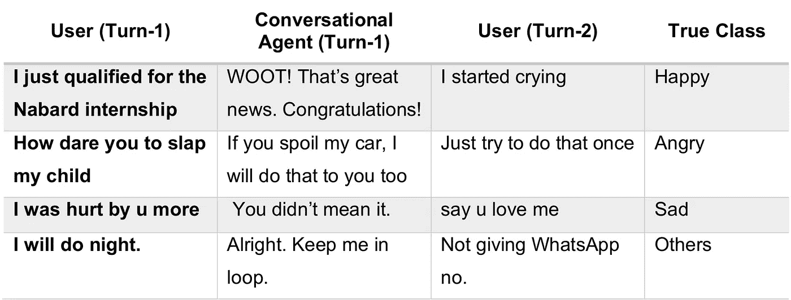
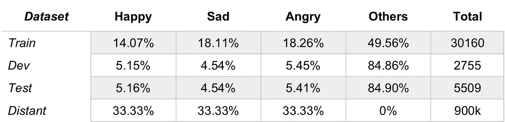
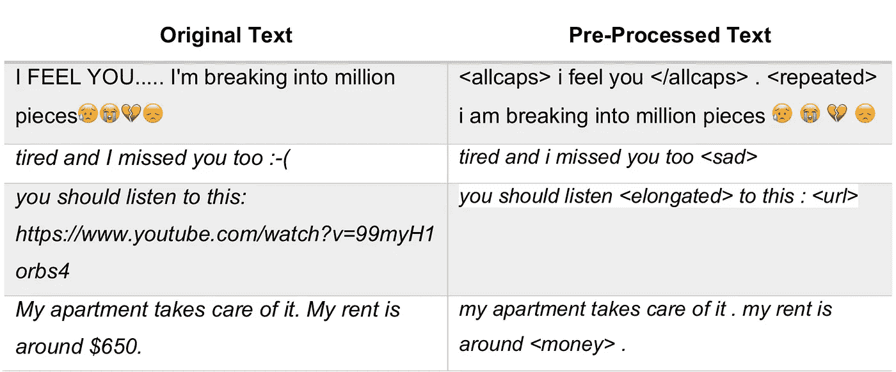
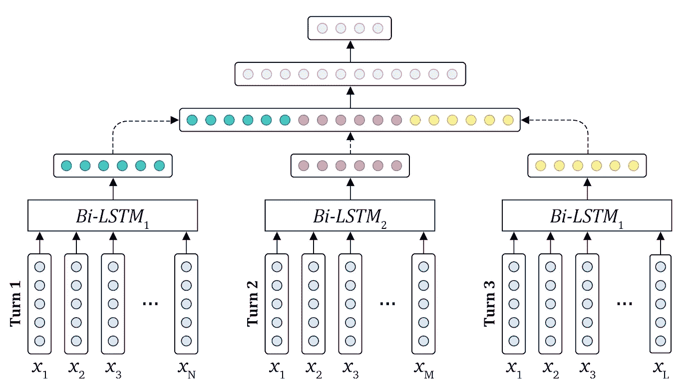

# 使用神经网络的文本对话中的上下文情感检测

> 原文：<https://towardsdatascience.com/contextual-emotion-detection-in-textual-conversations-using-neural-networks-381e3d8490c4?source=collection_archive---------15----------------------->



如今，与对话代理交谈正成为日常事务，对话系统生成尽可能像人类一样的响应是至关重要的。作为一个主要方面，主要的注意力应该放在为用户提供情感上的反应上。在本文中，我们将描述**文本对话中情感检测的递归神经网络架构**，它参与了 [SemEval-2019 任务 3“emo context”](http://alt.qcri.org/semeval2019/index.php?id=tasks)，即语义评估年度研讨会。任务目标是在三回合对话数据集中对情绪(即高兴、悲伤、愤怒和其他情绪)进行分类。

文章的其余部分组织如下。第 1 节简要概述了 EmoContext 任务和提供的数据。因此，第二和第三部分集中于文本预处理和单词嵌入。在第 4 节中，我们描述了提交中使用的 LSTM 模型的架构。最后，给出了系统的最终性能和源代码。该模型使用 Keras 库在 Python 中实现。

# 1.培训用数据

SemEval-2019 任务 3“emo context”侧重于文本对话中的上下文情感检测。在 EmoContext 中，给定一个文本用户话语以及对话中的两次语境，我们必须分类下一个用户话语的情绪是“快乐”、“悲伤”、“愤怒”还是“其他”(表 1)。只有两个对话参与者:一个匿名的人(tune-1 和 Turn-3)和基于人工智能的聊天机器人 [Ruuh](https://www.ruuh.ai/) (Turn-2)。详细描述见( [Chatterjee et al .，2019](https://www.aclweb.org/anthology/papers/S/S19/S19-2005/) )。



*Table 1\. Examples showing the EmoContext dataset (*[*Chatterjee et al., 2019*](https://www.aclweb.org/anthology/papers/S/S19/S19-2005/)*)*

在比赛期间，我们访问了任务组织者提供的 30160 篇人类标记的文本，其中大约 5000 篇样本来自“愤怒”、“悲伤”、“快乐”类，15000 篇来自“其他”类(表 2)。开发和测试集也是由组织者提供的，与训练集相反，它们有一个真实的分布，每个情感类大约占 4%，其余的是“其他”类。数据由微软提供，可在官方 LinkedIn group 中找到。



*Table 2\. Emotion class label distribution in datasets (*[*Chatterjee et al., 2019*](https://www.aclweb.org/anthology/papers/S/S19/S19-2005/)*).*

除了这些数据，我们还收集了 90 万条英语推文，以便为每种情绪创建一个 30 万条推文的远程数据集。为了形成距离数据集，我们基于 Go 等人(2009)的策略，在该策略下，我们简单地将推文与情绪相关的词的存在相关联，如“#愤怒”、“恼火”、“高兴”、“悲伤”、“惊讶”等。查询词列表基于 seme val-2018 AIT DISC([duppa da et al .，2018](https://aclweb.org/anthology/papers/S/S18/S18-1002/) )的查询词。

EmoContext 的关键性能指标是三种情绪类别的微观平均 F1 分数，即“悲伤”、“快乐”和“愤怒”。

# 2.文本预处理

在任何训练阶段之前，文本都经过文本工具[Ekphrasis](https://github.com/cbaziotis/ekphrasis)([Baziotis et al .，2017](https://aclweb.org/anthology/S17-2094) )的预处理。该工具有助于执行拼写纠正、单词规范化、分段，并允许指定哪些标记应该被省略、规范化或用特殊标签注释。我们在预处理阶段使用了以下技术。

*   URL、电子邮件、日期和时间、用户名、百分比、货币和数字都被替换为相应的标签。
*   重复的、删节的、拉长的和大写的术语都用相应的标签标注。
*   基于内置的单词统计语料库自动纠正拉长的单词。
*   基于内置的单词统计语料库执行标签和缩写解包(即，分词)。
*   为了减少各种情绪，使用了手动创建的字典来替换从文本中提取的术语。

此外，Emphasis 提供了 tokenizer，它能够识别大多数表情符号、表情符号和复杂的表达方式，如经过审查、强调和拉长的单词，以及日期、时间、货币和首字母缩写词。



*Table 3\. Text pre-processing examples.*

# 3.单词嵌入

单词嵌入已经成为 NLP 系统的任何深度学习方法的基本部分。为了确定最适合情绪检测任务的向量，我们尝试了 Word2Vec ( [Mikolov 等人，2013](https://arxiv.org/abs/1310.4546) )、GloVe ( [Pennington 等人，2014](https://aclweb.org/anthology/papers/D/D14/D14-1162/) )和 FastText ( [Joulin 等人，2017](https://www.aclweb.org/anthology/papers/E/E17/E17-2068/) )模型以及 DataStories 预训练的词向量( [Baziotis 等人，2017](https://aclweb.org/anthology/S17-2094) )。Word2Vec 的关键概念是在向量空间中非常接近地定位在训练语料库中共享公共上下文的单词。Word2Vec 和 Glove 模型都从单词的共现信息中学习单词的几何编码，但本质上前者是预测模型，后者是基于计数的模型。换句话说，虽然 Word2Vec 试图预测目标单词(CBOW 体系结构)或上下文(Skip-gram 体系结构)，即最小化损失函数，但 GloVe 计算单词向量，对共现计数矩阵进行维数缩减。FastText 与 Word2Vec 非常相似，除了它使用字符 n 元语法来学习单词向量，因此它能够解决词汇表之外的问题。

对于上面提到的所有技术，我们使用了作者提供的默认训练平台。我们基于这些嵌入中的每一个训练一个简单的 LSTM 模型(dim = 64 ),并使用交叉验证比较有效性。根据结果，预训练嵌入的数据集表现出最好的平均 F1 分数。

为了用单词的情感极性来丰富所选择的单词嵌入，我们考虑通过在自动标记的距离数据集上对嵌入进行微调来执行距离预训练短语。使用预培训的重要性在( [Deriu 等人，201](https://dl.acm.org/citation.cfm?id=3038912.3052611) 7)中得到证明。我们使用遥远的数据集训练简单的 LSTM 网络来分类愤怒、悲伤和快乐的推文。嵌入层在第一个训练时期被冻结，以避免嵌入权重的显著变化，然后在接下来的 5 个时期被解冻。在训练阶段之后，微调的嵌入被保存用于进一步的训练阶段，并且[公开可用](https://github.com/sismetanin/emosense-semeval2019-task3-emocontext)。

# 4.神经网络体系结构

递归神经网络(RNN)是专门用于处理顺序数据的人工神经网络家族。与传统的神经网络相比，rrn 被设计成通过共享它们处理序列的内部权重来处理序列数据。为此，RRNs 的计算图包括循环，表示先前信息对当前信息的影响。作为 RNNs 的扩展，长短期记忆网络(LSTMs)在 1997 年被引入( [Hochreiter 和 Schmidhuber，1997](https://www.mitpressjournals.org/doi/abs/10.1162/neco.1997.9.8.1735) )。在 LSTMs 中，递归单元以特定的方式连接，以避免消失和爆炸梯度问题。传统的 LSTMs 只保存过去的信息，因为它们只在一个方向上处理序列。双向 LSTM 结合了两个反向移动的隐藏 LSTM 层的输出，其中一个通过时间向前移动，另一个通过时间向后移动，从而能够同时捕获来自过去和未来状态的信息( [Schuster 和 Paliwal，1997](https://ieeexplore.ieee.org/document/650093) )。



*Figure 1: The architecture of a smaller version of the proposed architecture. LSTM unit for the first turn and for the third turn have shared weights.*

图 1 提供了我们方法的高级概述。所提出的神经网络结构包括嵌入单元和两个双向 LSTM 单元(dim = 64)。前一个 LSTM 单元旨在分析第一用户的话语(即会话的第一和第三轮)，后一个旨在分析第二用户的话语(即第二轮)。这两个单元不仅学习语义和情感特征表示，还学习如何捕捉用户特定的对话特征，这允许更准确地对情感进行分类。在第一步，使用预先训练的单词嵌入将每个用户话语馈送到相应的双向 LSTM 单元。接下来，这三个特征图被连接在一个展平特征向量中，然后被传递到一个完全连接的隐藏层(dim = 30)，该隐藏层分析所获得的向量之间的相互作用。最后，这些特征通过 softmax 激活函数继续通过输出层来预测最终的类标签。为了减少过拟合，在嵌入层之后添加了具有高斯噪声的正则化层，在每个 LSTM 单元(p = 0.2)和隐藏全连接层(p = 0.1)之前添加了丢弃层([斯里瓦斯塔瓦等人，2014](http://jmlr.org/papers/v15/srivastava14a.html) )。

# 5.结果

在搜索最佳结构的过程中，我们不仅试验了层中的单元数量、激活函数和正则化参数，还试验了神经网络的结构。关于这个短语的详细信息可以在[原文](https://www.aclweb.org/anthology/papers/S/S19/S19-2034/)中找到。

上一节中描述的模型展示了 dev 数据集上的最佳得分，因此它被用于竞赛的最终评估阶段。在最终的测试数据集上，情感类的微观平均 F1 分数达到 72.59%，而所有参与者的最高分数为 79.59%。然而，这远远高于任务组织者发布的官方基线，即 58.68%。

[模型的源代码和单词嵌入](https://github.com/sismetanin/emosense-semeval2019-task3-emocontext)可以在 GitHub 获得。

 [## sis metanin/emo sense-seme val 2019-task 3-emo context

### 该存储库包含用于 SemEval-2019 任务 3 的 EmoSense 提交的模型的源代码…

github.com](https://github.com/sismetanin/emosense-semeval2019-task3-emocontext) 

[文章的完整版本](https://www.aclweb.org/anthology/papers/S/S19/S19-2034/)和[任务描述论文](https://www.aclweb.org/anthology/papers/S/S19/S19-2005/)可以在 ACL 选集找到。
[训练数据集](https://www.linkedin.com/feed/update/urn:li:activity:6439879151053836288/)位于 LinkedIn 的官方竞赛组。

引用:

```
[@inproceedings](http://twitter.com/inproceedings){
    smetanin-2019-emosense, 
    title = "{E}mo{S}ense at {S}em{E}val-2019 Task 3: Bidirectional {LSTM} Network for Contextual Emotion Detection in Textual Conversations", 
    author = "Smetanin, Sergey", booktitle = "Proceedings of the 13th International Workshop on Semantic Evaluation", 
    year = "2019", 
    address = "Minneapolis, Minnesota, USA", 
    publisher = "Association for Computational Linguistics", 
    url = "[https://www.aclweb.org/anthology/S19-2034](https://www.aclweb.org/anthology/S19-2034)", pages = "210--214"
}
```