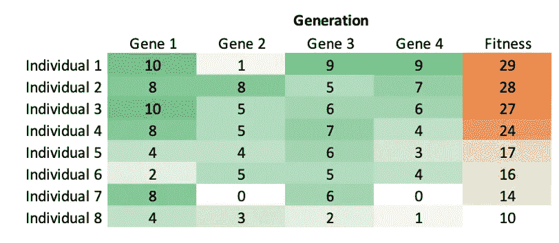
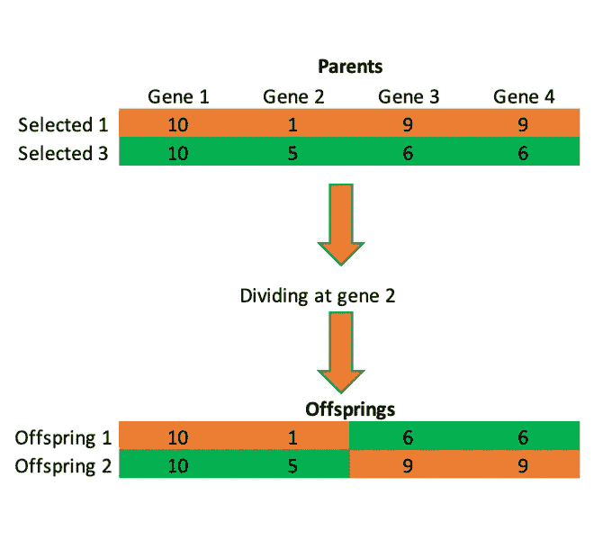

# 用 Python 从头开始连续遗传算法

> 原文：<https://towardsdatascience.com/continuous-genetic-algorithm-from-scratch-with-python-ff29deedd099?source=collection_archive---------3----------------------->

遗传算法是一种受自然启发的强大优化技术。遗传算法模仿进化来寻找最佳解决方案。与大多数优化算法不同，遗传算法不使用导数来寻找最小值。遗传算法最显著的优点之一是它们能够找到全局最小值而不会陷入局部最小值。随机性在遗传算法的结构中起着重要的作用，这也是遗传算法不断搜索搜索空间的主要原因。标题中的连续意味着我们要创建的遗传算法将使用浮点数或整数作为优化参数，而不是二进制数。


Flowchart of genetic algorithms

遗传算法创建随机生成的候选解的初始群体，评估这些候选解，并计算它们的适应值。解的适应值是决定解有多好的数值，适应值越高，解越好。下图显示了一个有 8 个人的示例生成。每个个体由代表优化参数的 4 个基因组成，并且每个个体具有适应值，在这种情况下，适应值是基因值的总和。



An example of a generation

如果初始种群不满足终止准则的要求，遗传算法产生下一代。第一次遗传操作是选择；在这个操作中，将会进入下一代的个体被选择。在选择过程之后，配对操作开始。配对操作将选定的个体两两配对，以进行交配操作。交配操作采用配对的亲代个体并产生后代，后代将替换在选择操作中未被选择的个体，因此下一代具有与上一代相同数量的个体。重复该过程，直到满足终止标准。

在本文中，使用 Python 标准库和 Numpy 从头开始创建遗传算法代码。前面讨论的每一种遗传操作都是作为函数创建的。在我们开始遗传算法代码之前，我们需要导入一些库作为:

```
import numpy as np
from numpy.random import randint
from random import random as rnd
from random import gauss, randrange
```

# ***初始人口***

遗传算法通过创建候选解的初始群体来开始优化过程，候选解的基因是随机生成的。为了创建初始群体，必须创建一个创建个体的函数；

```
def individual(number_of_genes, upper_limit, lower_limit):
    individual=[round(rnd()*(upper_limit-lower_limit)
                +lower_limit,1) for x in range(number_of_genes)]
    return individual 
```

该函数将基因数量、基因的上限和下限作为输入，并创建个体。在创建了创建个体的函数之后，需要另一个函数来创建群体。创建群体的函数可以写成:

```
def population(number_of_individuals,
               number_of_genes, upper_limit, lower_limit):
    return [individual(number_of_genes, upper_limit, lower_limit) 
        for x in range(number_of_individuals)]
```

使用这两个函数，可以创建初始群体。在遗传算法产生第一代后，计算个体的适应值。

# 适合度计算

适应度计算函数决定了个体的适应度值，如何计算适应度值取决于最优化问题。如果问题是优化一个函数的参数，那么该函数应该被实现为适应度计算函数。优化问题可能非常复杂，可能需要使用特定的软件来解决问题；在这种情况下，适应性计算功能应该运行模拟，并从正在使用的软件中收集结果。为了简单起见，我们将回顾文章开头给出的生成示例。

```
def fitness_calculation(individual);
    fitness_value = sum(individual)
    return fitness_value
```

这是一个非常简单的适应度函数，只有一个参数。可以为多个参数计算适应度函数。对于多个参数，归一化不同的参数是非常重要的，不同参数之间的幅度差异可能导致其中一个参数对于适应函数值变得过时。可以用不同的方法来优化参数，归一化方法之一是重新缩放。重新缩放可以表示为:


Function for normalizing parameters

其中 m_s 是参数的换算值，m_o 是参数的实际值。在此函数中，参数的最大值和最小值应根据问题的性质来确定。

在参数被归一化之后，参数的重要性由适应度函数中给予每个参数的偏差来确定。给定参数的偏差总和应为 1。对于多个参数，适应度函数可以写成:


Multi-parameter fitness function

其中 *b* 表示适应度函数的偏差，而 *p* 表示归一化参数。

# 选择

选择函数获取候选解的群体及其适应度值(一代)，并输出将进入下一代的个体。可以将精英主义引入到遗传算法中，遗传算法会在一代中自动选择最佳个体，因此我们不会丢失最佳解。有几种选择方法可以使用。本文给出的选择方法有:

*   **轮盘选择:**在轮盘选择中，每个个体都有机会被选中。个体被选中的几率是基于个体的适合度值。更健康的人更有可能被选中。


Roulette wheel selection figure

轮盘游戏轮盘选择的函数获取累积和以及选择过程中随机生成的值，并返回所选个体的号码。通过计算累积和，每个个体都有一个介于 0 和 1 之间的唯一值。为了选择个体，随机产生一个 0 到 1 之间的数字，并且选择接近随机产生的数字的个体。轮盘赌函数可以写成:

```
def roulette(cum_sum, chance):
    veriable = list(cum_sum.copy())
    veriable.append(chance)
    veriable = sorted(veriable)
    return veriable.index(chance)
```

*   **最适合的一半选择:**在这种选择方法中，候选解中最适合的一半被选择出来进入下一代。


Fittest half selection figure

*   **随机选择:**在这种方法中，个体随机选择。


Random selection figure

选择函数可以写成:

```
def selection(generation, method='Fittest Half'):
    generation['Normalized Fitness'] = \
        sorted([generation['Fitness'][x]/sum(generation['Fitness']) 
        for x in range(len(generation['Fitness']))], reverse = True)
    generation['Cumulative Sum'] = np.array(
        generation['Normalized Fitness']).cumsum()
    if method == 'Roulette Wheel':
        selected = []
        for x in range(len(generation['Individuals'])//2):
            selected.append(roulette(generation
                ['Cumulative Sum'], rnd()))
            while len(set(selected)) != len(selected):
                selected[x] = \
                    (roulette(generation['Cumulative Sum'], rnd()))
        selected = {'Individuals': 
            [generation['Individuals'][int(selected[x])]
                for x in range(len(generation['Individuals'])//2)]
                ,'Fitness': [generation['Fitness'][int(selected[x])]
                for x in range(
                    len(generation['Individuals'])//2)]}
    elif method == 'Fittest Half':
        selected_individuals = [generation['Individuals'][-x-1]
            for x in range(int(len(generation['Individuals'])//2))]
        selected_fitnesses = [generation['Fitness'][-x-1]
            for x in range(int(len(generation['Individuals'])//2))]
        selected = {'Individuals': selected_individuals,
                    'Fitness': selected_fitnesses}
    elif method == 'Random':
        selected_individuals = \
            [generation['Individuals']
                [randint(1,len(generation['Fitness']))]
            for x in range(int(len(generation['Individuals'])//2))]
        selected_fitnesses = [generation['Fitness'][-x-1]
            for x in range(int(len(generation['Individuals'])//2))]
        selected = {'Individuals': selected_individuals,
                    'Fitness': selected_fitnesses}
    return selected
```

# 配对

配对和交配在大多数遗传算法应用中被用作单个操作，但是为了创建更简单的函数并且能够容易地使用不同的交配和配对算法，这两个遗传操作在该应用中被分开。如果在遗传算法中存在精英，精英必须是函数的输入以及被选择的个体。我们将讨论三种不同的配对方法；

*   **最适:**在这种方法中，个体两两配对，从最适个体开始。通过这样做，健康的个体被配对在一起，但是不健康的个体也被配对在一起。


Fittest pairing figure

*   **随机:**在这种方法中，个体被两两随机配对。


Random pairing figure

*   **加权随机:**在这种方法中，个体两两随机配对，但更适合的个体被选中配对的几率更高。


Weighted random pairing

配对函数可以写成；

```
def pairing(elit, selected, method = 'Fittest'):
    individuals = [elit['Individuals']]+selected['Individuals']
    fitness = [elit['Fitness']]+selected['Fitness']
    if method == 'Fittest':
        parents = [[individuals[x],individuals[x+1]] 
                   for x in range(len(individuals)//2)]
    if method == 'Random':
        parents = []
        for x in range(len(individuals)//2):
            parents.append(
                [individuals[randint(0,(len(individuals)-1))],
                 individuals[randint(0,(len(individuals)-1))]])
            while parents[x][0] == parents[x][1]:
                parents[x][1] = individuals[
                    randint(0,(len(individuals)-1))]
    if method == 'Weighted Random':
        normalized_fitness = sorted(
            [fitness[x] /sum(fitness) 
             for x in range(len(individuals)//2)], reverse = True)
        cummulitive_sum = np.array(normalized_fitness).cumsum()
        parents = []
        for x in range(len(individuals)//2):
            parents.append(
                [individuals[roulette(cummulitive_sum,rnd())],
                 individuals[roulette(cummulitive_sum,rnd())]])
            while parents[x][0] == parents[x][1]:
                parents[x][1] = individuals[
                    roulette(cummulitive_sum,rnd())]
    return parents
```

# 交配

我们将讨论两种不同的交配方法。在下面给出的 Python 代码中，两个选定的父个体创建了两个子个体。我们将要讨论两种交配方法。

*   **单点:**在这种方法中，单点之后的基因被另一个亲本的基因替换，从而产生两个后代。



Single point mating

*   **两点:**在这种方法中，两点之间的基因被替换为另一个亲本的基因，从而产生两个后代。


Two points mating

交配功能可编码为:

```
def mating(parents, method='Single Point'):
    if method == 'Single Point':
        pivot_point = randint(1, len(parents[0]))
        offsprings = [parents[0] \
            [0:pivot_point]+parents[1][pivot_point:]]
        offsprings.append(parents[1]
            [0:pivot_point]+parents[0][pivot_point:])
    if method == 'Two Pionts':
        pivot_point_1 = randint(1, len(parents[0]-1))
        pivot_point_2 = randint(1, len(parents[0]))
        while pivot_point_2<pivot_point_1:
            pivot_point_2 = randint(1, len(parents[0]))
        offsprings = [parents[0][0:pivot_point_1]+
            parents[1][pivot_point_1:pivot_point_2]+
            [parents[0][pivot_point_2:]]]
        offsprings.append([parents[1][0:pivot_point_1]+
            parents[0][pivot_point_1:pivot_point_2]+
            [parents[1][pivot_point_2:]]])
    return offsprings
```

# 突变

最后的遗传操作是随机突变。随机突变发生在被选择的个体及其后代中，以提高下一代的多样性。如果遗传算法中存在精英主义，精英个体不会经历随机突变，因此我们不会失去最佳解决方案。我们将讨论两种不同的突变方法。

*   **高斯:**在该方法中，经历突变的基因被替换为根据原始基因周围的高斯分布生成的数字。


*   **重置:**在该方法中，原始基因被随机生成的基因所替代。


Reset mutation figure

变异函数可以写成:

```
def mutation(individual, upper_limit, lower_limit, muatation_rate=2, 
    method='Reset', standard_deviation = 0.001):
    gene = [randint(0, 7)]
    for x in range(muatation_rate-1):
        gene.append(randint(0, 7))
        while len(set(gene)) < len(gene):
            gene[x] = randint(0, 7)
    mutated_individual = individual.copy()
    if method == 'Gauss':
        for x in range(muatation_rate):
            mutated_individual[x] = \
            round(individual[x]+gauss(0, standard_deviation), 1)
    if method == 'Reset':
        for x in range(muatation_rate):
            mutated_individual[x] = round(rnd()* \
                (upper_limit-lower_limit)+lower_limit,1)
    return mutated_individual
```

# 创造下一代

下一代是用我们讨论过的遗传操作创造出来的。在产生下一代的过程中，精英主义可以被引入遗传算法。精英主义是创造下一代的 python 代码，可以写成；

```
def next_generation(gen, upper_limit, lower_limit):
    elit = {}
    next_gen = {}
    elit['Individuals'] = gen['Individuals'].pop(-1)
    elit['Fitness'] = gen['Fitness'].pop(-1)
    selected = selection(gen)
    parents = pairing(elit, selected)
    offsprings = [[[mating(parents[x])
                    for x in range(len(parents))]
                    [y][z] for z in range(2)] 
                    for y in range(len(parents))]
    offsprings1 = [offsprings[x][0]
                   for x in range(len(parents))]
    offsprings2 = [offsprings[x][1]
                   for x in range(len(parents))]
    unmutated = selected['Individuals']+offsprings1+offsprings2
    mutated = [mutation(unmutated[x], upper_limit, lower_limit) 
        for x in range(len(gen['Individuals']))]
    unsorted_individuals = mutated + [elit['Individuals']]
    unsorted_next_gen = \
        [fitness_calculation(mutated[x]) 
         for x in range(len(mutated))]
    unsorted_fitness = [unsorted_next_gen[x]
        for x in range(len(gen['Fitness']))] + [elit['Fitness']]
    sorted_next_gen = \
        sorted([[unsorted_individuals[x], unsorted_fitness[x]]
            for x in range(len(unsorted_individuals))], 
                key=lambda x: x[1])
    next_gen['Individuals'] = [sorted_next_gen[x][0]
        for x in range(len(sorted_next_gen))]
    next_gen['Fitness'] = [sorted_next_gen[x][1]
        for x in range(len(sorted_next_gen))]
    gen['Individuals'].append(elit['Individuals'])
    gen['Fitness'].append(elit['Fitness'])
    return next_gen
```

# 终止标准

在一代被创建之后，终止标准被用于确定遗传算法是否应该创建另一代或者应该停止。可以同时使用不同的终止标准，并且如果遗传算法满足标准之一，则遗传算法停止。我们将讨论四个终止标准。

*   **最大适应度**:该终止标准检查当前世代中最适应的个体是否满足我们的标准。使用这种终端方法，可以获得期望的结果。如下图所示，最大适应度极限可以被确定为包括一些局部最小值。


*   **最大平均适应度:**如果我们对一组解感兴趣，可以检查当前代中个体的平均值，以确定当前代是否满足我们的期望。
*   **最大代数:**我们可以限制遗传算法产生的最大代数。
*   **最大相似适应值:**由于精英主义，一代中最优秀的个体可以不发生变异而进入下一代。这个个体也可以成为下一代中最好的个体。我们可以限制同一个体成为最佳个体的数量，因为这可能意味着遗传算法陷入了局部极小值。用于检查最大适应值是否已经改变的函数可以写成:

```
def fitness_similarity_chech(max_fitness, number_of_similarity):
    result = False
    similarity = 0
    for n in range(len(max_fitness)-1):
        if max_fitness[n] == max_fitness[n+1]:
            similarity += 1
        else:
            similarity = 0
    if similarity == number_of_similarity-1:
        result = True
    return result
```

# 运行算法

既然遗传算法所需的所有函数都准备好了，我们就可以开始优化过程了。以每代 20 个个体运行遗传算法；

```
# Generations and fitness values will be written to this file
Result_file = 'GA_Results.txt'# Creating the First Generation
def first_generation(pop):
    fitness = [fitness_calculation(pop[x]) 
        for x in range(len(pop))]
    sorted_fitness = sorted([[pop[x], fitness[x]]
        for x in range(len(pop))], key=lambda x: x[1])
    population = [sorted_fitness[x][0] 
        for x in range(len(sorted_fitness))]
    fitness = [sorted_fitness[x][1] 
        for x in range(len(sorted_fitness))]
    return {'Individuals': population, 'Fitness': sorted(fitness)}pop = population(20,8,1,0)
gen = []
gen.append(first_generation(pop))
fitness_avg = np.array([sum(gen[0]['Fitness'])/
                        len(gen[0]['Fitness'])])
fitness_max = np.array([max(gen[0]['Fitness'])])
res = open(Result_file, 'a')
res.write('\n'+str(gen)+'\n')
res.close()finish = False
while finish == False:
    if max(fitness_max) > 6:
        break
    if max(fitness_avg) > 5:
        break
    if fitness_similarity_chech(fitness_max, 50) == True:
        break
    gen.append(next_generation(gen[-1],1,0))
    fitness_avg = np.append(fitness_avg, sum(
        gen[-1]['Fitness'])/len(gen[-1]['Fitness']))
    fitness_max = np.append(fitness_max, max(gen[-1]['Fitness']))
    res = open(Result_file, 'a')
    res.write('\n'+str(gen[-1])+'\n')
    res.close()
```

# 结论

遗传算法可以用来解决多参数约束优化问题。像大多数优化算法一样，遗传算法可以直接从 sklearn 等一些库中实现，但从头创建算法提供了一个关于它如何工作的视角，并且该算法可以针对特定问题进行定制。

感谢您的阅读，希望这篇文章对您有所帮助。

遗传算法是由约翰·h·霍兰德首先提出的，你可以在这里找到他的原著；

[https://MIT press . MIT . edu/books/adaptation-natural-and-artificial-systems](https://mitpress.mit.edu/books/adaptation-natural-and-artificial-systems)

如果你也想了解更多关于遗传算法的知识，你可以看看这两本书；

 [## 遗传算法基础|奥利弗·克莱默|斯普林格

### 这本书向读者介绍遗传算法，重点是使概念，算法，和…

www.springer.com](https://www.springer.com/gp/book/9783319521558) 

[https://www . Wiley . com/en-us/Practical+Genetic+Algorithms % 2C+2nd+Edition-p-9780471455653](https://www.wiley.com/en-us/Practical+Genetic+Algorithms%2C+2nd+Edition-p-9780471455653)