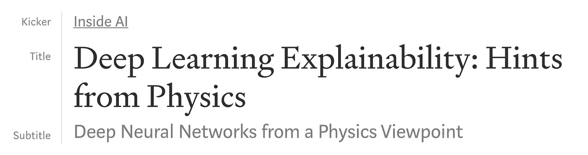
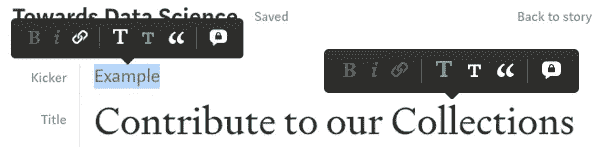

# 为我们的收藏做贡献

> 原文：<https://towardsdatascience.com/contribute-to-our-collections-94aafae1494f?source=collection_archive---------16----------------------->

## [作家指南](https://towardsdatascience.com/tagged/writers-guide)

## 将您的最新文章添加到我们的收藏中

我们的收藏收集了关于数据科学不同方面的令人兴奋的不同观点。目前，我们有五个系列可供您选择:

*   [**现实世界中的数据科学**](https://medium.com/towards-data-science/data-science-in-the-real-world/home) **。**数据科学中最紧迫的问题是什么，我们可以做些什么来解决这些问题？
*   [**数据新闻学。**](https://towardsdatascience.com/data-journalism/home) 数据科学如何帮助我们理解世界和媒体。
*   [**深入剖析**](https://medium.com/towards-data-science/in-depth-analysis/home) **。**以有趣且完整的(端到端)数据分析为特色。
*   [**内哀**](https://medium.com/towards-data-science/inside-ai/home) **。人工智能是如何工作的，它能解决什么问题，有什么潜在的风险，它对我们其他人意味着什么？**
*   [**体育分析学。**](https://towardsdatascience.com/sports-analytics/home) 数据科学与竞技的交集。

## 如何将您的帖子添加到我们的收藏中？

1.  **确保你的职位非常合适**！
2.  **给你的帖子添加标签**:“现实世界中的 DS”、“数据新闻”、“深度分析”、“Inside AI”，或者“运动”。此标签会自动将您的帖子添加到我们的收藏中。
3.  **添加一个带有收藏名称的 kicker(和一个链接)**:

## 如何添加踢球者？([看我们的视频](https://www.dropbox.com/s/oarq3mqbdn90vv0/Kicker.mov?dl=0))

1.  添加标题
2.  添加副标题(在标题下方)
3.  添加一个踢球者。这就像在你的标题上面加了一个副标题。
4.  不要忘记**将你的 kicker 链接添加到我们的收藏页面！**

干得好！