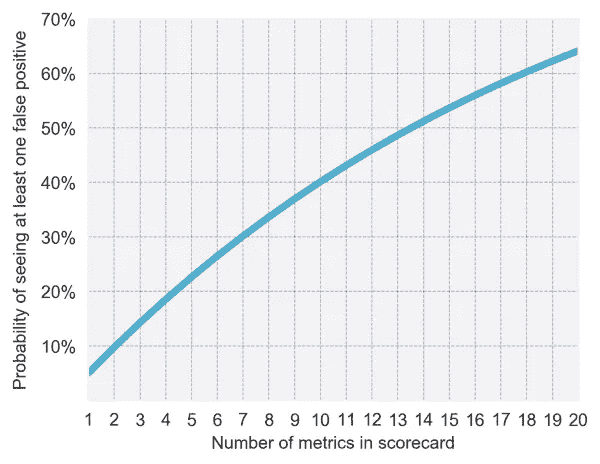

# 控制数字分析中的多重比较

> 原文：<https://towardsdatascience.com/controlling-multiple-comparisons-in-digital-analytics-92a879c4cbc6?source=collection_archive---------19----------------------->

做出的推论越多，就越有可能出现错误的推论。已经开发了几种统计技术来防止这种情况发生，允许直接比较单一和多重比较的显著性水平。”

在进行实验时，我们作为数据分析师或科学家的目标要求我们尽可能多地从我们的发现中学习。这可以通过多种方式实现，但通常我们会通过确定尽可能多的有用指标或通过执行适当的事后细分来实现。这两种技术都有助于我们以不同的方式更多地了解我们的受众。在定义指标的情况下，我们可能希望确定我们的数字平台的变化如何影响主要指标，但作为结果，变化可能如何影响我们页面的其他重要方面(例如，对健康指标的损害)。关于细分，我们可以进行后续的统计分析，以确定重要或不重要发现的路径；例如，页面性能的整体积极变化是否归因于某个设备或平台的性能？或者某个特定的人群。以上所有这些都意味着深入挖掘你的发现，并综合切实的见解来创造未来的假设。然而，这是有代价的…

Figure 1\. Possible test outcomes from experimentation, presenting both Type 1 and Type 2 errors

您在分析中包含的比较越多，您观察到第一类错误的可能性就越大，这也称为假阳性。这篇文章将首先概述在你的分析中加入比较如何影响你的统计发现，以及可以用来控制这个因素的方法。如果你在实验过程中采用了 95%的置信水平，你就接受了一个单一指标 5%的假阳性率。然而，只要您查看一个以上的指标，检测到误报的可能性就会增加。所以比较越多，假阳性越多。

Figure 2\. Visual representation taken from Skyscanner Engineering depicting the increase in false positive rate when including more metrics in analysis.

图 2 取自 Skyscanner 的 [**公开分析，他们通常在实验记分卡中采用 14 个指标。它描述了一个没有实际影响的实验(A 对 A；AA 测试)，以及它对一个指标产生显著影响的概率，作为分析中增加指标数量的函数。当在程序中采用 14 个指标时，任何一个实验都有大约 50%的机会出现一个或多个假阳性。**](/the-third-ghost-of-experimentation-multiple-comparisons-65af360169a1)

这种夸大的假阳性率的概念也可以应用于多变量测试(MVT)，在这种测试中，你要用多种条件进行试验。同样，事后细分(可通过您的分析集成将单个指标划分为设备、平台、地理和/或人口细分)也会提高您的误报率。此外, *Skyscanner* 称“如果你观察一项实验如何改变 20 个不同国家中每一个国家的一个指标，你会发现至少有一个国家在 60%的时间里受到了显著影响，即使你的实验没有任何实际效果。”进一步支持控制多重比较的需要。

幸运的是，目前存在许多统计方法，可以用来减轻多重比较问题；这通常涉及在进行分析之前调整您选择使用的显著性阈值，以便确定检测结果为阳性所需的 p 值也是实验考虑的比较次数的函数。

正如我们所知，统计假设检验是基于拒绝零假设，如果观察数据在零假设下的可能性相对较低。如果测试了多个假设，则罕见事件的机会增加，因此，错误拒绝零假设(即，犯 I 型错误)的可能性增加。因此，诸如 Bonferroni 校正之类的方法通过在 ***a/n*** 的显著性水平上测试每个单独的假设/比较来补偿上述增加，其中 ***a*** 是期望的α水平，而 ***n*** 是比较的次数。Bonferroni 校正控制着家族误差率(FWER ),即当您的实验没有真正的积极效果时，您的比较中至少有一个出现显著性的概率。FWER 是拒绝至少一个真假设的概率，即，做出至少一个假阳性发现(I 型错误)的概率。

我将在下面分解一个例子，看看你的数字分析实验会是什么样子。

您关心的是英国 3 个地区之间的单个指标的统计显著性，alpha 水平为 95%:

***n*** = 3

*= 0.05*

*因此，在应用 Bonferroni 校正时，您将测试每个地理区域/比较，如下所示:*

****一*** = 0.05/3*

*= **0.015***

*然后将该值用作校正后的 p 值，只有当测试结果小于 0.015 时，您才会认为该测试结果具有统计学显著性。这种校正后的 p 值可以很容易地纳入任何自定义电子表格或统计计算器中，用于确定分析的统计效果。*

*关于 FWER 的控制，Bonferroni 被广泛认为是控制多重比较的保守方法，如果有大量正相关的测试和/或比较。这是因为假设每个比较对于所有比较都是彼此独立的。这必然意味着所做的修正是以增加呈现假阴性(II 型错误)的概率和降低你的统计能力为代价的。然而，统计学家的普遍共识是，低估实验的真实效果比严重高估效果更好——因此，采取保守的校正比接受大量假阳性测试结果更好。*

*总之，在数字分析领域工作时，你会尽可能多地综合你的实验发现。然而，执行更精细的比较会导致确定假阳性的可能性随之增加。因此，可以在事后分析中使用 Bonferroni 校正等方法来调整 p 值，以考虑指标或实验比较的增加。尽管这种方法被广泛认为是解决多重比较的一种保守方法，但它在大量的科学实践中被使用，并且适用于实验比较之间共线性程度较低的情况。*