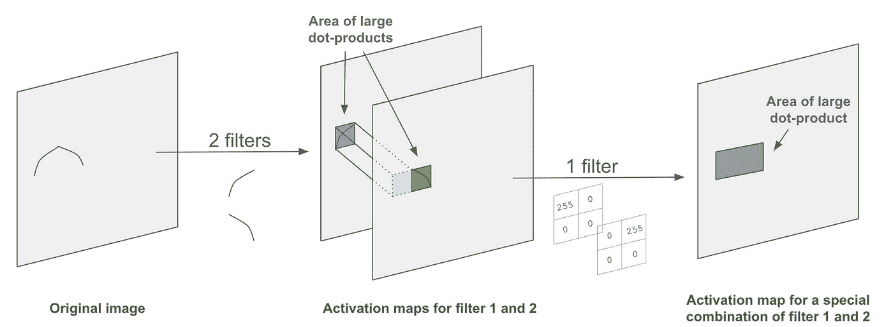

# Conv 假人网

> 原文：<https://towardsdatascience.com/conv-nets-for-dummies-a-bottom-up-approach-c1b754fb14d6?source=collection_archive---------15----------------------->

## 直观的方法

有许多很棒的在线文章解释了从初学者到高级水平的卷积神经网络(或“CNN”)。这篇文章是为初学者写的，旨在采取一种不同于大多数人的方法:自下而上地解释 CNN 的机制和系统。我的假设是，许多工程师按照解决方案被创建的顺序来学习它们:一次添加一个新功能来构建最终产品。

## 本文将分为三个部分。

*   首先，解释一下 CNN 要解决的问题。
*   第二，逐一解释 CNN 的算法(“层”)。
*   第三，这些层的使用顺序和原因。

# 第一部分:CNN 的设计初衷是什么？

计算机视觉奥林匹克是一年一度的竞赛，绰号为“图像网络挑战”(ILSVRC)。从 2010 年开始，这项任务一直是建立一个能够正确识别图像中物体的计算机程序。也就是说，如果我给你的程序一张蝴蝶的图片，它应该返回字符串“butterfly”

这个过程几乎是人脑瞬间完成的。不用我说，你已经知道上面的图像是什么了。那是因为人类看到狮子的那一刻，大脑就把它识别为一个截然不同的物体，并立刻将其归类为“狮子”。从生存的角度来考虑这些好处并不困难。ImageNet(名为“AlexNet”)的 2012 年获奖者将这种人类技能作为他们设计的基础。他们通过研究关于大脑识别物体的神经科学理论，创建了一个成功的 CNN。

那么大脑是如何把上面的图像变成“一块地里的三只狗？”我们做的一件事是识别背景的绿色和狗的棕色皮毛之间的清晰边缘。利用这个我们可以识别出狗的大致轮廓:两只耳朵伸出来，身体很长。这个轮廓内部的其他形状帮助我们确定它是一只狗而不是一只狐狸(考虑舌头、嘴和鼻子的形状等)。狗的颜色也帮助了我们。因此，假设我们想像人类一样处理识别形状的问题，我们可能想从制造一种算法开始，这种算法将识别图像中的某些形状或边缘。*这是第二部分的切入点。*

## 输入细节

对于这个问题，理解输入数据的形状是很重要的。对计算机来说，图像是一个三维(宽×高×深)矩阵，值在 0-255 之间。4K 彩色图像的尺寸为 4096×2160×3。也就是说，它的像素宽度*乘*像素高度*乘*三个颜色通道 RGB。这些值表示每个像素的每种颜色的强度。为了简化，本文将主要考虑深度为 1 的黑白图像。

A visual representation of a 6×6×3 image

# 第二部分:CNN 的层次

卷积神经网络可以分解成几个部分。这些组件可以被认为是独立的算法，通常被称为“层”首先，单独考虑各层。第 3 节将在后面讨论它们是如何结合的。有三层我们来看看 *(A，B，C)* 。

## 层 A:卷积

*正如第 1 节*中提到的，我们可能想要识别图像内部的边缘或颜色。例如，我们可能想要检测如下图所示的曲线。可以使用值矩阵来表示曲线(就像输入一样)。 ***滤镜的深度总是等于图像的深度。***

现在我们要测试图像是否包含这个形状。代表这个形状的矩阵被称为**过滤器**。它也被称为神经元或内核。让我们使用我们的滤镜来测试下面这个简单的图形:

如果我们关注与过滤器具有相同尺寸(W×H×D)的图像部分，我们可以计算图像部分值和过滤器值的点积。首先，让我们检查包含我们要测试的形状的图像区域。我们关注的区域被称为**感受野**:

现在执行过滤器和感受野之间的点积:

这个部分的点积计算为 218535，这是一个非常大的数字。如果图像中的形状与过滤器的形状不太相似，这个数字会更小。在下面的示例中，由于图像中的形状与滤镜的形状不匹配，点积计算出的值要低得多(计算出的值为 0)。

事实上，点积越大，过滤器和图像的截面越相似。因此，我们可以使用过滤器和图像部分的点积来测试特定形状的位置。获得正确的过滤器值是很重要的，因为您想要测试适当的形状。我们在 CNN 中“训练”的值正是这个:过滤器的矩阵值。在对一组图像进行训练之前，通常会随机初始化这些值。注意，过滤器的值也可以是负数。

但是我们如何存储这些信息呢？我们希望为图像中有曲线的地方保留某种形式的记录。我们如何存储左上方有一条曲线，而右侧没有？

Taken from [this](https://github.com/vdumoulin/conv_arithmetic) very helpful repo on GitHub

对于每个感受野，点积计算存储在另一个称为**激活图**的矩阵中。

它被称为*图*，因为激活图上的任何位置都将表示形状(过滤器)与实际图像的相应位置的匹配程度。换句话说，地图显示了图像中某个形状出现的位置。

***一个滤镜的激活图深度始终为 1。***

## B 层:池化

池层的目的是减少激活图的空间大小。这不仅减少了必要的计算量，而且防止了过度拟合。合用的想法很简单。我们想把大矩阵缩小成小矩阵。最常用的池技术是**最大池**。

这种方法的思想是只保留激活图中较小区域的最大值，而去掉其余的。在上面的橙色区域中，7 是最大值，因此它被保留，而 5、3 和 2 被丢弃。

## C 层:完全连接

全连接层总是卷积神经网络的最后一层。这是因为它是将图像上完成的转换关联到实际类别(如“狮子”和“鼠标”)的层。

这一层是传统的多层感知器。理解多层感知器对于从总体上理解机器学习模型很重要([在这里用图像找到一个很棒的解释！](/artificial-neural-networks-for-total-beginners-d8cd07abaae4))。CNN 的全连接层只是其应用的众多情况之一。因此，我敦促你寻找另一个更深入的教程。现在，我将重点讨论这一层的输入和输出。

**全连接层的输入**是一个值矩阵，包含某些复杂形状的位置信息。它实际上指出了这些形状在图像上的位置。

我们如何获得这种输入将在第 3 节中变得更加明显。然而，现在要记住的重要事情是，输入指示复杂图案的位置，这些复杂图案帮助我们猜测图像是由什么组成的。我们称这些复杂的模式为**可训练分类器**。模型学习寻找的确切的可训练分类器可能与上面给出的说明性例子有很大不同。

> *为什么我们不* ***只*** *使用全连接层？*

*好吧，虽然全连接层可能能够“分析”已经识别的形状的组合，但是它不能理解单个像素。这是因为单个像素与图像包含的内容无关，而复杂的形状却相关。很少有猫的图像包含轮子的形状。*

**全连接层的输出**是我们决定训练模型的每个类别的概率向量。例如，如果我们强迫一个模型将一幅图像分类为“猫”、“狮子”或“汽车”，那么输出可能是一个向量，例如[0.91，0.08，0.01]。这意味着有 91%的可能性图像是一只猫，8%是一只狮子，1%是一辆汽车。然后，我们选择最有可能的类别作为我们对该图像的“猜测”。 ***这个向量中的元素之和总是加 1。*** (如果你对为什么和多层感知器的激活功能有关感兴趣)。

简而言之，输出权重来源于图像中的可训练分类器的内容，以及它们相对于彼此的位置。这突出了一组好的图片对训练的重要性。如果模型从未从侧面看过汽车，它可能会将这样的图像误分类为不是汽车。然而，我们所做的工作意味着我们不需要从每个角度去看*。*

# **第三节:合并图层**

*有几种方法可以将第 2 节中描述的图层组合成对图像分类有用的东西。在这里，我们看看如何结合多个卷积层来识别复杂的形状，以及 CNN 中使用的第四个“层”:非线性函数。最后，我们将看看一些成功的 CNN 及其一般架构。*

在 2A 一节中，我们讨论了卷积层，并以一个简单的形状为例来测试图像。实际上，过滤器看起来有点不同。左边是一个来自 CNN 的斯坦福课程的例子。这是过滤器外观的更精确的可视化。

认识到这些模式是一个好的开始，但它们可能不会识别出什么是“狮子”或“猫”为此，我们需要用这些简单的形状构建更复杂的形状。

为了识别下面的形状，我们可以像前面一样为它创建一个过滤器。如此复杂的过滤器的问题是，它可能无法识别相似但不完全适合的形状，或者它可能会错误地触发看起来不像过滤器的形状。

更简单的过滤器可以更好地避免这些问题。因此，它们保持简单。相反，我们在一个卷积层中对图像应用多个滤波器，并且仅当它们被检测到并被单独记录在激活图中时，才在下一层中组合它们。

原始图像上的两个单独的形状(过滤器 1 和 2)在激活图中被识别为较高的值(根据点积计算)。然后，我们可以创建一个与第一层的输出深度相同的过滤器来组合这些过滤器。在上面的例子中，这个深度是 2，因为我们使用了 2 个过滤器。在其他架构中，这可能更大；这完全取决于我们在第一层使用多少过滤器。在我们的例子中，第二层的滤波器可以非常简单。我们希望通过查看激活图 1 找到形状 1 的出现，通过查看激活图 2 找到形状 2 的出现。将这些投影到 2D 图像上应该会产生它们的并排组合。因此，我们可以识别图像中具有更复杂形状的区域。

然后，这个过程会根据您的需要重复多次。重复更多次意味着网络可以学习越来越复杂的形状。目标是学习检测复杂的特征，这些特征可以成为一系列对象的**可训练分类器**。考虑以下汽车的复杂特征:

上述具体特征并不一定是参与 ILSVRC 竞争的网络所要“寻找”的。它们只是帮助我们人类理解 CNN 下正在发生的事情的可视化。

## 那么，为什么要为这个“非线性函数”而烦恼呢？

如果你熟悉其他神经网络结构，你不会对在卷积层之间使用非线性函数感到惊讶。但这是为什么呢？非线性函数有什么作用？

简单的回答就是卷积是线性变换。对此有简单的数学解释(比如[这个](https://www.quora.com/Why-do-we-need-a-non-linear-activation-function-in-a-convolutional-neural-network-The-convolution-is-already-non-linear-Shouldnt-that-already-be-enough))，如果你还不相信的话，我建议你读一读。

现在，如果我们一个接一个地执行多个线性变换，最终的过程可以简化为单个线性变换。因此，为了避免卷积层折叠成单个变换，我们可以在每个卷积之间引入非线性元素。

许多 CNN 中使用的一个成功的非线性函数是 ReLU。这是一个简单的函数“max(0，x)”，其中 x 是输入值，应用于整个矩阵的元素。它把任何负值变成 0。

## 把这些放在一起，设计 CNN 的架构

现在，您已经了解了所有的构建模块。我们(1)采取一个形象，并适用于卷积层。然后，我们(2)对输出应用非线性函数，以便(3)用另一个卷积层重复。在几个卷积和非线性对层之后，我们(4)应用汇集层以降低复杂性并避免过拟合。重复几次(步骤 1-4 ),我们已经确定了一些可训练的分类器，并且可以(6)将输出矩阵发送到完全连接的层中。它输出我们想要训练的每个类别的概率权重。该过程总结如下:

Again, taken from Stanford’s [course](http://cs231n.stanford.edu/) on CNNs

所有关于层数、超参数和它们的顺序的选择将唯一地识别一个网络。有许多开源和著名的网络，有不同的目的和成功的程度。我们已经讨论了 AlexNet，ILSVRC 2012 的获胜者。另一个专注于识别更复杂的可训练分类器的网络称为 VGG。

**就是这样！**在这一点上，我们理解了 CNN 如何解决我们在顶部确定的问题:将它以前没有见过的图像分类到主题类别中。

如果你喜欢这篇文章，请考虑给它一点掌声。这真的帮助了我，激励我去做更多！

