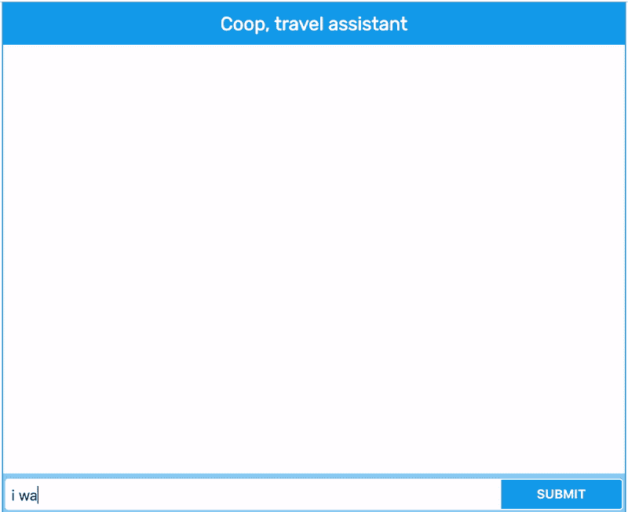
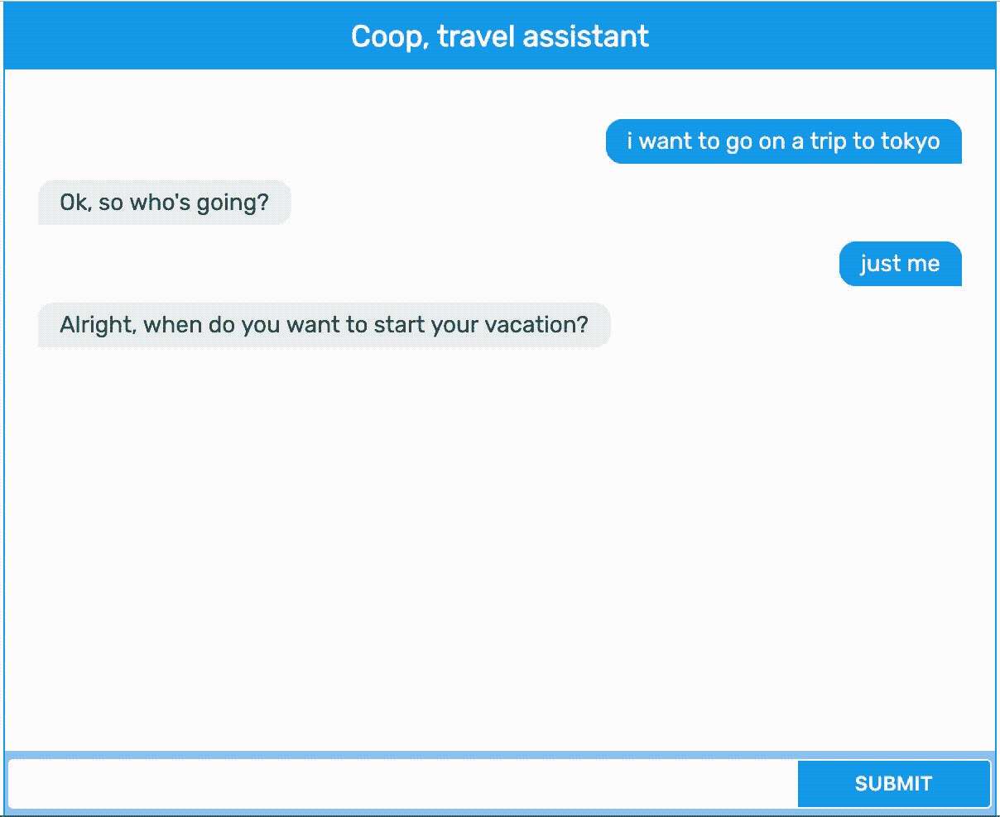
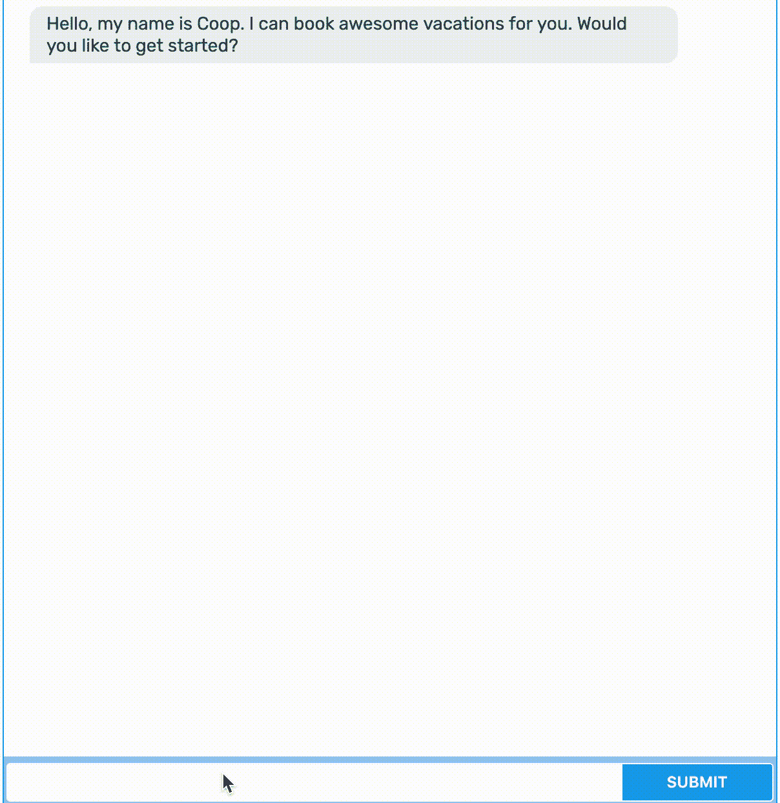
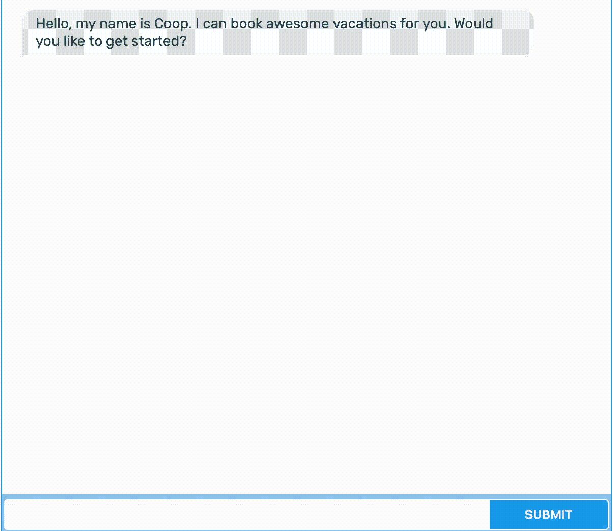

# 对话式人工智能:设计和构建上下文助手——第 2 部分

> 原文：<https://towardsdatascience.com/conversational-ai-design-build-a-contextual-assistant-part-2-80ec342e86ac?source=collection_archive---------15----------------------->


Photo by [Alex Knight](https://unsplash.com/@agkdesign?utm_source=medium&utm_medium=referral) on [Unsplash](https://unsplash.com?utm_source=medium&utm_medium=referral)

在本系列的第一部分中，我们介绍了对话式人工智能的不同成熟度，并开始使用 Rasa 构建一个旅行助手。在这篇文章中，我们将看看如何构建快乐和不快乐的对话路径，各种机器学习策略和配置来改善你的对话模型，并使用基于迁移学习的语言模型来生成自然对话。

> *Rasa 最近发布了 1.0 版本，其中他们将核心和 NLU 合并成一个包。在本文中，我们将使用 Rasa 1.0。*

# 你能做什么，库珀？

因为这个助手的主要目的，让我们把它命名为 Coop，是为了预订很棒的假期，Coop 需要来自用户的关键信息来这样做。出于本文的目的，让我们假设 Coop 只需要人数、度假目的地以及所述假期的开始和结束日期。在下一次迭代中，我们希望从用户那里提取更多的信息，包括他们的兴趣、预算、年龄、行程限制，以及我们为他们创造有计划的旅行体验所需的任何其他信息。有了这些初步的知识，让我们看看如何让 Coop 通过与用户的自然对话来收集这些信息。

# 用槽保存信息

Rasa 使用插槽来保存用户提供的信息以及其他信息。插槽，本质上是键值对，可以用来影响与用户的对话。可以通过多种方式设置插槽的值——通过 NLU、互动卡和动作。Rasa 将此定义为**槽填充**。插槽在“domain.yml”文件中定义。每个插槽都有一个名称、类型和一个可选的初始值。下面是 Coop 的 domain.yml 文件的一个片段:

```
...
slots:
  enddate:
    type: unfeaturized
  location:
    type: unfeaturized
  num_people:
    type: unfeaturized
  startdate:
    type: unfeaturized
...
```

注意，我们将每个槽的类型设置为“未授权”,因为我们不希望槽值影响我们的对话流。

# 用表单填充插槽

为了代表用户执行操作，就像我们试图用 Coop 做的那样，我们需要填充多个连续的槽或关键信息。我们可以使用 FormAction。FormAction 本质上是一个 python 类。它获取需要填充的空位或需要回答的问题的列表，并向用户询问所述信息以填充每个空位。请注意，FormAction 只要求用户提供填充尚未设置的槽的信息。

让我们来看看快乐之路。一条愉快的道路是，上下文助手能够从用户那里不受干扰地收集它需要的信息。换句话说，用户回答问题时不会偏离他们的路径，如下所示。



a happy path

为了启用 FormAction 机制，您需要将“FormPolicy”添加到通常名为“config.yml”的配置文件中:

```
...
policies:
  - name: FormPolicy
...
```

接下来，让我们定义我们的自定义表单类:

```
class BookingForm(FormAction):
    def name(self):
        # type: () -> Text
        """Unique identifier of the form"""
        return "booking_form" @staticmethod
    def required_slots(tracker: Tracker) -> List[Text]:
        """A list of required slots that the form has to fill""" return ["num_people", "location", "startdate", "enddate"] def submit(self,
               dispatcher: CollectingDispatcher,
               tracker: Tracker,
               domain: Dict[Text, Any]) -> List[Dict]:
        """Define what the form has to do
            after all required slots are filled""" dispatcher.utter_template('utter_send_email', tracker)
        return []
```

从上面的代码片段可以看出，我们的自定义表单类应该定义三个方法——name、required_slots 和 submit。这些方法是不言自明的。

现在让我们告诉我们的模型调用预订表单动作。打开 stories.md 文件，添加一个或多个快乐之路故事:

```
...
* request_vacation
    - booking_form
    - form{"name": "booking_form"}
    - form{"name": null}
...
```

# 插槽和实体，最好的关系类型

我们在 Coop 中定义了几个有趣的插槽。“位置”槽用于保存关于用户度假目的地的信息。我们还定义了一个同名的实体。当 Rasa NLU 识别用户消息中的“位置”实体时，它将填充“位置”槽。为了让它能够这样做，我们需要训练 NLU 提取位置实体。虽然这非常令人兴奋，但训练 NLU 模型来识别通用实体(如位置)是一个耗时的过程，需要大量数据。这就是 Rasa NLU 管道的开箱即用“SpacyEntityExtractor”组件拯救我们的地方。这个预先训练的组件是一个[命名实体识别器](https://spacy.io/api/annotation#named-entities)，它识别各种常见的实体(称为维度),如个人、组织、城市和州。

让我们来看看如何将这个组件挂接到我们的位置槽中。我们首先向 NLU 管道添加“SpacyEntityExtractor”组件。编辑“config.yml”文件。

```
language: en
pipeline:
...
- name: "SpacyEntityExtractor"
  dimensions: ["GPE", "LOC"]
```

Rasa 在 FormAction 类中提供了一个名为“slot_mappings”的方法，可用于进一步配置填充插槽的方式。在我们的例子中，我们可以使用这种方法来确保“位置”槽按以下顺序填充:

1.  使用由我们的 NLU 模型识别的“位置”实体
2.  如果第 1 步失败，使用由“SpacyEntityExtractor”标识的“GPE”维度
3.  如果第 2 步失败，使用由“SpacyEntityExtractor”标识的“LOC”维度

```
def slot_mappings(self):
        # type: () -> Dict[Text: Union[Dict, List[Dict]]]
        """A dictionary to map required slots to
            - an extracted entity
            - intent: value pairs
            - a whole message
            or a list of them, where a first match will be picked""" return {"location": [self.from_entity(entity="location"),
                         self.from_entity(entity="GPE"),
                         self.from_entity(entity="LOC")]}
```

你可以在这里阅读更多关于预定义函数[的信息。](http://rasa.com/docs/rasa/core/forms/#custom-slot-mappings)

Coop 域中其他有趣的槽是“startdate”和“enddate”。顾名思义，这些时间段代表用户对假期开始和结束日期的选择。我们可以使用“DucklingHTTPExtractor”组件，而不是训练我们的 NLU 模型来识别和提取这些数据，并在此过程中潜在地解决实体歧义。这个预训练组件是一个[命名实体识别器](https://duckling.wit.ai/#getting-started)，它识别各种常见的实体，如时间、距离和数字。类似于我们如何配置“SpacyEntityExtractor”，应该将“DucklingHTTPExtractor”组件添加到我们的 NLU 管道中。编辑“config.yml”文件。

```
language: en
pipeline:
...
- name: "DucklingHTTPExtractor"
  url: [http://localhost:8000](http://localhost:8000)
  dimensions: ["time", "number", "amount-of-money", "distance"]
```

从上面的配置可以看出，“DucklingHTTPExtractor”应该在指定的主机和端口上运行。你可以用 docker 来运行小鸭服务。

请注意，FormAction 类允许我们定义自定义验证，用于验证用户提供的信息。例如，我们希望确保开始日期早于结束日期。这些验证方法应该根据约定来命名。如果您有一个名为“enddate”的 slot，那么您希望定义一个名为“validate_enddate”的方法，以便 Rasa 调用它。

```
def validate_enddate(self,
                     value: Text,
                     dispatcher: CollectingDispatcher,
                     tracker: Tracker,
                     domain: Dict[Text, Any]) -> Optional[Text]:
    """Ensure that the start date is before the end date."""
    try:
        startdate = tracker.get_slot("startdate")
        startdate_obj = dateutil.parser.parse(startdate)
        enddate_obj = dateutil.parser.parse(value) if startdate_obj < enddate_obj:
            return value
        else:
            dispatcher.utter_template('utter_invalid_date', tracker)
            # validation failed, set slot to None
            return None
    except:
        print("log error")
        return None
```



write conversation that’s relaxed and informal

# 不愉快的道路是规则，而不是例外

格式操作对于从用户那里收集信息和代表用户执行操作非常有用。但是，正如你所知道的，用户行为是不可预测的，对话是混乱的。你可以用 30，000 种不同的方式询问天气；我最喜欢的方式之一是当人们说“今天会下倾盆大雨吗？”用户很少不离题地提供所需的信息，参与闲聊，改变主意，纠正他们的答案，问后续问题等等——如果你正在构建强大的对话式人工智能，所有这些都是有效的，预期的，需要处理的。这些偏离被称为不愉快的道路。我强烈推荐通过 CLI 使用交互式学习来训练您的模型处理不愉快的路径。

以下是在交互模式下运行 Rasa 的命令:

```
rasa interactive --endpoints endpoints.yml
```

完成后，您可以保存训练数据并重新训练您的模型。这里有一个不愉快的道路故事的例子。

```
* request_vacation
    - booking_form
    - form{"name": "booking_form"}
    - slot{"requested_slot": "num_people"}
...
* form: inform{"location": "paris", "GPE": "Paris"}
    - slot{"location": "paris"}
    - form: booking_form
    - slot{"location": "paris"}
    - slot{"requested_slot": "startdate"}
* correct{"num_people": "2"}
    - slot{"num_people": "2"}
    - action_correct
    - booking_form
    - slot{"requested_slot": "startdate"}
* form: inform{"time": "2019-07-04T00:00:00.000-07:00"}
...
```

Rasa 提供了多种策略，可用于配置和培训其核心对话管理系统。“嵌入”策略，也称为循环嵌入对话策略(REDP)，可用于有效地处理不愉快的路径。此外，它还提供了可用于微调模型的超参数。你可以在这里阅读更多关于 REDP 的信息。

我对 Coop 使用了嵌入策略。

```
...
policies:
  - name: EmbeddingPolicy
    epochs: 2000
    attn_shift_range: 5
...
```

现在，让我们来看看一条涉及纠正和解释的不愉快的道路。更正是指用户对之前的回答或陈述进行修改。例如，如果他们打错了电话号码并希望更正它。当用户想知道助手的问题背后的原因时，他们会给出一个解释。



powerful conversational AI that can handle unpredictable behavior

在上面的例子中，注意 Coop 是如何引导谈话回到手边的主题的。对话模型学习处理更正，并解释为什么它需要某些信息，本质上是将用户带回到快乐的道路上。

# NLG 是超级大国

自然语言处理(NLP)有两个重要领域与对话式人工智能有关。首先，有试图理解用户所说的方面；用户的意图是什么？第二，以自然和对话的方式生成和响应用户。自然语言生成(NLG)的最终目标是教会模型将结构化数据转化为自然语言，然后我们可以使用自然语言在对话中回应用户。

诚然，你可以创建人物角色，写出精彩的对话，让你的助手听起来像是在自然地交谈。但那可能需要写很多故事和规则。虽然规则是伟大的、稳定的和可预测的，但它们需要大量的工程设计，并且难以扩展和维护。他们也缺乏你在人类对话中发现的自发性和创造性。

通过用数据和它需要生成的语言的例子训练大规模无监督语言模型，该模型最终形成了自己的规则，知道它应该做什么，并有更多的自由来发挥创造力。我调整了一个现有的基于迁移学习的语言模型来生成闲聊。有了更多的例子和数据，这个模型可以生成自然语言来概括文本和回答问题，而不需要任何特定的任务训练。



NLG aka computer generated chitchat

在上面的例子中，请注意 Coop 如何在用户聊天时不断引导他们回到快乐的道路上。对话模型学会处理狭义和广义的上下文，忽略多余的信息。

# 但是 C 代表对话

写好对话对对话式人工智能至关重要。在你向外界发布你的语境助手之前，除了拥有高性能的 NLG 之外，你还想投资写一份清晰简洁的文案，它要有正确的语调、相关的语境方言、能引起你的观众共鸣的人物角色。良好的对话可以取悦用户，建立品牌忠诚度，并确保高用户保留率。您还想考虑为用户提供菜单按钮和快速回复来点击和触发某些事件，以尽量减少用户输入。它们是建议选项和引导用户走上快乐之路的好方法。

为对话式人工智能撰写文案是一件值得关注的事情，超出了本文的范围。点击阅读更多关于编写机器人副本[的信息。Coop 目前没有太多的对话或 UI 选项，但随着我们收集真实数据，我们将尝试理解用户行为，在与真实用户交互时进一步调整我们的自定义 NLG 模型，专注于编写好的文案，并在接下来的几次迭代中不断改进。](https://discover.bot/bot-talk/why-good-writing-is-central-to-conversational-ai/)

# 下一步是什么

在本系列的最后一部分，我们将讨论可以用来测试和评估我们的模型的各种测试策略。我们还将讨论将 Coop 部署到生产环境中，之后我们将进行监控并不断改进。