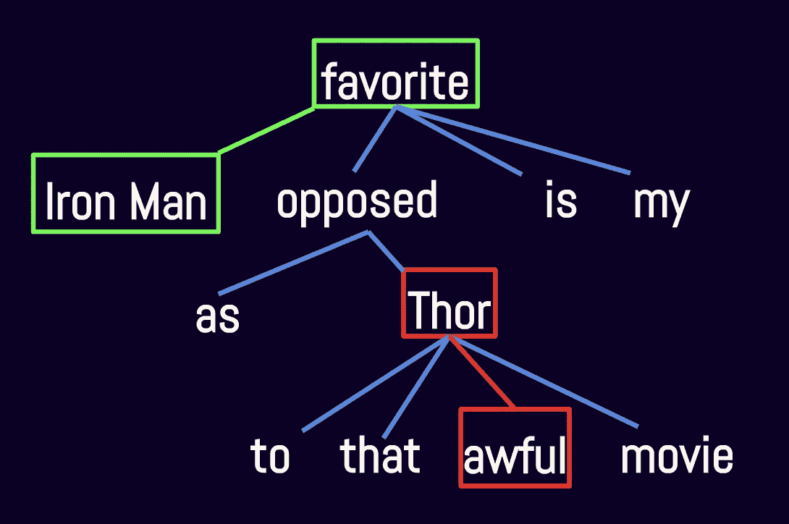

# 对话情感分析

> 原文：<https://towardsdatascience.com/conversational-sentiment-analysis-52eabd20155b?source=collection_archive---------14----------------------->

## 用于确定对命名实体的情感的方法

# 介绍

我最近制作了一个电影推荐器，它将用户写的关于喜欢和/或不喜欢的电影的文章作为输入。在这个项目开始的时候，我认为决定用户喜欢和不喜欢哪部电影很简单。毕竟，用文字来确定某人喜欢还是不喜欢一部电影，似乎并不太雄心勃勃。在 python 中，有各种各样的包可用于情感分析，因此必须有现成的东西来完成这项工作。

事实证明，使用文本来确定某人是喜欢还是不喜欢一部电影，或者任何命名的实体，是非常复杂的。这在对话环境中尤其如此，在这种环境中，结构是自由的，很少有假设可言。将对话环境与产品评论环境进行比较有助于说明这一点。

## 产品评论中的情感

对于产品评论，通常最重要的是对被评论产品的看法，通常产品是主要话题。因此，有可能做出一个简化的假设，即评论的总体情绪反映了评论对产品的情绪。使用这种假设，有可能在相对较少的预处理的情况下将文本输入到情感分析包中，并获得良好的结果。因此，产品评论的情感分析是一个常见的 NLP 介绍项目。

Product reviews also happen to be conveniently labeled with user assigned scores

## 谈话中的情感

然而，在交谈中讨论产品时，通常会对许多产品进行比较和对比。此外，一个人对每种产品的看法可能大相径庭。在交谈中，我们能够为产品评论做出的简化假设并不成立。即使将对话文本分成句子也是不够的，因为在同一个句子中提到许多产品是很常见的。以这句话为例，“我喜欢汉堡包，但讨厌泡菜。”显然，这句话的总体情绪(净中性与高极性)没有准确反映对汉堡包或泡菜的情绪。需要对语义结构进行更深入的研究，以便始终如一地正确分配情感。

经过一番搜索，我发现目前还没有可以开箱即用地进行实体级情感分析的软件包。事实上，这似乎仍然是一个活跃的研究领域。在这篇博文的其余部分，我将回顾我自己开发的一些方法来执行实体级情感分析。

# 密码

这篇博文的相关代码可以在我的电影推荐项目的链接的 [GitHub](https://github.com/alexmuhr/Natural-Language-Movie-Recommendations.git) repo 文件 entity _ perspective . py 中找到。那些希望深入研究的人可以看看 GitHub，或者克隆它供自己使用。查看我的[电影推荐应用](http://18.218.199.101/)，了解这些方法的应用示例。

该代码利用了 NLTK 中的 VADER 情感分析和斯坦福依赖解析器。要使用我的代码，你需要在你的机器上安装 NLTK 和 VADER 情绪。此外，Stanford dependency parser 需要一个 Java 安装和一些模型文件，这些文件可以从[这里](https://nlp.stanford.edu/software/stanford-parser-full-2015-04-20.zip)下载。然后，必须在 entity _ impression . py 文件中提供 Java 安装和模型文件的路径。

Where paths to Java installation and Stanford Dependency Parser .jar files must be inserted

我开发的功能是为了在句子层面上分析对实体的情感。因此，使用这些功能分析文档或文档集的第一步是将每个文档分割成单独的句子。

# 拆分方法

在最简单的情况下，一个句子仅表达一种情感，并且该句子的整体情感反映了对任何命名实体的情感。例如，“我喜欢小猫和小狗”表达了对小猫和小狗同样积极的情感。不幸的是，大多数句子都比这复杂一点。

出于比较的目的，句子通常包括对多个命名实体的引用。在这些情况下，在比较时分割句子并在每个分割中分析情感通常足以正确地将情感分配给每个实体。这就是拆分法。回到前面的例子“我喜欢汉堡包，但讨厌泡菜”，在这里使用 split 方法将基于“我喜欢汉堡包”将情感分配给“汉堡包”，基于“讨厌泡菜”将情感分配给“泡菜”。

我编写的实现 split 方法的函数相对简单。代码执行以下步骤:1)查找句子中的比较单词，2)在这些单词处拆分句子，3)查找哪些拆分包含命名实体，然后最后 4)确定每个拆分的情感。使用函数 compile _ split _ perspective 调用 split 方法。

# 邻域法

将情感分配给命名实体的另一种方式是通过查看出现在附近的单词。想想这句话“我爱篮球，尽管裁判很糟糕。”对“篮球”来说，最能表达感情的词是“爱”，对“裁判”来说，最能表达感情的词是“糟糕”。

对于邻域法，我编写的函数会找到一个句子中一个实体的所有实例，然后查看出现在附近的单词，直到确定情感。传播参数控制算法搜索实体的距离，衰减参数控制对远处的单词应用多少惩罚。传播和衰减参数的微调有助于在特定环境下优化性能。函数 compile _ neighborhood _ 情操调用这个方法。

# 树形方法

我要讨论的最后一个方法是树方法。树方法实际上非常类似于邻域方法。不同之处在于，不是查看出现在书面句子中的命名实体附近的单词，而是创建句子的依存关系树，并且使用出现在依存关系树中的命名实体附近的单词来建立情感。

在依存关系树中，除了句子的“根”以外，句子中的每个单词都被分配一个“父”单词。父词的子词被称为“依赖于”父词。形容词通常出现在依存关系树中，靠近它们所描述的名词，通常作为直系父母或子女。为句子创建依存关系树的行为被称为“依存关系解析”。在我的代码中，我使用了斯坦福依赖解析器。

想想这句话，“与那部糟糕的电影《雷神》不同，钢铁侠是我的最爱”。分裂法和邻域法都不能正确地将正面情绪分配给“钢铁侠”。但是，看一下这句话的依存树。该树正确地显示了“钢铁侠”与“喜爱”密切相关，“雷神”与“可怕”密切相关。

与邻域法类似，我的代码使用传播和衰减参数来控制算法在树中搜索的范围。我还创建了一个 DependencyTreeDict 类，它使用依赖解析器输出将单词映射到节点、父节点和子节点。该类包含根据单词在树中的关系轻松访问单词的方法。使用函数 compile _ tree _ perspective 调用通过 tree 方法编译情感。

# 组装

上述每种方法通常都会返回正确的结果，但在某些情况下会失败。幸运的是，每种方法都有其独特的优点和缺点。通过将这三种方法集成为一种，有可能创建一个更加健壮的算法。这是通过取三种方法的平均结果来实现的。就像人一样，这些方法一起使用比单独使用更有效。在代码中，所有三个方法的集合都是用函数 compile _ ensemble _ sensation 创建的。

# 结论

具有自由形式结构的对话环境中的情感分析很难做好。通常有许多感兴趣的命名实体，了解某人对每个实体的感觉是很有趣的。我已经描述了一些可以用来给命名实体分配情感的方法。这些方法可以通过导入我的 [Github](https://github.com/alexmuhr/Natural-Language-Movie-Recommendations.git) 上的 entity _ opinion . py 文件在你的项目中快速实现，不需要模型训练！我希望这有所帮助，并希望听到您的反馈。