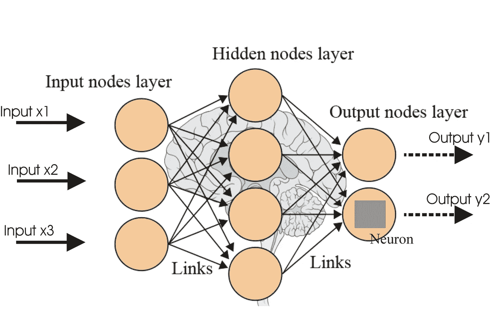

# 将具有多个输出的深度学习模型从 PyTorch 转换为 TensorFlow

> 原文：<https://towardsdatascience.com/converting-a-deep-learning-model-with-multiple-outputs-from-pytorch-to-tensorflow-a2d27a8e44f4?source=collection_archive---------10----------------------->

Reference: [https://i.stack.imgur.com/4YBht.jpg](https://i.stack.imgur.com/4YBht.jpg)

**简介**

前段时间，我写了一篇[文章](/converting-a-simple-deep-learning-model-from-pytorch-to-tensorflow-b6b353351f5d)，描述了如何使用 ONNX 将一个简单的深度学习模型从 PyTorch 转换为 TensorFlow。虽然这适用于许多用例，但在某些情况下，您需要转换具有多个输出的模型(例如，对象检测模型)。在这里，我将展示如何将一个具有多个输出的模型从 PyTorch 转换为 TensorFlow。

整个转换过程的许多部分重复了我在上一篇文章中提到的内容，所以我将只提到为转换一个具有多个输出的模型而添加或修改的部分。

**生成和准备数据**

数据的主要区别在于现在有两组不同的实际输出，一组是连续变量，另一组是二进制形式。此外，我定义了两个函数来为数据生成两种不同类型的输出。下面的代码片段说明了生成数据并为模型训练和评估做准备的过程。

**定义、培训和评估示例模型**

所定义的模型类与上一篇文章中的非常相似，除了 *forward()* 方法返回两个输出张量，而不是一个。还为输出定义了两种不同的损失对象，连续输出的均方误差损失和二进制输出的二进制交叉熵损失。下面的代码片段显示了模型、损失和优化器是如何定义的。

训练和评估过程也是类似的，除了在执行反向传播和模型权重更新之前，必须计算两个输出的损失并将其相加。下面的代码片段包含了训练和评估模型的过程。

**将模型转换为张量流**

将模型导出到*。onnx* 格式也很相似，只是应该给输出头分配不同的名称。在本例中，名称“output1”和“output2”被分配给两个输出头，如下面的代码片段所示。

**在 TensorFlow 中做推理**

TensorFlow 中的推理步骤也与上一篇文章类似，只是做了一些小的改动，得到了两个输出，而不是一个，如下所示。输入和输出的占位符名称可以用我在[上一篇文章](/converting-a-simple-deep-learning-model-from-pytorch-to-tensorflow-b6b353351f5d)中提到的相同方法找到。

如果一切顺利， *print('output1:'，output1)* 和 *print('output2:'，output2)* 的结果应该与前面步骤中 *print('dummy_output_1:'，dummy_output_1)* 和 *print('dummy_output_1:'，dummy_output_1)* 的结果相匹配。

**结论**

将具有多个输出的模型从 PyTorch 转换到 TensorFlow 可能比对具有单个输出的简单模型执行相同的过程更具挑战性，但仍然可以完成。我希望这篇文章能让您对使用 ONNX 转换更复杂的模型更有信心。

包含所有代码的 Jupyter 笔记本可以在这里找到。