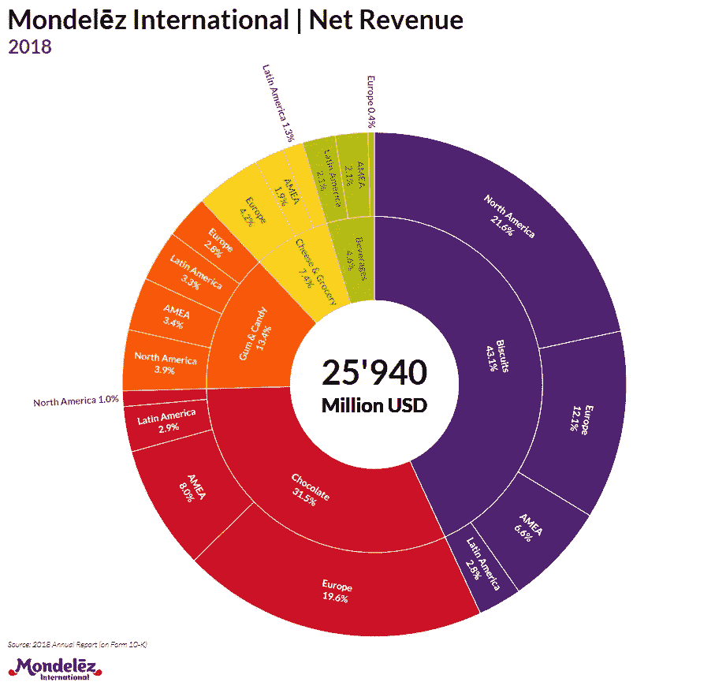

# 将 D3.js 转换为 PDF 到 PowerPoint

> 原文：<https://towardsdatascience.com/converting-d3-js-to-pdf-to-powerpoint-e98b15938bca?source=collection_archive---------16----------------------->

## 在商业报告中使用 D3.js 可视化的简单方法

在 D3.js 中创建了一个漂亮的可视化之后，我经常从我的营销同事那里收到同样的问题:*你能给我发一份这个的幻灯片吗？*。我通常解释说，这是一个程序化的图表，类似于一个网站，不幸的是，它不可能放在 PowerPoint 幻灯片上。到目前为止，我最好的建议是使用微软的 snipping 工具。但是我最近发现了一个非常有效的解决方案。

所以在我们开始之前，我们当然需要一个 D3.js 可视化。为此我制作了一张[旭日图](https://github.com/gregorhesse/D3.js_sunburst)，展示了 2018 年蒙德勒兹[年度净收入](https://www.mondelezinternational.com/investors/investing-in-us/annual-reports)。这是一个非常有趣的图表。正如我们所见，他们 43.1%的净收入来自奥利奥等饼干。仅北美就占了这些销售额的 50%。那真的有很多饼干。



所以让我们把这种形象化的东西转化成我们可以在 PowerPoint 幻灯片中使用的东西。我们要做的第一件事是将带有 D3.js 可视化的 html 文件转换成 PDF。为此，我们只需要 *PhantomJS* ，一点 JavaScript 和一行批处理文件。这只需要三分钟。首先，我们下载 [*PhantomJS*](http://phantomjs.org/download.html) 并将 ZIP 文件解压到我们喜欢的文件夹中，例如 *C:/PhantomJS/* 。无需安装。其次，我们下载 [*rasterize.js*](https://github.com/ariya/phantomjs/blob/master/examples/rasterize.js) 脚本，放入我们的*sunburst.html*文件所在的文件夹。现在，我们打开编辑器并键入

```
C:/PhantomJS/bin/phantomjs rasterize.js sunburst.html sunburst.pdf
```

我们将这个文件保存为批处理文件，例如 *convert.bat* 。当运行批处理文件时，我们可以看到一个名为*sunburst.pdf*的新文件会在我们的文件夹中弹出。我们可能想在 *rasterize.js* 脚本的最开始微调页面宽度和高度以及页边距。对于我们的旭日图，我们选择了:

这已经很方便了。我们的同事已经可以用 PDF 比依赖于几个 JavaScript 包和 JSON 文件的 HTML 文件做更多的事情。

下一步是将我们新生成的 PDF 文件转换成可以在 PowerPoint 中使用的文件。记住，这里的关键词当然是*无损*。我们希望有清晰的形状和文本，否则我们可能会坚持使用剪切工具。对于下一步，我们想使用 [*Inkscape*](https://inkscape.org/release/) 。安装完成后，我们只需编辑之前的批处理文件并添加以下行:

```
"C:/.../Inkscape/inkscape" -f=sunburst.pdf --export-emf=sunburst.emf
```

只要我们现在运行批处理文件，我们的 PDF 就会被转换成 EMF 文件。EMF 是 PowerPoint 的原生矢量格式，其作用方式类似于 SVG 文件。这意味着我们现在可以打开我们的 PowerPoint 演示文稿，并将这个新生成的 EMF 作为图片插入。形状和文本是清晰的，我们甚至可以取消可视化分组和修改单个组件。

我相信你的同事会喜欢这个的！