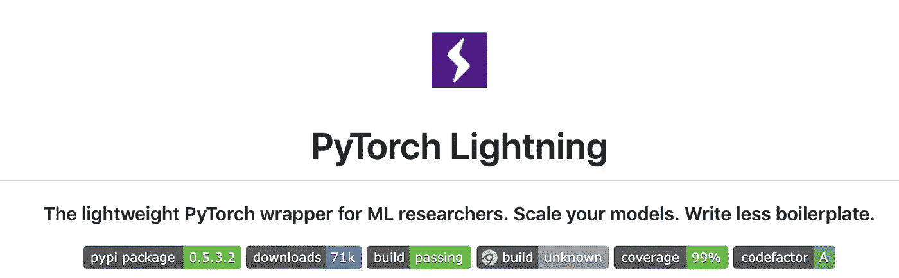

# 从喀拉斯转化为 PyTorch 闪电

> 原文：<https://towardsdatascience.com/converting-from-keras-to-pytorch-lightning-be40326d7b7d?source=collection_archive---------6----------------------->


Photo By: [Nicole Crank](https://nicolecrank.com/are-you-enjoying-the-journey/)

在本教程中，我们将把一个 [Keras](https://www.google.com/search?q=keras&oq=keras&aqs=chrome..69i57j0l3j69i60j69i65.1983j0j7&sourceid=chrome&ie=UTF-8) 模型转换成一个 [PyTorch Lightning](https://github.com/PyTorchLightning/pytorch-lightning) 模型，为你的深度学习忍者技能增加另一项能力。

Keras 为 Tensorflow 提供了一个极好的高级接口。现在，Keras 用户可以通过一个类似的名为 PyTorch Lightning 的高级界面试用 PyTorch。

然而，Lightning 与 Keras 的不同之处在于，与其说它是一个框架，不如说它是 PyTorch 的风格指南，它为用户(研究人员、学生、制作团队)提供了尝试疯狂想法的终极灵活性，而不必学习另一个框架，同时自动化掉所有的工程细节。

Lightning 与 Keras 的不同之处在于:

1.  它不是一个框架，更像是一个风格指南。
2.  Lightning 没有隐藏网络和优化设计的细节。
3.  Lightning 自动化了所有工程，如提前停止、多 GPU 训练、多节点训练等…
4.  Lightning 为研究人员和生产团队提供了极大的灵活性，他们可能需要跨多个 GPU 进行负采样或建立自己的分布式环境。

# 为什么要学 PyTorch 闪电？

根据您团队的需求，能够同时使用 Tensorflow 和 PyTorch 是非常有用的。Lightning 的用户喜欢这个框架的灵活性。他们可以让事情变得非常简单，或者将训练行为修改为如何完成后退的步骤。

这种简单性和最大复杂性的平衡(对于那些需要它的人来说)使得 Lightning 成为一个独特的框架，使得用 PyTorch 进行生产和原型设计变得非常容易。

事实上，它甚至使深度学习研究更具可重复性(查看 [NeurIPS 可重复性挑战](https://reproducibility-challenge.github.io/neurips2019/resources/))！

# 你好，在喀拉斯的 MNIST


要了解如何转换项目的核心，让我们看看典型的 MNIST·克雷斯的例子。

Source: [Keras documentation](https://keras.io/examples/mnist_cnn/)

这段代码可以分成几个部分。

**第一节:进口**

**第二部分:数据加载**

**第 3 节:模型定义**

**第四节:** **培训**

**第 5 节:测试**

上面的每个部分都有一个 PyTorch 闪电的等价物。但是在 Lightning 中，代码是在一个特定的接口中构建的，其中每个函数负责上面的一个部分。

# **照明模块**



每一个研究想法都在不同的[照明模块](https://pytorch-lightning.readthedocs.io/en/0.6.0/lightning-module.html)中实现。这是与 LightningModule 相同的 Keras 示例。

 [## Lightning module-py torch-Lightning 0 . 6 . 0 文档

### LightningModule 是 torch.nn.Module 的严格超类，但它提供了一个接口来标准化“成分”…

py torch-lightning . readthedocs . io](https://pytorch-lightning.readthedocs.io/en/0.6.0/lightning-module.html) 

虽然表面上看起来更冗长，但是增加的行让您可以更深入地控制正在发生的事情。请注意以下事项:

1.  通过 PyTorch 的美丽，现在你可以在前进的步骤中调试模型的流程。


事实上，您甚至可以通过改变调试器中的输入来尝试在**实时**中进行实验。在这种情况下，我们只想看看第二层之后的维度会发生什么，所以在调试器中，我们提供了一个张量，其中包含我们想要测试的维度。


2.训练步骤、验证步骤和测试步骤中发生的事情是分离的。例如，我们可以计算验证步骤的准确性，但不能计算训练步骤的准确性。

如果我们在做机器翻译之类的事情，我们可以在验证步骤中进行波束搜索来生成样本。

3.数据加载被很好地抽象在数据加载器之后。

4.代码是标准的！如果一个项目使用了 Lightning，您可以通过查看任何项目的培训步骤来了解正在发生的事情的核心！这是朝着帮助实现更多可复制的深度学习代码迈出的令人难以置信的一步。

5.这个代码是纯 PyTorch！上面没有抽象…这意味着你可以随心所欲地编写代码。

总之，LightningModule 集合了我们构建深度学习系统所需的核心成分:

1.  计算(初始化，向前)。
2.  训练循环(training_step)中会发生什么。
3.  验证循环中发生了什么(validation_step)。
4.  测试循环中发生了什么(test_step)。
5.  要使用的优化器(configure _ optimizers)。
6.  要使用的数据(训练、测试、评估数据加载器)。

# 运动鞋

请注意，LightningModule 没有任何关于 GPU 或 16 位精度或早期停止或日志记录或任何类似的东西…所有这些都是由培训师自动处理的。

这就是训练这个模型的全部！培训师为您处理所有事情，包括:

1.  提前停止
2.  自动记录到 tensorboard(或 comet、mlflow 等)
3.  自动检查点


如果你照原样运行训练器，你会注意到一个名为 ***lightning_logs*** 的文件夹，你可以从中运行一个 tensorboard 会话:)

```
tensorboard — logdir=./lightning_logs
```


所有这些都是免费的！

事实上，Lightning 添加了一个漂亮的文本窗口，向您显示在这个特定的实验中使用了哪些参数。只要将 hparams 参数传递给 LightningModule，您就可以免费获得它。


现在，模型的每次运行都确切地知道它使用了什么超参数！

# GPU 培训

闪电让 GPU 和多 GPU 训练变得琐碎。例如，如果您想在多个 GPU 上训练上述示例，只需向训练器添加以下标志:

使用上述标志将在 4 个 GPU 上运行该模型。

如果您想在 16 个 GPU 上运行，其中有 4 台机器，每台机器有 4 个 GPU，请将教练标志更改为:

并提交以下 SLURM 作业:

# 高级用途

对于学生，以及对深度学习有所了解的人来说，Lightning 非常容易使用。然而，对于高级用户，如研究人员和生产团队，Lightning 给你更多的控制。

例如，您可以这样做:

1.  [渐变裁剪](https://pytorch-lightning.readthedocs.io/en/latest/LightningModule/properties/#gradient_clip_val)

```
Trainer(gradient_clip_val=2.0)
```

2.[累积梯度](https://pytorch-lightning.readthedocs.io/en/latest/Trainer/Training%20Loop/)

```
Trainer(accumulate_grad_batches=12)
```

3.16 位精度

```
Trainer(use_amp=True)
```

4.[截断反向传播通过时间](https://pytorch-lightning.readthedocs.io/en/latest/Trainer/Training%20Loop/#truncated-backpropagation-through-time)

```
Trainer(truncated_bptt_steps=3)
```

还有关于 [42 更高级的特性](https://github.com/williamFalcon/pytorch-lightning#lightning-automates-all-of-the-following-each-is-also-configurable) …

# 高级使用++语言

但是也许你需要更多的灵活性。在这种情况下，您可以这样做:

1.  [改变后退步骤的完成方式](https://pytorch-lightning.readthedocs.io/en/latest/Trainer/hooks/#backward)。
2.  [改变 16 位的初始化方式](https://pytorch-lightning.readthedocs.io/en/latest/Trainer/hooks/#configure_apex)。
3.  [添加您自己的分布式培训方式。](https://pytorch-lightning.readthedocs.io/en/latest/Trainer/hooks/#configure_ddp)
4.  [添加学习率调度器](https://williamfalcon.github.io/pytorch-lightning/LightningModule/RequiredTrainerInterface/#configure_optimizers)。
5.  [使用多个优化器](https://williamfalcon.github.io/pytorch-lightning/LightningModule/RequiredTrainerInterface/#configure_optimizers)。
6.  更改优化器更新的频率。

还有很多很多东西。在引擎盖下，Lightning 中的所有东西都被[实现为可以被用户覆盖的钩子](https://williamfalcon.github.io/pytorch-lightning/Trainer/hooks/)。这使得**培训的每个**方面都具有高度的可配置性——这正是研究或生产团队需要的灵活性。

# 摘要

本教程解释了如何将 Keras 模型转换为 PyTorch Lightning，以供想要尝试 PyTorch 或寻求更大灵活性的用户使用。

闪电的关键在于:

1.  对于 PyTorch 来说，它不是一个框架，而更像是一个风格指南。这是因为闪电暴露了核心 PyTorch，而不是将其抽象掉。
2.  通过使用 Lightning 格式，您可以消除工程上的复杂性，并使您的代码具有可复制性。
3.  对于新用户来说，Lightning 可能非常简单，但对于即使是最高级的研究团队来说，它也非常灵活。
4.  虽然我们展示了一个 MNIST 的例子，但是 Lightning 可以实现任意复杂的方法。[看看这个可乐罐](https://colab.research.google.com/drive/1F_RNcHzTfFuQf-LeKvSlud6x7jXYkG31#scrollTo=HOk9c4_35FKg)！