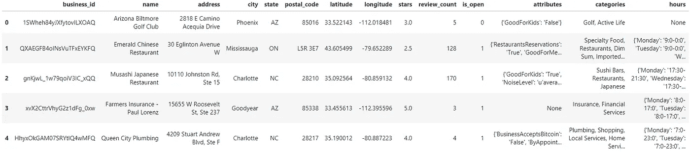
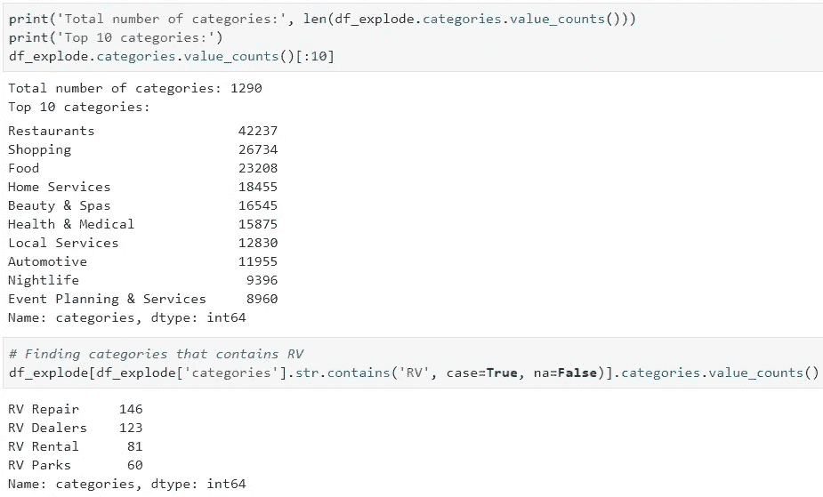

# 将 Yelp 数据集转换为 CSV

> 原文：<https://towardsdatascience.com/converting-yelp-dataset-to-csv-using-pandas-2a4c8f03bd88?source=collection_archive---------11----------------------->


Image source — Yelp

## 如何使用熊猫在 Jupyter 笔记本中加载大容量文件

第 13 轮 [Yelp 数据集挑战赛](https://www.yelp.com/dataset/challenge)于 2019 年 1 月开始，为学生提供赢得奖项和进行学术用途分析或研究的机会。

这篇文章一步一步地展示了如何加载 Yelp 数据集的巨大文件，特别是 5.2 千兆字节的 review.json 文件到一个更易于管理的 CSV 文件。review.json 文件中有超过 600 万条评论，在 Jupyter 笔记本中加载可能会很麻烦。

> **1。下载 Yelp 数据集**
> *(来源****:****Yelp 数据集挑战*[*https://www.yelp.com/dataset/challenge*](https://www.yelp.com/dataset/challenge)*)*

这个数据集包括 Yelp 获得的关于企业、评论、用户、签到、提示和照片的信息。文件为 8.69 未压缩的 json 格式(6 个 json 文件包括 business.json、review.json、user.json、checkin.json、tip.json 和 photo.json)。

解压`yelp_dateset`文件后，会出现另一个文件，在新文件的末尾加上`.tar`再次解压。这 6 个 json 文件应该与 Yelp 的数据集协议和第 13 轮描述的 2 个 pdf 文件一起出现。

> **2。在 Jupyter 笔记本中加载 Yelp 数据集**

因为 review.json 不包含业务的详细信息，所以如果我们想要了解每个评论是针对哪种业务的详细信息，我们需要将评论文件与业务文件合并。

## 加载 business.json 文件

设置 business.json 环境路径以使用 Pandas 加载

```
import pandas as pdbusiness_json_path = 'data/business.json'
df_b = pd.read_json(business_json_path, lines=True)
```



business.json

# 清理 business.json 文件

仅保留数据集中仍在营业的企业

```
# 1 = open, 0 = closed
df_b = df_b[df_b['is_open']==1]
```

删除任何不相关的栏目(必须保留`business_id`，以便与评论合并)

```
drop_columns = ['hours','is_open','review_count']
df_b = df_b.drop(drop_columns, axis=1)
```

## 按类别划分业务

我们可以先使用类别查询相关业务，然后找到我们想要的相关评论。

对于这个例子，我们只对房车相关的业务感兴趣。

```
business_RV = df_b[df_b['categories'].str.contains(
              'RV Repair|RV Dealers|RV Rental|RV Parks|Campgrounds',
              case=False, na=False)]
```

## 查找相关类别

因为一个企业可以有多个类别，所以很难计算出有多少不同的类别(*提示:1290 个不同的类别！*)。我们可以使用熊猫 v0.25 中的`explode`功能来拆分类别。

```
# Make sure the Pandas version is above 0.25
# If not, upgrade Pandas version
# !pip3 install --upgrade pandas
pd.__version__
```

一旦我们确认我们有更新的熊猫版本，让我们开始变魔术吧。

```
df_explode = df_b.assign(categories = df_b.categories
                         .str.split(', ')).explode('categories')
```

然后我们可以列出所有单独的类别

```
df_explode.categories.value_counts()
```

找到包含`RV`的类别

```
df_explode[df_explode.categories.str.contains('RV',
                      case=True,na=False)].categories.value_counts()
```



Yelp Dataset — Pandas Explode to find RV related categories

# 在 Pandas 中加载大量文件

对于 Yelp 数据集这样的大文件，一次加载所有数据很可能会导致计算机内存崩溃。幸运的是，熊猫可以通过将文件分割成小块来加载大数据。

## 清理和加载 review.json 文件

设置 review.json 环境路径以使用 Pandas 加载。

```
review_json_path = 'data/review.json'
```

识别每一列的数据类型可以减少内存使用。
幸运的是，Yelp 为他们的数据集提供了[文档](https://www.yelp.com/dataset/documentation/main)，因此我们可以设置每一列的数据类型。

```
size = 1000000
review = pd.read_json(review_json_path, lines=True,
                      dtype={'review_id':str,'user_id':str,
                             'business_id':str,'stars':int,
                             'date':str,'text':str,'useful':int,
                             'funny':int,'cool':int},
                      chunksize=size)
```

这里，1，000，000 的块大小意味着熊猫每次将读取 1，000，000 行。在 review.json 的这个数据集中，有超过 600 万条评论(行)。减小块的大小可能更容易加载并更快地检查结果。

# 合并 Review.json 和 Business.json 文件

通过仅将相关企业合并到评论文件，最终数据集将仅包含来自这些企业的评论。

# 将新数据框转换为 CSV 文件

可以更容易地加载和共享更简洁的数据集。

```
csv_name = "yelp_reviews_RV_categories.csv"
df.to_csv(csv_name, index=False)
```

# 结论

这篇文章展示了我们如何轻松地将 Jupyter Notebook 中的 JSON 文件加载到 CSV 文件中，而不需要外部转换器。只有当我们知道如何正确阅读和使用数据时，数据才是有用的。彻底清理和处理数据将决定我们分析的质量。

## 接下来:使用散点文本可视化分析 Yelp 数据集

现在我们已经有了 CSV 文件，我们可以开始分析数据了！在我的下一篇文章中，我将展示如何用散点图空间可视化数据。

感谢阅读！我很乐意听到你的想法，在这里评论或给我发消息。用于此的代码位于我的 [GitHub 库](https://github.com/gyhou/yelp_dataset)中。