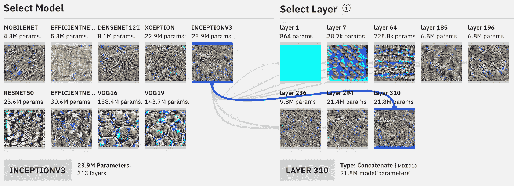

# ConvNet Playground:探索卷积神经网络的交互式可视化工具

> 原文：<https://towardsdatascience.com/convnetplayground-979d441ebf82?source=collection_archive---------16----------------------->

## 探索应用于语义图像搜索任务的 CNN，并查看由预训练模型学习的模式的可视化。

ConvNet Playground is an interactive visualization for exploring Convolutional Neural Networks applied to the task of semantic image search. It allows you explore the performance of multiple pre-trained CNN architectures (and intermediate models based on each architecture) for feature extraction on images across various datasets.

对于数据科学家和工程师来说，重用预先训练的模型所学习的特征(迁移学习)是相当常见的。当这在实践中完成时，几个问题出现了——我使用什么模型架构？我是使用整个模型还是模型的子集？每个模型中的层学习什么模式，它们最适合什么任务？建立如何导航这些选择的直觉需要大量的实验，这可能是计算和时间密集型的。

为了帮助解决这个问题， [ConvNet Playground](http://convnetplayground.fastforwardlabs.com) 提供了一个环境，以支持探索和学习的方式探索这些选择的组合(结果)。我们希望该工具将有助于对 CNN 如何工作建立直觉感兴趣的爱好者、教授 CNN 的教育者和对展示 CNN 在图像分析任务中的价值感兴趣的技术专家。ConvNet Playground 是[我们在](http://experiments.fastforwardlabs.com) [Cloudera 快进实验室](https://www.cloudera.com/products/fast-forward-labs-research.html)建造的几个原型之一，以帮助我们的客户建立对机器学习如何工作的直觉。

注意:与该工具的某些部分交互并理解它们需要一些机器学习概念的知识。如果你想了解 CNN 的一些背景知识，推荐[这篇文章](https://colah.github.io/posts/2014-07-Conv-Nets-Modular/)和[课程](http://cs231n.stanford.edu)。

# 语义搜索——一个简单的实现

ConvNet Playground 专注于使用 CNN 进行语义图像搜索的任务。我们的(相当简单的)方法分两个阶段实现:(1)我们使用预先训练的 CNN(想想 VGG16、InceptionV3 等)从我们的数据集中的所有图像中提取特征。在 i [mageNet](http://www.image-net.org/) )上进行预训练(ii。)我们计算相似性作为这些特征之间距离的度量。*好的*模型将提取正确捕获*相似性*的特征——相似图像的特征靠得很近，不相似图像的特征很好..相距甚远。当然，相似性是一个不断变化的概念，对于每个任务和相应的数据集可能会有所不同。

To implement semantic search, we start by extracting features from images in our dataset using pre-trained CNN models. Similarity is computed as the distance between these features.

## 执行搜索查询

The user can select an image and view a list of the top 15 images which are most similar to the selected image.

用户可以执行搜索查询(单击默认数据集中的图像)，默认模型(InceptionV3)会确定与所选模型最相似的 15 个图像的列表。搜索界面还提供了一个*搜索结果分数，它是与所选图像属于同一类别的返回结果的百分比，根据其在结果列表中的位置进行加权，即，与在列表末尾的正确结果相比，排列在结果列表顶部的正确结果得到更多分数。例如，对于是香蕉图像的搜索查询，如果所有返回的图像都属于同一类别(香蕉)，则搜索分数将是 100%。请注意，这个分数是保守的——一些图片可能属于不同的类别，但*也类似*(例如，轿车、甲壳虫、法拉利*都是*汽车)。搜索分数可用于轻松比较每个搜索配置的性能。*

## *修改搜索配置(高级选项)*

**

*Advanced options allows the user select datasets of varied complexity, select models and distance metrics for computing similarity. As each configuration is changed, the search results are updated in real time.*

*为了让用户进一步探索 CNN 的性能，用户可以使用 ***高级选项*** 开关修改他们的搜索配置——数据集、模型架构、距离度量。随着每个配置选项的修改，用户可以实时查看搜索性能的变化。*

***数据集:**用户可以从 4 个不同复杂程度(图像内容、图像大小)的数据集中选择一个。 ***Iconic200*** 是从 Flickr (creative commons)收集的真实世界图像的数据集。它包含跨越 10 个关键词搜索的图像(拱门、香蕉、大众甲壳虫、埃菲尔铁塔、帝国大厦、法拉利、皮卡、轿车、巨石阵、拖拉机)。 ***Fashion200*** 是来自 [Kaggle 时尚产品图片数据集](https://www.kaggle.com/paramaggarwal/fashion-product-images-dataset)的 200 张图片(10 个类别)的真实时尚单品的集合。图像的最大宽度为 300 像素。***tinyimagenet 200***包含 64px * 64px 图像，是 [Tiny Imagenet 视觉识别挑战数据集的子集。](https://tiny-imagenet.herokuapp.com/) ***Cifar10*** 是流行的 [cifar10](https://www.cs.toronto.edu/~kriz/cifar.html) 数据集的子集(200 张图像)，包含来自 10 个随机选择的类的 20 张图像。每幅图像的尺寸为 32px 32px。*

**

*ConvNet Playground allows users to perform search queries on 4 datasets of varying complexity (content, resolution).*

***模型和层(中间模型):**我们提供了九个模型(vgg16、vgg19、mobilenet、efficientnetb0、efficientnetb5、xception、resnet50、inceptionv3、densenet121)的结果，以及使用每个模型的 8 个层构建的一组中间模型。我们只用了八层，主要是为了减轻观众的认知负担，便于视觉比较。*

**

*The user can chose which models or intermediate models are used for feature extraction. Intermediate models are a subset of the main pre-trained model constructed from a given layer.*

*然而，选择使用哪些层的*取决于以下因素——首先，我们关注具有可训练参数的卷积层，并且我们在每个模型中包括第一个和最后一个卷积层。最后，我们选择中间的六个卷积层作为随机样本。这些模型按照复杂性(参数数量)递增的顺序呈现，并显示出它们在生成正确识别相似图像的特征的能力方面的显著差异。**

***距离度量:**我们提供了使用四种不同的距离度量来测量从每个数据集中的所有图像中提取的特征之间的相似性的结果。这些包括余弦、欧几里德、平方欧几里德和闵可维距离。*

## *嵌入的 UMAP 可视化*

*为了探索各种模型如何捕捉每个数据集的相似性，用户可以查看使用每个模型提取的特征的 [UMAP](https://arxiv.org/abs/1802.03426) 可视化。例如，很好地捕捉相似性的模型生成嵌入，其中每个类中的图像被聚集在一起，并且与其他不相同的类很好地分开。*

**

*Users can explore a UMAP visualization of embeddings extracted using each model. In the image above, the selected model (Inception V3, Layer 310) does a decent job of clustering each category in the dataset.*

## *比较每个查询的模型性能*

*compare models 视图提供了一个界面，用于跨所有模型体系结构比较给定查询的性能(搜索结果得分)。*

**

*For each query, users can view graphs of how how all other models (and intermediate models) perform.*

## *每个模型中各层学习到的模式的可视化*

*更好地理解为什么从模型中的层构造的中间模型对于不同的数据集表现不同的一种方法是检查在每个层学习的模式/特征。ConvNet Playground 通过 [Model Explorer](https://convnetplayground.fastforwardlabs.com/#/models) 视图支持这种检查。*

**

*The [Model Explorer](https://convnetplayground.fastforwardlabs.com/#/models) view allows users to explore patterns learned by layers in a pre-trained CNN model. In the example above, we see that channels in layer 2 in the VGG16 model have learned to detect colors and edges.*

# *一些反思*

## *你可以用预先训练好的模型走得很远*

*ConvNet Playground 中的所有特征提取都是使用在 [imageNet](http://www.image-net.org/) 上预先训练的模型架构来执行的。没有进行微调。由于预先训练的模型可以提供很好的价值，并作为实验的一个令人信服的起点，下一个问题是您使用模型的什么层或子集？*

## *我使用哪一层进行特征提取。*

*当重用表示(迁移学习)时，自由地使用整个模型(仅删除完全连接的层)或模型的子集可能会令人困惑。实现这一点的一种方法是考虑在每一层学到的模式对手头任务的适用性。例如，如果您的任务与低级特征相关(例如，检测形状、颜色、边缘)，则后续层(例如，眼睛、面部、物体的一部分)学习的高级概念不太可能有用。*

**

*a.) Layer 2 in the VGG model, which has learned to detect colors and edges, incorrectly returns images with similar colors. b.) Layer 7 in an Inceptionv3 model, which has also learned to detect colors and edges, correctly returns of shirts with similar colors and edges. Insight: when the meaning of similarity is simple (e.g. colors and edges), intermediate models constructed from early layers work well, have fewer parameters and should be considered.*

**

*a.) Layer 2 in the VGG model, which has learned to detect colors and edges, incorrectly returns images with similar colors. b.) Layer 7 in an Inceptionv3 model, which has also learned to detect colors and edges, correctly returns of shirts with similar colors and edges. Insight: when the meaning of similarity is simple (e.g. colors and edges), intermediate models constructed from early layers work well, have fewer parameters and should be considered.*

*接下来，他们可以利用提取的嵌入的 UMAP 可视化来探索这些模型在捕捉各种数据集的相似性概念方面的表现。*

## *AutoML/NAS 型号极具竞争力！！*

*通常的做法是使用 VGG16(前 5 名精度为 **92.6** )作为图像分析任务的基础。在凉爽的**138 米**称重，VGG16 是参数低效。相比之下， [EfficientNetB0](https://arxiv.org/abs/1905.11946) ，一个神经架构搜索(NAS，AutoML)模型，在 **5.3M** 参数(前 5 名精度 **93.2)** 中加权。ConvNet Playground 集成了两个 EfficientNet 模型变体，并将其应用于语义搜索(EfficientNetB0 5.3M 参数和 EfficientNetB5 30.6M 参数)..它们真的很好用，[去试试吧](http://convnetplayground.fastforwardlabs.com/)！*

**

*Top performing models for image analysis between 2012 and 2019\. We see that model architectures designed using neural architecture search approaches (autoML) models have become competitive in the last few years. Not just that, they achieve this with less parameters.*

## *一些神经元/层学习非常奇怪的模式*

*如果你对挖掘预训练模型中的层感兴趣，并探索每个架构中的层学习了什么样的模式，那么…有足够多的东西让你忙起来！如果你发现一些有趣的东西(比如下面的频道已经学会在 densenet121 中明确检测眼睛的[模式)..一定要在推特上分享！](http://convnetplayground.fastforwardlabs.com/#/models?model=densenet121&layer=conv4_block9_2_conv&channel=5)*

**

*This [eye pattern learned by Channel 5, Layer 202](http://convnetplayground.fastforwardlabs.com/#/models?model=densenet121&layer=conv4_block9_2_conv&channel=5) in densenet121\. Check out the [Model Explorer view](http://convnetplayground.fastforwardlabs.com/#/models), you might find some even more interesting patterns learned by other models.*

*请注意，该原型中的方法(使用来自预训练模型的特征)相对简单，因此具有局限性(规模、在搜索查询中匹配多个对象、准确性)。在实践中，我们可以通过微调给定数据集的专门模型来扩展这种实现，利用附加信息(例如文本描述、交互日志、购买日志等)来构建更有意义的嵌入，或者使用两阶段方法来匹配搜索查询中的多个对象(提取对象裁剪并用作搜索查询)。*

# *承认*

*ConvNet Playground 建立在许多相关项目和工具的基础上，旨在通过交互式体验使神经网络更容易访问。这些相关的项目包括[特征可视化、](https://distill.pub/2017/feature-visualization/) [Tensorflow 游乐场、](https://playground.tensorflow.org/) [可教机器、](https://teachablemachine.withgoogle.com/) [Keras.js](https://transcranial.github.io/keras-js/#/) 等等。ConvNet Playground 使用 [lucid](https://github.com/tensorflow/lucid/tree/master/lucid) 和 [lucid4keras](https://github.com/totti0223/lucid4keras) 库来可视化层中通道学习到的特征， [leader-line](https://anseki.github.io/leader-line/) 用于绘制 svg 线， [carbon](https://www.carbondesignsystem.com/) 设计系统用于布局。本项目中使用的预训练模型来自 [Keras 应用](https://keras.io/applications/)模块，EfficientNets 实施来自[此处](https://github.com/qubvel/efficientnet)。感谢格兰特·卡斯特对 Three.js 的宝贵指点，以及快进实验室团队的其他成员的反馈和指导！*

*ConvNet Playground 是我们最近在 Cloudera Fast Forward Labs 进行的关于用于图像分析的**深度学习**的研究报告的一部分。我们的报告更加详细(什么任务用什么模型，如何选择一个好的模型，OSS 工具和框架，可解释性等等)。).[如果您有兴趣获取完整报告(可通过订阅我们的研究和咨询服务获得)，请联系](https://www.cloudera.com/products/fast-forward-labs-research.html)。*

*如果你觉得这个工具有用或者有反馈要分享，请随时联系我们。*