# 卷积神经网络——初学者指南

> 原文：<https://towardsdatascience.com/convolution-neural-networks-a-beginners-guide-implementing-a-mnist-hand-written-digit-8aa60330d022?source=collection_archive---------2----------------------->

这篇文章的目的是介绍卷积神经网络的基本概念。**这篇文章的最终目标是实现一个 MNIST 手写数字分类器，所以一切都要牢记在心——卷积层**、**最大池层**、 **RelU 激活函数**、**全连接层、漏失层、交叉熵损失函数等。**

这篇文章是关于卷积神经网络(CNN)介绍的 2 部分系列文章的一部分。

[**第一部分——围绕 CNN 的基本概念**](https://medium.com/@krutpatel/convolution-neural-networks-a-beginners-guide-implementing-a-mnist-hand-written-digit-8aa60330d022)

[**第二部分— Pytorch 实现 CNN 对 MNIST 手写数字进行分类**](https://medium.com/@krutpatel/mnist-handwritten-digits-classification-using-a-convolutional-neural-network-cnn-af5fafbc35e9)

# 1.卷积层

在深入了解什么是卷积层之前，让我们先了解一下为什么要使用它们。

## 为什么使用卷积层？

在 Yann LeCun 于 1998 年提出卷积概念用于数字分类之前，人们使用其他方法如支持向量机、knn、逻辑回归等对图像进行分类。在这些算法中，像素值被视为特征，即对于 28×28 的图像，将有 784 个特征。

在卷积开始流行之前，人们已经使用了很多算法来进行图像分类。人们过去常常从图像中创建特征，然后将这些特征输入到像 SVM 这样的分类算法中。一些算法还使用图像的像素级值作为特征向量。举个例子，你可以训练一个具有 784 个特征的 SVM，其中每个特征是一个 28x28 图像的像素值。这样我们就失去了很多像素之间的空间相互作用。我们仍然可以像卷积层自动做的那样从图像中手动选择特征，但这将非常耗时。卷积层使用来自相邻像素的信息，通过卷积将图像下采样为特征，然后使用预测层来预测目标值。

## 卷积层是如何工作的？

我们使用多重卷积**过滤器**或**内核**来运行图像并计算点积。每个过滤器从图像中提取不同的特征。

让我们考虑一个大小为 3x3 的过滤器和一个大小为 5x5 的图像。我们在匹配内核大小的图像像素值和内核本身之间执行元素乘法，并将它们相加。这为我们提供了特征单元的单个值。

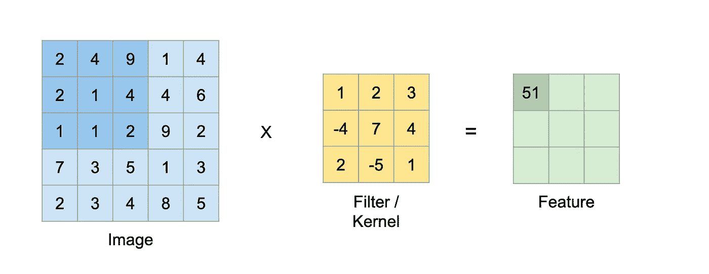

Convolution operation step — 1

**2 * 1+4 * 2+9 * 3+2 *(-4)+1 * 7+4 * 4+1 * 2+1 *(-5)+2 * 1 = 51**

过滤器继续在图像上运行，并产生新的值，如下所示。

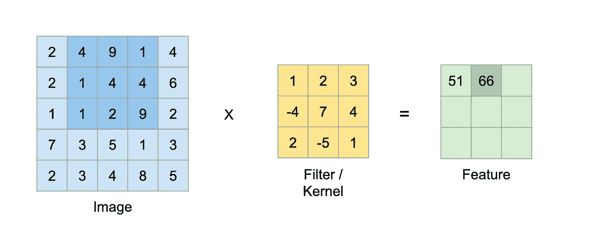

Convolution operation step — 2

**4 * 1+9 * 2+1 * 3+1 *(-4)+4 * 7+4 * 4+1 * 2+2 *(-5)+9 * 1 = 66**

诸如此类…

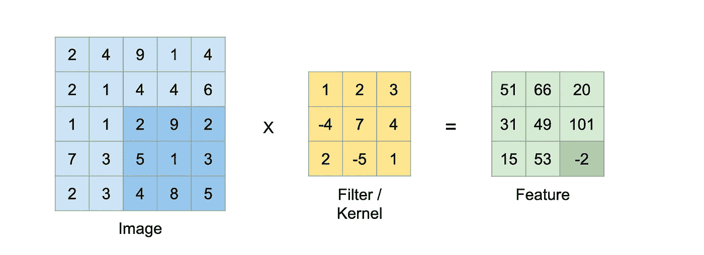

Convolution operation step — final

**2 * 1+9 * 2+2 * 3+5 *(-4)+1 * 7+3 * 4+4 * 2+8 *(-5)+5 * 1 =-2**

在上面的例子中，我们将内核滑动了 1 个像素。这叫**跨步。**我们可以让内核移动不同的步幅值来提取不同种类的特征。

我们选择的步幅也会影响提取的特征的大小。计算特定内核尺寸的特征尺寸的公式如下:

**特征大小=((图像大小-内核大小)/步幅)+ 1**

我们可以输入上述示例的值并验证它。

**特征尺寸=((53)/1)+1 = 3**

因此，步幅为 2 时，大小为 5×5 的图像上大小为 3×3 的核将只能提取大小为 2 的特征。

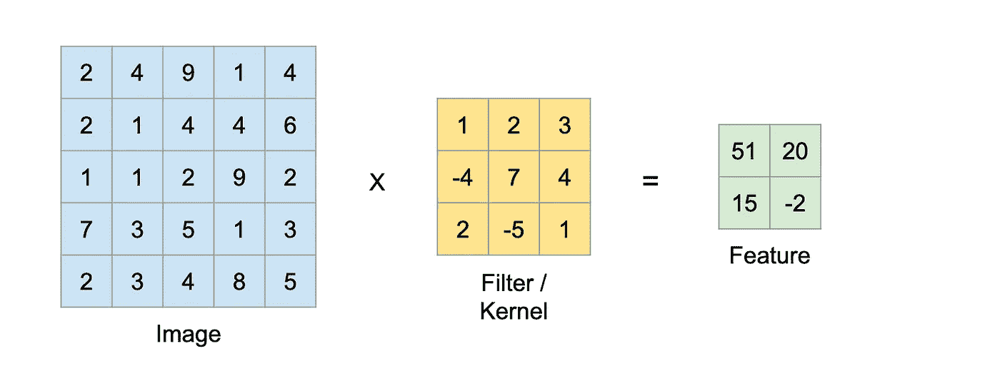

Convolution operation kernel size 3 and stride 2

**如果您希望特征与输入图像的大小相同，该怎么办？**你可以通过填充图像来实现。**填充**是一种简单地在图像边缘添加零以增加其尺寸的技术。填充允许我们强调边界像素，从而减少信息损失。

这里是一个具有大小为 5×5 的输入图像的例子，该输入图像被填充到 7×7，即填充大小为 1，并且被大小为 3×3 的核以 1 的步幅进行卷积，从而产生大小为 5×5 的特征。

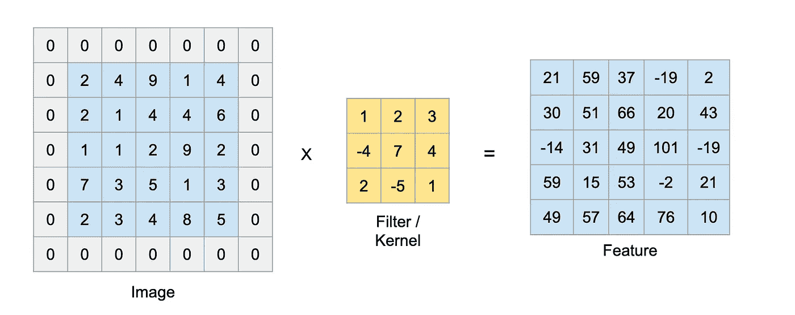

Convolution operation kernel size 3, stride 1 and padding 1

当考虑填充图像时，计算特定内核尺寸的特征尺寸的公式如下:

**特征尺寸=((图像尺寸+ 2 *填充尺寸-内核尺寸)/步幅)+1**

我们可以输入上例的值并验证它。

**特征尺寸=((5+2 * 13)/1)+1 = 5**

对于具有 3 个通道(即 rgb)的图像，我们对所有 3 个通道执行相同的操作。

神经网络通过反向传播来学习这些核心值，以提取图像的不同特征。典型地，在卷积神经网络中，我们在每一层都有一个以上的内核。我们可以进一步使用这些特征图来执行不同的任务，如分类、分割、对象检测等。

这里有一些很好的卷积层的可视化效果-

# 2.最大池层

最大池化图层有助于减少卷积要素的空间大小，并且通过提供它们的抽象表示有助于减少过度拟合。这是一个的基于样本的离散化过程。

它类似于卷积层，但我们不是在输入和内核之间取点积，而是取被内核覆盖的输入区域的最大值。

下面的示例显示了 maxpool 层的操作，其内核大小为 2，跨距为 1。

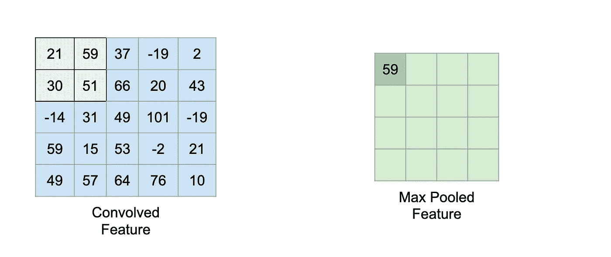

Max pooling step — 1

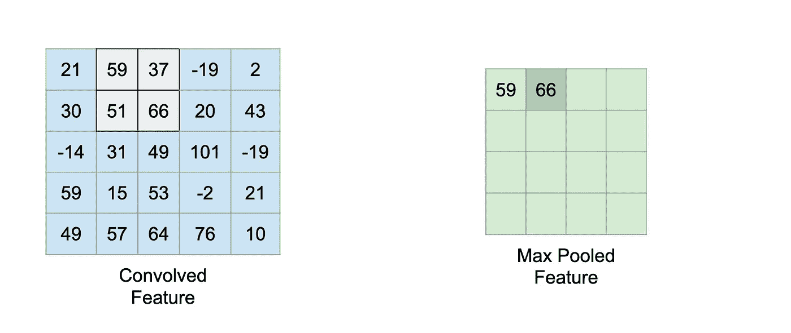

Max pooling step — 2

诸如此类…

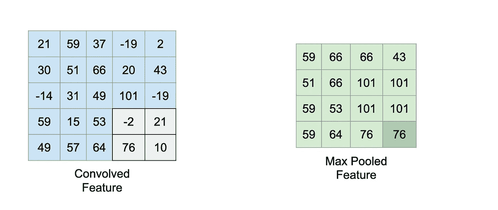

Max pooling step — final

还有一种叫做**平均池**的池，你取平均值而不是最大值。最大池有助于通过丢弃有噪声的激活来减少噪声，因此优于平均池。

# 3.RelU(整流线性单位)激活功能

激活函数向模型引入非线性，这允许它学习输入和响应变量之间的复杂函数映射。有相当多不同的激活函数，如 sigmoid、tanh、RelU、Leaky RelU 等。

RelU 函数是一个分段线性函数，如果大于 0，则直接输出输入，否则输出零。

**ReLU(x)=max(0，x)**

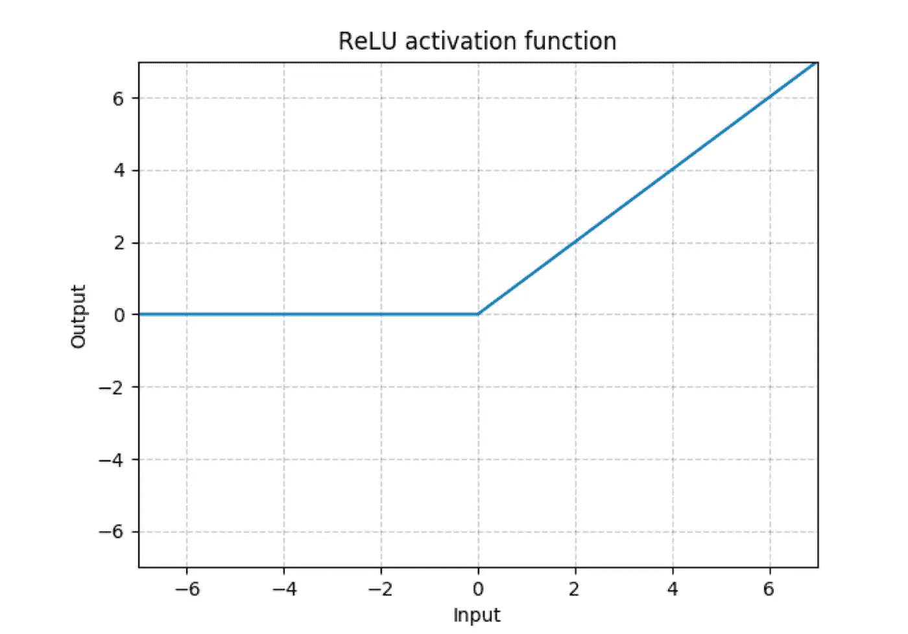

**Credit:** [PyTorch docs](https://pytorch.org/docs/stable/nn.html?highlight=relu#torch.nn.ReLU)

还有许多其他的激活函数，但是 RelU 是许多种类的神经网络最常用的激活函数，因为它的线性行为更容易训练，并且它通常实现更好的性能。

## 最大池层之前或之后的重新激活

嗯，**MaxPool(Relu(x))= Relu(MaxPool(x))**

所以它们满足了交际属性，可以用任何一种方式。实际上，RelU 激活函数在卷积层之后立即应用，然后输出被最大化汇集。

# 4.完全连接的层

在全连接层中，输入层节点连接到第二层中的每个节点。我们在 CNN 的结尾使用一个或多个完全连接的层。添加全连接层有助于学习卷积层输出的高级特征的非线性组合。

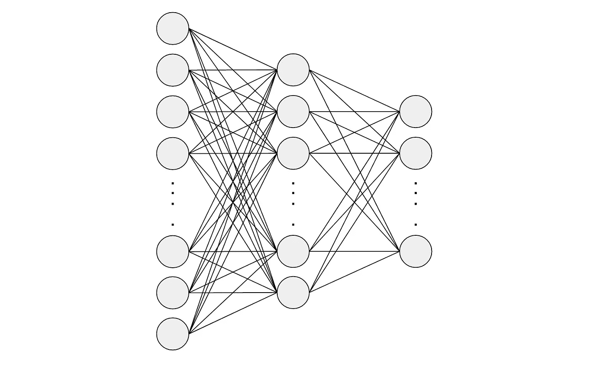

Fully Connected layers

通常在两个连续的全连接层之间使用**激活函数**和**脱落层**，分别引入非线性和减少过拟合。

在最后一个完全连接的层，我们根据我们的应用选择输出大小。为了对 MNIST 手写数字进行分类，最后一层的大小为 10，即每个数字一个节点，我们将对输出进行 softmax 处理，得到一个 10 维向量，其中包含每个数字的概率(0-1 之间的数字)。

# 5.脱落层

Dropout 是一种正则化技术，用于减少神经网络上的过拟合。通常，深度学习模型在完全连接的层上使用 dropout，但也有可能在 max-pooling 层之后使用 dropout，从而创建图像噪声增强。

Dropout 使用来自伯努利分布的样本以概率 p 随机地将输入张量的一些连接置零。

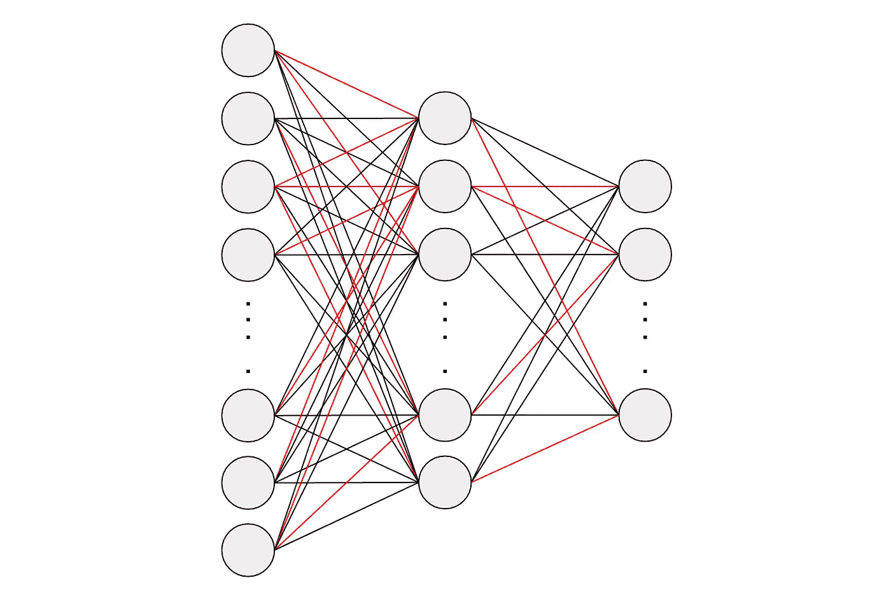

Zeroing out the red connections

# 6.损失函数—交叉熵

损失函数是一种评估模型对数据集建模程度的方法。如果预测值偏离实际目标值，损失函数将输出一个较大的数字，否则将输出一个较小的数字。

由于我们的问题是多类分类，我们将使用交叉熵作为我们的损失函数。如果实际目标类别标签的预测类别标签概率较低，则它基本上输出较高的值。

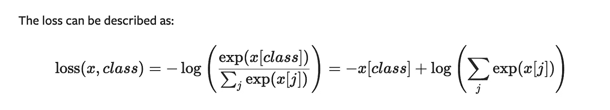

Credits: [Pytorch docs](https://pytorch.org/docs/stable/nn.html?highlight=cross%20entropy#torch.nn.CrossEntropyLoss)

# 放弃

虽然这篇文章涵盖了围绕用于图像分类的 CNN 模型的大多数概念，但它绝不是一个全面的指南。它主要面向初学者，最终目标是实现一个 CNN MNIST 手写数据分类器。

在下一部分 [**第 2 部分— Pytorch 实现 CNN 对 MNIST 手写数字进行分类**](https://medium.com/@krutpatel/mnist-handwritten-digits-classification-using-a-convolutional-neural-network-cnn-af5fafbc35e9) 我们将通过实现一个**卷积神经网络(CNN)网络**来使用所有这些概念对 **MNIST** **手写数字进行分类。**