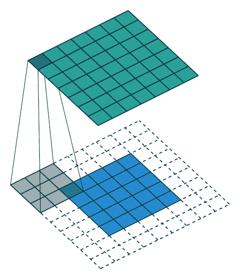

# 卷积与相关

> 原文：<https://towardsdatascience.com/convolution-vs-correlation-af868b6b4fb5?source=collection_archive---------1----------------------->

卷积神经网络是大多数计算机视觉应用(如自动驾驶汽车、面部识别系统等)的主干，它是一种特殊的神经网络架构，其中基本的矩阵乘法运算被卷积运算取代。他们专门处理具有网格状拓扑结构的数据。例子包括时间序列数据和图像数据，它们可以被认为是二维像素网格。

# 历史

卷积神经网络是福岛在 1980 年首次推出的，名为 [Neocognitron](https://www.rctn.org/bruno/public/papers/Fukushima1980.pdf) 。它受到 Hubel 和 Weisel 提出的神经系统层次模型的启发。但是这个模型并不流行，因为它复杂的无监督学习算法被称为无老师学习。Yann LeCun 在 1989 年使用反向传播和 Neocognitron 的概念提出了一个名为 [LeNet](http://yann.lecun.com/exdb/publis/pdf/lecun-89e.pdf) 的体系结构，它被美国邮政服务用于手写邮政编码识别。Yann LeCun 在这个项目上做了进一步的工作，最终在 1998 年发布了 LeNet-5，这是第一个现代的 convnet，它引入了我们今天仍在 CNN 使用的一些基本概念。他还发布了手写数字的 MNIST 数据集，这可能是机器学习中最著名的基准数据集。在 20 世纪 90 年代，计算机视觉领域转移了它的焦点，许多研究人员不再试图研究 CNN 架构。神经网络研究经历了一个寒冬，直到 2012 年，多伦多大学的一群研究人员在著名的 ImageNet 挑战赛中输入了一个基于 CNN 的模型(AlexNet ),最终以 16.4%的错误率获胜。从那时起，卷积神经网络不断向前发展，基于 CNN 的架构不断赢得 ImageNet，2015 年，基于卷积神经网络的架构 [ResNet](https://arxiv.org/abs/1505.00393) 以 3.57%的错误率超过了人类水平的 5.1%。

# 用词不当:

CNN 广泛使用的卷积运算是用词不当。所用的运算严格来说是相关运算，而不是卷积运算。这两个操作符略有不同，我们将分别研究它们以了解不同之处。

# 交叉相关:

相关是在图像上移动通常被称为核心的过滤遮罩并计算每个位置的乘积之和的过程。相关性是滤波器位移的函数。换句话说，相关的第一个值对应于滤波器的零位移，第二个值对应于一个位移单位，等等。

Figure 1.Cross-Correlation in 1-D

Figure 2.Cross-Correlation in 1-D

**数学公式:**

图 3 给出了使用滤波器 F 对图像 I 进行一维互相关运算的数学公式。假设 F 有奇数个元素会很方便，所以我们可以假设当它移动时，它的中心正好在图像 I 的一个元素的上面。所以我们说 F 有 2N+1 个元素，这些元素的索引从-N 到 N，所以 F 的中心元素是 F(0)。

Figure 3\. The formula of Cross-Correlation in 1-D

类似地，我们可以将这个概念扩展到图 4 所示的 2-D。基本思想是相同的，除了图像和过滤器现在是 2D。我们可以假设我们的滤波器有奇数个元素，所以用(2N+1)x(2N+1)矩阵表示。

Figure 4\. The Formula of Cross-Correlation in 2-D.

2D 的相关运算非常简单。我们只需要一个给定大小的过滤器，并将其放置在图像中与过滤器大小相同的局部区域上。我们继续这个操作，在整个图像中移动同一个滤波器。这也有助于我们实现两个非常受欢迎的属性:

1.  **平移不变性:**我们的视觉系统应该是感知、响应或检测同一物体，而不管它出现在图像的什么地方。
2.  **局部性:**我们的视觉系统聚焦于局部区域，而不考虑图像的其他部分正在发生什么。

互相关函数有一个限制或特性，当它被应用于一个离散的单位脉冲(一个全 0 且只有单 1 的 2D 矩阵)时，产生一个结果，该结果是滤波器的一个拷贝，但是旋转了 180 度的角度。

Figure 5\. The complete correlation operation

# 卷积:

卷积运算与互相关运算非常相似，但略有不同。在卷积运算中，首先将核翻转 180 度，然后应用于图像。卷积的基本性质是将一个核与一个离散的单位脉冲进行卷积，在脉冲的位置产生一个核的副本。

我们在互相关部分看到，相关运算产生一个脉冲副本，但旋转了 180 度。因此，如果我们*预旋转*过滤器并执行相同的滑动乘积和运算，我们应该能够获得期望的结果。

Figure 6\. Applying the convolutional operation on Image b in Figure 5.

**数学公式:**

使用核 F 在图像 I 上应用的卷积运算由 1-D 中的公式给出。卷积就像相关，除了我们在相关之前翻转滤波器。

Figure 7\. Convolution Operation in 1-D.

在 2D 卷积的情况下，我们水平和垂直翻转滤波器。这可以写成:

Figure 8\. Convolution Operation in 2-D.

卷积运算也遵循**平移不变性**和**局部性**的相同性质。

Figure 9\. The Correlation Operation demonstrated what many would refer to as convolution.

# 注意:

虽然这两种操作略有不同，但使用的内核是否对称并不重要。

# 结论:

在这篇文章中，我们简要讨论了卷积神经网络的历史和一些特性。我们讨论了各种文本中经常提到的卷积运算实际上是互相关运算的误称。这种差异非常微小，但非常有用，应该被每个刚进入、实践或经历过计算机视觉广阔领域的人所了解。我希望你喜欢这篇文章，如果有任何问题、疑问或讨论，请在 Twitter 或 Linkedin 上联系我。

# 参考资料:

1.  深度学习书籍，作者:**伊恩·古德菲勒、约舒阿·本吉奥和亚伦·库维尔。**
2.  Rafael C. Gonzalez 的数字图像处理。
3.  由 Aston Zhang、Zack C. Lipton、李牧和 Alex J. Smola 深入研究深度学习。
4.  相关和卷积由**大卫雅各布**完成。
5.  图 9 摘自[https://towards data science . com/applied-deep-learning-part-4-卷积神经网络-584bc134c1e2](/applied-deep-learning-part-4-convolutional-neural-networks-584bc134c1e2) 。
6.  [https://spatial-lang.org/conv](https://spatial-lang.org/conv)
7.  迷因取自[https://www . mihaileric . com/posts/convolutionary-neural-networks/。](https://www.mihaileric.com/posts/convolutional-neural-networks/.)