# 卷积与互相关

> 原文：<https://towardsdatascience.com/convolution-vs-cross-correlation-81ec4a0ec253?source=collection_archive---------18----------------------->

这篇文章将概述卷积和互相关的区别。这篇文章是网上唯一包含卷积和互相关的一步一步的例子的资源(据我所知，相信我，我做了很多搜索)。这篇文章还精确地讨论了指数，事实证明，如果你想通过例子证明卷积和互相关是如何相关的，那么正确使用指数是至关重要的。我花了很大一部分时间来准备这篇文章，为索引而紧张得要命，但现在它们都很漂亮，而且组织有序，供你欣赏。

首先，关于这个话题的一点动机…

## **动机**

要理解 CNN 中的[反向传播就要理解卷积和互相关的区别，要理解](https://www.jefkine.com/general/2016/09/05/backpropagation-in-convolutional-neural-networks/)[解卷积](https://arxiv.org/pdf/1311.2901.pdf)(一种 CNN 可视化技术)，要理解[解卷积](https://arxiv.org/pdf/1311.2901.pdf)和[显著图](https://glassboxmedicine.com/2019/06/21/cnn-heat-maps-saliency-backpropagation/)(更可视化)，要理解[引导反向传播](https://arxiv.org/pdf/1412.6806.pdf)(更可视化)，要理解 [Grad-CAM](https://arxiv.org/pdf/1610.02391.pdf) (更可视化)因此，尽管“卷积与互相关”可能一开始看起来跑题了，但这篇文章实际上仍然是 CNN 热图系列的一部分。

关于 CNN 的回顾，请参见[卷积神经网络介绍](https://glassboxmedicine.com/2019/05/05/how-computers-see-intro-to-convolutional-neural-networks/)。

既然你的积极性很高，让我们开始吧！

## **高层总结**

互相关和卷积都是应用于图像的操作。互相关意味着在图像上滑动一个核(过滤器)。卷积意味着在图像上滑动翻转的内核。机器学习库中的大多数卷积神经网络实际上是使用互相关来实现的，但它在实践中不会改变结果，因为如果使用卷积来代替，则在翻转的方向上会学习到相同的权重值。

## **跟踪指数**

为了使卷积和互相关的例子和方程清晰，我们需要跟踪我们的图像索引、核索引和输出索引。

首先，这里有一个常用来解释卷积的图，其中内核(黄色)滑过图像(绿色)产生输出(粉红色):

(图片来源:这部动画出现在很多地方，包括[这里](https://hackernoon.com/visualizing-parts-of-convolutional-neural-networks-using-keras-and-cats-5cc01b214e59)和[这里](https://www.cc.gatech.edu/~san37/post/dlhc-cnn/)。)

当我们对图像进行索引时，我们称哪个像素为[0，0]？我们可以选择左上角，或者中心，或者其他任意的像素。类似的，我们在内核或者输出中怎么称呼[0，0]？

对于图像、内核和输出，我们将中心元素称为[0，0]。这个决定对于让公式很好地工作是很重要的。

# 盘旋

## **卷积设置:符号&方程**

网上有很多关于卷积的方程，都有不同的符号和索引。例如:

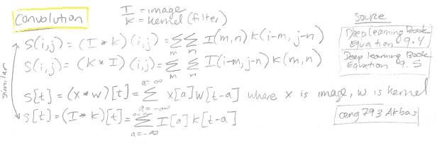

在本文的剩余部分，我们将使用下面的符号，其中图像被称为 **x** ，内核被称为 **h** ，输出被称为 **y** :

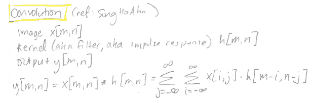

这是宋浩安在[他们关于 2D 卷积](http://www.songho.ca/dsp/convolution/convolution2d_example.html)的有用帖子中使用的符号。

星号*用于表示卷积运算。因此， **x** [m，n]* **h** [m，n】意味着我们将图像 **x** 与内核 **h** 进行卷积，以找到输出 **y** 中位置[m，n]处的值。总和超过 I 和 j，它们是图像像素的索引。

这里有一个内核(过滤器)的绘图，其中我们看到内核的中心是[0，0]，正如我们之前决定的。 **m** (红色)水平索引成列， **n** (绿色)垂直索引成行内核:

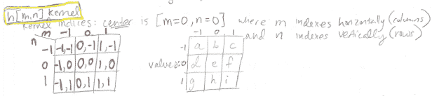

内核元素的索引显示在左边，红色和绿色。实际的内核数值表示为变量 a、b、c、d、e、f、g、h 和 I，如右图所示。(内核中的这些数值是 CNN 在训练过程中学习到的。)

最后，这里是 7 乘 7 的图像 **x** ，索引从-3 到 3:

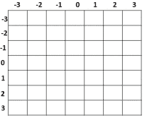

这是图像 **x** 的右下角，放大是因为这是我们在示例中要关注的图像部分:

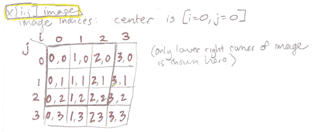

对于这幅图像，我写出了每个像素的索引。这些不是像素值，它们只是每个像素的[i，j]坐标。您可以想象这个图像有任意的像素值，因为在我们的例子中不需要图像像素值。

## **卷积例子(数学)**

回想一下卷积公式:

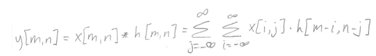

这似乎表明，为了获得输出 **y** 中索引[m，n]处的值，我们需要查看图像中的所有像素。毕竟，I 和 j 是图像的索引，和的值从负无穷大到正无穷大。

然而，实际上，我们不需要所有的像素，因为对于特定的输出索引 m 和 n，选择特定的像素索引 I 和 j 将导致访问不存在的内核元素。因此，我们将只查看图像的像素，对于这些像素，等式**h**【m-I，n-j】的核心部分仍然有效。为了说明这个效果，在下面的例子中，我包括了像素索引 i = 3 和 j = 3；您可以看到，对于所选的输出元素 **y** [m=1，n=1]，选择 i = 3 或 j = 3 会导致尝试访问不存在的内核元素(例如内核元素(1，2))；参考前面的内核图片，你会看到它的索引从-1 到+1。因此，我们没有明确说明输出图的每个部分需要哪个图像索引 I 和 j；它隐含在公式中，基于 I 和 j 的选择将导致可接受的内核访问。

(注意，不是从“负无穷大到正无穷大”求和，这有点奇怪，因为没有图片具有无穷大的大小，我们可以改为写“-k 到+k”，但这具有暗示固定的 k×k 输入图像大小的缺点。)

事不宜迟，下面是卷积产生输出条目 **y** [m=1，n=1]的工作示例:

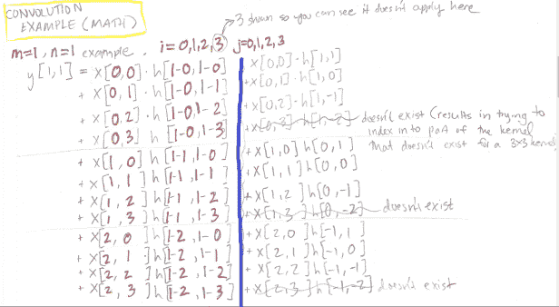

这里发生了什么事？

首先，我们试图在输出图 **y** 中找到单个位置的值，由索引 **m** = 1， **n** = 1 指定；我们想找到 **y** [1，1]。为了简单起见，我没有显示像素值 I 和 j(从-3 到+3)的每一个可能的组合，因为那样会变得非常混乱，并且我没有显示的所有组合都是“无效的”(也就是说，它们需要不存在的内核索引。)

图像中央有一条蓝线。在蓝线的左侧，我们将 m、n、I 和 j 的值以系统的方式直接代入卷积方程。在蓝线的右边，我们已经“求解”了左边的表达式，从而得到了与特定像素 **x** [#，#]相乘的 **h** [#，#]的最终索引。

## **卷积示例(绘图)**

上面的等式可能看起来像一大堆晦涩难懂的东西，但是如果我们把它们组织成一张图片，我们会突然明白为什么它们很酷。在下面的图片中，我显示了图像的右下角 **x** 并明确写出了相关的像素索引。然后，我将内核 **h** 与相关位置的图像对齐，并使用卷积方程的结果来填充内核索引 **h** [#，#]，以便右边的 **h** [#，#]与右边的 **x** [#，#]对齐。最后，我已经参考了原始的内核图片(在本文的前面)来计算哪些内核数值(a、b、c 等等)对应于哪些内核索引…瞧！！！我们已经表明卷积“翻转内核”:

所以，如果你曾经读过任何关于“实卷积如何使用翻转核”的东西，现在你明白为什么了，在数学上。

# **与卷积相比的互相关**

当你想到“卷积”时，你可能会想到互相关，因为互相关意味着在图像上滑动内核而不翻转内核。以下是互相关和卷积的并列等式，您可以比较它们:

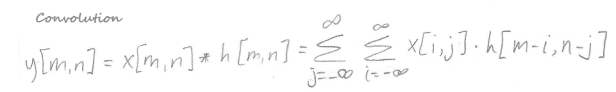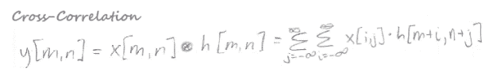

正如你所看到的，在表达式**h**【m-I，n-j】或**h**【m+I，n+j】中，关键的区别是加号与减号。这一差异最终决定了(a)内核是否翻转,( b)为输出贴图的每个元素处理哪些像素。

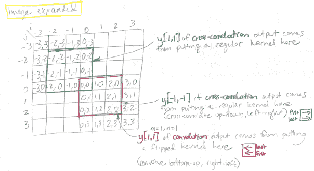

在上图中，我们可以看到以下内容:

*   为了获得 **y** [m=1，n=1]处*互相关*的输出值，我们需要查看*绿色*中的像素(因为这些是内核索引有意义的唯一像素。)
*   然而，为了获得*卷积*在**y**【m = 1，n=1】的输出值，我们需要查看一组不同的像素，用*红色*包围起来(因为这些是现在内核索引有意义的唯一像素。)
*   事实证明，如果我们想使用同一幅输入图像来完成一个工作示例，那么同一幅输入图像对应于不同的卷积和互相关输出图。这是因为卷积从右下角开始，从下向上/从右向左进行，而互相关从左上角开始，从上向下/从左向右进行。因此，我们关注的图像部分(红色方框部分)对应于卷积输出 y[1，1]，但对应于互相关输出 y[-1，-1]。

作为对该问题的进一步总结，以下两个图显示了输入图像的哪一部分用于创建输出图的不同部分，用于互相关与卷积:

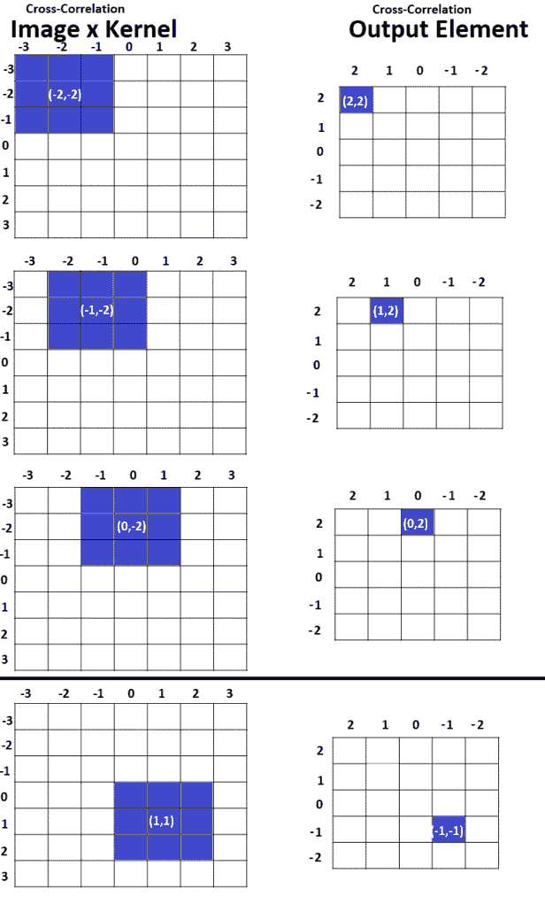

# 交叉相关

## **互相关示例(数学)**

最后，在这样的背景下，这是我们关注的图像“红色区域”的工作示例。在互相关中，这个补丁用于找到在 **y** [m= -1，n= -1]的输出:

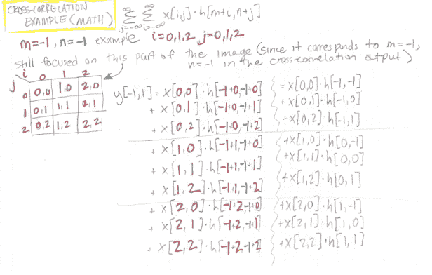

## **互相关示例(图纸)**

同样，我们可以使用上面的数学来填充一张图片，向我们展示在图像和内核级别上发生了什么。我们可以看到，通过将适当的内核索引与输入图像索引对齐，我们最终得到“面向原始方向”的内核，即在互相关中，内核是*而不是*翻转的。

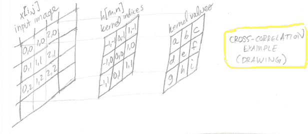

# **总结**

卷积和互相关都涉及在图像上滑动核来创建输出。

*   在卷积中，内核是翻转的
*   在互相关中，内核不翻转
*   卷积的大部分动画和解释其实都是在呈现互相关性，“卷积神经网络”的大部分实现其实都是利用了互相关性。在机器学习环境中，这不会改变模型的性能，因为 CNN 权重只是被学习翻转了。

要在示例中很好地使用公式，您需要:

*   (1)适当选择指标。图像的中心元素、内核和输出都是[0，0]
*   (2)注意，图像的固定碎片对应于卷积与互相关中输出图的不同索引。这是因为在卷积中，内核自下而上/从右向左遍历图像，而在互相关中，内核自上而下/从左向右遍历图像。

理解卷积和互相关之间的区别将有助于理解反向传播在 CNN 中是如何工作的，这是未来帖子的主题。

## 参考

*   [卷积与互相关，来自 Udacity“计算摄影”的视频](https://www.youtube.com/watch?v=C3EEy8adxvc)(还有，[第 10 课的所有内容](https://classroom.udacity.com/courses/ud955)，一个包含示例、动画和公式的视频系列)
*   [深度学习全书第九章](http://www.deeplearningbook.org/contents/convnets.html)(总结公式)
*   [曾 793 Akbas 第 3 周 CNN 和 RNNs](http://user.ceng.metu.edu.tr/~emre/resources/courses/AdvancedDL_Spring2017/week03_CNN.pdf) (汇总公式)
*   [宋浩安的 2D 卷积示例](http://www.songho.ca/dsp/convolution/convolution2d_example.html)(带索引的示例)
*   [宋浩安的卷积](http://www.songho.ca/dsp/convolution/convolution.html#convolution_2d)(带索引的例子)

## 关于特色图片

图片来源:[佩吉培根在半空后空翻](https://en.wikipedia.org/wiki/File:Peggy_Bacon_in_mid-air_backflip,_Bondi_Beach,_Sydney.jpg)。记住…实卷积翻转内核。

*原载于 2019 年 7 月 26 日*[*http://glassboxmedicine.com*](https://glassboxmedicine.com/2019/07/26/convolution-vs-cross-correlation/)*。*