# 用于图像降噪的卷积自动编码器

> 原文：<https://towardsdatascience.com/convolutional-autoencoders-for-image-noise-reduction-32fce9fc1763?source=collection_archive---------0----------------------->

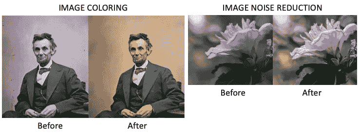

在“[自动编码器异常检测变得简单](/anomaly-detection-with-autoencoder-b4cdce4866a6)中，我提到自动编码器已经广泛应用于*降维*和*图像降噪*。从那时起，许多读者问我是否可以使用自动编码器来降低图像噪声。这就是这篇文章的动机。

在神经网络世界中，对图像数据建模需要一种特殊的方法。用于对图像数据建模的最著名的神经网络是**卷积神经网络(CNN，或 ConvNet)。**可以更好的保留一幅图像像素之间的连通信息。CNN 中各层的特殊设计使其成为处理图像数据的更好选择。

CNN 设计可用于图(1)所示的**图像识别/分类**，或用于图(2)所示的**图像降噪或着色**。在图(1)中，我们通过将许多图像样本作为输入并将标签作为输出来训练 CNN 模型。然后我们用这个训练好的 CNN 模型对一个新的图像进行识别，看它是“狗”，还是“猫”等等。CNN 也可以用作图像降噪或着色的自动编码器。

当 CNN 用于图像降噪或着色时，它应用于自动编码器框架中，即，CNN 用于自动编码器的编码和解码部分。图(2)显示了一个 CNN 自动编码器。每个输入图像样本是具有噪声的图像，并且每个输出图像样本是没有噪声的对应图像。我们可以将训练好的模型应用于有噪声的图像，然后输出清晰的图像。同样，它可以用于训练图像着色的模型。图(2)是一个使用 CNN 自动编码器为图像着色的例子。

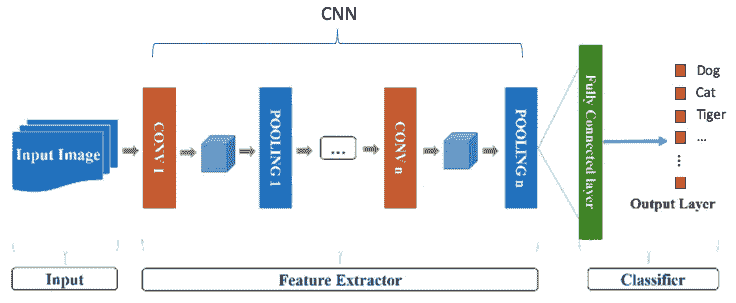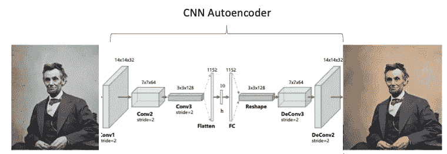

Figure (2)

在这篇文章中，让我先简单介绍一下图像数据，因为并非所有读者都熟悉图像数据领域(如果您已经熟悉了，请随意跳过这一部分)。然后，我描述了一个简单的标准神经网络的图像数据。这将允许我演示为什么卷积自动编码器是处理图像数据的首选方法。最重要的是，我将演示卷积自动编码器如何减少图像中的噪声。我在这篇文章中使用了 Keras 模块和 MNIST 数据。笔记本可以通过 Github 链接获得。 [Keras](https://keras.io/) 是一个高级神经网络 API，用 Python 编写，能够在 [TensorFlow](https://github.com/tensorflow/tensorflow) 之上运行。这篇文章是我之前的文章“[什么是图像识别”的延伸。](/module-6-image-recognition-for-insurance-claim-handling-part-i-a338d16c9de0)“我鼓励你去看一看。

我认为提及三大数据类别是有帮助的。这三个数据类别是(1)多元数据(与串行数据相反)，(2)串行数据(包括文本和语音流数据)，以及(3)图像数据。**深度学习有三种基本变化来解决每个数据类别:** (1)标准前馈神经网络，(2) RNN/LSTM，以及(3)卷积神经网络(CNN)。对于正在寻找每种类型教程的读者，建议查看《[用回归友好的方式解释深度学习](https://medium.com/swlh/a-tutorial-to-build-from-regression-to-deep-learning-b7354240d2d5)》的(1)，当前文章《[RNN/LSTM/GRU 股价预测技术指南](https://dataman-ai.medium.com/a-technical-guide-on-rnn-lstm-gru-for-stock-price-prediction-bce2f7f30346)》的(2)，以及《[用 PyTorch 进行深度学习不是折磨](https://medium.com/analytics-vidhya/not-torturing-in-learning-pytorch-b2f7f169923a)》，《[什么是图像识别？](/module-6-image-recognition-for-insurance-claim-handling-part-i-a338d16c9de0)、[使用自动编码器的异常检测变得容易](/anomaly-detection-with-autoencoder-b4cdce4866a6)、[用于图像降噪的卷积自动编码器](/convolutional-autoencoders-for-image-noise-reduction-32fce9fc1763)(3)。您可以将摘要文章“ [Dataman 学习之路——培养您的技能，推动您的职业发展](https://medium.com/analytics-vidhya/dataman-learning-paths-build-your-skills-drive-your-career-e1aee030ff6e)”加入书签。

**理解图像数据**

如图(A)所示，图像由“像素”组成。在黑白图像中，每个像素由一个从 0 到 255 的数字表示。今天大多数图像使用 24 位或更高的颜色。RGB 彩色图像意味着像素中的颜色是红色、绿色和蓝色的组合，每种颜色的范围从 0 到 255。RGB 颜色系统从红色、绿色和蓝色的组合中构建所有颜色，如[该 RGB 颜色生成器](https://www.w3schools.com/colors/colors_picker.asp)所示。所以一个像素包含一组三个值 RGB(102，255，102)指颜色 **#66ff66。**

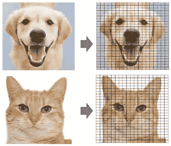

Figure (A)

800 像素宽、600 像素高的图像具有 800 x 600 = 480，000 像素= 0.48 兆像素(“兆像素”是 100 万像素)。分辨率为 1024×768 的图像是具有 1，024 列和 768 行的网格，因此包含 1，024 × 768 = 0.78 兆像素。

 [## 通过我的推荐链接加入 Medium-Chris Kuo/data man 博士

### 阅读 Chris Kuo/data man 博士的每一个故事。你的会员费直接支持郭怡广/戴塔曼博士和其他…

dataman-ai.medium.com](https://dataman-ai.medium.com/membership) 

**MNIST**

MNIST 数据库(改进的国家标准和技术研究所数据库)是一个手写数字的大型数据库，通常用于训练各种图像处理系统。Keras 中的训练数据集有 60，000 条记录，测试数据集有 10，000 条记录。每条记录有 28 x 28 个像素。

他们长什么样？让我们用`matplotlib`和它的图像函数`imshow()`来显示前十条记录。

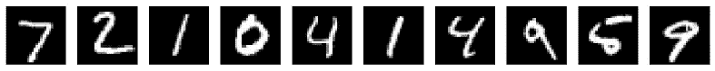

**堆叠用于训练的图像数据**

为了适合用于模型训练的神经网络框架，我们可以将所有 28 x 28 = 784 个值堆叠在一列中。第一条记录的堆叠列如下所示:(使用`x_train[1].reshape(1,784)`):

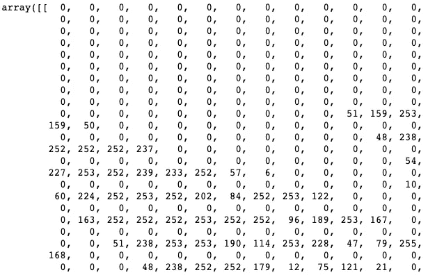

Figure (B): Part of the values

然后我们可以用标准的神经网络来训练模型，如图(B)所示。784 个值中的每一个都是输入层中的一个节点。但是等等，我们叠加数据的时候不是损失了很多信息吗？是的。*图像中的空间和时间关系已被丢弃。这是很大的信息损失。*让我们看看卷积自动编码器如何保留空间和时间信息。

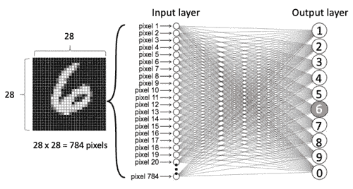

Figure (B)

**为什么卷积自动编码器适用于图像数据？**

当分割和堆叠数据时，我们看到大量信息丢失。卷积自动编码器不是堆叠数据，而是保持输入图像数据的空间信息不变，并在所谓的**卷积层**中温和地提取信息。图(D)展示了平面 2D 图像被提取到一个厚正方形(Conv1)，然后继续变成一个长立方体(Conv2)和另一个更长的立方体(Conv3)。此过程旨在保留数据中的空间关系。这是自动编码器中的编码过程。在中间，有一个全连接的自动编码器，其隐藏层仅由 10 个神经元组成。接下来是解码过程，使立方变平，然后变成 2D 平面图像。编码器和解码器在图(D)中是对称的。它们不需要对称，但是大多数从业者只是采用了这个规则，如“[使用自动编码器的异常检测变得容易](/anomaly-detection-with-autoencoder-b4cdce4866a6)”中所解释的。

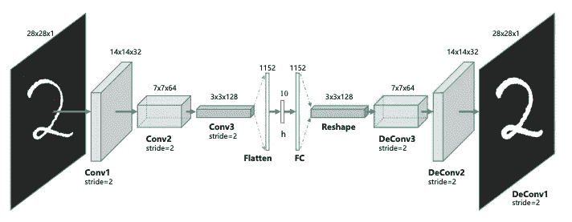

Figure (D)

**卷积自动编码器如何工作？**

上面的数据提取看起来很神奇。这是怎么回事？它包括以下三层:卷积层、reLu 层和池层。

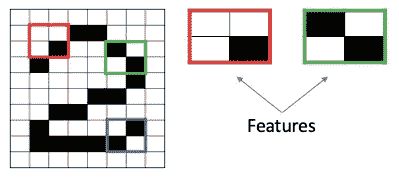

Figure (E): The Feature Maps

1.  **卷积层**

卷积步骤创建了许多称为*特征地图*或*特征*的小块，如图(E)中的绿色、红色或深蓝色方块。这些方块保留了输入图像中像素之间的关系。让每个特征扫描原始图像，如图(F)所示。这个产生分数的过程叫做*过滤*。

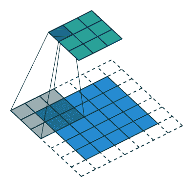

Figure (F): The Filtering Process

在扫描原始图像后，每个特征产生一个如图(G)所示的具有高分和低分的*过滤的*图像。如果完全匹配，则该方块得分高。如果匹配度低或不匹配，则得分低或为零。例如，红色方块在原始图像中找到了四个与该特征完全匹配的区域，因此这四个区域的得分很高。

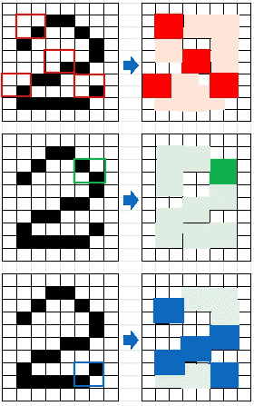

Figure (G)

更多的过滤器意味着模型可以提取更多的特征。然而，更多的功能意味着更长的训练时间。因此建议您使用最少数量的过滤器来提取特征。

**1.1 填充**

特征如何确定匹配？一个超参数是填充，它提供了两个选项:(I)用零填充原始图像以适合该特征，或者(ii)丢弃原始图像中不适合的部分并保留有效部分。

**1.2 步**

卷积层包括另一个参数:步幅。它是在输入矩阵上移动的像素数。当跨距为 1 时，滤镜一次移动一个像素。我们将在 Keras 代码中看到它作为一个超参数。

**2。重新执行步骤**

校正线性单元(ReLU)是与典型神经网络中的步骤相同的步骤。它会将任何负值修正为零，以保证数学运算正确进行。

**3。最大池层**

池会缩小图像大小。在图(H)中，一个被称为*池大小*的 2×2 窗口扫描通过每个过滤的图像，并将该 2×2 窗口的最大值分配给新图像中的 1×1 正方形。如图(H)所示，第一个 2 x 2 窗口中的最大值是高分(用红色表示)，因此高分被分配给 1 x 1 正方形。

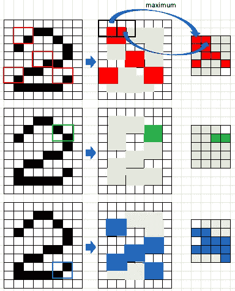

Figure (H): Max Pooling

除了取最大值，其他不太常用的汇集方法包括平均汇集(取平均值)或总和汇集(总和)。

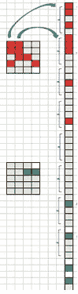

Figure (J)

合并后，会产生一个新的较小的过滤图像堆栈。现在，我们分割较小的过滤图像，并将它们堆叠成一个列表，如图(J)所示。

**Keras 中的型号**

以上三层是卷积神经网络的构造块。Keras 提供以下两种功能:

*   `Conv2D(filters, kernel_size, activation = 'reLu', strides=1)`:`kernel_size`是 2D 卷积窗的高度和宽度。因为我们在图(E)中使用了一个 2 乘 2 的正方形，所以在我们的例子中，kernel_size 将是(2，2)。`stride`是在输入矩阵上移动的像素数。我们的步幅是 1，因为我们一次移动一个像素的过滤器。
*   `MaxPooling2D(pool_size=(2,2))`:在图(H)中，我们使用 2 乘 2 的窗口来表示池的大小。所以我们将在下面的代码中使用(2，2)。

您可以在卷积自动编码器中构建许多卷积层。在图(E)中，编码部分有三层，分别标记为 Conv1、Conv2 和 Conv3。所以我们会相应地建造。

*   下面的代码`input_img = Input(shape=(28,28,1)`声明输入的 2D 图像是 28 乘 28。
*   然后构建三层 Conv1、Conv2 和 Conv3。
*   注意，Conv1 位于 Conv2 内部，Conv2 位于 Conv3 内部。
*   `padding`指定当滤波器不适合输入图像时该做什么。`padding='valid'`表示当滤镜不适合时，丢弃图像的部分；`padding='same'`用零填充图片以适合图片。

然后继续添加解码过程。所以下面的`decoding`部分有所有的编码和解码。

[Keras API](https://keras.io/models/model/) 需要声明模型和优化方法:

*   `Model(inputs= input_img,outputs= decoded)`:给定输入数据`input_img`，模型将包括计算输出`decoded`所需的所有层。`compile(optimizer='adadelta',loss='binary_crossentropy')`:优化器像梯度下降一样执行优化。最常见的是随机梯度下降(SGD)、适应梯度(Adagrad)和 Adadelta(Adagrad 的扩展)。详见 [Keras 优化器文档](https://keras.io/optimizers/)。损失函数可在 [Keras 损失文件](https://keras.io/losses/)中找到。

下面我使用 x_train 作为输入和输出来训练这个模型。`batch_size`是样本数，`epoch`是迭代次数。我指定`shuffle=True`要求在每个时期之前混洗训练数据。

我们可以打印出前十幅原始图像和对这十幅图像的预测。

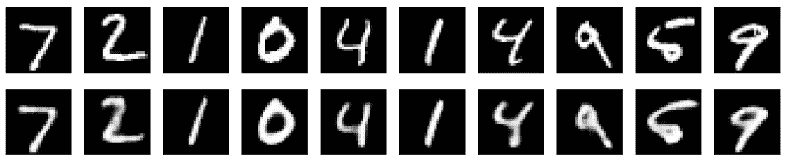

**如何构建图像降噪卷积自动编码器？**

图像降噪的思想是用噪声数据作为输入，它们各自的清晰数据作为输出来训练模型。这是与上述模型的唯一区别。让我们首先给数据添加噪声。

前十幅有噪声的图像如下所示:

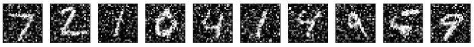

然后，我们用有噪声的数据作为输入，干净的数据作为输出来训练模型。

最后，我们打印出前十个噪声图像以及相应的去噪声图像。

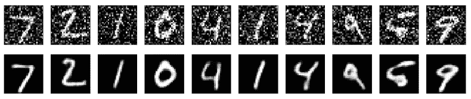

笔记本可以通过[这个 Github 链接](https://github.com/dataman-git/codes_for_articles/blob/master/Keras%20MNIST.ipynb)获得。

**有没有我可以使用的预先训练好的 CNN 代码？**

是的。如果你有兴趣学习代码， [Keras 有几个预先训练好的 CNN](https://keras.io/applications/)，包括 [Xception](https://keras.io/applications/#xception) 、 [VGG16](https://keras.io/applications/#vgg16) 、 [VGG19](https://keras.io/applications/#vgg19) 、 [ResNet50](https://keras.io/applications/#resnet50) 、 [InceptionV3](https://keras.io/applications/#inceptionv3) 、 [InceptionResNetV2](https://keras.io/applications/#inceptionresnetv2) 、 [MobileNet](https://keras.io/applications/#mobilenet) 、 [DenseNet](https://keras.io/applications/#densenet) 、[值得一提的是这个大型图像数据库](https://keras.io/applications/#nasnet) [ImageNet](http://www.image-net.org/) ，你可以贡献或下载用于研究目的。

 [## 通过我的推荐链接加入 Medium-Chris Kuo/data man 博士

### 阅读 Chris Kuo/data man 博士的每一个故事。你的会员费直接支持郭怡广/戴塔曼博士和其他…

dataman-ai.medium.com](https://dataman-ai.medium.com/membership)