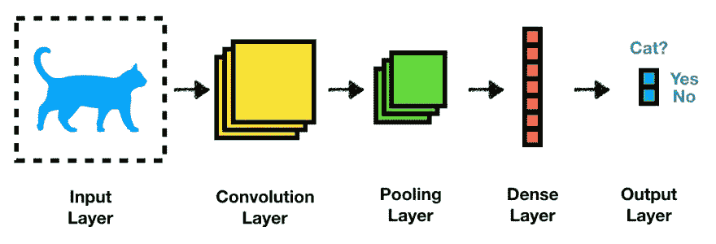
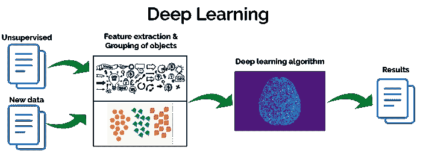
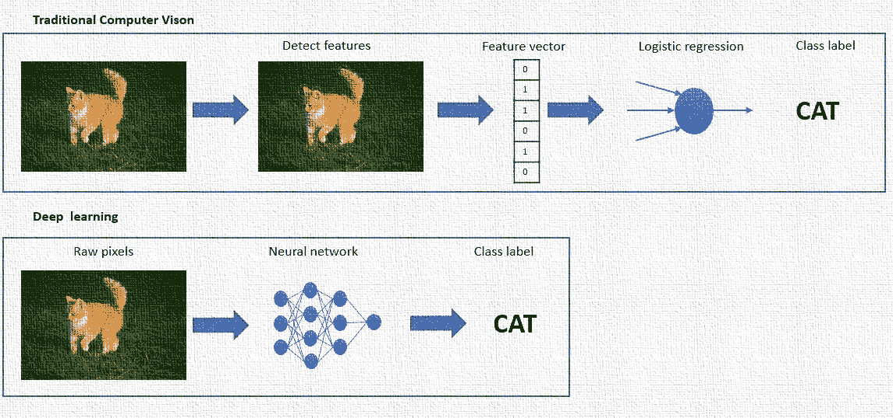
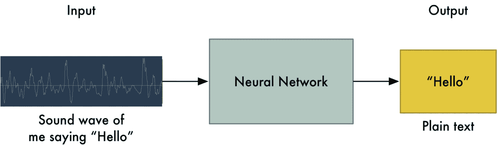
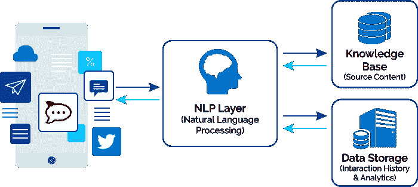
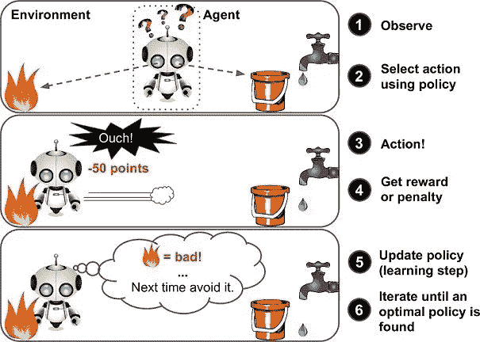

# 卷积神经网络:逐步指南

> 原文：<https://towardsdatascience.com/convolutional-neural-network-a-step-by-step-guide-a8b4c88d6943?source=collection_archive---------6----------------------->

> “人工智能、深度学习、机器学习——不管你在做什么，如果你不懂，就去学吧。因为否则，你会在三年内变成恐龙”*——*马克·库班，*连续创业者*

您好，欢迎， ***野心家*** ！

如果你正在阅读这篇文章，并且对这个话题感兴趣，我假设你熟悉深度学习和机器学习的基本概念。

如果没有，也不用担心！该教程旨在从头到尾让你开始学习深度学习技能——从感知机到深度学习。

在本教程中，我们将触及神经网络、模型和算法的各个方面，一些用例、要使用的库，当然还有深度学习的范围。除此之外，还将讨论深度学习的其他重要概念。

## **第一步:先决条件**

任何一个汤姆、迪克和哈里都不可能只是听说深度学习的奇迹，培养兴趣并开始一个教程。必须有一个好的学习方法，这就是为什么我们为你们奠定了基础工作。以下几点强调了在开始学习之前你需要做的事情:

*   ***R/Python 知识:*** 这是深度学习最常用和首选的两种语言。其中一个主要原因是两者都有足够的支持/社区。在你进入机器学习的世界之前，在你方便的时候选择其中的一个。毋庸置疑，Python 是领先领域；不过这里可以看到对比[。](https://www.analyticsvidhya.com/blog/2017/09/sas-vs-vs-python-tool-learn/)
*   ***对线性代数、微积分和概率的基本理解:*** 每堂课都有数量惊人的在线视频和课程，其中许多是免费的。我们并不建议你磨练技巧，只是为了更好地理解教程而复习一下。你可以试着从斯坦福的 [CS231n](http://cs231n.stanford.edu/) 开始。
*   ***神经网络和深度学习的初级诀窍:*** 正如我前面所说，网上有很多免费和付费的资源。无论如何，在线视频总是有帮助的。如果你想通读这个概念，我们建议你跟随[神经网络和深度学习](http://neuralnetworksanddeeplearning.com/)，这是绝对免费的。(此外，请注意[深度学习初学者的 25 个必知术语&概念](https://www.analyticsvidhya.com/blog/2017/05/25-must-know-terms-concepts-for-beginners-in-deep-learning/)
*   ***设置要求:*** 由于深度学习非常依赖计算概念，我们需要更快的机器在那个级别运行。所以，你现在需要的是:

1.  GPU (4+ GB，最好是 Nvidia)——它是当今深度学习应用的核心
2.  CPU(例如英特尔酷睿 i3 或更高版本也可以)
3.  4 GB RAM 或取决于数据集

注意:(如果你想了解更多关于硬件的要求，可以去看看这个[硬件指南](http://timdettmers.com/2015/03/09/deep-learning-hardware-guide/)，最重要的是，不要在这一步安装深度学习库。你将在本教程中被进一步告知。)

## **第二步:概念和技术方面的介绍**

*如何能一头扎进深度学习？*本质上，这一切都始于神经网络，深度学习不过是那些网络的逻辑实现，从数据中提取有用的信息。从技术角度来说，它是一种对非结构化输入数据(如包括图像、声音、视频和文本在内的媒体)进行分类的谨慎方法。

首先，你需要决定哪种学习媒介最适合你的研究和学习深度学习。它可以是博客、书籍、视频或在线课程。我们列出了来源，让你从最简单的概念开始，这将帮助你逐渐掌握这个主题。

博客方法

- [深度学习的基础——从人工神经网络开始](https://www.analyticsvidhya.com/blog/2016/03/introduction-deep-learning-fundamentals-neural-networks/)

- [深度学习教程:从感知机到深度网络](https://www.toptal.com/machine-learning/an-introduction-to-deep-learning-from-perceptrons-to-deep-networks)

书本方法

- [神经网络和深度学习](http://neuralnetworksanddeeplearning.com/)(迈克尔·尼尔森的免费书籍)

- [深度学习](http://www.deeplearningbook.org/)(麻省理工学院出版社的一本书)

视频方法

——[深度学习简体](https://www.youtube.com/playlist?list=PLjJh1vlSEYgvGod9wWiydumYl8hOXixNu)

- [神经网络班-舍布鲁克大学](https://www.youtube.com/watch?v=SGZ6BttHMPw&list=PL6Xpj9I5qXYEcOhn7TqghAJ6NAPrNmUBH)

在线课程方法

- [神经网络](https://www.coursera.org/learn/neural-networks)由(11 月 27 日开始注册)

- [吴恩达的机器学习](https://www.coursera.org/learn/machine-learning)(11 月 27 日开始报名)

- [机器学习](https://www.cs.ox.ac.uk/people/nando.defreitas/machinelearning/)作者 Nando de Freitas(包含视频、幻灯片和作业列表)

亲爱的学习者，接受这样一个事实，即转变为深度学习专家需要大量的时间、许多额外的资源，以及在构建和测试模型方面的专门练习。然而，我们确实相信，利用上面列出的资源可以让你进入深度学习。

## **第三步:** **选择你的冒险**

在你掌握了基础知识之后，有趣的部分来了――深度学习最先进技术的实践经验。该领域提供了许多令人兴奋的应用和机会。深度学习的技术将根据你的兴趣和目的而变化，见下文:

***计算机视觉/模式识别:*** 两者差别不大，因为模式识别也是计算机视觉的一部分，很多时候。然而，从广义上讲，计算机视觉仅包括分析图像，并用于对象检测、分割、基于视觉的学习等。而模式识别不限于图像。它是关于任何可以拥有一种模式的事物的分类。

若要了解，请访问此处:

[计算机视觉的深度学习](https://www.analyticsvidhya.com/blog/2016/04/deep-learning-computer-vision-introduction-convolution-neural-networks/)

[CS231n:用于视觉识别的卷积神经网络](http://cs231n.stanford.edu/)

对于视频和用例:

[计算机视觉详细讲座](http://crcv.ucf.edu/videos/lectures/2014.php)

***语音和音频识别:*** 有没有说过“Ok Google”？我敢肯定，你做到了。它包括一个语音识别系统，可以帮助你在谷歌上找到你要找的东西。

从技术上讲，它由一种神经网络组成，这种网络涉及输入序列，以在网络图中创建循环，称为递归神经网络(RNNs)。它们被称为“递归的”,因为它们对序列的每个元素执行相同的任务，并且执行诸如机器翻译或语音识别之类的任务。

若要了解，请访问此处:

[递归神经网络的不合理有效性](http://karpathy.github.io/2015/05/21/rnn-effectiveness/)

[递归神经网络教程](http://www.wildml.com/2015/09/recurrent-neural-networks-tutorial-part-1-introduction-to-rnns/)

[了解 LSTM 网络](http://colah.github.io/posts/2015-08-Understanding-LSTMs/)(一种广泛使用的 RNN 变种)

对于视频:

[递归神经网络的友好介绍](https://www.youtube.com/watch?v=UNmqTiOnRfg&t=171s)

[递归神经网络(RNN)](https://www.youtube.com/watch?v=y7qrilE-Zlc)

**自然语言处理或 NLP:** NPL 是一种计算机通过以智能和有用的方式模拟人类语言来阅读、分析和响应的方法。如今，技术广泛应用于多个行业领域，如广告、客户服务、保险等。实现人机交互过程的自动化。

NPL 层将用户请求或查询转换成信息，并从其数据库中搜索适当的响应。NLP 的一个高级例子是语言翻译――从一种人类语言到另一种语言。例如，英语到德语。

若要了解，请访问此处:

[理解终极指南&实现自然语言处理](https://www.analyticsvidhya.com/blog/2017/01/ultimate-guide-to-understand-implement-natural-language-processing-codes-in-python/)

[NLPFORHACKERS。IO](http://nlpforhackers.io/getting-started/)

[自然语言处理深度学习如何入门](https://machinelearningmastery.com/crash-course-deep-learning-natural-language-processing/)

对于视频:

[自然语言处理简介](https://www.youtube.com/watch?v=8S3qHHUKqYk)

[深度学习的自然语言处理](https://www.youtube.com/watch?v=OQQ-W_63UgQ)

**强化学习或 RL:** 想象一个机器人被训练从它以前的行为中学习，并在需要时执行新的任务，那不是很好吗，而且是自动的！事实上，这是真的。

强化学习为计算机代理引入了类似的概念；无论在特定任务中是成功还是失败，代理人都会收到对某个对象的行为的奖励和惩罚。它获得关于它的知识，作为控制其行为的深度学习模型的一部分。

若要了解，请访问此处:

[强化学习初学者指南](https://deeplearning4j.org/reinforcementlearning#a-beginners-guide-to-reinforcement-learning-for-java)(Java 版)

[强化学习的简单初学者指南&其实现](https://www.analyticsvidhya.com/blog/2017/01/introduction-to-reinforcement-learning-implementation/)

对于视频:

[深度强化学习](https://www.youtube.com/watch?v=lvoHnicueoE)

[强化学习](https://www.youtube.com/watch?v=w33Lplx49_A)

## **第四步:选择正确的框架**

我们在步骤 3 中讨论了深度学习技术的许多应用和用法。对于某些任务，传统的机器学习算法可能就足够了。但是，如果你正在处理大量的图像、视频、文本或语音，深度学习是你的福音和一切。然而，在深度学习中，对于许多人来说，哪个框架将是正确的选择。

记住，没有正确的框架，只有合适的框架。以下是您的选择标准应该主要依据的内容:

*   预训练模型的可用性
*   开源
*   支持的操作系统和平台
*   许可模式
*   模型定义和调整的简易性
*   调试工具的可用性
*   易于扩展(例如，能够编写新的算法)
*   与研究型大学或学术界有联系
*   支持深度学习算法家族和模型

为了帮助您选择一个，让我带您简单浏览一下**深度学习框架**:

**(a)****tensor flow:**背靠 Google，TensorFlow 是基于数据流图表示的数值计算通用深度学习库。

-试试它的[入门教程](https://www.tensorflow.org/versions/master/tutorials/mnist/tf/index.html#tensorflow-mechanics-101)

-要安装 TensorFlow，[请访问此处](https://github.com/tensorflow/tensorflow)

-参考其[文档](https://www.tensorflow.org/versions/master/api_docs/index.html)

-看看它的[白皮书](http://download.tensorflow.org/paper/whitepaper2015.pdf)

**(b)** **Theano:** 数学表达式编译器 Theano 是一种积极开发的架构，它有效地定义、优化和评估具有多维数组的数学表达式。

-试用一个[入门教程](http://deeplearning.net/software/theano/tutorial/examples.html)

-要安装 Theano，[请访问此处](http://deeplearning.net/software/theano/install.html)

-将[文件](http://deeplearning.net/software/theano/index.html)放在手边

**(c) Caffe:** 虽然 Theano 和 TensorFlow 可以成为你的“通用”深度学习库，但 Caffe 是通过牢记表达式、速度和模块化来制作的。该框架由计算机视觉小组开发，能够实现简单灵活的深度学习来组织计算。对其更新，咖啡 2 也可用。

-要安装 Caffe，请访问此处获取 [Caffe](http://caffe.berkeleyvision.org/installation.html) 和 [Caffe2](http://caffe2.ai/docs/getting-started.html)

-熟悉[介绍性教程演示](https://docs.google.com/presentation/d/1UeKXVgRvvxg9OUdh_UiC5G71UMscNPlvArsWER41PsU/edit#slide=id.gc2fcdcce7_216_371)

-在这里你可以找到它的[文档](http://caffe.berkeleyvision.org/tutorial/)

**(d)** **微软认知工具包:**微软认知工具包——以前称为 CNTK——是一个统一的深度学习工具包，可以跨多个 GPU 和服务器轻松实现和组合流行的模型类型，如 CNN、RNN、LTSM 等。

-要安装微软认知工具包，[请访问此处](https://docs.microsoft.com/en-us/cognitive-toolkit/Setup-CNTK-on-your-machine)

-如需教程，请点击此处的

- [模型库](https://www.microsoft.com/en-us/cognitive-toolkit/features/model-gallery/?filter=Tutorial)各种用例的代码样本、配方和教程的集合。

请注意，上面列出的体系结构并不是当今使用的唯一流行的库。我们列举了一些主要特征:

*   [**克拉斯**](http://keras.io/)

-用 Python 写的；一个极简和高度模块化的神经网络库

-能够在 Theano 或 TensorFlow 上运行

-支持快速实验。

*   [**火炬**](http://torch.ch/)

-科学计算框架

-为机器学习算法提供广泛支持

-基于 [Lua](https://en.wikipedia.org/wiki/Lua_(programming_language)) 编程语言

*   [**链条**](http://chainer.org/)

- Python 支持的，灵活直观的神经网络库

-根据运行定义的原则设计

-允许您在运行时修改网络

要了解更多基于标准的选择和对其他框架的详细审查，请访问页面- [如何选择深度学习框架](https://software.intel.com/en-us/articles/hands-on-ai-part-5-select-a-deep-learning-framework)(我们建议您将该链接加入书签，因为它会经常更新)。

**第五步:探索深度学习**

深度学习是一个复杂而突出的人工智能领域，真正的奇迹正在这里发生。引导深度学习领域的三个关键点是:

1.  大量训练数据的可用性
2.  强大的计算基础设施
3.  学术界的进展

然而，要开创深度学习，你需要做的很简单:

*   从第 2 步到第 4 步重复，每次都有不同的经历
*   继续测试你的深度学习技能(例如 [Kaggle](https://www.kaggle.com/competitions)
*   加入深度学习社区并提问(例如 [Google Group](https://plus.google.com/u/0/communities/112866381580457264725) 、 [DL Subreddit](https://www.reddit.com/r/deeplearning/) )
*   关注最近的研究/研究人员(例如[被引用最多的深度学习论文](https://github.com/terryum/awesome-deep-learning-papers))

**尾注**

今天，几年前和我们一样也是学习者的研究人员，正在努力挑战技术领域的不可能性。一开始，你可能会发现学习概念有困难，但是，坚韧是关键。

你可能会发现自己对深度学习算法感到困惑，并认为为什么它没有像你预期的那样工作，或者为什么我会得到这个错误 ABC？…相信我，这很正常。如果需要，先尝试一个您认为可以在一小组数据上工作的示例算法。

在这个学习领域，尝试一切对你有意义的事情。当你获得新技能的时候，试着用你的头脑创造一些不同的东西。还记得电影《蜘蛛侠》中的对白吗——“能力越大，责任越大。”深度学习的趋势正在不停地上升。要在深度学习名人堂留下印记，宇宙向你敞开。出来展示你的才华吧，因为还有很多东西没有被发掘。

最后，我请求你们支持(鼓掌)这篇文章并分享它，这样我们就不会留下任何有抱负的人才，也不会错过任何即将到来的发明机会！！爱你们所有人…