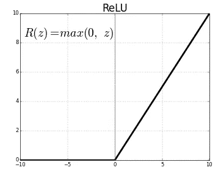

# 基于 PyTorch 实现的图像分类深度学习

> 原文：<https://towardsdatascience.com/convolutional-neural-network-for-image-classification-with-implementation-on-python-using-pytorch-7b88342c9ca9?source=collection_archive---------8----------------------->


[http://terencebroad.com/nnvis.html](http://terencebroad.com/nnvis.html)

## 对人工智能算法的探究

## 介绍

本文将以图像分类为例来解释卷积神经网络(CNN)。它使用 Python 上的 PyTorch 框架提供了 CNN 算法的简单实现。网上有很多免费的课程。个人建议斯坦福的安德烈·卡帕西([@卡帕西](http://twitter.com/karpathy))的课程。你会学到很多，这是一个循序渐进的过程。此外，它还提供了许多实现 CNN 架构的实用策略。

[](http://cs231n.github.io/convolutional-networks/) [## 用于视觉识别的 CS231n 卷积神经网络

### 斯坦福 CS231n 课程材料和笔记:视觉识别的卷积神经网络。

cs231n.github.io](http://cs231n.github.io/convolutional-networks/) 

## 什么是卷积神经网络？

在深入研究卷积神经网络之前，有必要了解一下它们的概念。CNN 属于监督算法的范畴。该算法从训练数据中学习，例如，输入中的一组图像和输出中的它们的相关标签。

它包括向卷积神经网络提供训练集 x 的图像及其相关联的标签(目标)y，以便学习网络的功能 y=f(x)。在学习了网络函数的参数(即权重和偏差)之后，我们用看不见的图像来测试网络，以便预测它们的标签。卷积神经网络(CNN 或 ConvNet)的架构

我们在本文中使用的 CNN 架构是在[本文](http://personal.ie.cuhk.edu.hk/~ccloy/project_target_code/index.html)中提出的。


Illustration of the image classification using CNN architecture

## 使用 PyTorch 库在 Python 中实现 CNN(如上图所示)

网络实现为一个名为 CNN 的类。它包含两个主要方法。第一种方法(__init__)定义网络的层组件。在第二种方法( *forward* )中，我们连接网络，并按照所需的顺序放置每个组件(如图所示)。

下面的 python 代码很简单。使用 Torch 的神经网络模块来定义网络。请注意，我们已经选择了网络的超参数，如填充(P)、步幅(S)和内核大小(F)。还有每层的过滤器数量，…

输入图像有四个维度，(批量大小、数量通道、高度、宽度)。该算法输出具有 10 个值的数组，对应于图像的预测标签的分数(或能量值)。因此，最大分数是为测试图像保留的预测标签(或类别)。

在下面的要点中，我们将解释算法每一层的作用:

*   *Conv 层*:这是算法的主层。它包括提取输入图像中的关键特征(锐边、平滑度、圆形等)。这是通过用一个或多个滤波器对输入图像进行一组二维卷积来实现的。注意，卷积是针对输入图像的每个通道同时执行的，例如，彩色图像具有 C=3 个通道，RGB:红色、绿色和蓝色。出于实用目的，滤波器设置为奇数大小 CxFxF，例如 3x3x3、3x5x5。这个操作的输出是一个标量值，一个人工神经元。http://cs231n.github.io/convolutional-networks/#conv 的[中给出了卷积层的说明性动画。](http://cs231n.github.io/convolutional-networks/#conv)


Source: [http://cs231n.github.io/convolutional-networks/#conv](http://cs231n.github.io/convolutional-networks/#conv)

此外，Conv 层被重复应用以提取表征输入图像的精细特征。Conv 层的输出被称为特征图(或激活图)，其中每个空间位置(或像素)代表一个人工神经元。

*   *ReLU(整流器线性单元)*:将负值硬阈值化为零，正值不变，即 ReLU(x)=max(0，x)。该图层保留了要素地图的动态范围。



*   *Maxpooling layer* :对特征图进行空间下采样，只保留最相关的信息。有关此操作的直观说明，请参见下图。从实用的角度来看，大小为 2x2、步幅为 2 的池在大多数应用程序中都能产生良好的效果。话虽如此，其他类型的池存在，例如，平均池，中位数池，总和池，…


## CNN 的 Python 实现怎么样？

对于本文，我使用神经网络框架 PyTorch 来实现上面详述的 CNN 架构。

完整的代码可以在我的 GitHub 资源库中找到:

[](https://github.com/amineHY/Image-classification-of-MNIST/blob/master/pytorch_mnist_deep_cnn.ipynb) [## MNIST 图像分类

### 该存储库包含用于 MNIST 数据集影像分类的笔记本…

github.com](https://github.com/amineHY/Image-classification-of-MNIST/blob/master/pytorch_mnist_deep_cnn.ipynb) 

希望代码非常容易理解，因为它以直观的方式提到了我们前面讨论的所有层。

Implementation of the convolutional neural network depicted in the picture above in PyTorch

请注意，方法输入中提到的所有数字都是参数。它们定义了 CNN 的架构:内核大小、步幅、填充、每个 Conv 层的输入/输出。下面的代码定义了一个名为 CNN 的类，我们在其中按顺序定义了 CNN 架构。

上述代码的输出总结了网络架构:

```
CNN(
  (layer1): Sequential(
    (0): Conv2d(1, 32, kernel_size=(3, 3), stride=(1, 1), padding=(1, 1))
    (1): ReLU()
    (2): MaxPool2d(kernel_size=2, stride=2, padding=0, dilation=1, ceil_mode=False)
    (3): Dropout(p=0.30)
  )
  (layer2): Sequential(
    (0): Conv2d(32, 64, kernel_size=(3, 3), stride=(1, 1), padding=(1, 1))
    (1): ReLU()
    (2): MaxPool2d(kernel_size=2, stride=2, padding=0, dilation=1, ceil_mode=False)
    (3): Dropout(p=0.30)
  )
  (layer3): Sequential(
    (0): Conv2d(64, 128, kernel_size=(3, 3), stride=(1, 1), padding=(1, 1))
    (1): ReLU()
    (2): MaxPool2d(kernel_size=2, stride=2, padding=1, dilation=1, ceil_mode=False)
    (3): Dropout(p=0.30)
  )
  (fc1): Linear(in_features=2048, out_features=625, bias=True)
  (layer4): Sequential(
    (0): Linear(in_features=2048, out_features=625, bias=True)
    (1): ReLU()
    (2): Dropout(p=0.30)
  )
  (fc2): Linear(in_features=625, out_features=10, bias=True)
)
```

## MNIST 数据集:导入训练集和测试集

为了获得 MNIST 图像，我们使用了一种 torchvision 库的方法。只需复制粘贴这段代码来下载数据。基本上，加载了两个数据集。训练数据集用作计算网络参数的基础事实。测试图像

## 训练 CNN

这是监督算法的一个重要阶段。通过向算法提供许多图像示例及其相关标签，我们教会算法寻找每一类的模式。这是通过计算滤波器的参数(权重和偏差)来完成的。

网络的训练由向前和向后两个主要步骤组成:

*   在正向传递期间，我们通过训练集的图像来馈送网络，并计算直到网络末端的特征图，然后我们计算损失函数来测量解(预测标签)离地面真实标签有多远/多近。
*   后向过程执行损失函数梯度的计算，并更新滤波器的参数。

我们还需要定义一个损失函数，例如[交叉熵损失函数](https://en.wikipedia.org/wiki/Cross_entropy#Cross-entropy_error_function_and_logistic_regression)，以及一个优化算法，例如[梯度下降、SGD、Adam](https://arxiv.org/pdf/1412.6980.pdf) (自适应矩估计 [)](https://arxiv.org/pdf/1412.6980.pdf) …


[Source: https://arxiv.org/pdf/1412.6980.pdf](https://arxiv.org/pdf/1412.6980.pdf)

*   **训练深度学习算法要记住什么**:

—初始化参数(权重:w，偏差:b)
—迭代优化损失以学习参数(w，b)
—计算损失函数及其梯度
—使用优化算法更新参数(例如，Adam)
—使用学习的参数来预测给定输入图像的标签

**使用 PyTorch 在 Python 中训练 CNN 的 Python 实现**

## 训练监控:绘制损失函数和精确度


绘制这些图有助于监控和理解算法的收敛性。由于优化算法(Adam)的目标是最小化损失函数，所以损失图在训练期间减小，这正是我们想要的。在右侧，该图显示了训练期间分类准确度的演变。我们对算法训练得越多，分类精度就越好。注意精度在大约 90%和 100 %之间波动。超参数的更好调整将提供精确的分类。

## 显示分类结果

由于 CNN 的训练，该算法现在能够理解这些图像的内容。


## 结论

本文试图简要解释卷积神经网络，而不深入数学发展。每一步都提供了一个插图，并附有直观的解释，以及 MNIST 数据集图像分类的应用。最后，给出了一个使用 PyTorch 库的 python 实现，以提供一个具体的应用实例。希望你会发现它有趣且易于阅读。

**下一步怎么办？**

*   请在评论区告诉我你的想法，或者直接在 LinkedIn 上给我发消息。
*   阅读我在 medium 上的另一篇文章:[你在部署之前优化过你的深度学习模型吗？](/have-you-optimized-your-deep-learning-model-before-deployment-cdc3aa7f413d)