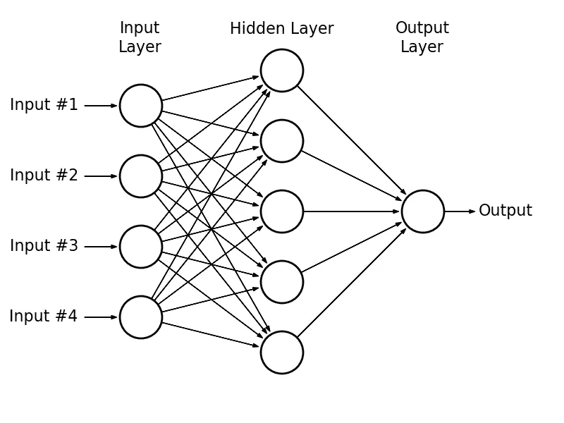
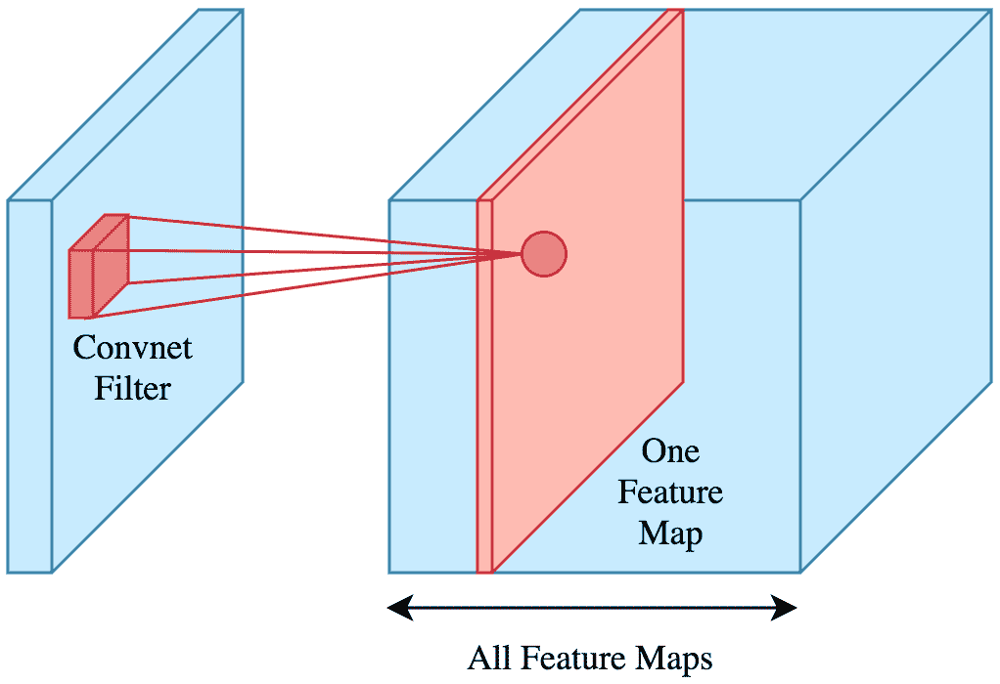
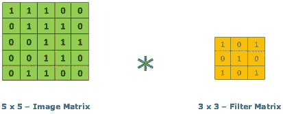
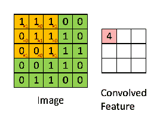
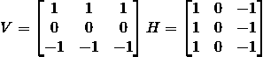
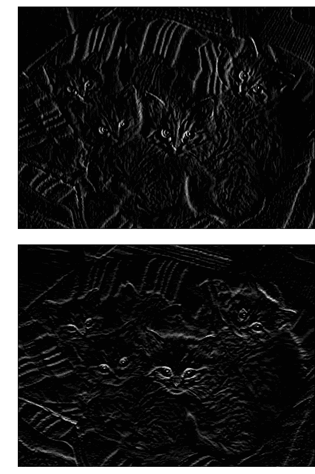

# 如何用 Python (TensorFlow Eager API)训练卷积神经网络

> 原文：<https://towardsdatascience.com/convolutional-neural-networks-an-introduction-tensorflow-eager-api-7e99614a2879?source=collection_archive---------18----------------------->

Keep an eye out for Deep Learning. Source: [Pixabay](https://pixabay.com/photos/eye-iris-look-focus-green-1132531/).

卷积神经网络是过去十年深度学习经常成为头条新闻的一部分。今天我们将使用 TensorFlow 的 eager API 训练一个**图像分类器**来告诉我们一幅图像中包含的是一只狗还是一只猫。

由于人工神经网络在许多领域具有前所未有的能力，它最近已经颠覆了几个行业。然而，不同的深度学习架构在每个方面都很出色:

*   图像分类(卷积神经网络)。
*   图像、音频和文本生成(GANs、RNNs)。
*   时间序列预测(RNNs，LSTM)。
*   推荐系统。
*   巨大的等等(例如，回归)。

今天我们将关注列表中的第一项，尽管每一项都值得单独写一篇文章*。*

# 什么是卷积神经网络？

在多层感知器(MLP)中，*香草*神经网络，每层的神经元连接到下一层的所有**神经元。我们称这种类型的层为完全连接的层。**

A MLP. Source: [astroml](http://www.astroml.org/book_figures/appendix/fig_neural_network.html)

卷积神经网络是不同的:它们有卷积层。

在完全连接的层上，每个神经元的输出将是前一层的线性变换，由非线性激活函数组成(例如， *ReLu* 或 *Sigmoid* )。

相反，**卷积层**中每个神经元的输出只是前一层神经元的一个(通常很小)**子集**的函数。

Source: [Brilliant](https://brilliant.org/wiki/convolutional-neural-network/)

卷积层上的输出将是对前一层神经元的子集应用**卷积**的结果，然后是激活函数。

# 什么是卷积？

给定一个输入矩阵 *A* (通常是前一层的值)和一个被称为**内核**或**滤波器** *K* 的权重矩阵(通常小得多)，卷积运算将输出一个新的矩阵 *B* 。

by @[RaghavPrabhu](https://medium.com/@RaghavPrabhu/understanding-of-convolutional-neural-network-cnn-deep-learning-99760835f148)

如果 *K* 是一个 *CxC* 矩阵，那么 *B* 中的第一个元素将是以下结果:

*   取 *A* 的第一个 *CxC* 子矩阵。
*   将每个元素乘以其在 *K* 中的相应权重。
*   添加所有产品。

这最后两个步骤相当于展平 *A* 的子矩阵和 *K* ，并计算结果向量的点积。

然后我们向右滑动 K 以获得下一个元素，依此类推，对每一行重复这个过程。

Convolution visualization by @[RaghavPrabhu](https://medium.com/@RaghavPrabhu/understanding-of-convolutional-neural-network-cnn-deep-learning-99760835f148)

根据我们的需要，我们只能从以第 *Cth* 行和列为中心的内核开始，以避免“越界”，或者假设“A 之外”的所有元素都有某个默认值(通常为 0)——这将定义 *B* 的大小是小于 *A* 还是相同。

如你所见，如果 *A* 是一个 *NxM* 矩阵，那么现在 *B* 中每个神经元的值将不取决于 *N*M* 权重，而只取决于其中的 *C*C* (少得多)。这使得卷积层比全连接层轻得多，有助于卷积模型学习得更快。

当然，我们最终会在每一层上使用许多内核(得到一堆矩阵作为每一层的输出)。然而，这仍然需要比我们的老 MLP 少得多的重量。

# 为什么会这样？

为什么我们可以忽略每个神经元如何影响大多数其他神经元？嗯，这整个系统成立的前提是每个神经元都受到其“邻居”的强烈影响。然而，远处的神经元对它只有很小的影响。

这个假设在图像中**直观上是真实的——如果我们想到输入层，每个神经元将是一个像素或一个像素的 RGB 值。这也是为什么这种方法对图像分类如此有效的部分原因。**

例如，如果我拍摄一张照片中有蓝天的区域，很可能附近的区域也会使用相似的色调来显示天空。

像素的相邻像素通常具有相似的 RGB 值。如果他们没有，那么这可能意味着我们在一个图形或物体的边缘。

如果你用笔和纸(或计算器)做一些卷积，你会意识到如果在某种边缘上，某些内核会增加输入的强度。在其他边缘，他们可以减少它。

作为一个例子，让我们考虑下面的内核 *V* 和 *H* :

*V* 过滤垂直边缘(上面的颜色与下面的颜色非常不同)，而 *H* 过滤水平边缘。注意一个是另一个的转置版本。

# 卷积示例

这是一窝小猫未经过滤的照片:

如果我们分别应用水平和垂直边缘滤镜，会发生以下情况:

我们可以看到一些特征变得更加明显，而另一些逐渐消失。有趣的是，每个过滤器展示了不同的功能。

这就是卷积神经网络如何学习识别图像中的特征。让它适合自己的内核权重比任何手动方法都要容易得多。想象一下，试图用手弄清楚你应该如何表达像素之间的关系… *！*

为了真正掌握每个卷积对一张图片的影响，我强烈建议你在这个网站上玩一玩。它对我的帮助比任何书籍或教程都大。去吧，把它收藏起来。很好玩。

好了，你已经学了一些理论。现在让我们进入实际部分。

# 如何在 TensorFlow 中训练一个卷积神经网络？

TensorFlow 是 Python 最流行的深度学习框架。我也听说过 PyTorch 的优点，虽然我从来没有机会尝试。

我已经写了一篇关于[如何用 TensorFlow 的 Eager API](http://www.datastuff.tech/machine-learning/autoencoder-deep-learning-tensorflow-eager-api-keras/) 训练神经网络的教程，重点是自动编码器。

今天会有所不同:我们将尝试三种不同的架构，看看哪一种做得更好。像往常一样，所有的代码都可以在 [GitHub](https://github.com/StrikingLoo/Cats-and-dogs-classifier-tensorflow-CNN) 上获得，所以你可以自己尝试或者跟着做。当然，我还会展示 Python 代码片段。

# 数据集

我们将训练一个神经网络来预测一幅图像是包含一只狗还是一只猫。为此，我们将使用 Kaggle 的[猫狗数据集](https://www.kaggle.com/c/dogs-vs-cats)。它包含 12500 张猫和 12500 张狗的图片，分辨率各不相同。

# 用 NumPy 加载和预处理我们的图像数据

神经网络接收特征向量或矩阵作为输入，通常具有**固定维度**。我们如何从我们的照片中产生这种感觉？

幸运的是，Python 的图像库为我们提供了一种将图像作为 NumPy 数组加载的简单方法。RGB 值的高 x 宽矩阵。
我们已经在[这篇文章](http://www.datastuff.tech/machine-learning/k-means-clustering-with-dask-editing-pictures-of-kittens/)中这样做了，所以我将重用这段代码。

然而，我们仍然必须解决固定维度部分:我们为输入层选择哪些维度？这很重要，因为我们必须将每张图片调整到所选的分辨率。我们不想扭曲太多的长宽比，以免给网络带来太多的噪音。

下面是我们如何看到数据集中最常见的形状。

为此，我对前 1000 张图片进行了采样，尽管当我查看 5000 张图片时，结果并没有改变。最常见的形状是 375×500，尽管我决定将它除以 4 作为我们网络的输入。

这就是我们的图像加载代码现在的样子。

最后，您可以用这个代码片段加载数据。我选择使用 4096 张图片作为训练集的样本，1024 张图片作为验证集的样本。然而，这只是因为我的电脑不能处理更多的内存大小。

如果你在家尝试，可以随意增加这些数字到最大值(比如训练用的 10K 和验证用的 2500 )!

# 训练我们的神经网络

首先，作为一种基线，让我们看看一个普通的 MLP 在这项任务中表现如何。如果卷积神经网络如此具有革命性，我预计这个实验的结果会是**可怕的**。

这是一个单隐层全连接神经网络。

本文的所有训练都是使用 AdamOptimizer 完成的，因为它是最快的。我只调整了每个模型的学习率(这里是 1e-5)。

这个模型我训练了 10 个纪元，基本收敛到**随机猜测**。我确保**打乱了训练数据**，因为我是按顺序加载的，这可能会使模型产生偏差。

我使用 **MSE** 作为损失函数，因为它通常更直观地解释。如果你的 MSE 在二进制分类中是 0.5，你就等于**总是预测 0** 。然而，具有更多层或不同损失函数的 MLP**并没有表现得更好**。

# 训练卷积神经网络

单个卷积层能有多大好处？让我们给我们的模型加一个看看。

对于这个网络，我决定添加一个单一的卷积层(24 个内核)，然后是 2 个完全连接的层。

Max Pooling 所做的只是将每四个神经元减少到一个，四个之间的值最高。

仅仅过了 5 个时代，它已经比以前的网络表现得更好了。验证 MSE 为 0.36，这已经比随机猜测好得多了。但是请注意，我不得不使用一个小得多的学习率。此外，即使它在更少的纪元中学习，**每个纪元**花费**更长的时间**。该型号也重了很多(200 多 MB)。

我决定也开始测量预测和验证标签之间的皮尔逊相关性。这款车型得分 15.2%。

# 两个卷积层的神经网络

因为那个模型做得更好，我决定尝试一个更大的。我添加了**另一个卷积层**，并使两者都大了很多(每个 48 个内核)。这意味着模型可以从图像中学习更复杂的特征。然而，这也不出所料地意味着我的内存几乎爆炸。同样，训练花费了**更长的时间**(15 个周期半小时)。

结果非常好。预测和标签之间的皮尔逊相关系数达到 0.21，验证 MSE 低至 0.33。

让我们来测量网络的准确性。因为 1 是猫，0 是狗，我可以说“如果模型预测的值高于某个阈值 *t* ，那么预测*猫*。否则预测*狗*在尝试了 10 个简单的阈值后，这个网络的最大准确度达到了 61% 。

# 更大的卷积神经网络

显然，增加模型的大小可以让它学习得更好，所以我试着把两个卷积层都做得更大，每个都有 128 个滤波器。我没有改动模型的其他部分，也没有改变学习率。

这个模型最后达到了 30%的关联度！它最好的**准确率是 67%** ，这意味着它有三分之二的时间是正确的。我认为一个更大的模型可能更符合数据。然而，这个已经花了 7 分钟了，我不想离开下一个训练一上午。

通常，在模型的**尺寸**和**时间限制**之间需要做出**的权衡。大小限制了网络能够多好地适应数据(一个**小模型**会**不适应**)，然而我不会等 3 个小时让我的模型学习。**

如果你有一个商业截止日期，同样的担心也适用。

# 结论

我们已经看到，在图像分类任务中，卷积神经网络比传统架构明显更好(T21)。我们还尝试了不同的**指标**来衡量**模型性能**(相关性、准确性)。

我们了解了**模型的尺寸**(防止欠拟合)和它的**收敛速度**之间的**权衡**。

最后，我们使用 TensorFlow 的 eager API 来轻松训练一个深度神经网络，并使用 numpy 进行(尽管很简单)图像预处理。

在以后的文章中，我相信我们可以用不同的池层、过滤器大小、步长和不同的预处理进行更多的实验。

你觉得这篇文章有用吗？你会更喜欢学习其他的东西吗？还有什么不清楚的吗？请在评论中告诉我！

*在*[*Twitter*](http://www.twitter.com/strikingloo)*[*Medium*](http://www.medium.com/@strikingloo)*或*[*dev . to*](http://www.dev.to/strikingloo)*上找我如果有什么问题，或者想联系我什么的。如果你想从事机器学习事业，下面是我的* [*推荐阅读清单*](http://www.datastuff.tech/data-science/3-machine-learning-books-that-helped-me-level-up-as-a-data-scientist/) *。**

**原载于 2019 年 6 月 12 日*[*http://www . data stuff . tech*](http://www.datastuff.tech/machine-learning/convolutional-neural-networks-an-introduction-tensorflow-eager/)*。**