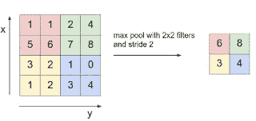
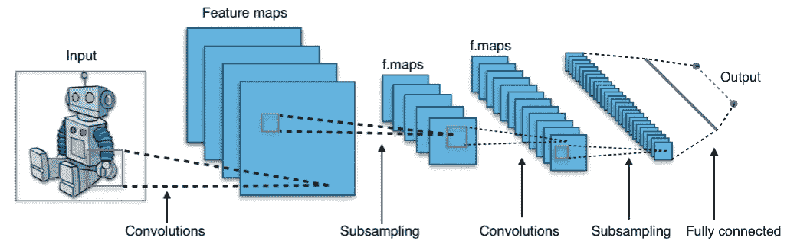

# 卷积神经网络

> 原文：<https://towardsdatascience.com/convolutional-neural-networks-e5a6745b2810?source=collection_archive---------5----------------------->

研究人员在研究图像处理算法时提出了 CNN 或卷积神经网络的概念。传统的全连接网络有点像一个黑匣子，它接收所有的输入，并将每个值传递给一个密集的网络，然后再传递给一个热输出。这似乎适用于少量输入。

但是，当我们处理 1024x768 像素的图像时，我们的输入是 3x1024x768 = 2359296 个数字(每个像素的 RGB 值)。消耗 2359296 个数字的输入向量的密集多层神经网络在第一层本身中每个神经元将具有至少 2359296 个权重——第一层的每个神经元 2MB 的权重。那太疯狂了！对于处理器和内存来说。在 20 世纪 90 年代和 21 世纪初，这几乎是不可能的。

这使得研究人员想知道是否有更好的方法来完成这项工作。任何图像处理(识别或操作)的首要任务通常是检测边缘和纹理。接下来是识别和处理真实对象。如果我们同意这一点，显然要注意的是，检测纹理和边缘真的不依赖于整个图像。人们需要查看给定像素周围的像素来识别边缘或纹理。

此外，用于识别边缘或纹理的算法(不管它是什么)在整个图像中应该是相同的。我们不能对图像的中心或任何角落或侧面使用不同的算法。检测边缘或纹理的概念必须是相同的。我们不需要为图像的每个像素学习一组新的参数。

这种理解导致了卷积神经网络的出现。网络的第一层由扫描图像的小块神经元组成——一次处理几个像素。通常这些是 9 或 16 或 25 像素的正方形。

CNN 非常有效地减少了计算。小“过滤器/内核”沿着图像滑动，一次处理小块。整个图像所需的处理是非常相似的，因此这非常有效。如果你对这个主题的详细研究感兴趣，可以看看马修·d·泽勒和罗布·弗格斯的论文

虽然它是为图像处理而引入的，但多年来，CNN 已经在许多其他领域得到了应用。

# 一个例子

现在我们对 CNN 的基本概念有了一个概念，让我们感受一下数字是如何工作的。正如我们所见，边缘检测是任何图像处理问题的首要任务。让我们看看如何使用 CNN 来解决边缘检测问题。

左侧是 16×16 单色图像的位图。矩阵中的每个值代表相应像素的亮度。正如我们所看到的，这是一个简单的灰色图像，中间有一个方形块。当我们试图用 3×3 滤波器(在中间)卷积它时，我们得到了一个 14×14 的矩阵(在右边)。

我们选择的滤镜会高亮显示图像中的边缘。我们可以在右边的矩阵中看到，与原始图像中的边缘相对应的值很高(正或负)。这是一个简单的边缘检测滤波器。研究人员已经确定了许多不同的过滤器，可以识别和突出显示图像的不同方面。在典型的 CNN 模型开发中，我们让网络自己学习和发现这些过滤器。

# 重要概念

看了美国有线电视新闻网的顶级节目后，让我们向前迈进一步。在我们进一步使用有线电视新闻网之前，这里有一些我们应该知道的重要概念。

## 填料

卷积滤波器的一个明显问题是，每一步都通过减少矩阵大小(缩小输出)来减少“信息”。本质上，如果原始矩阵是 N x N，而滤波器是 F x F，则得到的矩阵将是(N-F+1)x(N-F+1)。这是因为边缘上的像素比图像中间的像素使用得少。

如果我们在图像的所有边上按(F-1)/2 像素填充，N x N 的大小将被保留。

因此，我们有两种类型的卷积，有效卷积和相同卷积。有效本质上意味着没有填充。因此，每次卷积都会缩小尺寸。相同卷积使用填充，以保留矩阵的大小。

在计算机视觉中，F 通常是奇数。所以这个很管用。奇数 F 有助于保持图像的对称性，也允许中心像素，这有助于在各种算法中应用统一的偏置。因此，3x3、5x5、7x7 滤清器非常常见。我们还提供 1x1 滤波器。

## 交错卷积

我们上面讨论的卷积是连续的，因为它连续地扫描像素。我们也可以通过在图像中移动卷积滤波器时跳过 s 个像素来实现这一点。

因此，如果我们有 n x n 个图像和 f x f 个滤波器，并使用步长 s 和填充 p 进行卷积，则输出大小为:((n + 2p -f)/s + 1) x ((n + 2p -f)/s + 1)

当然，如果这不是一个整数，我们就必须向下或向上推。

## 卷积 v/s 互相关

互相关本质上是矩阵在自下而上的对角线上的卷积。翻转将关联性添加到操作中。但是在图像处理中，我们不会翻转它。

## RGB 图像上的卷积

现在我们有一个 n x n x 3 图像，我们用 f x f x 3 滤波器对它进行卷积。因此，我们有一个高度，宽度和数量的渠道，在任何图像及其过滤器。在任何时候，图像中的通道数都与过滤器中的通道数相同。该卷积的输出具有(n-f+1)的宽度和高度以及 1 个通道。

## 多个过滤器

用三通道滤波器卷积的三通道图像给我们一个单通道输出。但是我们并不仅限于一个过滤器。我们可以有多个过滤器，每个过滤器都会产生一个新的输出层。因此，输入中的通道数应与每个滤波器中的通道数相同。并且滤波器的数量与输出中的通道数量相同。

因此，我们从 3 通道图像开始，以输出中的多个通道结束。这些输出通道中的每一个都代表由相应的滤波器拾取的图像的某个特定方面。因此，它也被称为一个功能，而不是一个渠道。在真实的深度网络中，我们还添加了一个偏差和一个非线性激活函数，如 RelU。

## 池层

池化本质上是将多个值组合成一个值。我们可以有平均池、最大池、最小池等。因此，具有 fxf 池的 nxn 输入将生成(n/f)x(n/f)输出。它没有需要学习的参数。

Max Pooling

# CNN 架构

典型的中小型 CNN 模型遵循一些基本原则。

A Typical CNN Architecture (Source Wikimedia)

*   交替卷积和池层
*   逐渐减小帧尺寸并增加帧数量，
*   接近末端的平坦且完全连接的层
*   对所有隐藏层重新激活，然后对最后一层进行软最大化

CNN 架构中的一个突出概念是交替层将信息内容一个接一个地变为稀疏和密集。这有助于分离信息的各个部分。你可以把这想象成某人在玩一个棉花球。如果我们一次又一次地推拉这些线，我们自然会将各个线分开。类似地，CNN 可以分离图像中的单个成分。

随着我们转向大型和超大型网络，事情变得越来越复杂。研究人员为我们提供了更多可以在这里使用的具体架构。ImageNet 、 [GoogleNet](https://www.cv-foundation.org/openaccess/content_cvpr_2015/papers/Szegedy_Going_Deeper_With_2015_CVPR_paper.pdf) 和 [VGGNet](https://arxiv.org/pdf/1409.1556v6.pdf) 就是其中的几个。

# 履行

通常实施 CNN 模型数据分析和清理，然后选择我们可以开始使用的网络模型。我们根据网络数量的布局、层的大小以及它们的连接性来提供架构，然后我们允许网络自己学习其余部分。然后，我们可以调整超参数来生成一个足以满足我们目的的模型。

让我们看一个卷积网络如何工作的简单例子。在[之前的博客](/a-glimpse-of-tensorflow-bd9c6c06ab73)中，我们看了一下用完全连接的神经网络构建 MNIST 模型。如果您想详细了解如何使用 TensorFlow 和 Keras 构建深度模型，可以查看一下。现在让我们看看用卷积网络做同样的工作。

## 导入模块

我们从导入所需的模块开始。

## 获取数据

下一步是获取数据。出于学术目的，我们使用 Keras 模块中内置的数据集——MNIST 数据集。在现实生活中，这需要更多的处理。现在，让我们继续进行。

因此，我们加载了训练和测试数据。我们对数据进行整形，使其更适合卷积网络。本质上，我们将其改造成一个 4D 数组，该数组有 60000(记录数)个大小为 28x28x1 的条目(每个图像的大小为 28x28)。这使得在 Keras 中构建卷积层变得很容易。

如果我们想要一个密集的神经网络，我们会将数据重塑为 60000 x784——每个训练图像的 1D 记录。但是 CNN 的不一样。记住卷积的概念是 2D——所以没有必要将其展平成一维数组。

我们还将标签改为分类的独热数组，而不是数字分类。最后，我们归一化图像数据，以确保我们减少了[消失梯度](https://en.wikipedia.org/wiki/Vanishing_gradient_problem)的可能性。

## 建立模型

Keras 库为我们提供了现成的 API 来构建我们想要的模型。我们从创建顺序模型的实例开始。然后，我们将各个层添加到模型中。第一层是处理 28×28 的输入图像的卷积层。我们将内核大小定义为 3，并创建 32 个这样的内核，以创建 32 帧的输出，大小为 26x 26(28–3+1 = 26)

其次是 2x2 的最大池层。这将尺寸从 26x26 减小到 13x13。我们使用最大池，因为我们知道问题的本质是基于边，我们知道边在卷积中显示为高值。

随后是另一个内核大小为 3×3 的卷积层，生成 24 个输出帧。每帧尺寸为 22x22。它后面又是一个卷积层。最后，我们展平这些数据，并将其提供给一个密集层，该层具有对应于 10 个所需值的输出。

## 训练模型

最后，我们用现有的数据训练模型。五个时期足以获得相当精确的模型。

# 摘要

上面的模型只有 9*32 + 9*24 = 504 个值需要学习。这太神奇了。一个完全连接的网络在第一层中每个神经元需要 784 个权重！因此，我们大大节省了处理能力，同时降低了过度拟合的风险。请注意，在此过程中，我们使用了我们对问题的了解。我们使用我们所知道的，然后训练模型去发现其余的。使用全连接或随机稀疏网络的黑盒方法永远不会以这样的成本获得这样的精度。

通过使用我们所知道的，我们把机器限制在已知的范围内。从头开始训练网络可能会开辟未知的途径。然而，最好是留给学术研究人员。如果我们想创造一些今天可以使用的东西，一个人应该很好地融合知识和发现。卷积神经网络帮助我们实现了这一点。