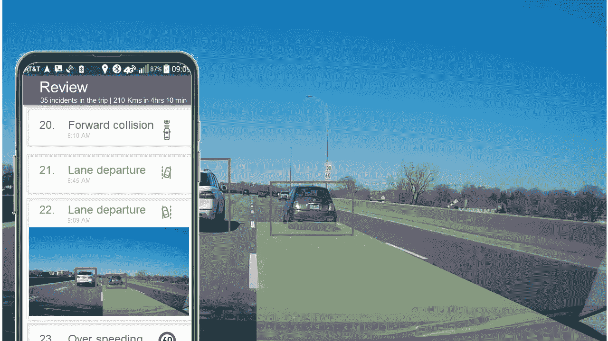
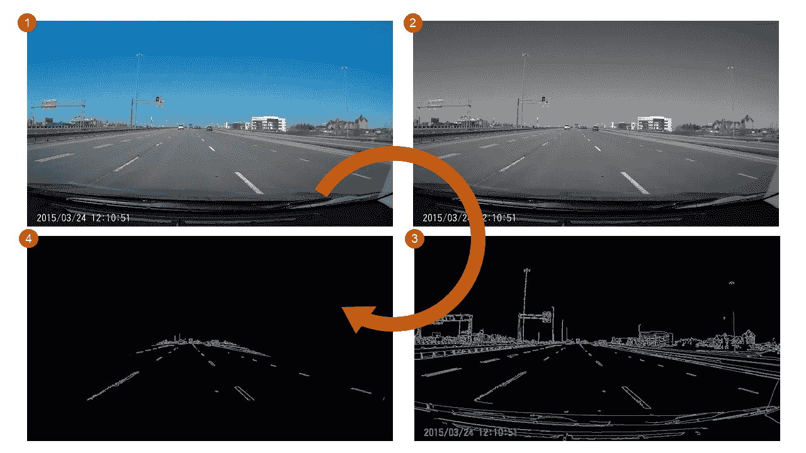
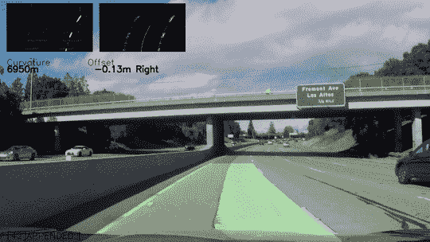
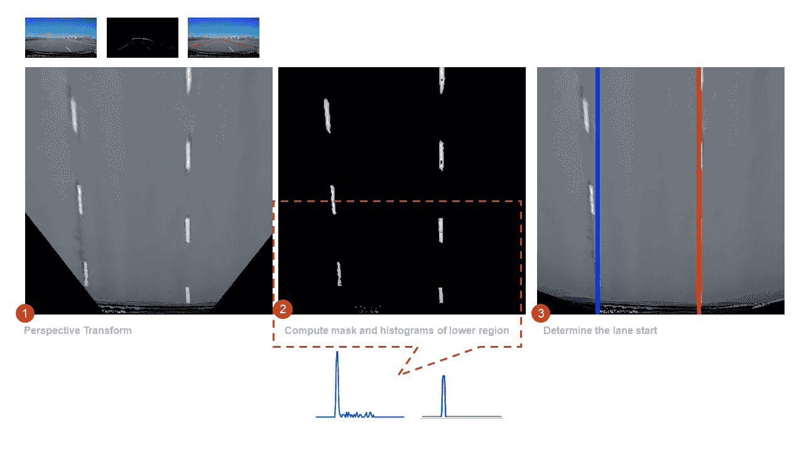
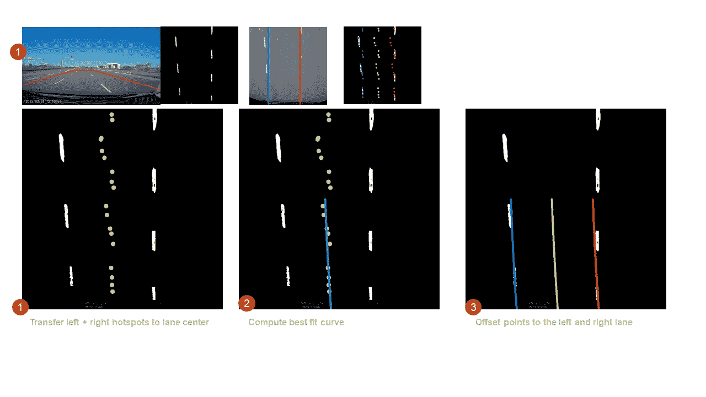
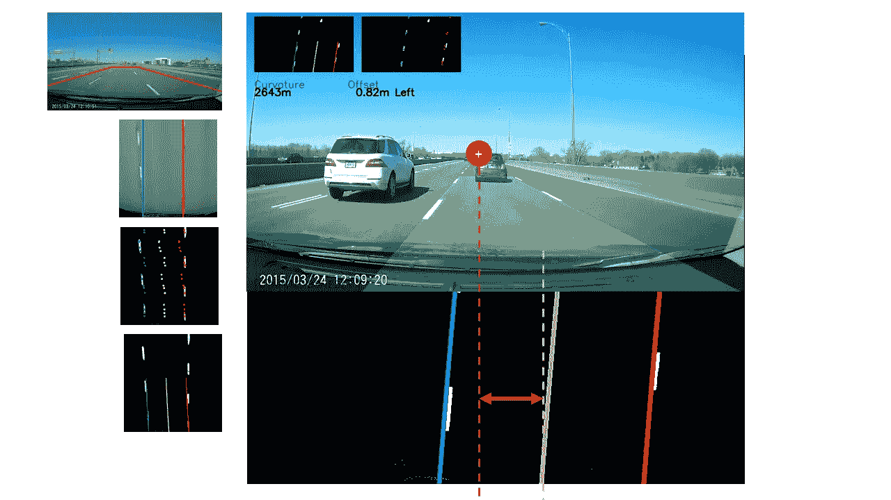
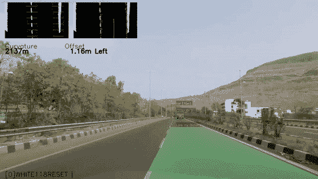
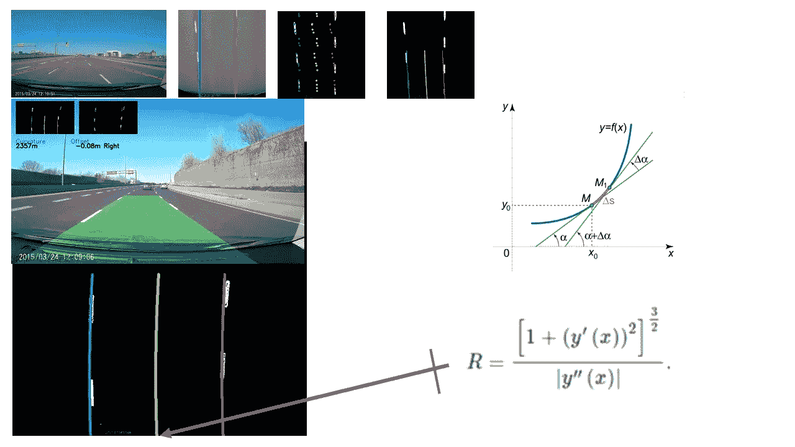
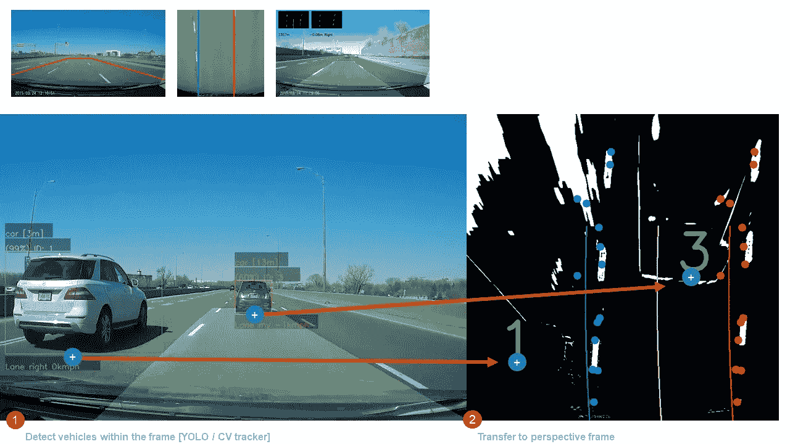
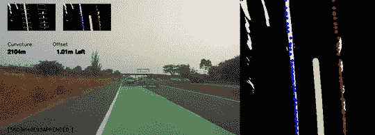

# 下次通勤时，你的手机会成为副驾驶吗？小型设备上的障碍物和车道检测。

> 原文：<https://towardsdatascience.com/copilot-driving-assistance-635e1a50f14?source=collection_archive---------8----------------------->

## 副驾驶:车道和障碍物检测，在驾驶过程中提供主动协助。让智能手机的算法既可靠又灵活

Fig 1 Collision and lane change autonomous warning

尼尔转过身来，把石碑指给他的女儿看。一家三口开车去海边度周末。“我明白了，你要我写什么回信？”坐在后座的女儿皮娅问道。"你能读出他写的内容吗？"尼尔反问道。他们的掀背车以大约每小时 40 英里的速度行驶。尼尔瞥了一眼后视镜看着皮娅。由于一时疏忽，他没有注意到前面 5 秒钟处的 SUV 紧急刹车。

他安装在挡风玻璃上的手机有一个来自前置摄像头的应用程序记录。它实时监控车辆。就在 Neel 看着镜子的时候，3 秒钟的阈值被打破了，手机发出一声警告哔哔声，就在 Pia 喊“爸爸小心”的时候。

当这家人打开行李进入酒店时，他们庆幸的是，除了侧镜外，其他人都安然无恙。

全球每年道路事故死亡人数总计约 150 万，刚好相当于毛里求斯的人口。[其中 90%发生在低收入和中等收入国家](https://www.who.int/violence_injury_prevention/road_safety_status/2018/en/),这些国家拥有的汽车数量不到世界总量的一半。不到 0.1%的车辆配备了高级驾驶辅助系统(ADAS)车道检测和碰撞警告。它们在发展中国家几乎不存在。

新兴经济体的智能手机拥有率中值约为四轮车的 10 倍。虽然我们已经有半自动车辆在世界各地行驶。这篇文章检验了我们离使用移动计算平台作为 ADAS 副驾驶还有多远。

# 探测车道

如果我们必须教会计算机理解道路场景，第一步是车道检测。从汽车到斑马线，我们检测到的所有其他东西都存在于我们行驶的车道环境中。我们关心的是我们车道上前方车辆的保险杠距离。

我们可以利用车道的一些特征。车道线是平行的；它们是白色或黄色的。在很大程度上，它们在整个道路上是连续的，有一个标准的宽度。对于安装在挡风玻璃上的摄像机，它们通常在图像帧周围均匀分布。从一帧到另一帧，识别的曲线将是连续的。

安装在挡风玻璃上的摄像机拍摄场景的正面。在前视图中，随着我们向地平线上移动，明显的车道宽度减小。这对于计算距离来说不是很好。正是由于这个原因，我们将卫星送入低地球轨道，拍摄鸟瞰图像，进行地形计算。作为第一步，我们需要将 dash-cam 前视图转换为俯视图。

如果我们看下面的图片，车道线似乎在地平线上相交。这就是所谓的消失点。在俯视图中，消失点或地平线附近的点比它们在前视图中相距更远。我们必须将前视图中源图像的一组点映射到顶视图中的一组图像。我们可以手动选择四个这样的点(使用路面作为指导)，我们知道这些点在俯视图中会形成一个矩形，但在前视图中会显示为菱形。这一步可以使用消失点作为参考自动完成，因为我们知道菱形的所有斜边都会相交于其上。自动化对于改变摄像机位置不是很稳定(每个 dashcam 素材都有不同的位置),可能需要对过程进行一些调整

Fig -2 Obtaining Images from gray-scale images

如果我们观察图像内部表面的边缘(*见上图 2❶-❹*)，它们似乎形成了一条线，在消失点相交。我们将 [canny 滤波器](https://en.wikipedia.org/wiki/Canny_edge_detector)应用于灰度图像，以获得代表边缘的点云。Canny 计算每个像素的亮度梯度。然后它使用[阈值](https://en.wikipedia.org/wiki/Canny_edge_detector#Double_threshold)来过滤掉一些噪音。如果我们用灰度图像的中值作为基准，这些阈值看起来是最好的。现在，在图像的上半部分可能会有标志，这可能会增加我们后续步骤的噪声，因此我们添加了一个菱形遮罩来过滤感兴趣的区域，如❹.所示

边缘点包含嵌入在噪声中的多条线。在这些明显的线条中有一些是空白的。这些明显的线的斜率有噪声。我们需要一种稳健的方法将边缘点转化为直线。[霍夫变换](https://en.wikipedia.org/wiki/Hough_transform)用于识别图像中的线条和形状，在给定一组点的情况下，使用投票算法和约束条件来决定候选线条。我已经对这些[控件](https://github.com/visualbuffer/copilot/blob/aedbcbe421f0a2d678fbcda1b16ed50fc3e1d108/lane_detection.py#L348)的图像尺寸进行了基准测试，这似乎为不同帧尺寸的线条提供了合理的预测。

有时，驾驶车辆(自我车辆)的发动机罩，甚至部分仪表板可能会进入前视图。在任何处理之前，我们应该在第一阶段就把它们剔除掉。

## 透视变换

我们现在已经从边缘点获得了线(*见下面的图 3*)。使所有这些直线的垂直距离之和最小的点就是我们的消失点。我们使用[数学](https://github.com/visualbuffer/copilot/blob/1c568973de92749be7837e4846f1777aee43e70a/lane_detection.py#L360)构造来缓解它。我们随后使用这个消失点创建一组[源点](https://github.com/visualbuffer/copilot/blob/1c568973de92749be7837e4846f1777aee43e70a/lane_detection.py#L380)(红色多边形❷的角)来映射到目的点(俯视图❸).的角)我发现[将顶视图尺寸](https://github.com/visualbuffer/copilot/blob/1c568973de92749be7837e4846f1777aee43e70a/lane_detection.py#L276)设置为 360 X 360px 似乎足够好了，即使目标图像是 720 px 高。

Fig 3 Creating a birds-eye view

我们也可以将源点的顶部边缘移向消失点。这将增加车道线曲线所基于的路面。然而，随着我们越来越接近消失点，噪声增加，因为更大的图像空间(俯视图)被挤压到前视图中更小的像素区域中。你可以在顶视图中找到两个黑色的三角形尾巴，因为我们已经在前视图图像下面取了最后一个源点。这使我们可以在俯视图中使用完整的车道区域(直到自我车辆),因为它是使用透视变换从正面图像中展开的。因此，它会留下一个黑色的三角形伪影。

## 从透视图像中创建遮罩

透视图像(3 通道 RGB)还不可用。我们必须将它转换为一个掩码(掩码矩阵)，从中我们可以提取车道信息。这是整个过程中最棘手的一步。你必须在不同的光照条件下驾驶过汽车:黎明、中午、夜晚、阴暗处、高速公路上的森林里等等。这些变化中的一些是逐渐的，而作为建筑物/天桥阴影的一些是非常突然的。虽然我们可以在 RGB 颜色空间(255，255，255)中隔离白色通道，但黄色有点棘手。迁移到 [HL](https://en.wikipedia.org/wiki/HSL_and_HSV) S(色调、亮度、饱和度)色彩空间更容易管理，我们将使用 HLS *转换的*图像作为提取蒙版的起点。

Fig 4 Using Thresholds to create a mask

我们从[为白色和黄色蒙版设置一个低/高阈值](https://github.com/visualbuffer/copilot/blob/master/lane_detection.py#L311)开始。如果一切都是静态照明和背景，这就足够好了。然而，随着背景和照明条件的变化，我们必须每隔几秒钟更新一次阈值。最敏感的因素是较低的亮度界限(HLS 中的 l ),选择一个不正确的数字(ⓐ——ⓓ，见上面的图 4 ),其他一切都将付诸东流。在我们应用阈值之前，最好有一个[标准化步骤](https://github.com/visualbuffer/copilot/blob/master/lane_detection.py#L299)。我们可以通过计算该区域上的平均亮度(l ),并使用该平均值来调节我们用于计算掩模的阈值，来使用紧接在车辆❷前面的路面。查看下面的 gif 图，当汽车通过天桥时，该步骤如何恢复阈值。

Fig 5 Recovering from a shadow

## 检测车道起点和宽度

我们现在有了从顶视图获得的遮罩。我们必须开始从中提取车道信息。作为第一步，我们需要[确定左右车道的起点](https://github.com/visualbuffer/copilot/blob/master/lane_detection.py#L395)。在*屏蔽矩阵*(列的总和)的直方图上的峰值给了我们这样的结果。有时车道可能会向左/向右弯曲，因此使用汽车附近的较低 portion❷(见下图 6)来计算直方图更为谨慎。

Fig 6 Detecting the lane start

在大多数道路上，车道的标准宽度为 3.5 到 3.75 米。我们可以使用此信息将顶视图图像中的像素坐标系映射到图像所代表的真实世界坐标系。[使用这个比率，](https://github.com/visualbuffer/copilot/blob/master/lane_detection.py#L420)俯视图中的所有位置都可以转换成现实世界中的位置。因此，我们可以报告车辆的速度、发生碰撞的时间以及道路在某一点的曲率半径。

## 清扫窗户

在上一步中，我们已经确定了车道起点。在这一步中，我们必须提取包含车道线的像素。同样，我们使用下面描述的滑动窗口机制。第一步是进行一次水平扫描，[获得由左右矩形包围的像素](https://github.com/visualbuffer/copilot/blob/master/lane_detection.py#L678)。随后，我们确定这些像素的中点，以确定下一步窗口的[水平位置。(参见下面的图 7)我们不断重复这些步骤来提取下一行的像素，直到我们覆盖了整个图像。](https://github.com/visualbuffer/copilot/blob/master/lane_detection.py#L706)

我们必须设置窗口高度和宽度参数。高度由我们想要滑过框架的窗口数量决定。一般来说，窗口数量越多，曲线拟合得越好，窗口宽度也越大。设置太高，我们最终会浪费计算资源。通常，我发现每帧 25-35 个窗口是最佳的。将[窗宽](https://github.com/visualbuffer/copilot/blob/master/lane_detection.py#L278)增加到很高将开始拾取来自人行道或路边植物的噪音。

Fig 7 Finding lane hotspots using window sweeping

这一步有些复杂。在一个窗口内，有时可能选择的像素太少，而在其他情况下可能选择的像素太多(回想一下，我们必须使用宽窗口来扫过)我们如何确定下一个窗口的 *x* 位置。在每一种情况下，我们都必须拒绝窗口中的信息，因为它是不可用的，并输入下一个窗口 *x* 位置的估计值。有[三个选项](https://github.com/visualbuffer/copilot/blob/master/lane_detection.py#L697)可供选择:如果相邻行已被填满，我们可以将其位置偏移车道宽度并继续。否则，如果足够数量的行已经被*预*填充，我们可以使用一般曲线来估计下一个位置。如果不成功，我们可以使用前一帧中获得的位置继续。如果万不得已，我们可以继续纵向发展。

有时，在一行的高亮像素之间可能会有一个[间隙](https://github.com/visualbuffer/copilot/blob/master/lane_detection.py#L709)。如果我们忍受它，车道会因噪音而弯曲。最好拒绝这样的帧，并使用来自前一帧的信息来纠正它。每当我们拒绝整个帧时，谨慎的做法是重新校准我们用来创建掩码的阈值。在这个阶段的最后，我们有一组左右像素。

## 最佳拟合车道中心

我们已经获得了左侧和右侧车道坐标，现在我们必须对这些坐标拟合一条曲线。如果不是因为系统拾取的噪声，这应该很简单。如果我们从底部的几个窗口中取所有点，并让优化器为下一个点或曲线产生一个估计值，它可能最终会给阳光照射的点一个很高的权重，并产生一个不规则的曲线。缓和这种情况的一种方法是在每个窗口中使用[(点](https://github.com/visualbuffer/copilot/blob/master/lane_detection.py#L691)的)质心，并使用质心来估计曲线(见下图 8)。我发现这对于噪声更鲁棒。

Fig 8 Determining the best fit lane

一旦我们得到一条曲线，[我们将它与前一帧的曲线进行比较，以检查它们是否彼此接近。足够接近时，我们接受曲线，否则我们继续从先前的帧进行估计。在拒绝的情况下，我们设置一个计数器，一旦它记录出一个阈值，我们就接受该解决方案，即使它已经超过了最大可接受的偏差。这有助于我们捕捉系统错误并从中恢复。作为最后一步，我们使用移动平均来消除一些噪声，而不是直接进行曲线估计。](https://github.com/visualbuffer/copilot/blob/master/lane_detection.py#L717)

值得注意的是，左车道线和右车道线都可以估计两条独立的曲线。然而，使用中线估计在两个方面更好。首先，它汇集了两条车道的信息，即使其中一条车道线缺失或错误，这也有助于产生估计值。第二，车道线是平行的，将它们视为两个独立的实体会丢失这些信息。

## 切换车道和计算偏移

开车时，我们会变换车道，因此系统必须监控我们在车道上的位置，并在需要时触发车道变换。让我们弄清楚。对于每个车道，我们已经确定了车道的起始位置。它的中点给了我们车道的中心。俯视图中摄像机的中心给出了车辆中心的位置。我们可以通过使用之前计算的比率，将其从像素坐标系转换为真实世界的偏移。如果这个偏移量大于车道宽度的一半，我们就准备在下一帧中切换车道(见下面的图 9)。

fig 9 Changing Lanes

对于转换车道，我们将所有东西偏移一个车道宽度。我们保留车道线的旧坐标，为两条车道所共有，并重置另一条车道。在大多数情况下，它顺利发生。(参见下面的图 10)。

Fig 10-Switching from the right to the left lane | NH60 India

我们可以使用多项式系数来确定汽车当前位置的[真实世界曲率半径](https://github.com/visualbuffer/copilot/blob/master/lane_detection.py#L146)(见下图 11)。这可以是对给出性感曲线的虚假帧的另一种检查，因为计算的半径不会在帧与帧之间突然改变。

Fig 11 radius of curvature

# 检测车辆

有许多方法用于物体检测。 [YOLO](https://pjreddie.com/darknet/yolo/) 在平衡准确性和计算成本方面[相当高效](https://medium.com/@jonathan_hui/object-detection-speed-and-accuracy-comparison-faster-r-cnn-r-fcn-ssd-and-yolo-5425656ae359)。然而，即使是 YOLO 也无法在移动处理环境中从实时视频流中挤出边界框。对象[追踪器](https://docs.opencv.org/3.4/d9/df8/group__tracking.html)精确而快速，可以用有限的计算资源做实时流。我们可以让 YOLO 每隔一段时间制作一张目标地图[并让一个目标追踪器大部分时间跟随它。除了从一个坐标系切换到另一个坐标系之外，这很容易实现。](https://github.com/visualbuffer/copilot/blob/master/frame.py#L185)

Fig 12 Locating cars

在从追踪器到 YOLO 的切换过程中，我们应该能够在当前帧中定位先前识别的车辆(见上面的图 12)。YOLO 生产粘合盒。因此，我们必须创建一种方法来识别刚刚进入视野的新汽车，并将边界框分配给前一帧中识别的汽车 ID。我们使用 [IOU 度量](https://github.com/visualbuffer/copilot/blob/master/frame.py#L187)来分配具有现有 id 的头寸。

最后一步是[计算车辆参数](https://github.com/visualbuffer/copilot/blob/master/lane_detection.py#L445):位置速度、碰撞时间。如果我们将下边缘的中点作为车辆的位置参考(不完美，因为我们可能会斜着看车辆，但这是一个很好的估计)，我们可以计算所有的参数。将坐标转换到俯视图中，我们可以获得真实世界中车辆离摄像机有多远。帧与帧之间距离的变化给出了速度的估计。如果车辆在车道上，汽车正在行驶(由简单的代数不等式确定)，我们可以根据观察到的速度确定前车相对于本车减速时发生碰撞的时间(见下图 13)。

Fig 13 Front view and top view

我们基于到边界框的距离进行所有的测量。在大多数情况下，它准确地反映了真实的地面距离。然而，只要作为消失点测量的地平线上的点在帧之间保持一致，这就起作用。然而，我们在坑洼路面、斜坡上行驶，等等。所有这些都会扰乱消失点。这将导致车辆看起来比实际更远或更近。如果我们把系统设置成只有当我们行驶超过 20 KMPH 时才触发，我们就可以避免这些陷阱。我们设计的用例是巡航速度，所以这是可以接受的。

由 YOLO 和追踪器编码的边界框会增加噪声。有时盒子与车辆的轮廓太紧，而在其他盒子上与车辆轮廓更宽松。我们可以通过使用移动平均来估计位置，并使用稍大的周期来估计速度，从而减弱一些噪声。然而，不利的一面是，它降低了系统的一些响应能力。

物体检测的最后一个障碍是道路分隔物对其他车辆的阻碍。测量到车辆的距离时，假设边界框的下边缘与道路平面相交。这在大多数情况下是正确的，但是如果道路中间有一个分隔线或者一辆车挡住了视线，它会裁剪掉最终的边界框。车辆将出现在道路的更远处。这种判断错误会经常发生。然而，这不是一个交易破坏者。为了避免碰撞，我们主要关注与自我车辆在同一车道上的摄像机附近的车辆。我们可以忽略一些反向穿越马路的车辆，忍受一些计算上的失误。

# 够快吗？能快一点吗？

这在没有 GPU 的台式机或笔记本电脑上实时运行。处理速度对以下参数敏感:触发 YOLO 的时间、输入视频的帧速率和视频的像素分辨率。减少这些参数中的任何一个都会提高处理速度。我发现 Yolo 每 2 秒触发一次，以 360 像素、10 帧/秒的速度工作，比笔记本电脑上的实时帧速率要好。

在移动设备能够实时运行该算法之前，这仍然需要调整。好在还有弥补的余地。对象检测 YOLO 占用了每帧的大部分处理时间。它使用 VGG 网络构建的主体，可以替代较小的移动架构。这将在一些准确性和更快的处理之间进行权衡。我们也可以调整在一个自定义头只做车辆+行人+交通灯检测，而不是 80 类。

一些代码可以重构，以便在对象检测和车道检测之间共享。追求的方向之一是直接使用俯视图(缩放到 446 X 446)进行对象检测和跟踪。这有助于我们跳过在不同坐标系之间多次重新缩放的部分。

最后，如果我们抛开 dash-cam 记录器用例，专注于检测、报警和日志记录(可能立即有听觉音调，并在驱动器后有表格摘要),我们可以去掉用于产生增强视频的部分代码。这将使我们的速度提高一个数量级，允许移动设备处理实时信息。

# 这会导致什么？

汽车行业的监管环境正在发生变化。较低的排放标准加上较高的安全评估要求增加了合规成本。在监管不利的情况下，投资在便携式设备上运行的 ADAS 平台将间接有助于安全性，并以制造商极低的前期和运营成本改善整体客户体验。

> 运输经济的未来将建立在微观交易的基础上，而微观交易本身就需要区分谨慎和疏忽

汽车行业的终端用户角色也在重新定位。车主、司机和通勤者传统上是同一个人。在未来，这些角色将由不同的个人来执行。这是有道理的，因为每辆停放的车辆都是闲置资产。运输经济的未来将建立在微观交易的基础上，而微观交易本身就需要区分谨慎者和疏忽者。这就是主动辅助算法可以发挥作用的地方。从驾驶时的*轻推*行为开始，到根据驾驶分数历史确定保险费。

汽车工业的最终产品正在发生变化。这种变化需要新的技能和关系。电动汽车的部件数量比传统的汽油发动机少一个数量级。该行业可能会对其供应商群进行横向整合。在这种动态中，承担了开拓成本的先行者很可能在以后获得有利的标准和网络。ADAS 为传统玩家提供了一个机会，让他们在这一转变过程中押下较小但渐进的赌注。

最后，ADAS 的现有参与者，从创新者市场转向早期采用者的障碍之一是[意识](https://www.mckinsey.com/industries/semiconductors/our-insights/advanced-driver-assistance-systems-challenges-and-opportunities-ahead)。创建一个半功能的智能手机应用程序是他们可以尝试的技巧之一。

并非所有当前的智能手机都支持主动辅助算法所需的处理能力。然而，在新兴经济体，每年有三分之一的智能手机被替换。这难道不是一个为基于移动设备的驾驶助手造势的有力案例吗？

# 其他链接:

1.  [Colab 笔记本](http://bit.ly/coPilot-colab)【在 youtube 视频上运行该过程，替换新视频的链接，调整设置】
2.  包含全部代码的 Github 存储库

 [## 视觉缓冲器/副驾驶

### 车辆位置+碰撞时间叠加在顶视图附文…

github.com](https://github.com/visualbuffer/copilot) 

汽车行业一直在以惊人的速度适应变化。你一直在管理这些变化吗？我很想听听你对未来的看法。同样，如果您正在构建这些解决方案，我很想听听您的故事。请在我的 [LinkedIn](http://bit.ly/copilot-linkedin) 上留言。