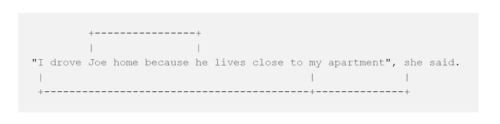

# Python 中的共指消解

> 原文：<https://towardsdatascience.com/coreference-resolution-in-python-aca946541dec?source=collection_archive---------6----------------------->

## 使用 NeuralCoref 将基于神经网络的共指消解集成到您的 NLP 管道中


在人类语言中，**内水平意识**在理解(解码)技能、写作(编码)技能和一般语言意识中起关键作用。内指包括语篇中的回指、下指和自我参照。

**指代是指一个词为了其意思而回指文本中的其他概念。**

```
*David went to the concert. He said it was an amazing experience.***He** refers to *David*.
**It** refers to the concert.
```

**指代发生在一个词指代文本后面的想法时。**

```
*Every time I visit her, my grandma bakes me cookies.***Her** refers to my grandma.
```

**共指消解**是 **NLP** (自然语言处理)相当于信息检索系统、会话代理和亚马逊的 Alexa 等虚拟助理中使用的内视感知。它的任务是将文本中涉及相同底层实体的提及进行聚类。

例如:



*“我”、“我的”*、*“她”*属于同一类，而*“乔”*、*“他”*属于同一类。

解析引用的算法通常寻找与引用表达式兼容的最近的前面提及。代替使用基于规则的依赖解析树，神经网络也可以被训练，其考虑单词嵌入和提及之间的距离作为特征。

[**neural refe**](https://github.com/huggingface/neuralcoref)**是一个集成在 SpaCy 的 NLP 管道中的开源 python 包。您可以使用 pip 安装 NeuralCoref:**

```
pip install neuralcoref
```

**或来自虚拟环境中具有依赖关系的源:**

**SpaCy 和 NeuralCoref 可用于创建生产就绪的 NLP 应用程序，只需稍加微调。例如，让我们解析历史上的 [**美国诉尼克松**](https://www.law.cornell.edu/supremecourt/text/418/683) 案，以检索引用美国前总统理查德·尼克松的事实:**

****输出:**
*事实计数:***108****

1.  ****在指控白宫某些工作人员和总统的政治支持者违反联邦法规的起诉书后，特别检察官在美联储的领导下提出了一项动议。****
2.  ****继续。17(c)要求在审判前出示与总统和其他人之间准确确定的谈话和会议相关的某些磁带和文件的传票。****
3.  ****总统以行政特权为由，提出动议撤销传票。****

***该脚本使用 Urllib 抓取网页，并使用 Beautiful Soup 解析 HTML。我们将文本加载到我们选择的空间模型中；您可以从终端下载预先训练的空间模型，如下所示:***

```
*python -m spacy download en_core_web_lg*
```

***SpaCy 管道分配单词向量、上下文特定的标记向量、词性标记、依存解析和命名实体。通过扩展空间的注释管道，您可以解析共同引用。***

***您可以使用`doc._.coref_clusters`属性检索所有相关提及聚类的列表，并使用`doc._.coref_resolved`属性用每个聚类中的主要提及替换相关提及。***

***SpaCy 有一个内置的无监督句子标记器，可以将文本分成一系列句子。对于你感兴趣的主题(如总统)，使用小写的词条化句子进行近似字符串搜索。***