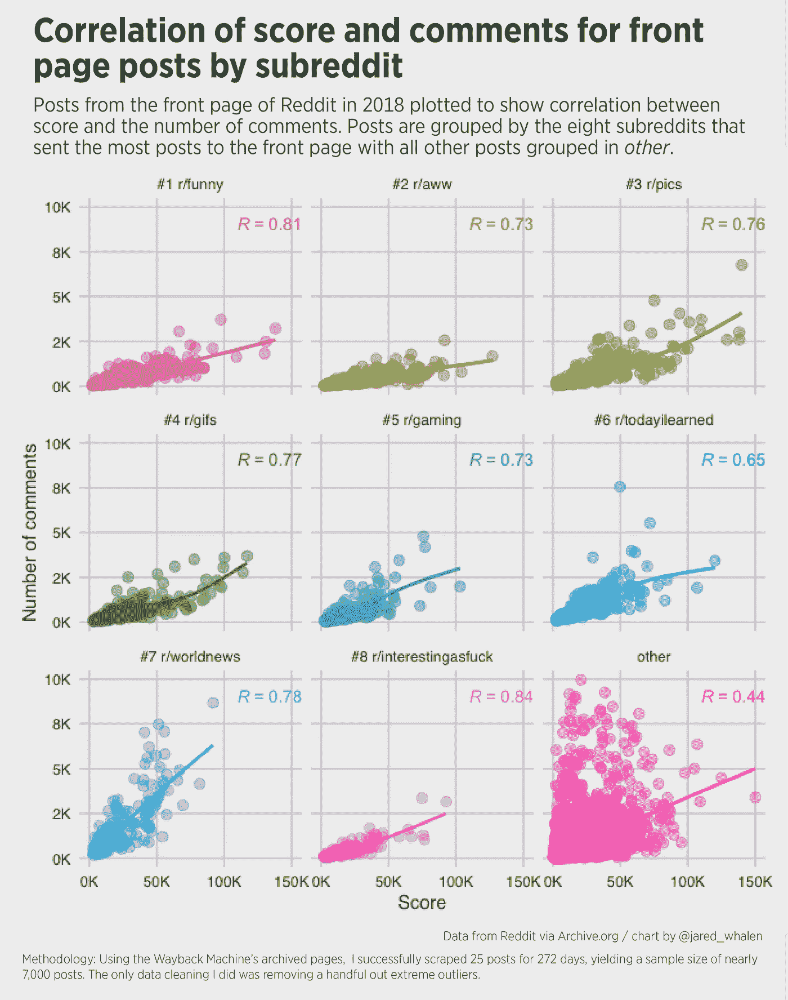
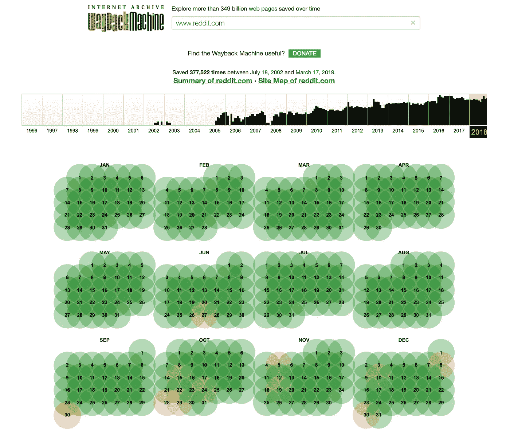

# Reddit 首页评分与评论的相关性

> 原文：<https://towardsdatascience.com/correlation-between-score-and-comments-on-the-front-page-of-reddit-a9e7b4f23b64?source=collection_archive---------18----------------------->

我不是 Reddit 的大用户，但当我在那里时，我通常只在几个子网站上闲逛(r/dataisbeautiful，r/geography，r/philadelphia，r/emo 和其他几个网站)。除了广受欢迎的数据 viz subreddit，这些数据都不会产生你在 reddit 首页看到的分数。

我说这些只是为了指出*我没有*挖掘出 Reddit 文化的所有细微差别。*然而*有一天，在仔细阅读了互联网的首页后，我确实有一个问题——一个热门帖子的分数和围绕它的对话量之间有关联吗？



It looks like r/worldnews really struck up some conversations!

首先，**获取数据**。我看了一下 Reddit 主页的 api，但没有看到在给定的日期和时间内拉顶部帖子的方法。所以我求助于 [Wayback 机器的](https://web.archive.org/) API，它可以使用特定的日期和时间作为端点，并将返回最近的网页截图的 url。



The front page is pretty well archived it appears.

我非常自信地认为我可以为 2018 年收集大量数据，于是我跳到 R 并生成了一个完整的 URL 列表来调用 API。

```
library(lubridate)
dateRange <- gsub(“-”,””,seq(ymd(‘20180101’),ymd(‘20181231’), by = ‘1 day’, truncated=2))
base_url <- "[https://archive.org/wayback/available?url=reddit.com](https://archive.org/wayback/available?url=reddit.com)"#create list of api urls
url_list <- c()
for (date in dateRange) {
  full_url <- paste(base_url, "&timestamp=",date, "120000", sep="")
  url_list <- c(url_list, full_url)
}
```

现在我们可以调用 Wayback 机器来获取网页截图列表。

```
#create list of archive links
archive_list <- c()
archive_times <- c()for (url in url_list) {
  #get raw result from api call
  raw.result <- GET(url = url)
  raw.result$status_code
  #get raw content from results
  this.raw.content <- rawToChar(raw.result$content)
  #put content into list
  this.content <- fromJSON(this.raw.content)
  #extract archive url from list and add to archive_list
  archive_times <- c(archive_times, this.content$archived_snapshots$closest$timestamp)
  archive_list <- c(archive_list, this.content$archived_snapshots$closest$url)
}
```

这给了我们一个 365 个 URL 的列表，从每天中午开始捕获。现在开始真正的网络抓取。可能有更快的方法，但是我用一个老式的*来循环*，并使用 **rvest** 包来抓取该页面 25 个帖子中每个帖子的分数、评论数和 r/subreddit。

在将 r/subreddit 值添加到 datalist 变量之前，我通过检查来确保 r/subreddit 值的长度大于 0(即任何帖子实际上都被提取了),从而包含了一些简单的错误处理。

循环完成后，我使用 rbind 填充数据帧并过滤掉任何有问题的数据。

```
#create empty list
datalist = list()#loop through archive urls
for (i in 1:length(archive_list)) {
  #get all the html from the webpage
  webpage <- read_html(archive_list[i])
  #filter all the .things
  things <- webpage %>%
    html_node("#siteTable") %>%
    html_nodes(".thing")
  #get votes
  score <- things %>%
    html_node(".score") %>%
    html_text()
  #get number of comments
  comments <- things %>%
    html_node(".comments") %>%
    html_text()
  #remove " comments" and convert to number
  comments <- as.numeric(gsub(" comments","", comments))
  # get post subreddit
  subreddit <- things %>%
    html_node(".subreddit") %>%
    html_text()
  #get date of page
  date <- gsub("[http://web.archive.org/web/|/https://www.reddit.com/](http://web.archive.org/web/|/https://www.reddit.com/)", "", archive_list[i])if (length(subreddit) > 0) {
    print(paste(unique(date),length(subreddit),sep=" "))
    #create temp df
    temp <- data.frame(date = date, score = score, comments = comments, subreddit = subreddit)
    #add it to the list
    datalist[[i]] <- temp
  }
}#make a df from the datalist
main_data = do.call(rbind, datalist)
#remove incomplete posts
reddit_posts <- main_data %>% 
  filter(score != "•",
         !is.na(score),
         !is.na(comments)
         ) %>% 
  mutate(score = as.numeric(sub("k", "e3", score, fixed = TRUE)),
         subreddit = gsub(".*r/","r/",subreddit))
```

擦伤怎么样了？不算太坏。该网站在一年的 75%的时间里成功地发布了每日帖子。我没有对此进行彻底的调查，因为我有足够的数据来处理，但我认为 Wayback 机器在 Reddit 网站重新设计方面存在一些问题。

现在我们有了一个新生成的数据集，但是为了产生我想要的可视化效果，它需要一些争论。

1.  找出将最多帖子发送到首页的八个子编辑
2.  将来自非顶级订阅者的帖子的 subreddit 值更改为“其他”
3.  对子编辑因子级别进行重新分类，使其以降序排列，末尾是“其他”。

```
#get top 8 subreddits
top_subs <- reddit_posts %>% 
  group_by(subreddit) %>% 
  summarise(count=n()) %>% 
  top_n(8, count) %>% 
  ungroup()#create vector of top_subs
top_subs <- as.character(top_subs$subreddit)#make notin operator
'%!in%' <- function(x,y)!('%in%'(x,y))reddit_posts_reduc <- reddit_posts %>% 
  mutate(subreddit = case_when(
    subreddit %!in% top_subs ~ 'other',
    TRUE ~ as.character(.$subreddit)
  ))#get list of factors in descending order
factor_order <- reddit_posts_reduc %>% 
  group_by(subreddit) %>% 
  summarise(count=n()) %>% 
  arrange(desc(count)) %>% 
  select(subreddit)#overwrite with list
factor_order <- as.vector(factor_order$subreddit) 
#remove "other" from first position
factor_order <- factor_order[-1]
#create new factor level list
factor_order2 <- factor_order
#update new factor list with ordering info
for (i in 1:length(factor_order)) {
  factor_order2[[i]] <- paste("#",i," ",factor_order[[i]], sep = "")
}
#append other to both factor lists
factor_order <- append(factor_order, "other")
factor_order2 <- append(factor_order2, "other")#update dataframe levels with update factor levels
reddit_posts_reduc$subreddit_f <- mapvalues(reddit_posts_reduc$subreddit, from = factor_order, to = factor_order2)
levels(reddit_posts_reduc$subreddit_f)
```

现在，是时候策划了。我把评论的数量标在 x 轴上，分数标在 y 轴上。我使用轴限制来说明异常值，最终结果是一个按子网格分组并标有相关系数的小多次波图。

```
#plot data
reddit_posts_reduc %>% 
ggplot(aes(
  x=score,
  y=comments,
  color=subreddit_f)
       ) +
  geom_point(size=3, alpha=0.4) +
  facet_wrap(~subreddit_f, ncol = 3) +
  geom_smooth(se=F) +
  theme_fivethirtyeight() +
  theme(axis.title=element_text()) +
  # labs(title = "Correlation between score and comments on front page",
  #      subtitle = "Posts from the front page of Reddit in 2018 plotted to show correlation between score and the number of comments. Posts are grouped by the eight subreddits that sent the most posts to the front page with all other posts grouped in other.",
  #      caption = "Data from Reddit via Archive.org\nChart by @jared_whalen"
  #      ) +
  theme(legend.position="none") +
  stat_cor(method = "pearson", label.x = 110000, label.y = 9000) +
  scale_y_continuous(label=unit_format(unit = "K", scale = 1e-3, sep=""),
                     limits=c(0,10000)) +
  scale_x_continuous(label=unit_format(unit = "K", scale = 1e-3, sep=""),
                     limits=c(0,150000)) +
  xlab("Score") +
  ylab("Number of comments"**)**
```

**我从这个项目中得到的东西**

*   如何使用 Wayback 机器的 API 来抓取存档的页面
*   更好地理解重新指定因子级别，以便在打印时自定义排序

这里是整个源代码的要点。