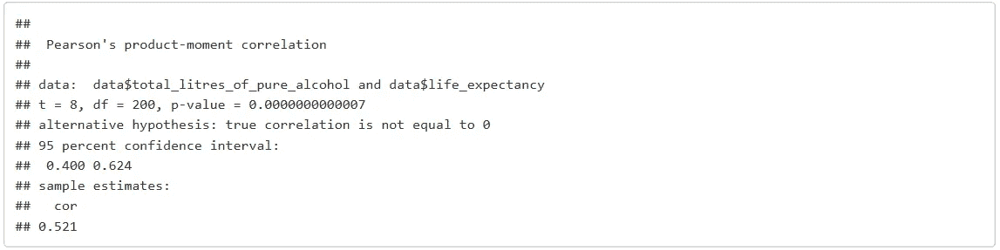

# 关联与因果——酒精如何影响预期寿命

> 原文：<https://towardsdatascience.com/correlation-causation-how-alcohol-affects-life-expectancy-a68f7db943f8?source=collection_archive---------11----------------------->

## 我们应该多喝酒来长寿吗？

## 相关性并不意味着因果关系！

作为初级统计学家和数据科学家，我们反复听到这句话。但那实际上是什么意思呢？这个小分析借助于 **R** 和简单回归揭示了这个话题，聚焦于酒精如何影响健康。

# 狄俄尼索斯的困境

关于酒精对健康的影响以及它如何改变人的寿命，已经有很多研究了。只要在谷歌上输入*“酒精预期寿命研究”*，我们就会得到大约 11，000，000 个结果。有些人可能声称适度饮酒实际上对我们的健康有益，而大多数研究表明，即使每天一杯酒也会降低预期寿命。

这项分析研究了不同国家的饮酒量和平均预期寿命之间的关联模式，解释了可能的相关性，并提供了为什么这些相关性可能存在的见解。

我最初的假设是，预期寿命更高的国家也消费更多的酒精。起初这听起来可能有争议，但这可能是由于其他因素，如更高的生活质量，只有它的副产品是获得酒精饮料。

# 配料

这项任务使用了 3 个数据集:

*   *Drinks.csv* :各个国家 15 岁及以上人口每年人均饮酒量(啤酒、葡萄酒和烈酒)
*   *life expectation . CSV*:各个国家的预期寿命和其他健康因素
*   *countries of world . xlsx*:各个国家的地理和社会经济数据。

# 混合饮料

数据包含了 193 个国家的啤酒、葡萄酒和烈酒。这些数字存储为字符，因此我们可以将它们转换为数字数据类型。

缺失值在数据集中显示为问号，我们将用 *NA* 值替换这些符号。

我们需要一种有意义的方式来汇总这些服务:根据众所周知的刻板印象，法国人可能会消费更多的葡萄酒，而德国人可能会喝更多的啤酒。然而，我们需要一种方法在相似的范围内比较这些国家。

我编写了一个函数，使用以下公式计算每个国家纯酒精的总升数:

> *总* _ *升*_*纯* _ *酒精* = *啤酒* _ *份数*∫(12∫0.0295∫0.05)+*葡萄酒* _ *份数*∫(5∫0.0295∫

我们最终得到了下表:

Table 1: Drinks dataset

# 生活中的期望

`life_exp`数据包含各种健康指标(出生时的预期寿命、60 岁时的预期寿命和健康预期寿命)，显示了从 1990 年到 2013 年按性别分列的综合数据。

我关注的是 2012 年男女出生时的预期寿命，并加入了按国家分列的`drinks`数据。

在预期寿命和饮酒量之间进行一个简单的相关性测试，我们可以看到一个 0.521 的结果。

这标志着适度的高相关性，表明酒精消费量高的国家也有更高的预期寿命。我们将进一步调查这一现象。

# 我们是世界

`countries`的数据比其他两个稍微混乱一些。它被存储为一个*。xlsx* 文件。在导入过程中，我们跳过了第 1 页上的前 3 行不重要的内容。(现在)第一行包含标题，它的一部分也留在了第二行。

Table 2: Countries dataset

我将第一行和第二行合并成一个标题，清除了列名(空格、点等)。)并将必要的列转换为数字类型。最后，我将地理和社会经济数据与之前的数据集合并。

# 相关性和因果关系

让我们快速看一下不同的因素是如何与预期寿命相关联的:

Figure 1: Correlations of numeric features

如前所述，饮酒量(混合饮酒和分开饮酒)与预期寿命呈相对正相关。婴儿死亡率和死亡率当然是负相关的(人死得越多/越快，平均水平就越低)。

Figure 2: Highest positive and negative correlations

手机数量、文化水平和人均 GDP 也与寿命延长高度相关。这导致了我一开始的假设:教育程度更高、更富裕、技术装备更好的国家有更高的预期寿命。这些情况为公民提供了酒精饮料，他们比没有达到这一水平的贫穷国家消费更多的酒精饮料。

我们可以看到每个区域的相关性来证明这一说法:

Figure 3: Alcohol on Life Expectancy

这个假设似乎确实是对的。更发达的地区如*欧洲*、*美洲*和*西太平洋*(澳新等。)根据`loess`回归似乎有正相关。另一方面，由于经济/文化/宗教原因，像非洲*和地中海东部*这样的欠发达地区倾向于消费较少的酒精，他们的预期寿命不受饮酒量的影响。**

如果我们看看人均国内生产总值对预期寿命的对数回归，它显示了最清晰的画面:

Figure 4: GDP on Life Expectancy

# 摘要

我们首先可以看到饮酒与预期寿命的关系，以及为什么立即下结论是危险的。经过进一步的调查，我们发现，发达国家的人均寿命最高，他们也倾向于消费更多的酒精，但这并不一定意味着另一个。这就是为什么从相关性中暗示因果关系是非常危险的！

Source: [https://xkcd.com/552/](https://xkcd.com/552/)

# 编后记

这个项目是作为匈牙利中欧大学掌握数据科学过程课程的要求而完成的。R 代码和数据集可以在 GitHub 上我的[ceu _ life-expectation](https://github.com/BenceToth/ceu_life-expectancy)存储库中找到。