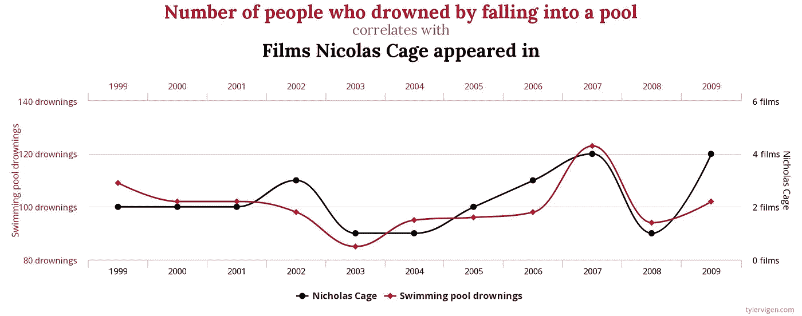

# 相关性并不意味着因果关系

> 原文：<https://towardsdatascience.com/correlation-does-not-imply-causation-92e4832a6713?source=collection_archive---------8----------------------->

## 肺癌会导致吸烟吗？

Photo by [Sajjad Zabihi](https://unsplash.com/@isxjxd?utm_source=medium&utm_medium=referral) on [Unsplash](https://unsplash.com?utm_source=medium&utm_medium=referral)

正如我们今天所知，吸烟会导致肺癌。然而，这一事实在 20 世纪 50 年代并不完全清楚，当时首次研究表明吸烟和肺癌之间的相关性。其中一位怀疑论者是统计学家 R.A. Fisher，他推断因果关系可能正好相反:

> “那么，有没有可能，肺癌——也就是说，必须存在的癌前状态，并且已知在那些将表现出肺癌的人中存在多年——是吸烟的原因之一？我认为不能排除。”

需要说明的是，费舍尔不仅是一名统计学家，还是一名烟瘾很大的人，所以他的观点很可能有失偏颇。然而，他有一个观点:相关性本身不足以确定因果关系。还有什么可以解释相关性？

## 香烟导致肺癌

通常，如果两个变量 A 和 B 相关，至少有四种可能的解释:

1.  a 导致 B
2.  b 导致 A
3.  a 和 B 都是由第三个变量 c 引起的。
4.  机会(相关性是虚假的)。

那么香烟和肺癌之间的因果联系是如何建立的呢？在 50 年代和 60 年代，大量的研究证实了这种相关性。此外，研究还表明，重度吸烟者比轻度吸烟者患更多的癌症，烟斗吸烟者患更多的唇癌，而吸烟者患更多的肺癌。所有证据加在一起，使这个案子变得清楚了。1964 年，美国卫生局局长路德·特里正式宣布了这种因果关系:

> “考虑到来自许多来源的持续的和越来越多的证据，委员会的判断是，吸烟在很大程度上导致了某些特定疾病的死亡率和总体死亡率。”

特里总结说，吸烟对健康有害。

source: xkcd

## 由第三个变量引起的相关性

有时，两个变量之间出现相关性仅仅是因为它们都是由第三个未观察到的变量引起的。教科书上的一个例子是纽约市冰淇淋销售量和谋杀率之间的相关性。显然，这种相关性是由第三个变量引起的:季节。夏天是冰淇淋和犯罪的黄金时间。

其他时候，由第三个变量引起的相关性可能不太明显。考虑雌激素水平和心脏病之间的联系:在 90 年代，研究表明女性的雌激素水平与心脏病风险呈负相关。这是一个重要的问题，因为心脏病是 65 岁以上妇女死亡的主要原因。那么，为什么不默认推荐*激素替代疗法*用于绝经后低雌激素女性呢？事实上，这是千年之交前的普遍看法。

然后，*女性健康倡议*报告了一项涉及 16 万多名女性的长期对照研究的结果，反驳了普遍的看法:激素替代疗法*没有*降低心脏病风险，在某些情况下甚至会适得其反。在这种情况下，第三个变量，绝经，影响心脏病的发病率和雌激素水平，导致观察到的相关性被误认为是因果关系。

另一个显著的例子是疫苗和自闭症之间的明显联系，这引发了持续至今的反疫苗运动。1998 年，医学杂志 *The Lancet* 发表了 Andrew Wakefield 博士的研究，声称发现了自闭症和 MMR(麻疹、腮腺炎、风疹)疫苗之间的联系。那篇论文有很多问题，最重要的是样本量很小——显然是人工挑选的——只有 12 个孩子。与第三个变量的相关性也可能是一个问题:自闭症症状的发展和第一次接种疫苗都发生在幼儿期，因此预计存在时间相关性。

由于其他研究人员指出了这项研究的缺陷，韦克菲尔德的论文很快被《华尔街日报》撤回。后来，韦克菲尔德不仅被指控为糟糕的科学，还被指控为蓄意欺诈。

## 虚假相关

你知道 1999 年至 2009 年间，每年掉进游泳池淹死的人数和尼古拉斯·凯奇的电影数量是相关的吗？

他的电影是不是烂到让观众想在自己的池子里自杀？不，这是一个虚假关联的例子，一个幸运的巧合。泰勒·维根在他的网站上有很多这样的例子。

当研究人员测试大量可能的联系时，伪相关性是一个严重的问题。在《不可思议的统计数据》中，我提到了瑞典 1992 年的一项研究，该研究将住在高压电线附近与儿童白血病联系起来:研究人员在 25 年的时间里调查了住在高压电线 300 米范围内的所有人，并在 800 多种不同疾病中寻找具有统计意义的发病率增长。当然，通过一次查看这么多不同的可能性，很有可能会偶然发现至少一次统计上显著的相关性。这就是所谓的*看别处效应*。

## 结论:小心相关性

相关性本身并不意味着因果关系。有时这两个相关变量是第三个未被观察到的变量的结果，例如雌激素水平和心脏病风险之间的联系。有时，这种相关性可能是虚假的，例如电力线和儿童白血病之间的联系。

建立因果关系比寻找相关性需要更多的工作，因为这是一个更强有力的陈述。这就是推断的问题:*因果关系只能推断，永远无法确切知道。*

## 参考

*   乔丹·艾伦伯格，*如何不犯错:数学思维的力量*
*   饶&安德拉德，[MMR 疫苗与自闭症](https://www.ncbi.nlm.nih.gov/pmc/articles/PMC3136032/)

在我的[个人资料](https://medium.com/@samuel.flender)页面上找到更多我的故事，例如:

 [## 不可能的统计

### 圣经代码、投资基金、彩票和“看别处”效应的诅咒

towardsdatascience.com](/the-statistics-of-the-improbable-cec9a754e0ff)  [## 不要根据结果来判断决定

### 马后炮如何影响我们的判断

medium.com](https://medium.com/swlh/dont-judge-decisions-by-their-outcomes-6f37bec6fd44)