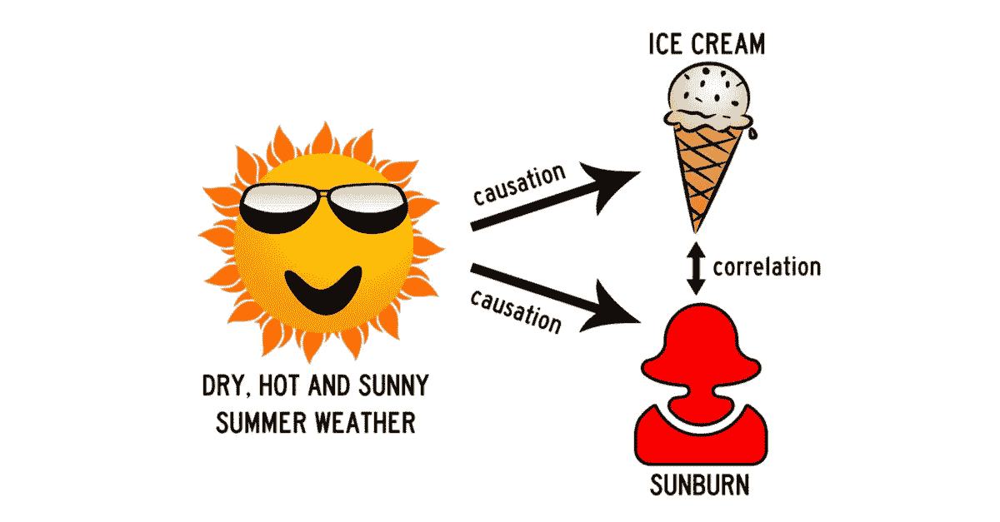
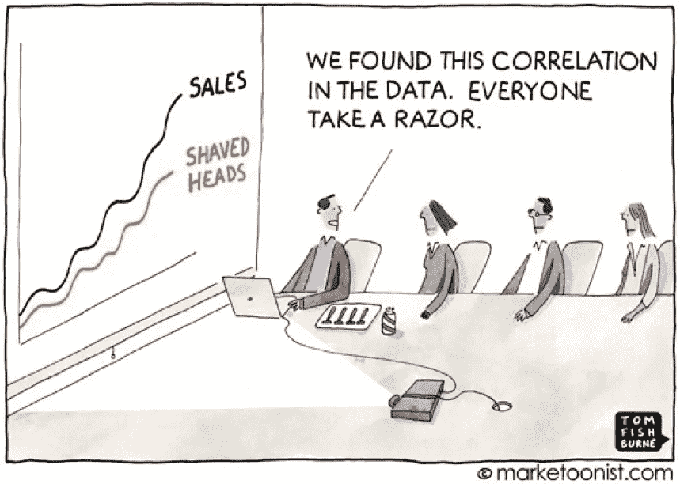
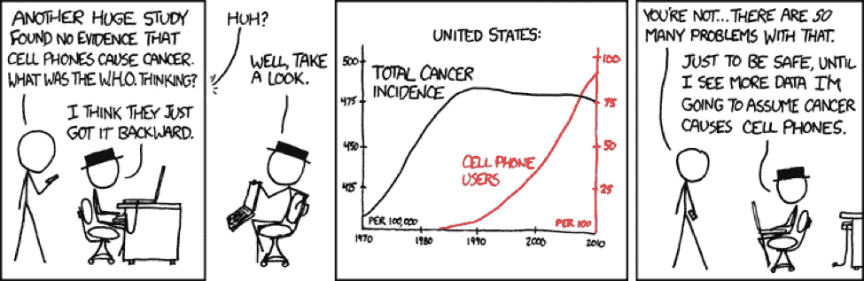

# 相关性不是因果关系

> 原文：<https://towardsdatascience.com/correlation-is-not-causation-ae05d03c1f53?source=collection_archive---------0----------------------->

## 从医疗保健到商业管理，为什么这些概念的混淆具有深远的影响

# 介绍

在相关数据中，一对变量是相关的，因为一个变量可能会随着另一个变量的变化而变化。这种关系可能会让我们认为一个事物的变化会导致另一个事物的变化。本文通过解释相关性、因果关系以及经常将二者混为一谈的偏见，澄清了这种错误的想法。

人类的大脑简化了输入的信息，所以我们可以理解它。我们的大脑经常基于轻微的关系或偏见对事物做出假设。但是这个思考过程并不是万无一失的。一个例子是当我们把相关性误认为因果关系时。偏见会使我们得出这样的结论:如果一件事和另一件事同时以同样的方式发生变化，那么这两件事必然会引起另一件事。本文通过探索这些主题和人类大脑的偏向性，澄清了相关性等于因果关系的误解。

# 关于相关性和因果关系

相关性是两个变量之间的关系或联系，其中一个变量发生变化，另一个变量也可能发生变化。但是一个变量的变化不会引起另一个变量的变化。这是一种关联，但不是因果关系。你从孩子到成人的成长就是一个例子。当你的身高增加时，你的体重也会增加。长高并没有让你变宽。相反，成熟到成年导致这两个变量增加——这就是因果关系。

## 商业中的因果关系

假设我们想给我们的一些客户提供促销或折扣。我们的营销部门想要最大化 delta，换句话说，促销带来的销售增长。所以我们需要决定哪些客户会给我们在促销或折扣上的投资带来最好的回报。我们想只向你的前 10%的客户提供吗？还是垫底的 10%？

你可能会认为推动更多销售的用户对你的商业成功更有责任。然而，这种假设可能是错误的。向哪些客户提供促销的最佳选择可能完全不同。在缺乏有效的实验或分析的情况下，你对这些问题没有准确的答案。

## 认知偏差

有许多形式的认知偏差或不合理的思维模式经常导致错误的结论和经济决策。这些类型的认知偏见是人们在商业和营销中假设错误原因的一些原因:

*   **确认偏差。**人都想对。他们经常不能承认或接受他们在某些事情上是错的，即使这种态度会导致最终的伤害和损失。
*   **因果关系的错觉。过于看重自己的个人信念、过度自信和其他未经证实的信息来源，往往会产生一种伤亡的错觉。一个经济例子是最近的美国房地产泡沫。数百万人相信，以远高于其实际价值的价格购买房屋将继续带来投资回报，因为这种情况发生在过去。**
*   **金钱。**你想销售你的产品。如果赚钱的欲望蒙蔽了你的逻辑，你在营销和其他业务上的花费可能会超过你的投资回报。
*   **主要营销含义。**营销统计和数据往往复杂且令人困惑。当不存在因果关系时，很容易看出变化的销售数字和企业中许多其他变量之间的关系。

## 实验

知道某物有价值需要实验。实验有助于你理解你是否做出了正确的选择。但是这是有代价的。如果你因为不给工作组带来价值的特性而拖了他们的后腿，你会赔钱。但是你会学到这个特性的重要性。

实验的价值在于完成这两件事:

*   在不同的选择中做出决定。
*   量化最佳选择的价值。

## 实验变量

一个科学有效的实验需要三种类型的变量:受控变量、独立变量和从属变量:

*   受**控制的**变量保持不变，因此可以在静态环境中测量彼此相关的其他变量。
*   实验的**独立**变量是唯一可以改变的变量。
*   **因变量**是自变量发生变化时观察到的结果。

任何不受控制的变量或中介变量都会影响实验的准确性。因此，为了正确评估实验结果，需要对它们进行识别和剔除。不可控变量的差异也会影响自变量和因变量之间的关系。

不受控制的变量增加了无关因素对实验结果的影响。相关性可能是假定的，假设可能是在不存在的地方形成的。精确的分析变得困难或不可能。从不受控制的变量中得出的结论的例子显示在儿童音乐课和随后的手机癌症例子中。

## 我们的大脑如何欺骗我们

很容易观察到相关数据的连续变化，并假设一个因素导致另一个因素。这是因为我们的大脑天生就有因果关系认知偏差。我们需要理解大量的输入数据，所以我们的大脑简化了这些数据。这个过程被称为启发式，它通常是有用和准确的。但并不总是如此。试探法出错的一个例子是，每当你相信相关性意味着因果关系。

## 虚假相关

这是一种数学关系，其中两个或两个以上的事件或变量相关联，但不是因果关系，这是由于巧合或某个第三个看不见的因素的存在

## 儿童和音乐课

在对人类大脑发展进行研究后，研究人员得出结论，参加音乐课的 4 至 6 岁儿童在与记忆和注意力相关的领域表现出大脑发展加快的证据。根据这项研究，我们有偏见的大脑可能会很快将这些点联系起来，并得出结论，音乐课可以促进大脑发育。但是还有其他变量需要考虑。孩子们上音乐课这一事实是财富的标志。所以他们可能接触到了其他已知能促进大脑发育的资源，比如良好的营养。

这个例子的要点是，研究人员不能仅从这么多数据中假设音乐课会影响大脑发育。是的，这显然有关联，但没有因果关系的实际证据。我们需要更多的数据来得到真正的因果解释。

## 癌症和手机

如果你研究一张显示癌症病例和手机数量的图表，你会注意到这两个数字在过去的 20 年里都上升了。如果你的大脑以因果关系认知偏见处理这些信息，你可能会认为手机导致癌症。但这太荒谬了。除了两个数据点都在增加之外，没有其他证据。在过去的 20 年里，很多其他的东西也增加了，它们不能全导致癌症或由手机使用引起。

# 可解释性

为了找到因果关系，我们需要可解释性。在人工智能和大数据分析的时代，这个话题变得越来越重要。人工智能提供基于数据的建议。有时候，人类看不到那些建议的任何理由，除了是一个 AI 做出的。换句话说，它们缺乏可解释性。

## 医学中的可解释性

FDA 不会批准缺乏解释力的癌症治疗。想一想这种情况。基于人工智能对你的基因组、你的癌症 DNA、数百万其他病例和更多数据的分析，即使你无法解释计算机的神经网络是如何提出确切的治疗方法的，你想要对你的癌症进行最好的治疗吗？或者你更愿意有一个你能解释原因的次优治疗？

医学可解释性可能是本世纪最大的话题之一。

## 单向对双向

相关性是双向的。我们可以说移动电话的使用与癌症风险的增加相关，癌症病例与移动电话的数量相关。基本上，你可以交换相关性。在因果关系中，我们可以说一项新的营销活动导致了销售额的增加。但是说销售的增加(在活动运行之后)导致了营销活动没有任何意义。

根据定义，任何因果陈述都是一种方式。这是一个很大的线索，关于你处理的是相关性还是因果性。

# 巨大的困境

在《教育对收入的因果影响》一书中，大卫·卡德说，更好的教育与更高的收入相关。但是他说的最重要的事情是，如果我们不能做一个实验，用我们所有的

变量不变，我们不能从相关性中推断因果关系。我们总能把可解释性带到桌面上。但是在现实生活中，有足够大的问题，基于可解释性的原因很难被证明。从科学的观点来看，它们只能被称为理论。

> 在缺乏实验证据的情况下，很难知道教育程度较高的工人所观察到的较高收入是由他们的高等教育造成的，还是收入能力较强的个人选择了接受更多的学校教育。
> 
> —大卫·卡德，教育对收入的因果影响

高收入会导致高等教育吗？高等教育会带来更高的收入潜力吗？我们不知道。但是，我们可以进行预测。我们可以利用这种相关性，根据一个人的教育程度来预测他的收入潜力。我们还可以根据他的收入预测他的教育程度。

## 好的预测是基于相关性的

考虑到本文的上下文，这听起来像是一个矛盾。相关性是指分析静态历史数据集，并考虑观察结果和结果之间可能存在的相关性。然而，预测不会改变一个系统。这就是决策。为了做出软件开发决策，我们需要理解如果您采取行动或不采取行动，它会对系统的发展产生什么影响。决策需要对行动的影响有一个粗略的了解。

## 什么是预测？

我们不会通过发展更好的随意理解来做出更好的预测。相反，我们需要知道我们用来做预测的技术的精确限制，以及每种方法能为我们做什么。

# 参考

Lovestats (2019)。“动画片。”LoveStats 博客。从 lovestats.wordpress.com 取回。

卡片，D..(1999)."教育对收入的因果影响。"*劳动经济学手册*，第 3 卷。