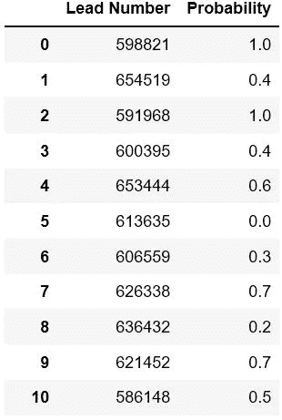
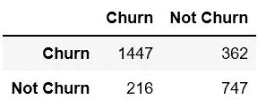
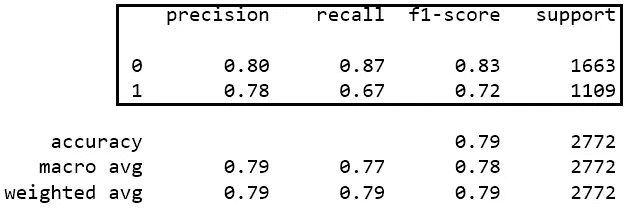
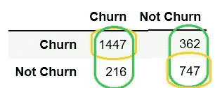
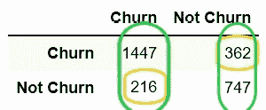
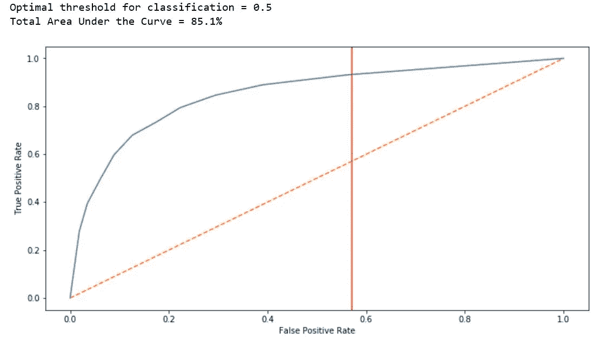
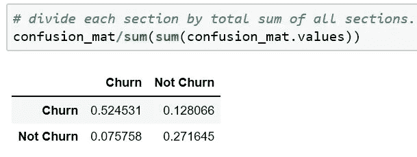
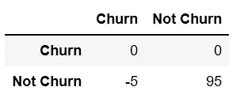
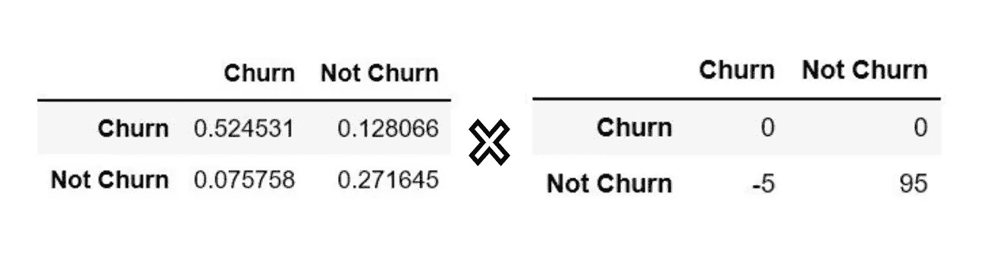
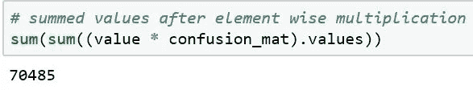

# 销售线索得分预测和成本效益分析

> 原文：<https://towardsdatascience.com/cost-benefit-analysis-by-predicting-lead-score-and-expected-value-fb2082eef50a?source=collection_archive---------12----------------------->

## 现实场景中分析的真正优势

[*链接到笔记本全代码*](https://github.com/zigzagktz/My-work/blob/master/Predictive%20Lead%20Scoring/Lead%20score%20and%20cost%20benefit%20analysis.ipynb)

> 内容
> -成本收益分析
> -期望值
> -领先得分概率
> -分类
> -混淆矩阵
> -准确率、召回率和 F-1 得分

# 问题陈述和解决方案

一家名为 X 教育的公司销售在线课程。任何时候有人访问他们的网站，他们要么注册课程，要么不注册。那些在看到课程信息后仍未注册的人被称为潜在客户。

现在，为了将这些潜在客户吸引回他们的课程，公司尝试了不同的策略，如电子邮件营销或特殊折扣等。问题是，举例来说，如果公司有 50 个潜在客户，并向所有 100 个客户发送电子邮件，可能只有 10 或 15 个客户会注册。因此，公司损失了金钱和精力，这需要我们稍后进行成本效益分析。

解决方案是使用预测模型来确定每个潜在客户参加课程的概率，以便公司只给那些高潜力的潜在客户折扣或发送电子邮件。

要查看完整的分析，请查看这个笔记本。它遵循一种分类方法，在这种方法中，模型使用称为 conversion(0，1)的目标变量进行训练，其中 0 表示客户不会返回，1 表示客户会返回。

## 随机森林和单热编码

一种热门编码是将分类变量转换为数值的方法，以便机器学习模型可以解释它。随机森林是一种集成方法，它通过选择变量子集作为预测因子来迭代工作，并试图减少模型的方差。在本书[统计学习介绍](http://faculty.marshall.usc.edu/gareth-james/ISL/ISLR%20Seventh%20Printing.pdf)中阅读更多关于随机森林的内容。

## 销售线索得分概率

通过应用机器学习模型，我计算出了每个潜在客户成为他们客户的概率，如下图所示。这些只是所有值的子集，我们可以按照概率从高到低的顺序排列。

## 混淆矩阵(准确性是一个神话)

上面我们看到了概率方面的结果，下面是二进制信息方面的结果，简单地说是或不是。

Accuracy = 80%

虽然准确率为 80%，但我们应该理解，这是以 0.5 的概率作为分类的阈值。换句话说，任何概率大于 0.5 的人都被认为没有流失，否则为流失。这是一个坏主意，因为可能 0.1 是正确的阈值，或者 0.2 或 0.3 才能获得最佳结果。

## 精确度、召回率、F-1 评分和 AUC 曲线

**Precision** :它说明了我们的模型中有多少正面预测值是真正正确的。(真正)除以(真正+真负)

**回忆:**也叫**真阳性率**，表示在所有阳性人群中，有多少人被正确预测。
(真阳性)除以(真阳性+假阴性)

**假阳性率:**所有阴性中，有多少是实际预测为阴性。

## AUC 曲线(真阳性率和假阳性率之间的权衡)

简单地说，AUC 曲线解决了定义正确的基于阈值的分类的问题。它将阈值从 0.0%更改为 100.0%，而不是保持在 0.5%，并绘制了一个图表，使我们能够确定最佳可能结果。

这看起来可能很复杂，但关键是 0.58 左右的红线表示对结果进行分类的最佳阈值是 0.58。这意味着如果小于 0.58，则为 0 类，如果大于 0.58，则为 1 类，以产生可能的最佳精度。

## 预期值

根据业务用例，混淆矩阵的每个单元(真阳性、真阴性、假阳性和假阴性)可能对结果有不同的影响。例如，错误地将某人分类为患有癌症，而他后来发现他没有(假阳性)患有癌症，这可能会使他付出金钱和压力的代价，然而，错误地将某人分类为没有癌症，而他后来意识到他患有癌症(假阴性)将会使他付出生命的代价，后者显然更重要。因此，我们可以制定一种方法，其中混淆矩阵的每个单元格包含其概率，并且我们基于我们业务的历史价值将每个单元格乘以某个值“v”。请参见下面每个单元格的概率:

Probability for each cell

> 注意:*我们还可以基于期望值定义分类器的决策边界。*

## 成本效益分析

现在回到我们业务问题的初始阶段，让我们假设 X Education 的销售团队决定向所有被归类为潜在买家的潜在客户发送电子邮件通知。并且不会向被分类为非购买者的类别发送电子邮件。

发送每封电子邮件的成本:5 美元*(假设)*
如果客户购买，利润:100 美元*(假设)*

**真实肯定:**说客户会流失，我们没有发送电子邮件。
**真否定:**说客户不会流失我们发邮件，客户会购买。
**误报:**说客户会流失，但他没有，所以没有发送电子邮件，也没有产生利益。
**假阴性:**说客户不会流失，但他确实会流失，所以我们发出了电子邮件，但他没有购买。

真正:(0 成本，0 收益)= 0
真负:(5 成本，100 收益)= 100–5 = 95
假正:(0 成本，0 收益)= 0
假负:(5 成本，0 收益)= 0–5 =-5

Cost-Benefit Matrix

预期利润=概率矩阵和成本效益矩阵的乘积

对这些值求和后，我们得到:

## 结论

如果 X Education 使用我的模型对新客户进行分类，并向那些被分类为潜在买家的人发送电子邮件，它可以产生 70485 美元的总体预期利润。

> 注意:为了进一步分析，我们可以使用概率先验，以防我们有高度不平衡的类分布