# 哥斯达黎加家庭贫困水平预测

> 原文：<https://towardsdatascience.com/costa-rican-household-poverty-level-prediction-in-r-46b31c3d1801?source=collection_archive---------29----------------------->

## 基于机器学习的 R 中综合数据分析和预测

## **作者:** Chaithanya Pramodh Kasula 和 [Aishwarya Varala](https://medium.com/u/7fa2d5fd374b?source=post_page-----46b31c3d1801--------------------------------)

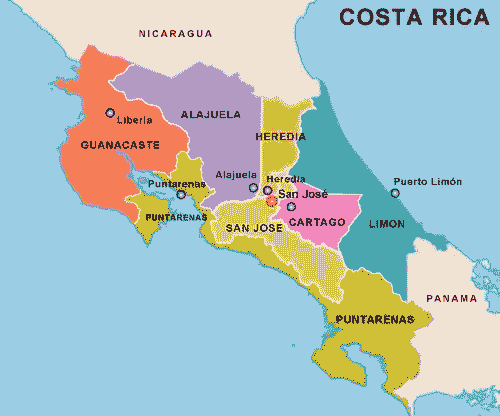

A map of Costa Rica

**导言:**本报告详细介绍了回答与哥斯达黎加家庭贫困水平相关的几个研究问题的过程。它由数据源、通过可视化进行的探索性数据分析、模型开发、微调、解决数据不平衡问题的方法、性能指标和结果可视化组成。

背景:在一个州或一个地方，政府或银行为他们的社会福利项目确定需要帮助的家庭是很重要的。据观察，生活在经济落后地区的人没有必要的知识或不能提供必要的文件，如收入/支出记录，以证明他们有资格获得援助。

在拉丁美洲，一种被称为代理收入测试的流行方法被用来做这个决定。各机构查看一个家庭的可观察属性，如天花板材料、家庭房间数量、家庭人数等，以确定该家庭是否有资格获得援助。然而，准确性仍然是一个问题。因此，美洲开发银行向 Kaggle 社区提供了一套数据，以提出新的方法，有效地将他们引向需要社会福利援助的家庭。

**数据来源:**项目使用的数据集提取自 Kaggle。数据源的网址为:[https://www . ka ggle . com/c/Costa-Rican-household-poverty-prediction/overview](https://www.kaggle.com/c/costa-rican-household-poverty-prediction/overview)

**数据描述:**数据文件夹由 train.csv 和 test.csv 组成，分别为 9557 行和 23856 行。但是，test.csv 不包含确定贫困水平的“目标”列。因此，train.csv 单独用作大小为 3.08 MB 的数据集。列数为 143。每个记录都与一个人相关联。143 列的描述可以在上面提到的数据源的 URL 中找到。下面提供了一些列的描述。
目标:表示贫困等级 1 =极端贫困，2 =中度贫困，3 =弱势家庭，4 =非弱势家庭
Idhogar:每个家庭的唯一标识符。属于一个家庭的人由这一栏来标识。
v2a1:每户每月支付的租金。
房间:房子里房间的数量。escolari:受教育年限等。

**相关研究问题:**
**R1:** 我们能否构建一个模型来确定哥斯达黎加不同家庭的贫困水平？
**R2:** 我们能否确定决定一个家庭贫困程度的最重要因素/栏目/预测因素？
**R3:** 受教育程度、性别、户主、人数、家庭房间数、依赖程度、技术(手机、电脑、电视、平板电脑)与一个家庭的贫困程度有关系吗？

**变量的数据类型:**数据集中的变量有四种数据类型:

1.  布尔型:整数布尔型(0 或 1)，字符布尔型(是或否)。paredblolad、noelec 等栏目。
2.  浮点数据类型。例如，贫困、过度拥挤等。
3.  整数数据类型。比如年龄，房租，房间，tamviv 等。
4.  字母数字。比如 Id，idhogar。

**数据探索阶层分布:**贫困水平分布(阶层分布)非常不平衡，如图 2 所示。属于类别“四”的行数占数据集的 65.72%，但属于类别“一”的行数仅占 0.074%。在图 3 所示的家庭级数据集中观察到了同样的不均匀分布。要详细了解家庭级数据集，请阅读“家庭数据集”一节。

monthly_rent_payment 列 NaN 值个数:【monthly _ rent _ payment】列有 6860 行包含 NaN 值。' own _ and _ fully _ paid _ house '、' own _ paying _ in _ partitions '、' rented '、' unsaky '和' other _ assigned _ lowed '列包含表示 0(假)或 1(真)的二进制值。从图 4 可以推断，拥有房子的有 5911 人，拥有房子但分期付款的有 961 人。这个事实在数据预处理过程中非常有用。

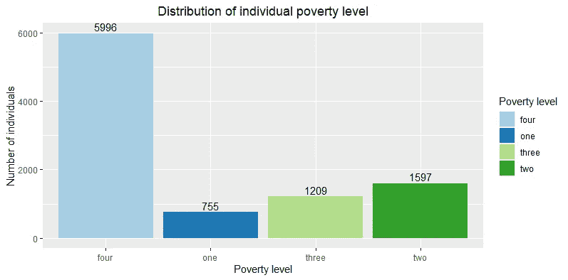

**Fig. 2**

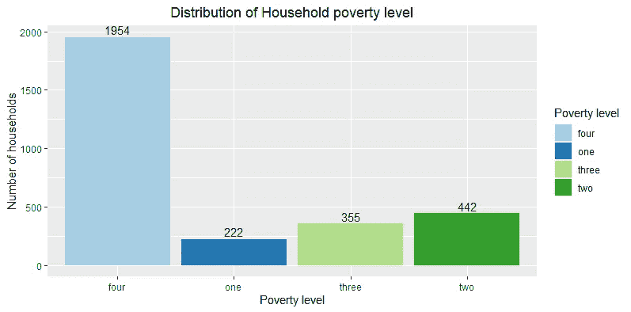

**Fig. 3**

**数据预处理:**为了便于参考、理解和交流，将原来的列名重新命名为英文缩写。可以在“changed_column_names.csv”中找到它们。此后，将通过重命名的列引用数据。

**缺失值处理和特征工程:**从研究问题 R1、R2、R3 可以解释分析的单位是户。然而，数据集中的每条记录都描述了家庭中一个人的属性。属于同一个家庭的人可以通过“household_identifier”列分组，因为他们每个人都有相同的标识符值。“Household _ identifer”值对每个家庭都是唯一的。此外,“目标”等级(贫困水平)的相同值被分配给一个家庭中的所有人。

在数据集中的多个列中发现缺失值。根据**“数据探索”**部分对“每月租金付款”栏中出现的 NaN 值的解释，假设所有拥有房屋的人都不支付租金。只剩下 7 个人了。因为它们的计数太少，所以所有在‘monthly _ rent _ payment’列中具有 NaN 值的行都被替换为零。

列“number _ of _ tablets _ household _ owns”也包含 NaN 值。“拥有平板电脑”一栏表明一个家庭是否拥有平板电脑。如果家庭没有平板电脑，则“平板电脑数量 _ 家庭拥有数”列中的值将被替换为零。对于每个家庭，计算“上学年数”和“在校年数”栏的平均值，并分配给户主。“依赖关系”列中的字符布尔值(是或否)已分别替换为 1 或 0。对“edjefe”和“edjefa”列执行了相同的操作。

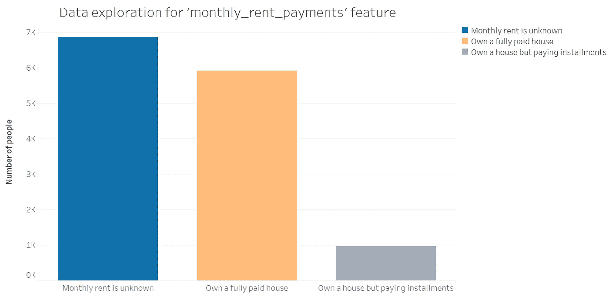

**Fig. 4**

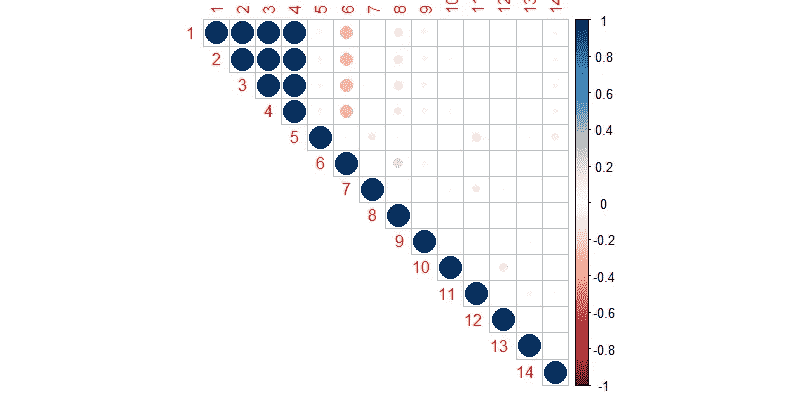

**Fig. 5 — Correlation plot between highly correlated features**

从数据集中删除重复的列。例如，有两列具有相同的名称“age_squared ”,它们彼此重复。只是，保留了其中一个。此外，还有许多列是现有列的平方值，如 oversmooth _ squared、dependency_squared 等。所有这些列都已从数据集中删除，因为它们没有为模型提供额外的信息。此外，类别变量“目标”由数字格式为 1、2、3 和 4 的贫困水平组成。它们分别被替换为单词 1、2、3 和 4。各栏(if _ 继子 _or_doughter、if _ 儿子 _or_doughter_in_law、if _ 孙子 _or_doughter、if _ 父亲 _ or _ 岳母 _law、if _ 哥哥 _ or _ 姐姐、if _ 哥哥 _ or _ 姐姐 _in_law、if_other_family_member、if _ 配偶 _or_partner、if _ 儿子 _or_doughter、if _ 母亲 _ or _ 父亲)不重要，不属于回答研究问题的范围，因此已被删除。“DP lyr”(Wickham 等人，2017 年)和“stringr”(Wickham，2019 年)软件包用于数据预处理。“gg plot”(Wickham，2016 年)和 Tableau (Tableau Software，2019 年)软件包用于数据可视化。“corrplot”软件包(魏等，2017)用于绘制相关矩阵。

**使用相关性来减少特征:**已经为预处理阶段之后剩余的 119 列构建了相关性矩阵。如此巨大的情节的可视化是笨拙的。因此，相关值大于 0.98 的高度相关的特征已经从矩阵中提取出来并被单独绘制。由于软件不能绘图，不能合并过长的列名，所以在图 5 中用数字表示。图中的数字 1 到 14 对应于“家庭大小”、“家庭大小”、“家庭中个人总数”、“家庭中个人总数”、“厕所连接下水道或污水池”、“家庭户主”、“区域布朗卡”、“鳏夫”、“无主要能源来源、用于烹饪、无厨房”、“主要材料、外墙上的天然纤维”、“电力、合作用”等栏构建相关图的目的是从数据集中移除高度相关的列，因为它们不提供任何附加值。从图 5 可以看出，“家庭规模”、“家庭规模”、“家庭中个人总数”、“家庭中个人总数”彼此高度相关。因此，这些列中只有一列包含在数据集中。

**住户数据集:**户主被视为每个住户的代表。因此，只有“if_household_head”列等于 1 的行才成为该数据集的一部分。在数据预处理期间，与单个人相关联的诸如“上学年数”的特征已经被适当地处理以反映家庭。该数据集共有 2973 行，此后将被称为家庭数据集。

**使用随机森林建模:**为了回答第一个研究问题，使用家庭数据集来训练随机森林。对于给定的实例，其贫困水平/目标是未知的，训练的模型将预测该行的类别。随机森林是一种集成学习技术，它通过从数据集中抽取样本(引导抽样)来构建不同长度的树。不属于结构一部分的剩余数据通常称为袋外(OOB)数据集。然后，构建的模型使用 OOB 数据集作为测试集，并自行评估其性能。假设这些行是相互独立的(就像我们的例子一样)，那么在使用随机森林时就不需要单独执行交叉验证。这是在 OOB 数据的帮助下在内部隐式完成的。每个构造的决策树的 OOB 误差可以被平均以表示模型的总误差率。随机森林也能很好地概括并避免过度适应，这是决策树中观察到的主要问题之一。“caret”软件包(Kuhn 等人，2019 年)中一个名为“random forest”(Liaw 等人，2002 年)的软件包用于训练和测试数据。

**将数据集拆分为训练集和测试集:**由于类别不平衡问题，以 75:25 的比例随机拆分数据集用于训练集和测试集不会提取与测试集中的少数类别相关联的大量行。因此，所获得的性能指标并不十分可靠。因此，来自每个类的 75%的数据成为训练集的一部分，来自每个类的 25%的数据成为测试集的一部分。因此，来自每个类的 75%和 25%的数据分别构成了训练集和测试集。训练集和测试集中的结果行数分别为 2230 和 744。

**训练:**对于第一次迭代，112 列(预处理后剩下的列)用于训练。“id”和“household_identifier”列等字母数字特征已从训练集中删除。用于训练分类器的超参数是:“ntree=500”和“mtry=10”。测试了各种“mtry”值，但等于 10 的“mtry”会产生更好的性能。为了减少用于训练的列数，从已训练的模型中提取 MeanDecreaseinGini 值。基尼系数的平均下降值与特征的重要性直接相关。某一特征的基尼值的平均降幅越大，它在预测目标变量方面的重要性就越大。图 6 显示了 15 个最重要的特征。在接下来的迭代中，只有这 15 个特征用于训练。这通过将功能的数量从 112 个减少到 15 个来降低培训成本。

**Fig. 6 —** **Top fifteen important features from the random forest model**

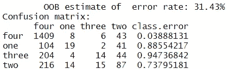

**Fig. 7 — OOB estimate and Confusion Matrix without Sampling**

OOB 误差估计如图 7 所示。可以注意到,“四”的分类误差非常小。然而，“一”、“二”和“三”的分类误差很高。该模型在类 4 上训练得很好，因为类 4 的记录数量相对较高，因此误差较低。但是，由于与“一”、“二”和“三”类相关联的记录数量较少，模型没有被很好地训练，因此误差较大。

**采样:**为了调整数据集中类别的分布，采用了两种流行的技术，即欠采样和过采样。对一个类进行欠采样涉及只获取与多数类相关联的一小部分记录。为了说明，仅从类别“四”中提取一些记录，并使其成为数据集的一部分。属于其他少数民族阶层的记录不变。欠采样导致数据丢失。过采样包括合成/复制属于少数类的记录。

**欠采样:**对‘四’班进行了随机欠采样。35%属于“第四类”的记录是随机选择的，并且是数据集的一部分。因此，属于“四级”的记录数量从 1954 年减少到 684 个。没有对属于其他类的记录进行采样。在欠采样之后，图 8 和图 9 分别示出了训练集和测试集的类别分布。图 10 详细描述了欠采样数据集的 OOB 误差估计。可以观察到，当与图 7 相比时，类别“一”、“二”和“三”的 OOB 误差估计没有显著降低。“四”的等级误差增加了。由于所有类别的可用记录数量较少，因此该模型在任何类别上都表现不佳。因此，在记录数量较少的情况下对数据集进行欠采样是一种糟糕的方法，因为这会导致欠拟合。

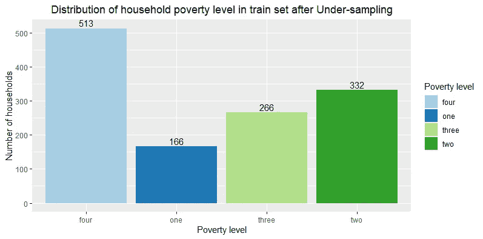

**Fig. 8**

**Fig. 9**

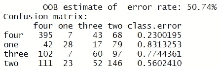

**Fig. 10 — OOB estimate and Confusion Matrix during Under-sampling**

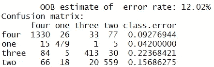

**Fig 11 — OOB estimate and Confusion Matrix during Oversampling**

**过采样:**对‘一’、‘二’和‘三’类进行了随机过采样。与提到的类别相关联的记录已经被适当地复制，以最小化类别分布的差异。过采样后，图 12 和图 13 分别表示训练集和测试集中的类别分布。该模型已经被重新训练，并且 OOB 误差估计表示在图 11 中。

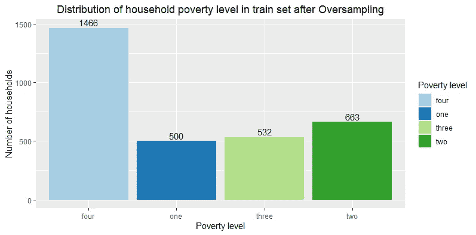

**Fig. 12**

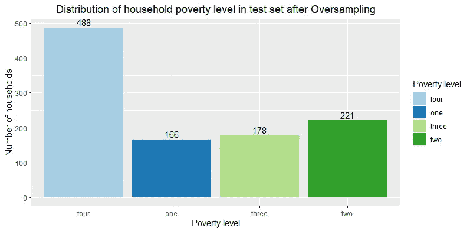

**Fig. 13**

可以注意到，总的 OOB 误差估计和相应的分类误差有显著的降低。因此，过采样少数类的记录促进了更好的模型训练和开发。图 14 和图 15 表示在欠采样和过采样期间，随着树的数量的增加，不同类别的训练错误率的变化。红色、绿色、蓝色和紫色分别代表“四级”、“一级”、“二级”和“三级”。黑线代表总的 OOB 误差率。在过采样期间，所有类的错误率随着树的数量的增加而降低。

**测试:**测试集中的记录总数为 488 条。它包含从每个类别中提取的 25%的记录。“目标”、“id”和“家庭标识符”列已从测试集中删除。结果数据被发送到训练好的随机森林分类器以获得结果。对于测试集中的每个记录，分类器利用通过训练获得的知识来预测该记录的类别。预测的标签将根据它们在“目标”类中的原始值进行评估，这些值决定了模型的性能。

**性能度量:**准确性是评估分类模型的主要度量之一。其定义如下:

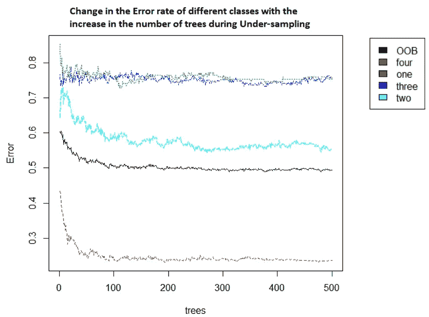

**Fig. 14**

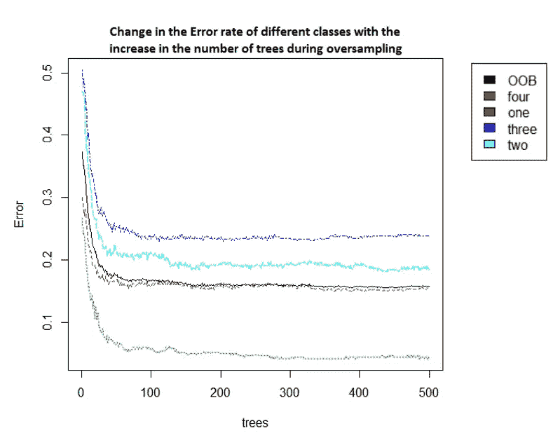

**Fig. 15**

然而，在分类问题中，不能仅使用准确度来评估分类器。可以通过混淆矩阵对所获得的结果进行更仔细的检查。混淆矩阵是不同类别的预测值和实际值的组合。可以从中推导出重要的度量标准，如精确度(特异性)和灵敏度(召回率)。敏感性也称为真阳性率。特异性也被称为真阴性率。现有类别的准确性、敏感性和特异性的值越高，模型就越好。

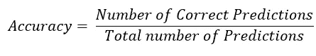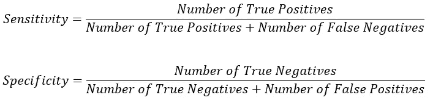

caret (Kuhn 等人，2019 年)软件包中的函数“混淆矩阵”用于通过提供实际值和预测值作为输入来获得混淆矩阵。图 16 和图 17 表示对于相应技术的混淆矩阵和分类器的性能。但是，必须调整总体中表示的度量，因为这些度量是针对提取的样本，而不是针对整个总体。因此，必须对获得的度量进行调整，以使它们反映实际总体。

对于一个样本，如果 C1、C2、C3 和 C4 分别表示“一”、“二”、“三”和“四”类的分类度量，那么，其整个/原始总体的加权度量值表示为:

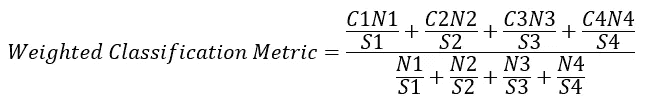

其中 N1、N2、N3、N4 代表原始/实际人口规模，S1、S2、S3、S4 代表样本人口规模。因此，在欠采样数据上训练的分类器的加权准确率、加权特异性和加权灵敏度分别为 53.41%、78.65%和 18.01%。在过采样数据集上训练的分类器的加权准确率、加权特异性和加权召回率分别为 84.39%、93.24%和 84.44%。

**评估 R3 提及的特征与贫困水平之间的关系:**为了评估受教育程度、性别、户主、人数、家庭房间数、依赖性和技术(手机、电脑、电视、平板电脑)与贫困水平之间的关系，仅使用以下提及的特征训练模型。然后，使用经过训练的模型来预测测试集中的记录。新分类器的性能度量越接近旧分类器的性能度量(用前 15 个重要特征训练的模型)，所提到的特征和“目标”(贫困水平)之间的关系越强。

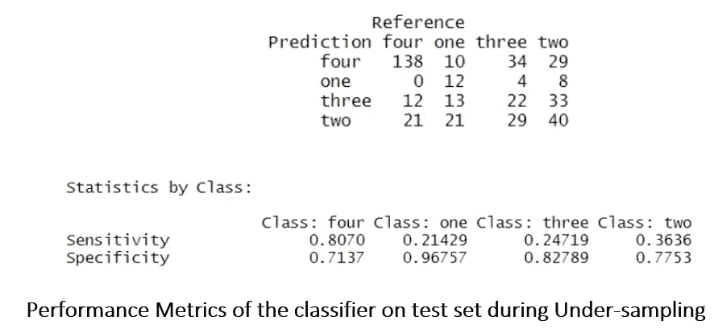

**Fig. 16**

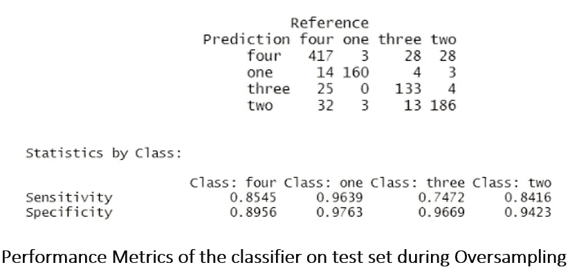

**Fig. 17**

通过过采样类“一”、“二”和“三”来训练新模型，但是仅使用特征“edjefa”、“edjefe”、“受教育年数”、“男性户主平方”、“依赖性”、“过度拥挤”、“meaneduc”、“受教育年数”、“家庭中女性总数”、“家庭中人员总数”、“移动电话数量”、“家庭中男性总数”、“如果家庭中有笔记本电脑或台式电脑”。图 18 详细描述了在测试集上获得的再训练模型的性能度量。

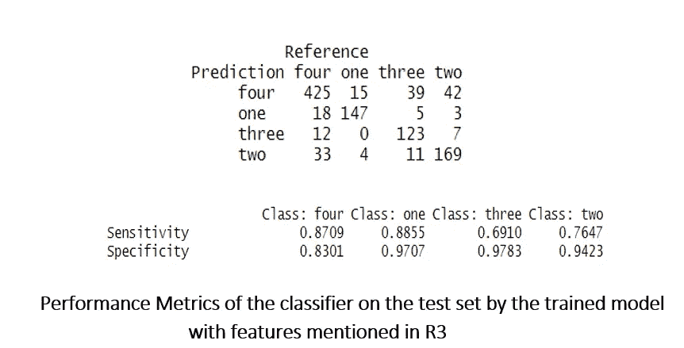

**Fig. 18**

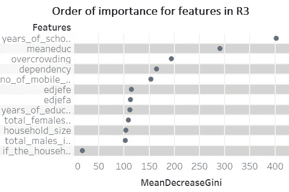

**Fig. 19**

原始人群的总校正加权准确性、加权敏感性和加权特异性分别为 81.11%、0.8115 (81.15%)和 0.9059 (90.59%)。结果表明，这些特征表现出与“目标”类的强烈关联。它们的排序后的 MeanDecreaseGini 值如图 19 所示。在所选择的特征中，“上学年数”是最重要的特征，而“如果家庭有笔记本电脑或台式电脑”是最不重要的特征。

**聚类:**聚类技术便于根据相似性度量对记录进行分组。K-Means 是一种著名的聚类技术，它使用距离度量(通常是欧几里德距离)来对数据点进行聚类。质心是 K 均值聚类中最具代表性的点。“cluster”(rousse euw 等人，2019 年)、“facto extra”(Kassambara 等人，2017 年)和“purrr”(Henry 等人，2019 年)分别用于 K 均值算法、聚类可视化和肘图(图 20)。在“**评估 R3 提及的特征与贫困水平**部分之间的关系中使用的特征仅用于聚类，因为它们与 R3 提及的因素相关。K-Means 算法仅应用于上述特征。这里，分析的单位是一个人。输入聚类数被提供为 8，因为它看起来是肘图中膝盖上的弯曲(图 20)。用于随机森林的预处理数据也用于 K-Means。“目标”列从数据集中删除。

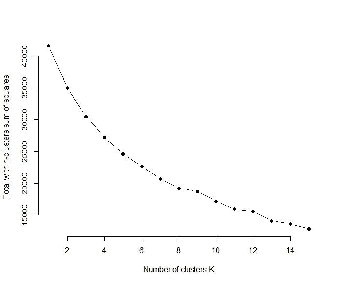

**Fig. 20 — Elbow Plot**

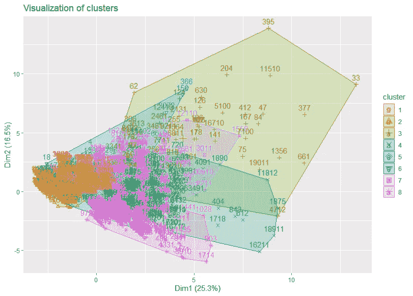

**Fig. 21 — Visualization of K-Means Clusters**

图 21 显示了 8 个集群的可视化。X 轴和 Y 轴表示由具有最高方差的两个主成分表示的记录的缩减维度。仅通过可视化的“factoextra”包使用 PCA 进行降维。在 K-Means 中，每个记录被分配到其最近的质心，该质心由一个聚类数表示。图中的每种颜色代表一个聚类。

比较一个记录和它的簇号，以便进一步分析。目的是发现 K-Means 是否具有将具有相似贫困水平的记录聚类在一起的能力。桌子。1 代表个人贫困水平在所产生的组群中的分布。可以推断，K-均值聚类在确定贫困水平方面并不有效，因为所得聚类与原始贫困水平之间没有关联。原因可以归结为不平等的类分布和数据的非线性。在最小化类内平方和的同时，该算法给予大类比小类更多的权重。因此，没有观察到明显的组。贫困水平分布在各个组群。为了检查输入聚类数的重要性，提供不同的值作为输入，并相应地生成 K 均值聚类。然而，集群数量的增加并没有导致有效集群的形成。作为实验，从训练的随机森林模型获得的前 15 个特征(都是连续变量)被用来代替 R3 的特征，以生成 K-均值聚类。这也没有显著改善结果。

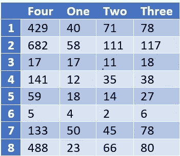

**Table 1 — Distribution of individual poverty levels in the clusters (when input number of clusters = 8)**

**调研问题答案:
R1 答案:**有。构建了随机森林分类器，以通过良好的性能指标成功确定哥斯达黎加家庭的贫困水平。随着更多数据的可用性，模型的性能可以得到改善。
**R2 回答:**是的。决定一个家庭贫困程度的 15 个最重要的栏目，按其重要性递减的顺序是:"上学年数"、"平均教育程度"、"年龄年数"、"抚养程度"、"过度拥挤"、"房子里所有房间的数量"、"移动电话的数量"、" edjefe "、"受教育年数、男性户主平方数"、"子女数、0 岁至 19 岁、家庭中的子女数"、"月租金支付额"、" edjefa "、"家庭中女性总数"、"卧室数"
**R3 的回答:**是的。问题 R3 中提到的与实体相关的特征与家庭贫困水平之间有着密切的关系。
**R4 答案:** K-Means 聚类技术在将具有相同贫困水平的记录聚类在一起时表现不佳。因此，在缺少“目标”列的情况下，并且利用 R3 中的给定特征，K-Means 聚类算法不能帮助为个人/个体分配类别标签。

**参考文献:** 哈德利·威克姆、罗曼·弗朗索瓦、莱昂内尔·亨利、基里尔·穆勒(2019)。dplyr:数据操作的语法。r 包版本 0.8.3。[https://CRAN.R-project.org/package=dplyr](https://CRAN.R-project.org/package=dplyr)

哈德利·威克姆(2019)。stringr:通用字符串操作的简单、一致的包装器。r 包版本 1.4.0。[https://CRAN.R-project.org/package=stringr](https://CRAN.R-project.org/package=stringr)

H.韦翰。ggplot2:用于数据分析的优雅图形。2016 年纽约斯普林格出版社。Tableau 软件(2019)。从 https://www.tableau.com/[取回](https://www.tableau.com/)

Taiyun Wei 和 Viliam Simko (2017 年)。r 包“corrplot”:相关矩阵的可视化(版本 0。84).可从 https://github.com/taiyun/corrplot[获得](https://github.com/taiyun/corrplot)

A.Liaw 和 M. Wiener (2002)。randomForest 分类和回归。r 新闻 2(3)，18 - 22。

马克斯·库恩。供稿来自杰德·温、史蒂夫·韦斯顿、安德烈·威廉姆斯、克里斯·基弗、艾伦·恩格尔哈特、托尼·库珀、扎卡里·迈尔、布伦顿·肯克尔、R 核心团队、迈克尔·贝尼斯特、雷纳德·莱斯卡博、安德鲁·齐姆、卢卡·斯库卡、唐远、坎·坎丹和泰勒·亨特。(2019.分类和回归训练。r 包版本 6.0-84。[https://CRAN.R-project.org/package=caret](https://CRAN.R-project.org/package=caret)

Maechler，m .，Rousseeuw，p .，Struyf，a .，Hubert，m .，Hornik，K.(2019)。聚类:聚类分析基础和扩展。r 包版本 2.1.0。

Alboukadel Kassambara 和 Fabian Mundt (2017 年)。factoextra:提取并可视化多元数据分析的结果。r 包版本 1.0.5。https://CRAN.R-project.org/package=factoextra

莱昂内尔·亨利和哈德利·韦翰(2019)。函数式编程工具。r 包版本 0.3.2。【https://CRAN.R-project.org/package=purrr 

Tableau 软件(2019)。从 https://www.tableau.com/[取回](https://www.tableau.com/)