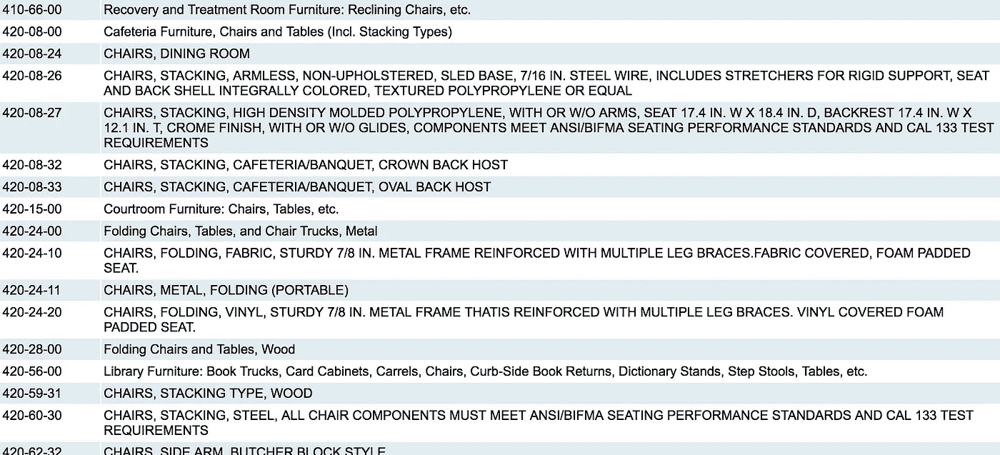
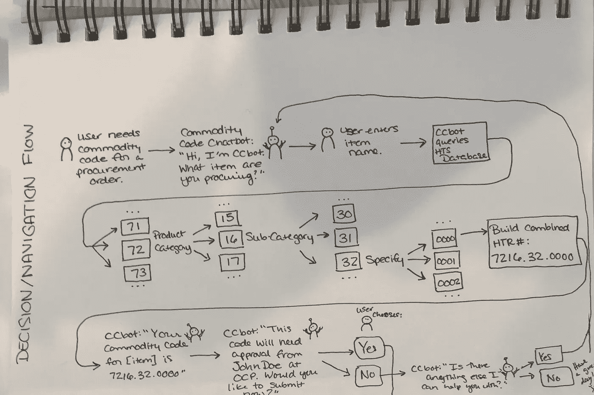
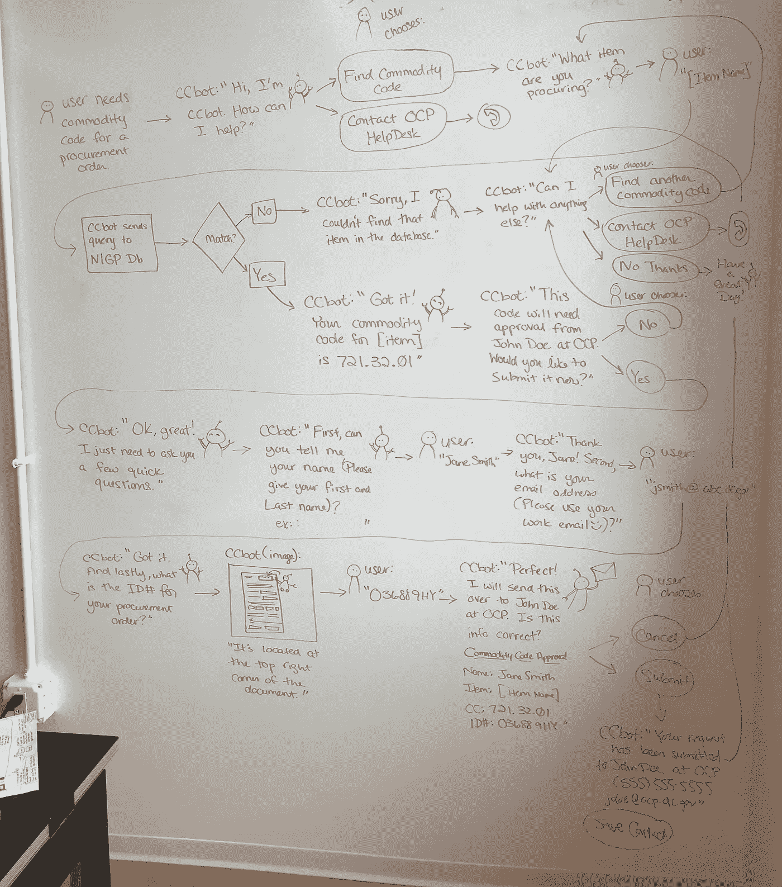
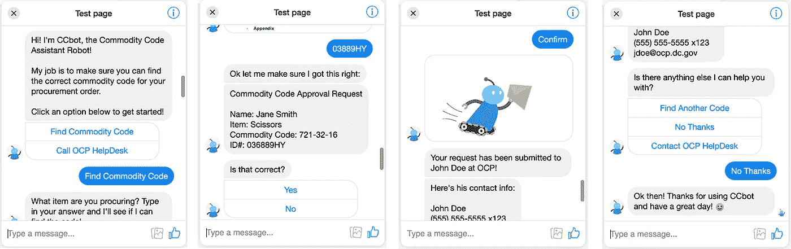

# 聊天机器人能让政府工作变得更容易吗？

> 原文：<https://towardsdatascience.com/could-a-chatbot-make-working-in-government-easier-b75358f6d40f?source=collection_archive---------20----------------------->

在三周的时间里，我参与了哥伦比亚特区政府的一个研究项目。前两个星期用于用户研究和综合，最后一个星期围绕着设计我们研究中发现的一个问题的解决方案。我有一个简短的总结研究，导致我的设计如下。如果你对这个项目研究部分的更多细节感兴趣，你可以在这里阅读我的案例研究。

## 研究概述

第一周，我们在首席技术官办公室和地区总务部门对地区机构员工进行了 14 次 30-60 分钟的采访。接下来的一周，我们综合了我们所听到的。以下方法用于合成:

*   关联映射到小组痛点、机会和进展顺利的事情
*   热图查找主题
*   人物角色、场景和客户旅程

这些主题导致了对三个机构的建议:DC 人力资源、地区总务以及合同和采购办公室(OCP)。在项目的最后一周，我们的团队分头关注不同的难点，并着手设计可能的解决方案。我关注的是我们发现的 OCP 最大的痛点。

## 规定

**问题:** **OCP 难以提供一致的信息来指导其他机构的员工完成签约和采购流程。**我决定进一步挖掘这个问题，看看是否有机会通过构建某种对话式用户界面(CUI)或平台工具来改善这种情况，这种工具可以为机构员工提供有意义的影响，并且可以在不到一周的时间内进行原型开发和测试。

在我们采访中给出的故事和例子中，我发现了受访者提出的机会，一点点自动化可以带来很大的不同。

> 有一种东西叫做商品代码，我认为这些需要更清楚一点。因为…根据您选择的商品代码，它应该会自动发送给特定的人进行审批。
> 
> —地区机构雇员

这是一个很好的机会来帮助改善 OCP 的问题，提供一致的信息:一个 CUI 可以为机构雇员提供一个一致的信息来源的商品代码，并确保他们选择正确。

那么，你可能会问什么是商品代码？ **事情没有听起来那么复杂。**基本上，它只是一个数字代码，确保对进出口商品或服务支付正确的税款。商品编码有一个国际标准，称为商品名称及编码协调制度(HS 编码)，长度为 6 位数字，随着不同国家数字的增加，这一编码可以变得更加具体。对于美国进口的商品和服务，企业使用协调关税代码(HTS 代码)，这只是一个 6 位的 HS 代码，后面跟着另外 4 位。

NIGP Code Search Results

区政府使用一个名为国家政府采购商品代码协会的七位数系统，缩写为 NIGP 代码。这些代码之所以重要，是因为当使用不正确的商品代码时，会产生许多负面影响。这可能会导致延误、货物错运，并可能导致罚款，甚至在某些情况下被指控欺诈。OCP 在他们的[网站](http://app.ocp.dc.gov/RUI/information/nigplist.asp)上有一个数据库搜索功能，但是正如一位受访者指出的，这些功能经常会被选错。很容易看出错误是如何产生的。快速搜索“椅子”,可以筛选出 171 个结果！

**目标:** **构建一个健壮的聊天机器人，它可以为代理机构的雇员提供正确的商品代码，并将带有该代码的采购订单发送给正确的人进行审批。**

## 设计

我的第一步是勾画出用户获取正确代码所需的基本流程。

First Pass for User Flow

我开始用一个[僵尸社会](https://botsociety.io/)原型测试用户流，在那里我发现我需要更多的选项以防用户找不到他们需要的东西。例如，如果他们的搜索没有结果，他们可能想联系一个真实的人寻求帮助。我还发现，在这一点上，OCP 使用 NIGP 代码，而不是 HTS。接下来，我回去在白板上优化我的用户流。

Second Pass for User Flow

在第二次通过用户流之后，我在基于 Facebook Messenger 的聊天机器人工具 [Chatfuel](https://chatfuel.com) 中构建了一个交互式原型。我对这个交互式原型进行了用户测试，确保没有死角或令人困惑的副本。最后，我向客户演示了我的聊天机器人。

Interactive Chatbot Prototype

## 外卖食品

当谈到解决服务设计问题时，聊天机器人可能不是我们首先想到的，但它们可以是一个很好的起点，来定义用户需要做什么才能达到他们的目标。在设计限制方面，聊天机器人简化了可能性，并让我们思考一个结构化的双向对话到底能完成多少工作。