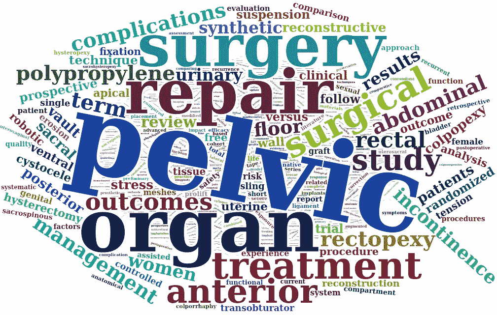
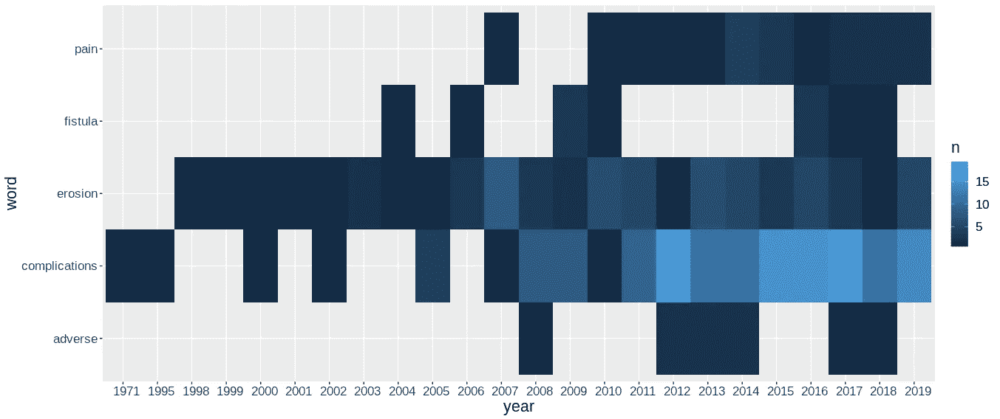

# 数据分析能防止不必要的痛苦吗？

> 原文：<https://towardsdatascience.com/could-data-analysis-prevent-unnecessary-suffering-lessons-to-learn-from-the-vaginal-mesh-scandal-793086d6bbcc?source=collection_archive---------34----------------------->

## 从阴道网丑闻中吸取的教训。



The most frequent words used in the titles of scientific articles concerning meshes for pelvic organ prolapse from 1999–2019\. Complications high up.

在阴道网丑闻的余波中，纽约时报和 T2 卫报广泛报道了强生子公司 Ethicon 如何未能警告病人和外科医生他们的产品所带来的“风险”,给成千上万的妇女带来了可怕的痛苦。

一些接受经阴道网片手术修复盆腔器官脱垂(POP)的女性最终出现了[可怕的并发症](https://digital.nhs.uk/news-and-events/latest-news/nhs-digital-publishes-statistics-on-vaginal-mesh-procedures)，如网片暴露和侵蚀(当网片刺穿阴道壁或切割内部组织时)、阴道瘢痕、瘘管形成、性交疼痛和盆腔疼痛。使这种手术特别危险的是，一旦植入永久性(不可降解)网片，它通常是不可逆的。它的完全移除是极其困难的，有时是不可能的，因为它已经融入了自然组织。

一个特别令人困惑的经历是阅读 2011 年的 [FDA 安全报告(是的，2011 年！)，其中说得很明白:“基于包括 11，785 名女性在内的 110 项研究的数据，大约 10%接受经阴道网片修补的女性在手术后 12 个月内经历了网片侵蚀”。该报告还向医生提出了一项建议:“在大多数情况下，POP 可以在没有网片的情况下成功治疗，从而避免了与网片相关的并发症。”](https://www.fda.gov/media/81123/download)

根据 2011 年的报告，NHS 的数据显示在 2011-2018 年间，每年仍有数千名女性接受这种手术，这让我感到惊讶。

更多…英国卫生和社会福利大臣在 2018 年 2 月的[辩论中被问及是否会立即暂停使用涉及阴道网状植入物的医疗程序。他所在部门的一名成员回答说:“政府不支持暂停或禁止使用外科手术网片设备。“药品和医疗保健产品管理局(MHRA)认为，外科网片装置在按预期用途使用时，作为适当治疗途径的一部分，在考虑相关风险和益处的情况下，以及在外科网片装置符合欧盟现行法律要求的情况下，是可接受的安全装置。”在我看来，在回应中不说“阴道网眼”使这成为一个相当空洞的交流。外科网片装置可以应用于从疝气到整形外科的任何东西。](https://www.parliament.uk/documents/commons-library/Surgical-mesh.pdf)

但是很快，事情发生了变化。2018 年 7 月 10 日，英国国家医疗服务体系致函英国所有医疗主任，建议立即高度警惕[阴道网片限制期](https://www.rcog.org.uk/en/guidelines-research-services/guidelines/mesh-safety-alert/)。2018 年 9 月 12 日，苏格兰政府指示所有卫生局[完全停止所有经阴道网片手术](https://news.gov.scot/news/halt-in-use-of-transvaginal-mesh)，直到制定出新的‘限制使用协议’。2019 年 4 月 16 日，FDA 通知所有用于经阴道修补的手术网片制造商[停止销售](https://www.fda.gov/news-events/press-announcements/fda-takes-action-protect-womens-health-orders-manufacturers-surgical-mesh-intended-transvaginal)和分销他们的产品。那么，什么发生了变化？不是数据。主要是公众压力、澳大利亚法庭案件和新评论完成了这项工作。

作为一名女性(FDA 的同一份报告称，女性一生中患持久性有机污染物的风险估计为 30-50 %)同时也是一名科学家，阅读这篇文章让我感到很困惑。让我们暂时忽略销售产品的公司。为什么医疗机构对自己的发现反应如此缓慢？为什么从 FDA 的审查到一些改变需要 8 年时间？

我只能猜测“模糊”的数据是罪魁祸首。我想知道，如果自 2011 年以来所有要做手术的女性都能获得清晰的统计数据，并充分了解风险，她们会接受手术吗？当然，问题在于这些信息，即使可以获得，也被淹没在乏味的报告和充满术语的科学论文中(其中大部分甚至不为广大公众所知)。更别说和你的医生讨论这个了。我不知道我是否是唯一一个试图利用最近的系统综述与她的医生协商(一个不必要的)医疗程序的人，但我可以告诉你:我没有得到很好的接受。更好地获取数据能增强我们的能力吗？



Some of the scary complications have been in the titles of the relevant articles for years. Major complication ‘erosion’ appears since 1998, continuously.

作为一名目前正在开发生物材料及其生物效应数据库的科学家( [DEBBIE](https://github.com/ProjectDebbie) )，我对从已发表的科学文章中提取生物材料的生物反应数据很感兴趣。这一过程通常被称为“生物固化”。几乎可悲的是，我们作为人类收集的如此多的好的、有价值的知识隐藏在几公里长的文本中，几乎没有人愿意去读，大多是在付费墙后面。那么，为什么我们开采金矿的速度如此之慢呢？为此，处理非结构化数据会面临许多挑战。第一个是自动化识别、提取和评估信息的复杂过程。接下来的问题是如何确保你的结论是可靠的(验证)。最后，使数据清晰并确保其公开需要真正致力于公众利益。我认为是后者在阴道网眼悲剧中起了作用。

我很想快速(也很懒……)看一下科学文献中的阴道网。做一个 [PubMed](https://www.ncbi.nlm.nih.gov/pubmed/) 搜索(PubMed 是访问美国国家医学图书馆书目数据库 MEDLINE 的开放式搜索引擎)，我检索了总共 2509 个与‘骨盆器官脱垂’和‘mesh’有关的记录，其中 2197 个有英文摘要。阅读成千上万的文章远远超出了大多数人的时间和耐心，除非你进行系统的审查，否则你甚至不可能阅读所有的标题。但是，即使使用文本挖掘工具包中最简单的现成工具，也可以获得关于文本的基本信息。在这里，我对呈现为词云的词频做了一个快速而简单的分析，并检查了文章标题中关键复杂因素的出现(是的，有很多)。如果你不知道你在找什么，你可以使用一个无监督的主题模型，如 hLDA(见下文),对你的样本中的主要主题有一个粗略的想法，并看到有关于感染、侵蚀和组织反应的报告。这只是为了好玩。想象一下，使用适当的文本挖掘管道在完整的文章上可以提取出大量的信息。


In the case of vaginal meshes, the FDA took the trouble to conduct an in-depth systematic review of relevant clinical trials, which is a rather excruciating manual task. Applying hierarchical latent dirichlet allocation topic model (hLDA) to infer some topics from text files is a quick and lazy way to have a less accurate, but a certain idea, of what’s in it. I did just that on the 2197 records with abstracts, minimally optimized the parameters, and anyone can see for themselves the result. Topics discovered with key terms such as ‘infection’, ‘erosion’, ‘tissue’ and ‘response’. The term ‘complication’ was identified as the fourth most important in the largest subtopic discovered in the corpus (1618 abstracts). This is just a starting point.

那么我们还在等什么呢？当然，现在是我们下定决心挖掘我们辛苦收集的科学知识的时候了。不仅仅是为了利润丰厚的 T2 药物研发，也是为了保护公众健康和更多基于证据的实践。为了科学家、医生和患者的利益，组织历史数据的紧迫性似乎比以往任何时候都更加重要，我们必须尽快加强这些努力。花点时间再读一遍那些并发症，想象一下所有本可以避免的痛苦。

财务鸣谢:DEBBIE 项目已经获得了欧盟 Horizon 2020 项目的资助，该项目是根据玛丽·斯科多瓦斯卡-居里赠款协议获得的，项目编号:751277

*   *这里的所有分析都是使用 R 包(ggplot，tidytext，tidyr，dplyr)和 python (nltk，hlda.sampler，matplotlib)* 进行的
*   *要实现层次 LDA 主题模型，请参见*[*hlda/hlda/sampler . py*](https://github.com/joewandy/hlda/blob/master/hlda/sampler.py)*中清晰简单的示例代码*
*   *从 PubMed 及其 Ebot 中检索文本*

```
#make a word cloud on R from the article titles in df format
#identify words of interest and create a heatmaplibrary(tidytext)
library(wordcloud2)
library(ggplot2)df <- titles %>% unnest_tokens(word, title) %>% anti_join(stop_words) %>% count(word) wordcloud2(data=df, size=0.7, shape=elipse) df_complication <- df[df$word %in% c('complications','adverse', 'pain', 'fistula', 'scarring', 'erosion')]ggplot(df_complication, aes(x=year, y=word, fill=n))+geom_tile()+theme(text=element_text(size=16))
```