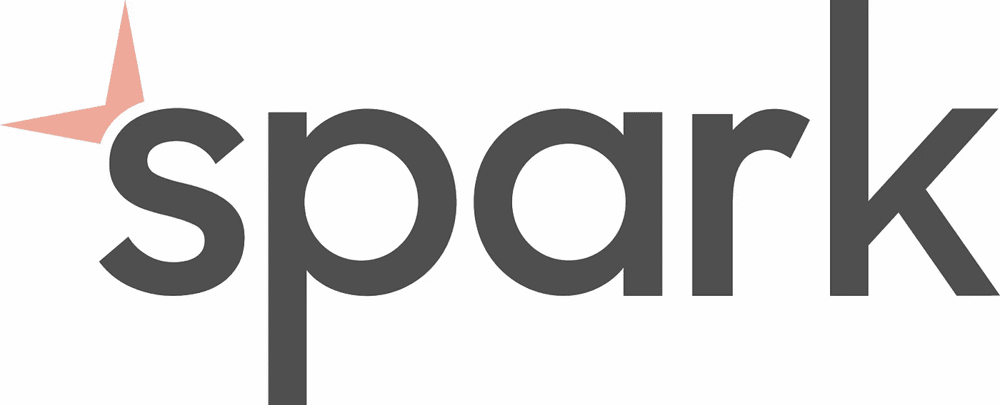
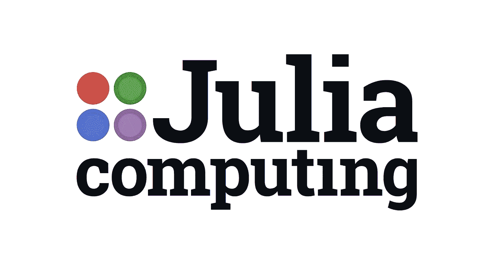

# 朱莉娅能取代斯卡拉吗？

> 原文：<https://towardsdatascience.com/could-julia-replace-scala-77b73c345f6e?source=collection_archive---------12----------------------->

实话实说:我们中的很多人真的希望将 Scala 从我们的数据科学工作流程中移除。Spark 是管理企业级 Hadoop 和协调工人进行深度学习的一种很好的方式，然而，这种努力的开销明显比 R 和 Python 等传统统计语言更重。幸运的是，麻省理工学院开发的一种语言正在进行学术研究，它有很大的潜力将我们喜欢的 Spark、Python 和 R 的所有东西结合到一个方便的包中。

Spark 是 Scala 内置的多功能数据管理工具，也是数据科学家最常使用的可扩展语言。Spark 的主要优势来自大数据，因为它与 Hadoop 的集成以及快速的速度使其非常适合用于大型、未管理的数据集，这些数据集需要大量处理才能访问和操作。

然而，Spark 的继承性让它在很多方面都停滞不前，传统上这种语言对于机器学习操作来说是不可行的。Spark 的一个有争议的缺点是，Spark 比数据科学中通常使用的其他语言更难使用和阅读。通常使用的语言包括 R、Python、Matlab 和 Go 等。然而，这些语言中有很多都有自己的问题。在 Python 中，这通常是一项乏味的任务，或者根本不可能处理大型数据集。r 有它自己的缺点，这些缺点源于它的起源。

虽然我肯定不会说 R 很有挑战性(大多数时候)，但是像 Python 这样的语言确实从创业的角度把 R 打下了基础。此外，R 也有自己的速度问题，尽管肯定比 Python 快。最后但并非最不重要的是，在 R…

但是当我们将所有这些缺点与 Scala 的缺点进行比较时，Scala/Spark 的启动曲线要困难得多，有时非常难以使用，并且更容易将数据分成不同的文件以读取不同的语言。

对于某些人来说，启动和易于阅读可能不是一个很大的缺点，但是下一个缺点对于数据科学来说绝对是一个很大的缺点。

浮点精度错误本质上是 Sparks 的中名，并且是您可能经常发现自己试图通过操纵软件的前几行来解决的问题。当然，这并不理想:这是一种带有浮点不精确性的统计语言，有时让人无法不弃船退回到 R 和 Python 的舒适环境中。

此外，考虑到它植根于 JVM，任何形式的递归都有许多问题，我已经解释了我对递归的热爱(尽管许多人对它有抱怨。)没有递归优化意味着在循环栈内部固有地需要递归的神经网络运行起来比考虑到递归的最新语言慢得多。有鉴于此，Java 和 SBT (Scala 构建工具)在设计时都必须考虑到统计学。

> 但是朱莉娅呢？

Julia 走在前面，它的结构是 BASIC、Python 和 MATLAB 的奇怪混合。这使得朱莉娅容易学习，也容易阅读。Julia 的优势在于它是一种统计语言，本质上是为了满足数据科学和机器学习的需求而从头开始构建的。最重要的是，Julia 有一个专门用于管理 Hadoop 的包，还有许多支持日常统计和机器学习的包。

Julia 非常适合一般的数据科学用途。Julia 是我用过的唯一一种统计语言，它处理大数据的能力一直让我感到惊讶。我曾经遇到过这样的情况，有些数据帧甚至用 R 和 Python 都无法读取，但在 Julia 内部却很容易清理、处理和学习。在我看来，一种能让你避免因缺乏计算能力而丢失数据的语言是一种很棒的语言。我只达到过我个人硬件的极限，从来没有达到过 Julia 的极限，主要是在通过数百万次观察进行深度学习的过程中以内存转储的形式，因为我只有 8g 的内存！

除此之外，浮点问题是不存在的，Julia 在处理数百万种“大浮点”数据类型时仍然表现出色。在可预见的未来，如果 Julia 成为数据科学工作的首选，我不会感到惊讶。

最后一点，不管你扔什么东西，Julia 都很快，递归的问题肯定不存在。正如我在三个不同循环(实际循环、递归循环和迭代循环)之间的[速度测试中所展示的，Julia 的递归优化得非常好。](https://towardsdatascience.com/julia-speed-battle-syntactual-recursive-and-iterative-loops-ff5f719867c1https://towardsdatascience.com/julia-speed-battle-syntactual-recursive-and-iterative-loops-ff5f719867c1)

能够用一种语言轻松管理 Hadoop、操作和测试大数据以及编写和利用算法是一个巨大的优势。尽管我非常喜欢 Python、R、Scala/Spark，以及介于两者之间的任何东西，但我经常发现自己希望在使用它们的时候使用 Julia。朱莉娅很强大，非常强大，对我来说，这种力量是不可估量的。Julia 的速度快如闪电，处理大量数据，易于阅读，而且极其准确。朱莉娅是我喜欢的所有语言的完美结合。如果你只是对数据科学感兴趣，或者你碰巧是一名饱受战争摧残的 DS 老兵，我无法表达我对这门语言的热爱，也无法表达我对它是如何扭曲世界的一种尝试。